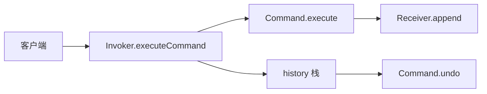
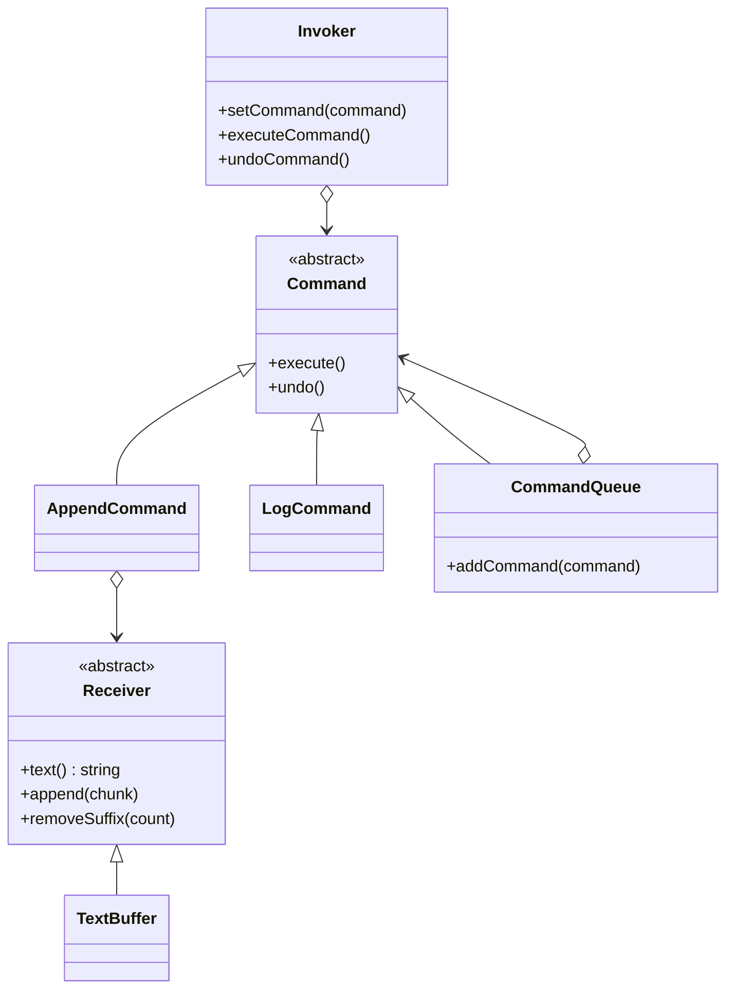

# Command（命令）

**类型**：Behavioral（行为型）

**代码位置**：

- 头文件：[`include/behavioral/command/command.h`](../../include/behavioral/command/command.h)
- 实现：[`src/behavioral/command/command.cpp`](../../src/behavioral/command/command.cpp)
- 测试：[`tests/behavioral/command_test.cpp`](../../tests/behavioral/command_test.cpp)
- 客户端：[`examples/behavioral/command/main.cpp`](../../examples/behavioral/command/main.cpp)

## 意图

把请求封装成对象，这样可以用同一套接口去执行、排队、记录和撤销。

本仓库的例子是文本缓冲加遥控器。`AppendCommand` 把「追加一段文字」交给 `TextBuffer`；`Invoker` 只调 `executeCommand` / `undoCommand`，不必知道具体命令类。`CommandQueue` 把多条命令合成一条宏命令。



## 适用场景

- 要把操作参数化、排队或写日志：每个按钮对应一个 `Command` 对象
- 需要撤销：`execute` 和 `undo` 成对实现
- 要把多条操作当成一条：`CommandQueue` 顺序 `execute`、逆序 `undo`

**不适合**：

- 只是换算法、不需要把请求存成对象 → [Strategy（策略）](strategy.md)
- 只是状态变化通知听众 → [Observer（观察者）](observer.md)

## 结构



| 构件 | 作用 |
| ---- | ---- |
| `Command` | 抽象命令。`execute` / `undo` 成对 |
| `Receiver` / `TextBuffer` | 接收者。真正改缓冲；命令只持非拥有指针 |
| `AppendCommand` | 追加文字；`undo` 按长度 `removeSuffix` |
| `LogCommand` | 不碰接收者，只写外部 `std::string` 日志 |
| `CommandQueue` | 宏命令。拥有子命令的 `unique_ptr` |
| `Invoker` | 调用者。执行后把命令移入历史栈，`undo` 弹栈 |

`Command` 与 `Receiver` 禁用拷贝和移动，避免按值拷贝时对象切片。子命令与待执行命令由 `unique_ptr` 表达所有权；指向 `Receiver` 和日志的指针不拥有目标，生命周期由客户端保证。

## `Invoker`

```cpp
TextBuffer buffer;
Invoker remote(std::make_unique<AppendCommand>(&buffer, "on"));
remote.executeCommand();
// buffer.text() == "on"

remote.undoCommand();
// buffer.text() == ""
```

空指针在构造、`setCommand`、`executeCommand` 时抛 `command is required`。历史栈为空时 `undoCommand` 抛 `nothing to undo`。测试 `InvokerExecutesAndUndoes`、`NullArgumentsAreRejected`。

## `CommandQueue`

```cpp
CommandQueue macro;
macro.addCommand(std::make_unique<AppendCommand>(&buffer, "a"));
macro.addCommand(std::make_unique<AppendCommand>(&buffer, "b"));
macro.execute();  // "ab"
macro.undo();     // ""
```

`CommandQueue` 本身也是 `Command`，可以再被别的队列或 `Invoker` 使用。测试 `CommandQueueRunsMacroInOrder`。

## 参考

- 《设计模式：可复用面向对象软件的基础》（GoF）：Command
- [Strategy（策略）](strategy.md)：换算法，不必封装成可撤销的请求对象
- [Memento（备忘录）](memento.md)：只保存状态快照时，不必为每个操作写命令类
