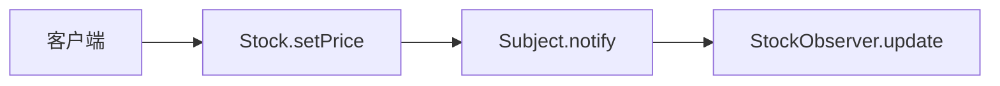
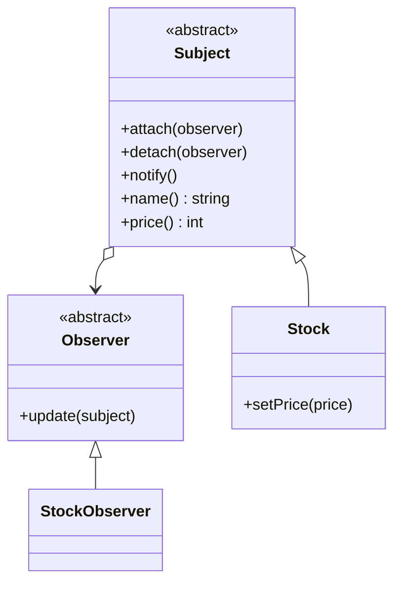

# Observer（观察者）

**类型**：Behavioral（行为型）

**代码位置**：

- 头文件：[`include/behavioral/observer/observer.h`](../../include/behavioral/observer/observer.h)
- 实现：[`src/behavioral/observer/observer.cpp`](../../src/behavioral/observer/observer.cpp)
- 测试：[`tests/behavioral/observer_test.cpp`](../../tests/behavioral/observer_test.cpp)
- 客户端：[`examples/behavioral/observer/main.cpp`](../../examples/behavioral/observer/main.cpp)

## 意图

一次状态变化，通知所有订阅者。发布方只认 `Observer`，不写死谁在听。

本仓库的例子是报价。`Stock` 保存代码和价格。`setPrice` 写下新价格后 `notify`。`StockObserver` 在 `update` 里自己读 `name` 和 `price`。



## 适用场景

- 同一份状态要交给多个订阅者：价格一变，每个 `StockObserver` 都要知道
- 订阅者还会增加，`setPrice` 里不该出现对具体观察者的调用

要换的是算法而不是听众时，用[策略](strategy.md)。

## 结构



| 构件 | 作用 |
| ---- | ---- |
| `Observer` | 订阅方。`update` 收到 `const Subject&`，自己读状态 |
| `Subject` | 发布方。`attach` / `detach` 维护指针名单，`notify` 按登记顺序回调 |
| `Stock` | 具体主题。`setPrice` 写价格再通知。构造时不通知 |
| `StockObserver` | 具体观察者。记下最近一次读到的 `name` 和 `price` |

## `Subject` / `Observer`

名单里存的是指针。`Subject` 不拥有观察者，拷贝出来的 `StockObserver` 没有订阅。观察者要先 `detach`，再销毁。`Stock` 不能拷贝。

```cpp
Stock stock("AAPL", 100);
StockObserver first;
StockObserver second;
stock.attach(&first);
stock.attach(&second);
stock.setPrice(120);
// first.text() == "AAPL 120"
// second.text() == "AAPL 120"

stock.detach(&second);
stock.setPrice(125);
// second 不再更新
```

空指针抛 `observer is required`。重复 `attach` 抛 `observer is already attached`。`detach` 一个不在名单里的观察者抛 `observer is not attached`。原来的订阅保留。空的股票代码抛 `name is required`。

测试 `StockNotifiesAttachedObservers`、`DetachStopsFurtherUpdates`、`BadObserverIsRejected`。

## 参考

- 《设计模式：可复用面向对象软件的基础》（GoF）：Observer
- [Strategy（策略）](strategy.md)：一个调用点换算法；这里是一次状态变化通知多个订阅者
