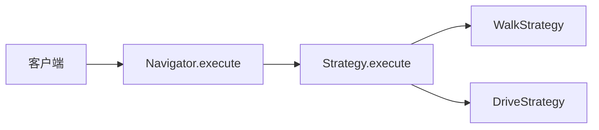
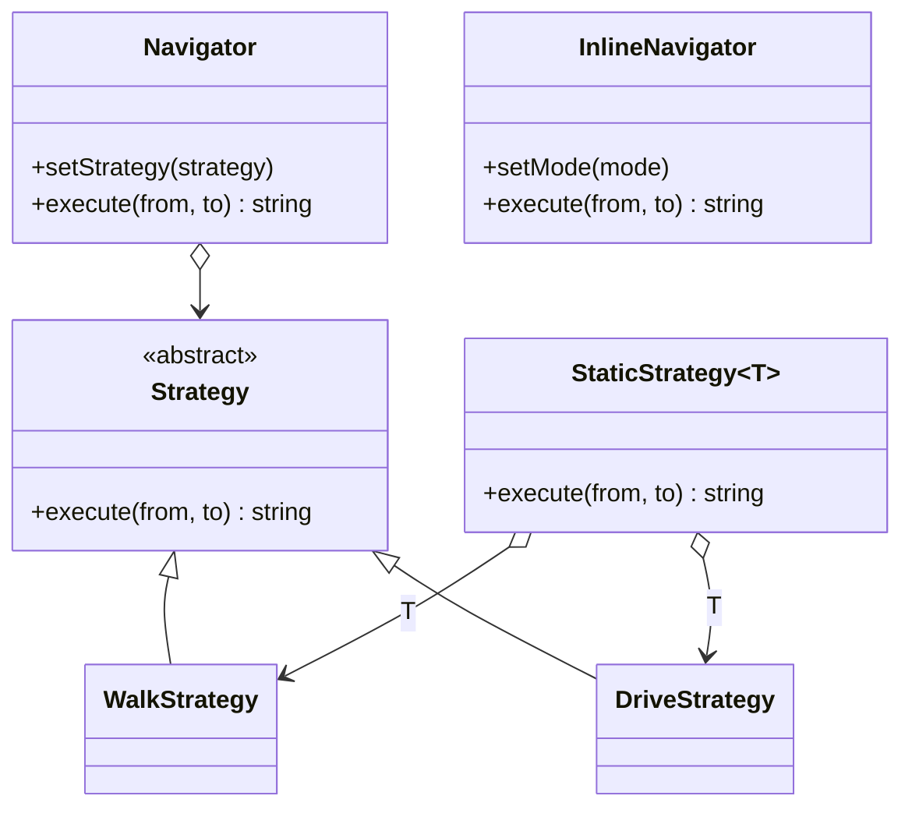

# Strategy（策略）

**类型**：Behavioral（行为型）

**代码位置**：

- 头文件：[`include/behavioral/strategy/strategy.h`](../../include/behavioral/strategy/strategy.h)
- 实现：[`src/behavioral/strategy/strategy.cpp`](../../src/behavioral/strategy/strategy.cpp)
- 测试：[`tests/behavioral/strategy_test.cpp`](../../tests/behavioral/strategy_test.cpp)
- 客户端：[`examples/behavioral/strategy/main.cpp`](../../examples/behavioral/strategy/main.cpp)

## 意图

把可替换的算法从使用它的类里拆出来。调用方只认一个接口，具体算法各自实现。

本仓库的例子是导航。同一对起点和终点，步行和驾车各写自己的 `execute`。`Navigator` 只保存当前策略，并把它的 `execute` 转发出去。



## 适用场景

- 同一份输入，整段算法要换：地点不变，变的是怎么走
- 算法还会增加，调用点不该出现 `if (walk)` / `if (drive)`

**不适合**：

- 方式只有步行和驾车，而且不会再加 → `InlineNavigator`
- 算法类型在编译期就写死 → `StaticStrategy<T>`
- 有两个维度都会继续加类 → 那是[桥接](../structural/bridge.md)

## 结构



| 构件 | 作用 |
| ---- | ---- |
| `Strategy` | 父类，只提供 `execute` |
| `WalkStrategy` / `DriveStrategy` | 两种具体算法 |
| `Navigator` | 运行时持有 `unique_ptr<Strategy>`，`setStrategy` 换对象，`execute` 转发 |
| `StaticStrategy<T>` | 编译期按 `T` 调用 `T::execute`，不走虚函数表 |
| `InlineNavigator` | 对照。`TravelMode` 枚举，分支写在类里 |

三种写法对 `home -> office` 都能得到 `walk home -> office` 或 `drive home -> office`。差别在于算法是对象、是类型参数，还是枚举。

## 运行时：`Navigator`

```cpp
Navigator navigator(std::make_unique<WalkStrategy>());
navigator.execute("home", "office");
// "walk home -> office"

navigator.setStrategy(std::make_unique<DriveStrategy>());
navigator.execute("home", "office");
// "drive home -> office"
```

空指针在构造和 `setStrategy` 时抛 `strategy is required`，原来的策略保留。测试 `NavigatorForwardsAndSwapsStrategy`、`NullStrategyIsRejected`。

## 编译期：`StaticStrategy<T>`

`T` 必须派生自 `Strategy`。类里放一个 `T` 对象，`execute` 写成 `strategy_.T::execute(...)`，按静态类型绑定到 `WalkStrategy::execute` 或 `DriveStrategy::execute`。

```cpp
StaticStrategy<WalkStrategy> walk;
StaticStrategy<DriveStrategy> drive;
walk.execute("home", "office");
drive.execute("home", "office");
```

换算法要换类型参数，不能 `setStrategy`。测试 `StaticStrategySelectsExecuteByType`。

## 对照：`InlineNavigator`

方式已经关闭时，不用策略对象。`execute` 里按 `TravelMode` 分支，句子和上面相同。加一种走法就要改这个类。可以拷贝；改副本的 `setMode` 不影响原件。测试 `InlineNavigatorMatchesTheClosedCase`、`InlineNavigatorCopiesByValue`。

## 参考

- 《设计模式：可复用面向对象软件的基础》（GoF）：Strategy
- [Bridge（桥接）](../structural/bridge.md)：两个维度都要独立加类时，不是再加一层策略
