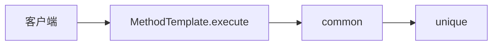
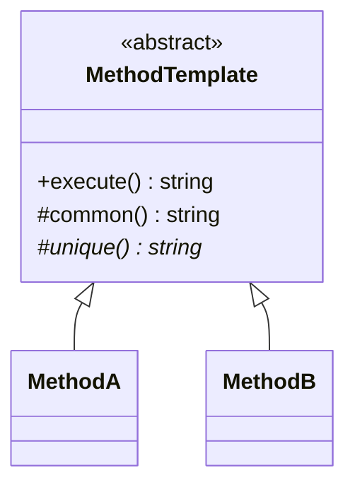

# Template Method（模板方法）

**类型**：Behavioral（行为型）

**代码位置**：

- 头文件：[`include/behavioral/template_method/template_method.h`](../../include/behavioral/template_method/template_method.h)
- 实现：[`src/behavioral/template_method/template_method.cpp`](../../src/behavioral/template_method/template_method.cpp)
- 测试：[`tests/behavioral/template_method_test.cpp`](../../tests/behavioral/template_method_test.cpp)
- 客户端：[`examples/behavioral/template_method/main.cpp`](../../examples/behavioral/template_method/main.cpp)

## 意图

算法的顺序放在基类。变的步骤留给子类。客户端只调这个骨架，不自己排步骤。

`MethodTemplate::execute` 固定为先 `common` 再 `unique`。`common` 写在基类。`MethodA` 和 `MethodB` 只覆盖 `unique`。



## 适用场景

- 步骤顺序不变，只有其中一步不同：A 和 B 都是先公共步骤再各自的步骤
- 调用方不该自己写 `common`、`unique` 的先后

要整段换掉算法时，用[策略](strategy.md)。

## 结构



| 构件 | 作用 |
| ---- | ---- |
| `MethodTemplate` | 基类。`execute` 先调 `common` 再调 `unique`。`common` 是公共步骤 |
| `MethodA` | 具体类。`unique` 标成 method-a |
| `MethodB` | 具体类。`unique` 标成 method-b |

## `execute`

`execute` 不是虚函数。子类改不了这两步的顺序，只能换 `unique`。

```cpp
MethodA a;
MethodB b;
a.execute();
// "common method-a"
b.execute();
// "common method-b"
```

测试 `MethodARunsCommonThenUnique`、`MethodBRunsCommonThenUnique`。

## 参考

- 《设计模式：可复用面向对象软件的基础》（GoF）：Template Method
- [Strategy（策略）](strategy.md)：组合换整段算法；这里是继承换其中一步
