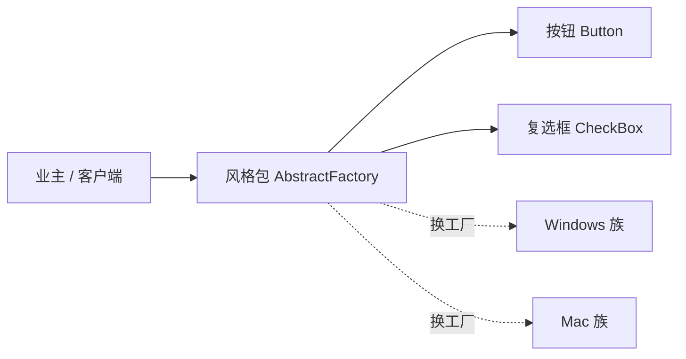
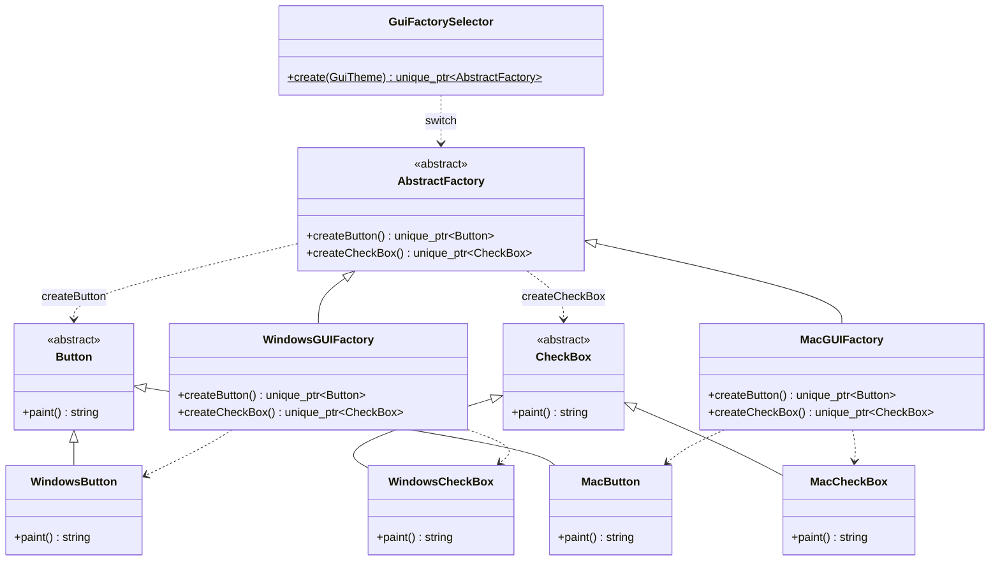
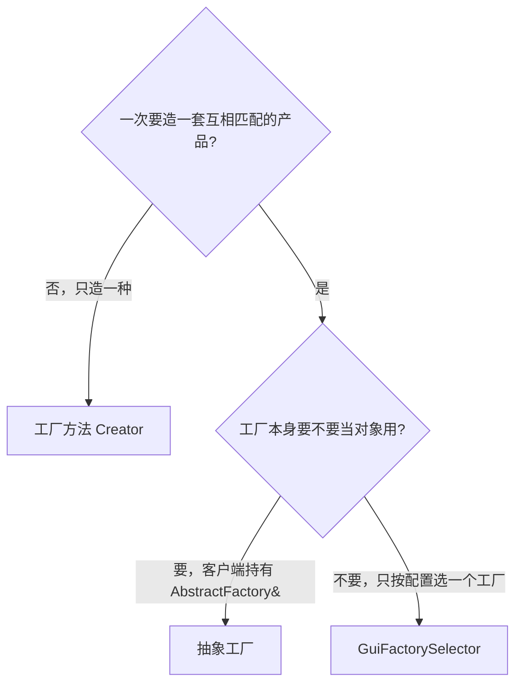
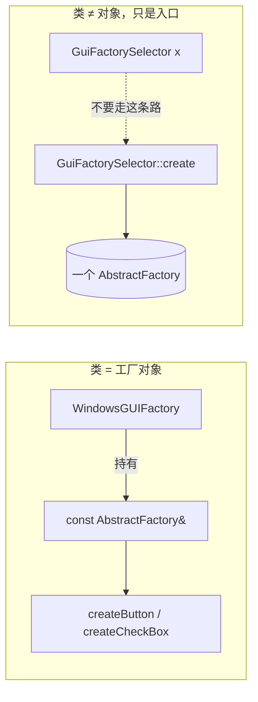
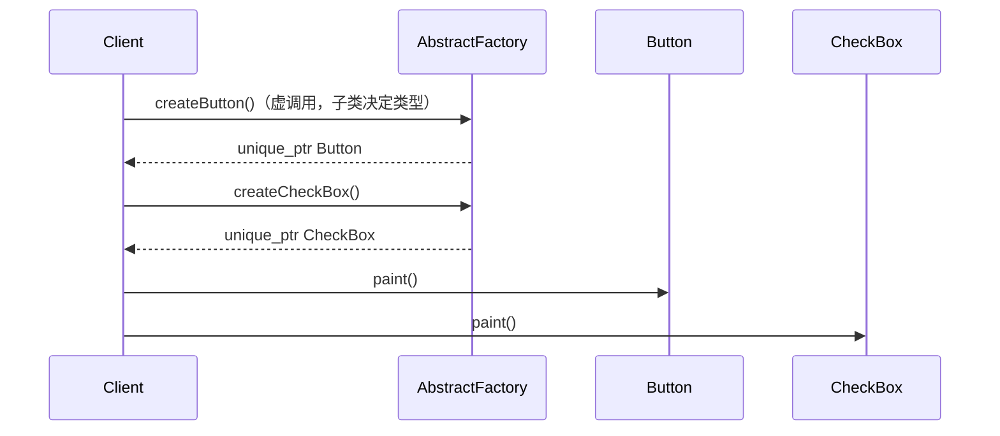
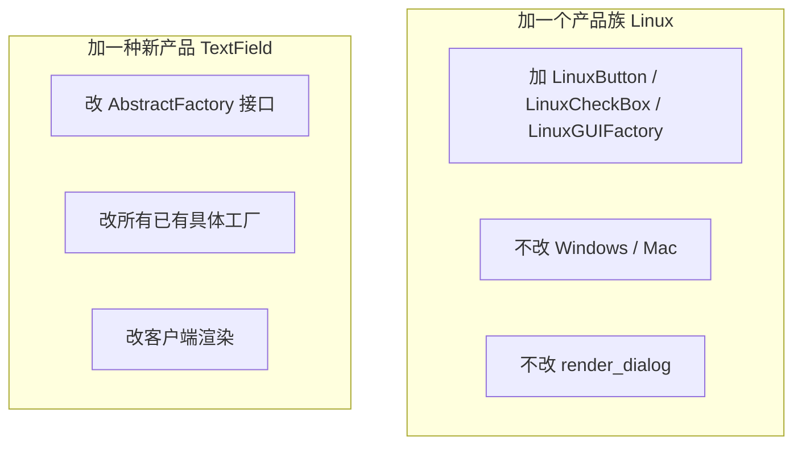
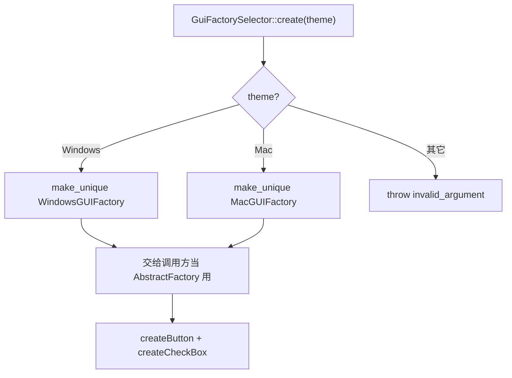
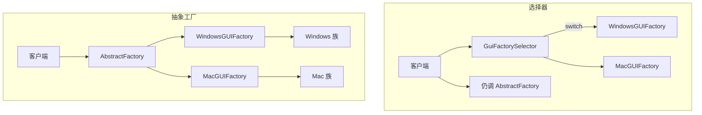
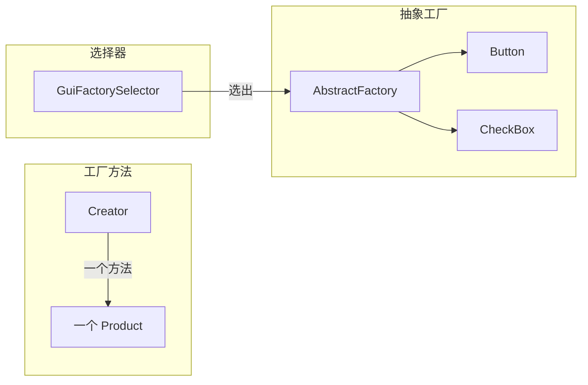

# Abstract Factory（抽象工厂）

**类型**：Creational（创建型）

**代码位置**：

- 头文件：[`include/creational/abstract_factory/abstract_factory.h`](../../include/creational/abstract_factory/abstract_factory.h)
- 实现：[`src/creational/abstract_factory/abstract_factory.cpp`](../../src/creational/abstract_factory/abstract_factory.cpp)
- 测试：[`tests/creational/abstract_factory_test.cpp`](../../tests/creational/abstract_factory_test.cpp)
- 客户端：[`examples/creational/abstract_factory/main.cpp`](../../examples/creational/abstract_factory/main.cpp)

## 意图

提供一个**创建一组相关或互相依赖对象**的接口，且不必指定具体类。选中一个具体工厂，就锁定整族产品。

可以把 `AbstractFactory` 想成「装修风格包」：选了北欧风，门把手、灯、沙发必须都是北欧；不能北欧沙发配中式灯。业主点的是「按这套风格装一间房」，不会自己去市场 `new` 一个 Windows 按钮再 `new` 一个 Mac 复选框。

本仓库的例子就是 GUI 主题：`WindowsGUIFactory` 只出 Windows 控件，`MacGUIFactory` 只出 Mac 控件。



## 适用场景

- **一组产品必须配套出现**：同一主题、同一数据库方言、同一序列化协议
- 客户端不该依赖 `WindowsButton`，只该依赖 `Button` / `AbstractFactory`
- 希望换一族 = 换一个工厂，渲染 / 业务流程不动

**不适合**：

- 每次只造一种产品，没有「必须配套」→ 工厂方法或直接构造
- 产品种类会横向猛涨（按钮、输入框、菜单、滚动条……）→ 每加一种都要改抽象工厂接口
- 只是不想在客户端写 `new`，却没有产品族 → 那是简单工厂 / `GuiFactorySelector`，不必上这一套

## 共同骨架

本仓库两套写法共用同一组抽象产品和 `AbstractFactory`，差在**谁决定用哪一个具体工厂**：



| 构件 | 作用 |
| ---- | ---- |
| `Button` / `CheckBox` | 两族抽象产品；客户端 / `render_dialog` 只认它们 |
| `Windows*` / `Mac*` | 真正被造出来的配套控件 |
| `AbstractFactory` + `WindowsGUIFactory` / `MacGUIFactory` | 抽象工厂：每个方法造一种产品，一个工厂锁定一族 |
| `GuiFactorySelector` + `GuiTheme` | 对照：一个静态函数按枚举选出具体工厂 |

两套都返回 `std::unique_ptr`，都不再 `new` 裸指针。差别还在三件事：**谁选出具体工厂、谁使用产品族、加新产品 / 新族改不改旧代码**。



和 [工厂方法](factory_method.md) 的粒度不同：工厂方法一次造 **一种** 产品；抽象工厂一次造 **一族**。抽象工厂的**每个** `createButton()` / `createCheckBox()`，内部往往仍是工厂方法。

### 为什么 `AbstractFactory` 能造对象，`GuiFactorySelector` 却是 `= delete`

差在一件事：**这个类本身要不要被当成对象用。**

`WindowsGUIFactory` 是客户端手里的那个工厂：`const AbstractFactory &factory = windows;`，构造必须存在。`Button` / `CheckBox` / `AbstractFactory` 是多态基类，拷贝会切片，所以拷贝 / 移动 **`= delete`**，构造仍是 `= default`。

`GuiFactorySelector` 相反：正确用法只有静态函数，造出一个 `GuiFactorySelector` 对象毫无意义。构造直接 **`= delete`**，谁都不能实例化。



| | `AbstractFactory` / 具体工厂 | `GuiFactorySelector` |
|--|------------------------------|----------------------|
| 这个类是什么 | 产品族工厂，客户端要持有 | 按参数选工厂的工具 |
| 要不要有「自己的实例」 | 要 | 一个都不要 |
| 构造怎么写 | `= default` | `= delete` |
| 拷贝 / 移动 | `= delete`（防切片） | 构造都删了，自然不能拷 |
| 原因 | 成员里能造，按值拷会切片 | 造出来就是误用 |

一句话：

- **`AbstractFactory` 默认构造 + 删除拷贝**：对象可以存在，但不能当值来拷。
- **`GuiFactorySelector` 删除构造**：类型不允许有生命周期，只准调静态方法。

这和工厂方法里 `Creator` vs `SimpleFactory` 是同一条规则，只是这里选出来的是**工厂**，不是单个产品。

### 为什么返回 `unique_ptr` 而不是裸指针

工厂的职责就是把对象交出去。返回 `Button*` 等于把「谁 `delete`」藏在约定里：漏了就泄漏，异常路径更容易漏。

```cpp
virtual std::unique_ptr<Button> createButton() const = 0;
virtual std::unique_ptr<CheckBox> createCheckBox() const = 0;
static std::unique_ptr<AbstractFactory> create(GuiTheme theme);
```

实现用 `std::make_unique<WindowsButton>()`。签名即契约：调用方独占所有权，析构时自动释放。

裸指针还分不清是「借给你看」还是「给你管」。`unique_ptr` 把这件事写进类型。虚析构必须留着：`unique_ptr<Button>` 析构时走的是 `Button::~Button()`，没有虚析构就是未定义行为。

产品方法返回 `std::string` 而不是打 `std::cout`：头文件一旦 `#include <iostream>` 会污染所有翻译单元，打印也无法直接断言。

---

## 1. 抽象工厂：`AbstractFactory` / `WindowsGUIFactory` / `MacGUIFactory`

GoF 原意。工厂只负责创建；稳定的使用流程在客户端（本仓库是 `render_dialog`），不在工厂基类里。这点和工厂方法的 `Creator::process()` 相反：工厂方法把流程写在创建者上，抽象工厂把流程留在调用方。

### 原理

客户端只拿 `AbstractFactory&`。每次需要控件就调对应的工厂方法，再 `paint()`。动态绑定发生在 `createButton()` / `createCheckBox()`，不发生在渲染流程上。同一个工厂拿出来的按钮和复选框一定同族。



扩展有两个方向，代价不一样：



加 Linux 符合开放封闭。加 `TextField` 要改抽象，这是抽象工厂的经典代价：产品种类写进了工厂接口。

### 基本构成

| 位置 | 内容 |
| ---- | ---- |
| `Button` / `CheckBox` | 纯虚 `paint()`，虚析构，删除拷贝 / 移动 |
| `WindowsButton` 等具体产品 | `final`，实现放在 `.cpp` |
| `AbstractFactory::createButton()` / `createCheckBox()` | 纯虚、`const` |
| `WindowsGUIFactory` / `MacGUIFactory` | 覆盖两个工厂方法，`make_unique` 对应族的产品 |

| | `render_dialog`（客户端） | `createButton()` / `createCheckBox()` |
|--|---------------------------|----------------------------------------|
| 是否虚函数 | 否 | 纯虚 |
| 谁实现 | 调用方一份 | 每个具体工厂 |
| 加新族要不要改 | 不要 | 新写一个工厂覆盖 |
| 加新种类要不要改 | 要 | 抽象和所有工厂都要加方法 |

`create*` 标 `const`：创建不修改工厂自身。测试里才能写 `const AbstractFactory &as_windows = windows`。

```cpp
void render_dialog(const AbstractFactory &factory, std::string_view screen) {
  auto button = factory.createButton();
  auto checkbox = factory.createCheckBox();
  // button->paint() | checkbox->paint()
}

std::unique_ptr<Button> WindowsGUIFactory::createButton() const {
  return std::make_unique<WindowsButton>();
}

std::unique_ptr<CheckBox> WindowsGUIFactory::createCheckBox() const {
  return std::make_unique<WindowsCheckBox>();
}
```

没有「Windows 按钮 + Mac 复选框」这条路径：具体工厂根本造不出来。这是模式要保证的不变量，不是靠客户端自觉。

### 用法

直接拿产品族（测试 `WindowsFactoryCreatesWindowsFamily` / `MacFactoryCreatesMacFamily`）：

```cpp
WindowsGUIFactory factory;
std::unique_ptr<Button> button = factory.createButton();
std::unique_ptr<CheckBox> checkbox = factory.createCheckBox();
button->paint();     // "WindowsButton paint"
checkbox->paint();   // "WindowsCheckBox paint"
```

只走渲染流程，不碰具体类型（测试 `ClientDependsOnAbstractFactory`）：

```cpp
WindowsGUIFactory windows;
MacGUIFactory mac;
const AbstractFactory &as_windows = windows;
const AbstractFactory &as_mac = mac;
render(as_windows);  // "WindowsButton paint | WindowsCheckBox paint"
render(as_mac);      // "MacButton paint | MacCheckBox paint"
```

拷贝 / 移动已删除，对应测试 `CopyAndMoveAreDeleted`。

示例 [`examples/creational/abstract_factory/main.cpp`](../../examples/creational/abstract_factory/main.cpp) 里，设置页按主题渲染对话框：换 `theme` 只换工厂，`render_dialog` 始终只依赖抽象。

### 特点

- 换主题只换工厂，一族控件一起换
- 符合开放封闭的方向是**加产品族**：加 `Linux*` 三类，不改已有 Windows / Mac 和渲染代码
- 每个具体工厂都可以有很多实例，**不是**工厂单例
- 加**新种类**必须改 `AbstractFactory` 和所有具体工厂，种类很多时偏重
- 若工厂只剩一个 `createButton()`，类图还像抽象工厂，语义上已滑回工厂方法

---

## 2. 对照：`GuiFactorySelector`

对照实现，**不是** GoF 抽象工厂。一个类、一个静态函数、内部 `switch` 按 `GuiTheme` 决定造哪个具体工厂。客户端拿到的仍是 `AbstractFactory`，渲染流程仍然只依赖抽象。

它对应工厂方法笔记里的 `SimpleFactory`：简单工厂按枚举造**产品**；这里按枚举造**工厂**。真正保证产品族配套的，还是后面那个 `AbstractFactory`。

### 原理

调用方把「要哪一套主题」当作参数传进去。选择器内部看枚举，命中就 `make_unique` 对应工厂，否则抛异常。选择器本身没有虚函数，也没有子类。





### 基本构成

| 位置 | 内容 |
| ---- | ---- |
| `enum class GuiTheme` | 编译期类型开关，避免 `"windows"` / `"mac"` 魔数字符串 |
| `GuiFactorySelector() = delete` | 不许实例化，只准调静态方法 |
| `create(GuiTheme)` | `switch` 分支；未知值 `throw std::invalid_argument` |

```cpp
auto factory = GuiFactorySelector::create(GuiTheme::Windows);
factory->createButton();  // 客户端仍走抽象工厂，没有自己 new 控件
```

非法枚举（例如 `static_cast<GuiTheme>(99)`）走 `switch` 之后的 `throw`，对应测试 `GuiFactorySelectorRejectsUnknownTheme`。

### 用法

```cpp
auto windows = GuiFactorySelector::create(GuiTheme::Windows);
auto mac = GuiFactorySelector::create(GuiTheme::Mac);
render(*windows);  // "WindowsButton paint | WindowsCheckBox paint"
render(*mac);      // "MacButton paint | MacCheckBox paint"
// GuiFactorySelector s;  // 错误：构造已删除
```

对应测试 `GuiFactorySelectorCreatesWindowsFamily` / `GuiFactorySelectorCreatesMacFamily`。`CopyAndMoveAreDeleted` 里还有 `!std::is_default_constructible_v<GuiFactorySelector>`。

示例第三段就是这条路径：配置字符串先解析成 `GuiTheme`，再交给选择器，渲染函数仍然只吃 `AbstractFactory&`。

### 特点

- 代码最短，一种主题一个 `case`，好懂
- 加新族必须改 `create()`（以及 `GuiTheme`），封闭原则破了
- 选择器不管产品怎么配套，配套仍然由具体工厂保证
- 多态发生在工厂和产品上，选择器本身不是多态点
- 主题少、启动时按配置选一套时很合适；不要把它当成抽象工厂本身

---

## 总对照

| 写法 | 创建点 | 使用点 | 加新产品 / 新族 | 推荐场景 |
| ---- | ------ | ------ | --------------- | -------- |
| 直接 `make_unique<T>` | 调用方 | 调用方 | 改所有调用点 | 类型固定 |
| 简单工厂 `SimpleFactory` | 一个静态 `switch` | 调用方 | 改工厂 | 一种产品、种类少 |
| 工厂方法 `Creator` | 子类的 `createProduct` | **基类 `process`** | 加一对类 | 流程稳定、一次造一个 |
| **抽象工厂** | 一族工厂方法 | **客户端 / 框架** | 加一个产品族 | 多产品要配套出现 |
| `GuiFactorySelector` | 一个静态 `switch` 选工厂 | 仍走抽象工厂 | 改选择器 | 启动时按配置选一套主题 |



再记三点，和具体类名无关，但最容易混：

1. **抽象工厂是「一族工厂方法」，不是「工厂单例」。** 每个 `WindowsGUIFactory` 都可以有很多实例；它管的是「这一族控件」，不管「全进程只有一个工厂」。
2. **`unique_ptr` 解决所有权，虚函数解决类型。** 两件事不要互相替代：返回智能指针不会自动变成抽象工厂；写了虚 `create*` 但返回裸指针，模式对了，C++ 契约仍是错的。
3. **`GuiFactorySelector` 只负责选出工厂。** 没有它，抽象工厂照样成立；有了它，也不等于把抽象工厂降成了简单工厂。

## 怎么选

```text
一次要造的是一个对象，还是一套必须匹配的对象？
  └─ 一个
        └─ 创建之后有没有一段不变的使用流程？
              └─ 有 → 工厂方法（Creator::process）
              └─ 没有 → 直接构造或 SimpleFactory
  └─ 一套
        └─ 客户端需要持有工厂对象 → AbstractFactory / 具体工厂
        └─ 只在启动时按配置选一套 → GuiFactorySelector 选出工厂，后面仍走抽象
```

产品种类会横向猛涨时，先问能不能接受改抽象工厂接口；不能接受就不要把每一种 UI 控件都塞进同一个工厂。

## 参考

- 《设计模式：可复用面向对象软件的基础》（GoF）：Abstract Factory
- [Factory Method（工厂方法）](factory_method.md)：一次造一种 vs 一次造一族
- 《Effective C++》条款 18：让接口容易正确使用、难以误用（所有权写进签名）
- `std::unique_ptr` / `std::make_unique`（`<memory>`）
