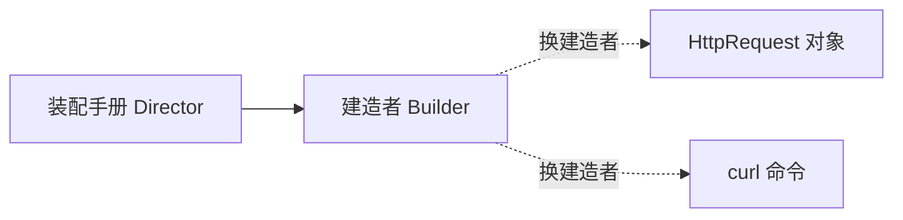
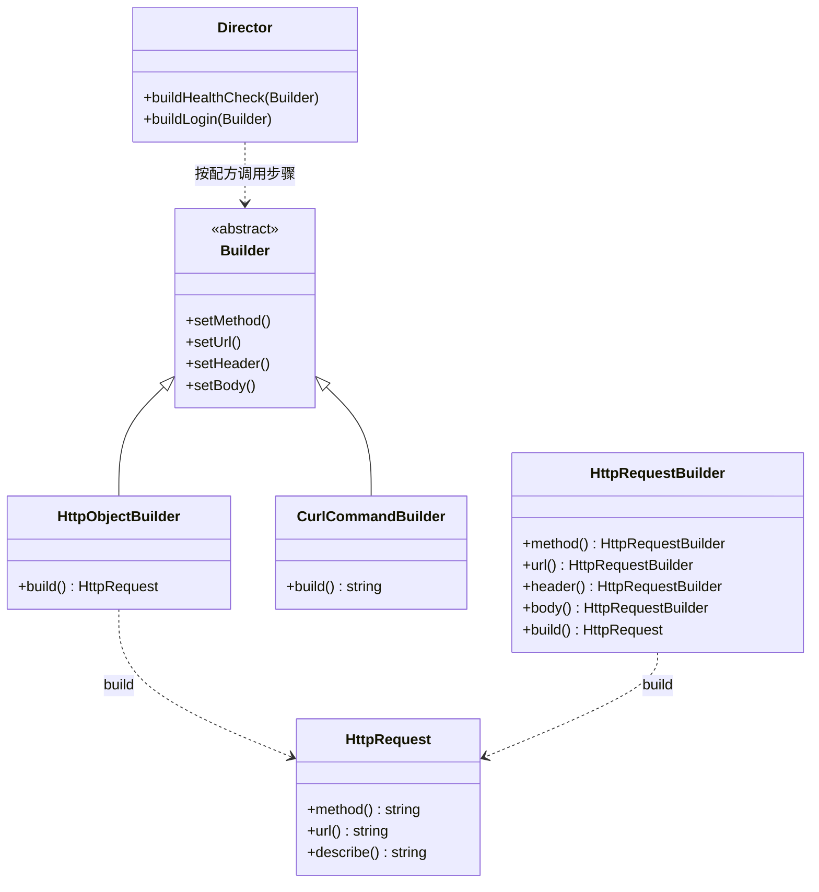
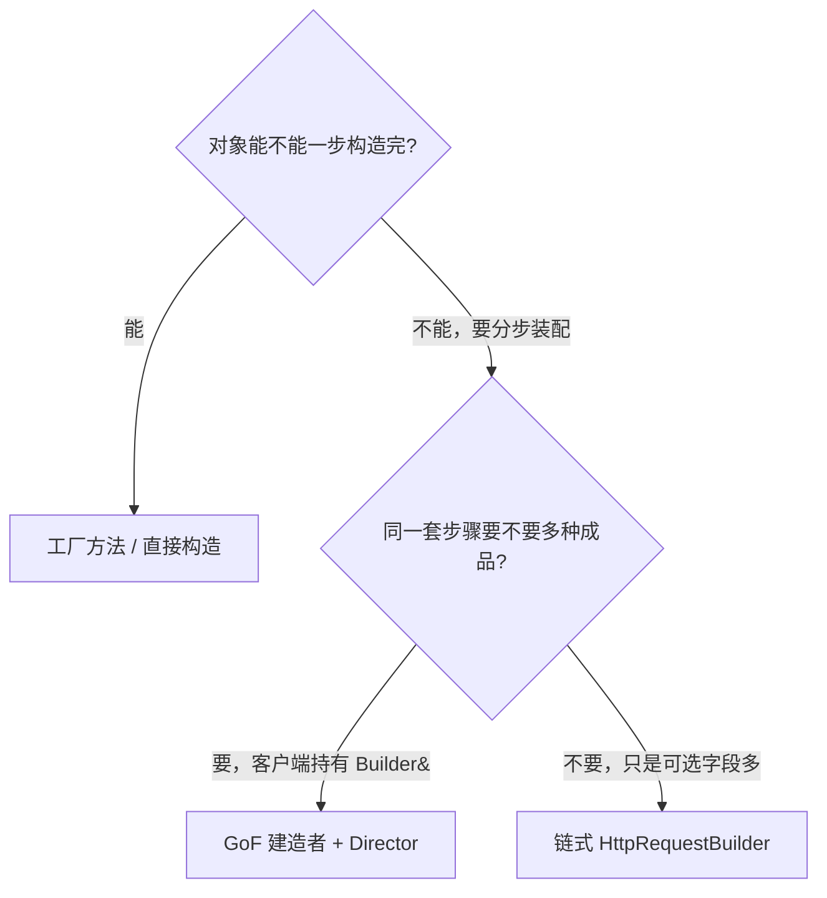
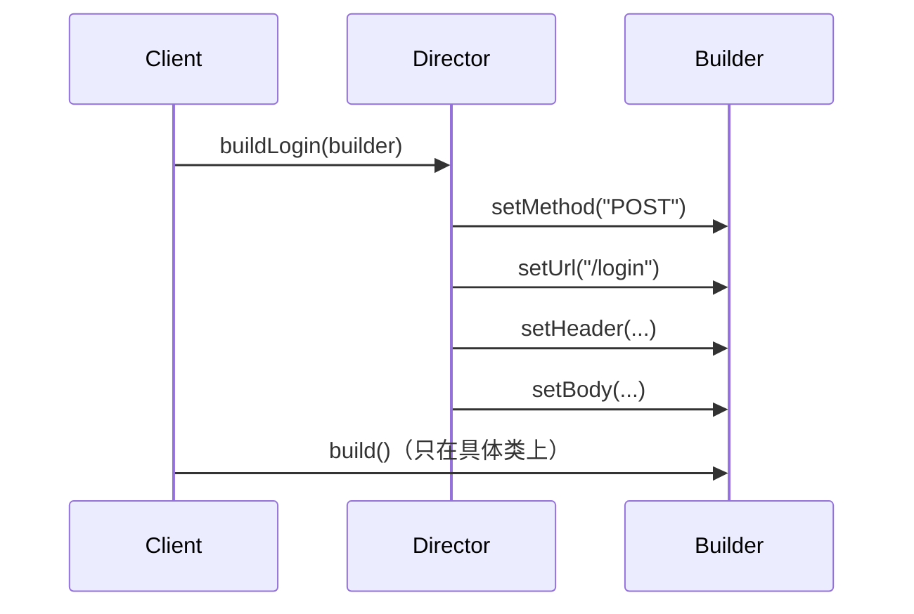
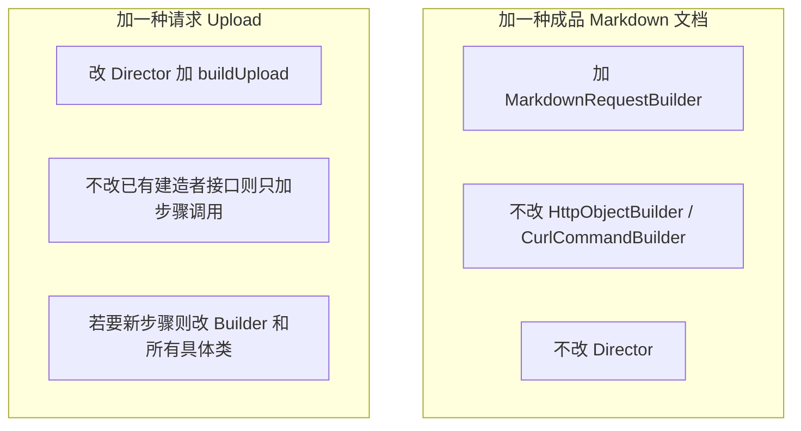
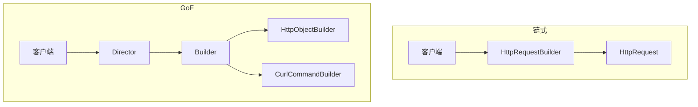
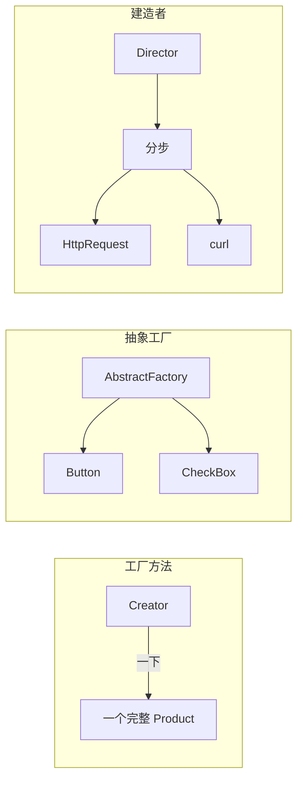

# Builder（建造者）

**类型**：Creational（创建型）

**代码位置**：

- 头文件：[`include/creational/builder/builder.h`](../../include/creational/builder/builder.h)
- 实现：[`src/creational/builder/builder.cpp`](../../src/creational/builder/builder.cpp)
- 测试：[`tests/creational/builder_test.cpp`](../../tests/creational/builder_test.cpp)
- 客户端：[`examples/creational/builder/main.cpp`](../../examples/creational/builder/main.cpp)

## 意图

把**复杂对象的装配过程**从最终表示里拆出来，让同一套步骤可以产出不同的产品。

可以把 `Director` 想成「装配手册」：登录请求先写 POST、再写 URL、再加 JSON 头、最后放 body。手册不管最后交出来的是一个 `HttpRequest` 对象，还是一条 `curl` 命令。换建造者，换的是成品形态，不是装配顺序。

本仓库的例子就是拼 HTTP 请求：`HttpObjectBuilder` 交出不可变的 `HttpRequest`，`CurlCommandBuilder` 交出等价的 curl 字符串。



## 适用场景

- **构造参数多、多数可选**：method / url / header / body，不想写十个重载构造函数
- **同一套步骤，多种成品**：同一登录流程，既能得到对象，也能得到 curl
- **产品希望装配完再不可变**：可变状态只活在建造者里，`build()` 之后不再改

**不适合**：

- 两个必填参数就能造出来 → 直接构造
- 一次要造一组互相匹配的对象（按钮 + 复选框）→ 那是抽象工厂
- 只是不想在客户端写 `new`，对象一步就能造完 → 工厂方法或简单工厂

## 共同骨架

本仓库两套写法共用同一个产品 `HttpRequest`，差在**谁掌握装配顺序、建造步骤是不是虚函数**：



| 构件                                                         | 作用                                                                   |
| ------------------------------------------------------------ | ---------------------------------------------------------------------- |
| `HttpRequest`                                              | 装配完成后的不可变产品；`describe()` 方便断言，头文件不引入 iostream |
| `Builder` + `HttpObjectBuilder` / `CurlCommandBuilder` | GoF 建造者：步骤在抽象接口上，成品类型在具体建造者的 `build()` |
| `Director`                                                 | 固定配方：健康检查、登录。只认`Builder&`，不知道成品长什么样         |
| `HttpRequestBuilder`                                       | 对照：链式 API，客户端自己当导演                                       |

两套都不在头文件里打日志。差别在三件事：**步骤是虚函数还是返回 `*this`、谁决定装配顺序、`build()` 放在哪**。



和 [工厂方法](factory_method.md) 的粒度不同：工厂方法一次 `createProduct()` 交出完整对象；建造者把创建拆成 `setMethod` / `setUrl` / `setHeader` / `setBody`。和 [抽象工厂](abstract_factory.md) 也不同：抽象工厂一次造**一族**对象；建造者一次造**一个**复杂对象。

### 为什么 `build()` 在具体建造者上，不在 `Builder` 里

差在一件事：**两种成品的类型不一样。**

`HttpObjectBuilder::build()` 返回 `HttpRequest`，`CurlCommandBuilder::build()` 返回 `std::string`。抽象 `Builder` 如果声明 `virtual HttpRequest build()`，curl 那条路就塞不进去。GoF 原意就是：抽象接口只规定**步骤**，取成品是具体建造者自己的事（书里叫 `GetResult`，本仓库统一叫 `build`：交成品时才真正把零件拼起来）。

`Director` 因此从来不调 `build()`。它只负责把步骤按顺序喊出来。客户端自己拿着具体建造者取成品。



链式建造者没有这个问题：它只产一种 `HttpRequest`，所以 `build()` 可以直接写在同一个类上。

### 为什么 `Builder` 删除拷贝，`HttpRequest` 却可以拷

差在一件事：**这个类是不是多态基类。**

`Builder` 要被 `Director` 用 `Builder&` 持有。按值拷会切片，拷贝 / 移动 **`= delete`**，构造仍是 `= default`。`HttpObjectBuilder` / `CurlCommandBuilder` 跟着基类一起不能拷。

`HttpRequest` 相反：装配结束就是一份数据，客户端按值拿、按值传。链式 `HttpRequestBuilder` 也不是多态点，可以拷一份半成品接着填。

|                        | `Builder` / 具体建造者 | `HttpRequest` / `HttpRequestBuilder` |
| ---------------------- | ------------------------ | ---------------------------------------- |
| 这个类是什么           | 多态装配工位             | 值对象                                   |
| 要不要有「自己的实例」 | 要                       | 要                                       |
| 构造怎么写             | `= default`            | 普通构造                                 |
| 拷贝 / 移动            | `= delete`（防切片）   | 允许                                     |
| 原因                   | 成员里能造，按值拷会切片 | 拷的是数据，不是继承层次                 |

一句话：

- **`Builder` 默认构造 + 删除拷贝**：对象可以存在，但不能当值来拷。
- **`HttpRequest` 按值返回**：产品离开建造者之后就是普通数据。

### 为什么产品用 `describe()` 而不是 `std::cout`

建造者的职责是把对象装配出来。在头文件里 `#include <iostream>` 会污染所有翻译单元，打印也无法直接断言。`describe()` 返回 `std::string`，测试写 `EXPECT_EQ`，示例再决定要不要打印。

`url` 是必填：三种建造者在 `build()` 时若 URL 为空，都 `throw std::invalid_argument`。`method` 缺省为 `"GET"`，避免为了默认值再写一串构造函数重载——那正是建造者要消掉的望远镜构造。

---

## 1. 建造者：`Builder` / `Director` / 具体建造者

GoF 原意。稳定配方在 `Director`，变化点在具体建造者怎么把每一步写进自己的产品。这点和工厂方法的 `Creator::process()` 同类：流程写一次，变化推迟到子类；工厂方法变化的是**造哪一种完整对象**，建造者变化的是**同一步骤对应哪种表示**。

### 原理

客户端准备一个具体建造者和一个导演。导演只拿 `Builder&`，按配方依次调步骤。动态绑定发生在 `setMethod()` 这些虚函数上，不发生在配方上。同一个 `buildLogin()`，交给 `HttpObjectBuilder` 得到对象，交给 `CurlCommandBuilder` 得到 curl。



加一种表示符合开放封闭。加一种**新步骤**（例如 `setTimeout`）要改抽象，这是建造者的经典代价：装配步骤写进了 `Builder` 接口。

### 基本构成

| 位置                                                    | 内容                                                |
| ------------------------------------------------------- | --------------------------------------------------- |
| `HttpRequest`                                         | 值类型产品；空 URL 抛异常；空 method 当成 GET       |
| `Builder`                                             | 纯虚步骤，虚析构，删除拷贝 / 移动                   |
| `HttpObjectBuilder` / `CurlCommandBuilder`          | `final`，实现放在 `.cpp`，各自提供 `build()` |
| `Director::buildHealthCheck` / `buildLogin` | 非虚，稳定配方                                      |

|                  | `Director::buildLogin` | `Builder::setMethod` 等  |
| ---------------- | ---------------------------- | -------------------------- |
| 是否虚函数       | 否                           | 纯虚                       |
| 谁实现           | 导演一份                     | 每个具体建造者             |
| 加新表示要不要改 | 不要                         | 新写一个建造者覆盖         |
| 加新步骤要不要改 | 要                           | 抽象和所有建造者都要加方法 |

步骤**不**标 `const`：建造者是可变工位，装配就是在改自己。`Director` 的配方可以是 `const`：它不改自己，只改传入的 `Builder&`。

```cpp
void Director::buildLogin(Builder &builder) const {
  builder.setMethod("POST");
  builder.setUrl("/login");
  builder.setHeader("Content-Type", "application/json");
  builder.setBody(R"({"user":"alice","password":"secret"})");
}

HttpRequest HttpObjectBuilder::build() const {
  return HttpRequest(method_, url_, headers_, body_);
}
```

没有「登录配方写出半截 curl」这条路径：导演把步骤走完，具体建造者自己保证表示自洽。这是模式要保证的不变量。

### 用法

导演驱动两种表示（测试 `DirectorConstructsLoginOnBothBuilders` / `DirectorConstructsHealthCheck`）：

```cpp
Director director;
HttpObjectBuilder http;
CurlCommandBuilder curl;
director.buildLogin(http);
director.buildLogin(curl);
http.build().describe();
// "POST /login | Content-Type=application/json | body=..."
curl.build();
// "curl -X POST '/login' -H 'Content-Type: application/json' -d '...'"
```

只依赖抽象步骤，不碰具体类型（测试 `ClientDependsOnBuilderAbstraction`）：

```cpp
HttpObjectBuilder http;
Builder &as_http = http;
director.buildLogin(as_http);
http.build();  // 取成品仍要具体类型
```

拷贝 / 移动已删除，对应测试 `CopyAndMoveAreDeleted`。缺 URL 会抛异常，对应 `BuildersRejectMissingUrl`。

示例 [`examples/creational/builder/main.cpp`](../../examples/creational/builder/main.cpp) 里，登录和健康检查各跑一遍对象 / curl；换 `Builder&` 只换表示，配方不动。

### 特点

- 换表示只换建造者，配方一起复用
- 符合开放封闭的方向是**加一种成品**：加 `MarkdownRequestBuilder`，不改已有建造者和 `Director`
- 每个具体建造者都可以有很多实例，**不是**建造者单例
- 加**新步骤**必须改 `Builder` 和所有具体建造者，步骤很多时偏重
- 若导演只剩一个建造者、配方也只有一种，类图还像建造者，语义上已滑回「分步 setter」

---

## 2. 对照：`HttpRequestBuilder`

对照实现，**不是** GoF 建造者。一个类、一套返回 `*this` 的方法，最后 `build()` 得到 `HttpRequest`。没有抽象 `Builder`，也没有 `Director`。客户端自己决定先写 URL 还是先写 header。

它对应工厂方法笔记里的 `SimpleFactory`：简单工厂把「选哪种」收进一个函数；这里把「填哪些可选字段」收进一条链式调用。真正保证产品不可变的，还是最后那个 `build()`。

### 原理

调用方按需要串方法。每个 setter 改建造者内部状态并返回自身引用，所以可以写在一行里。没有虚函数，也没有第二种成品。




### 基本构成

| 位置                        | 内容                                        |
| --------------------------- | ------------------------------------------- |
| 返回`HttpRequestBuilder&` | 链式调用的唯一条件，返回值不能是`void`    |
| `build() const`           | 按值交出`HttpRequest`；建造者自己仍可再用 |
| 无抽象基类                  | 不删除拷贝，半成品可以拷一份                |

```cpp
HttpRequest req = HttpRequestBuilder()
                      .method("POST")
                      .url("/login")
                      .header("Authorization", "Bearer token")
                      .body(R"({"user":"alice"})")
                      .build();
```

缺 URL 同样 `throw`，对应测试 `BuildersRejectMissingUrl`。只写 URL 时 method 默认 GET，对应 `FluentBuilderDefaultsToGet`。

### 用法

```cpp
HttpRequest login = HttpRequestBuilder()
                        .method("POST")
                        .url("/login")
                        .header("Authorization", "Bearer token")
                        .build();
HttpRequest health = HttpRequestBuilder().url("/health").build();
```

对应测试 `FluentBuilderBuildsRequest` / `FluentBuilderDefaultsToGet`。

示例第三段就是这条路径：客户端自己编排字段，没有导演。

### 特点

- 代码最短，可选字段想写就写，好懂
- 只有一种成品，加 curl 表示必须另写一套，封闭原则帮不上忙
- 装配顺序由调用方决定，配方无法复用
- 多态不发生，建造者本身不是扩展点
- C++ 里更常见；参数多、表示只有一种时很合适。不要把它当成 GoF 建造者本身

---

## 总对照

| 写法                       | 装配顺序           | 成品             | 加新表示 / 新字段 | 推荐场景                 |
| -------------------------- | ------------------ | ---------------- | ----------------- | ------------------------ |
| 望远镜构造函数             | 调用方一次塞完     | 一种             | 改所有重载        | 字段少                   |
| 一串 setter 再拿对象       | 调用方             | 一种，且对象可变 | 改产品类          | 可变 DTO                 |
| **GoF 建造者**       | **Director** | **多种**   | 加一个具体建造者  | 同一步骤、多种成品       |
| 链式`HttpRequestBuilder` | 调用方             | 一种             | 改建造者          | 可选字段多、只有一种成品 |
| 工厂方法                   | 一次创建           | 一种完整对象     | 加一对类          | 不需要分步装配           |
| 抽象工厂                   | 一次创建           | 一族对象         | 加一个产品族      | 多产品必须配套           |



再记三点，和具体类名无关，但最容易混：

1. **建造者是「分步装配」，不是「带默认参数的构造函数」。** 默认参数解决的是「少写几个实参」；建造者解决的是「步骤可复用、表示可替换、产品离开工位后不可变」。
2. **`build()` 在具体类上，因为成品类型不同。** 强行写进抽象 `Builder`，第二种表示就没处放。链式建造者的 `build()` 能写在同一个类上，正是因为它只产一种东西。GoF 书里这个方法叫 `GetResult`；本仓库两套都叫 `build()`，差的不是名字，是它挂在哪。
3. **`HttpRequestBuilder` 只负责填字段。** 没有它，GoF 建造者照样成立；有了它，也不等于把导演和抽象接口都省掉之后还叫同一个模式。

## 怎么选

```text
对象能不能一步构造完？
  └─ 能
        └─ 一次一个 → 工厂方法 / 直接构造
        └─ 一次一族配套产品 → 抽象工厂
  └─ 不能，要分步
        └─ 同一套步骤要多种成品 → Builder + Director
        └─ 只有一种成品，只是可选字段多 → HttpRequestBuilder 链式调用
```

步骤会横向猛涨时，先问能不能接受改 `Builder` 接口；不能接受就不要把每一个 HTTP 细节都塞进同一个抽象建造者。

## 参考

- 《设计模式：可复用面向对象软件的基础》（GoF）：Builder
- [Factory Method（工厂方法）](factory_method.md)：一次造完 vs 分步装配
- [Abstract Factory（抽象工厂）](abstract_factory.md)：一族对象 vs 一个复杂对象
- 《Effective C++》条款 18：让接口容易正确使用、难以误用
- `std::string_view`（只读入参，避免无谓拷贝）/ 按值返回产品（拷贝消除）
