# 创建型模式总览

**类型**：Creational（创建型）对照

本文件把本仓库五种 GoF 创建型模式放在同一张图里看，并补上 C++ 工程里**更常写到**、但不一定叫设计模式的创建方式。单模式细节仍看各自笔记。

| 模式 | 笔记 |
| ---- | ---- |
| Singleton | [singleton.md](singleton.md) |
| Factory Method | [factory_method.md](factory_method.md) |
| Abstract Factory | [abstract_factory.md](abstract_factory.md) |
| Builder | [builder.md](builder.md) |
| Prototype | [prototype.md](prototype.md) |

创建要回答的不是「要不要工厂」这一件事，而是四个问题：

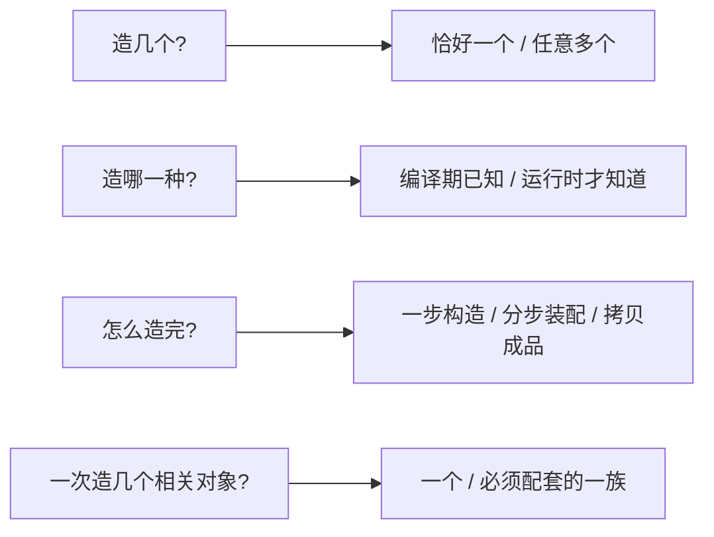

五种 GoF 模式各自钉死其中一问。C++ 日常写法（`make_unique`、命名构造、值拷贝、依赖注入）往往在这些问题还没涨起来之前就把对象造好了。

---

## 1. 本仓库五种模式对照

把「谁决定类型、成品从哪来、加新种类改哪里」对齐以后，五种模式不再像五套互不相关的类图。

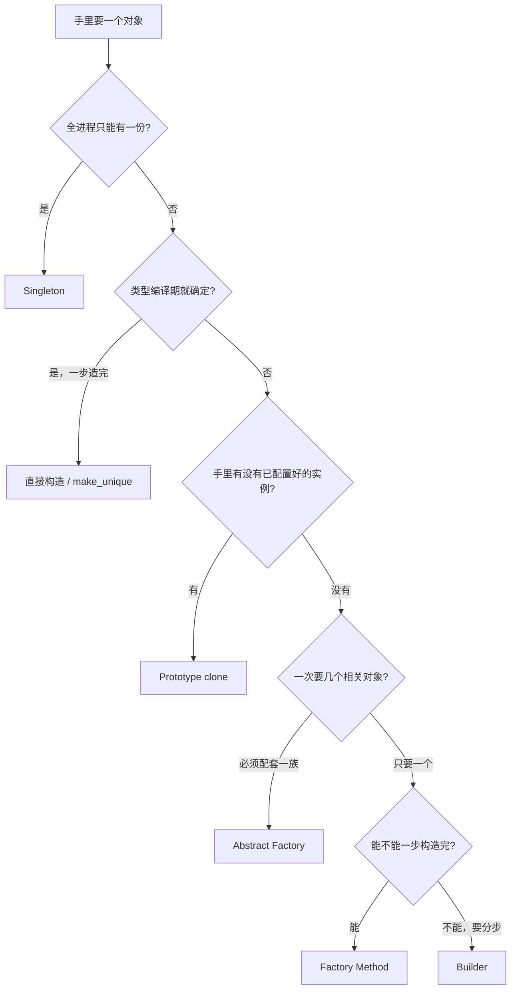

### 各自钉死哪一问

| 模式 | 钉死的问题 | 本仓库里像什么 | 变化点 |
| ---- | ---------- | -------------- | ------ |
| [Singleton](singleton.md) | 造**几个**：恰好一个，全局入口 `getInstance()` | 总配电箱 | 实例化时机（饿汉 / Meyers / 加锁） |
| [Factory Method](factory_method.md) | 造**哪一种**：子类覆盖 `create()`，使用留在调用方 | 后厨窗口 vs 各地菜品 | 加一对 `ConcreteProduct` + `ConcreteFactory` |
| [Abstract Factory](abstract_factory.md) | 一次造**一族**：选中工厂就锁定整套 | 装修风格包 | 加一个产品族（Standard / Pro） |
| [Builder](builder.md) | **怎么造完**：步骤可复用，成品表示可换 | 装配手册 vs HTTP 对象 / curl | 加一个具体建造者 |
| [Prototype](prototype.md) | 按**已有实例**再来一份，且不能切片 | 兵营模具出兵 | 加一个可 `clone()` 的具体类 |

工厂方法和抽象工厂都在「运行时选类型」，差在粒度：一次一个完整对象，还是一次一套必须配套的对象。建造者和原型都在「对象已经比较复杂」，差在手里有没有成品：没有就分步装配，有就拷贝。单例和其他四种几乎正交——它不管类型层次，只管个数。

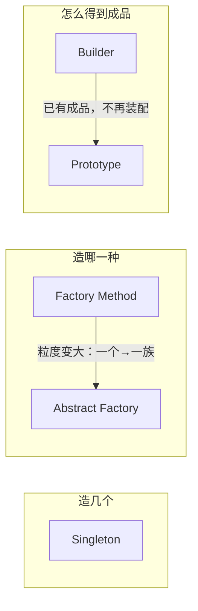

### 类图放在一起看

本仓库每个模式都带一套**对照写法**（简单工厂、选择器、链式建造者、值对象）。对照不是 GoF 本身，是 C++ 里更短的那条路。

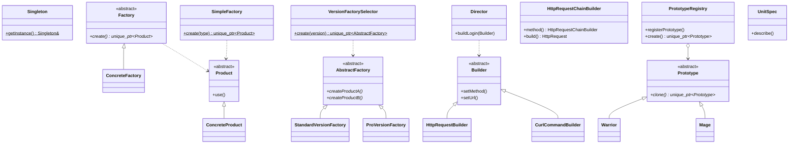

### 创建点 / 使用点 / 扩展方向

| | 创建点 | 使用点 | 加新种类时 | 返回什么 |
| - | ------ | ------ | ---------- | -------- |
| Singleton | 类内部，静态局部 / 指针 | 全进程同一份引用 | 通常不加「第二种单例」 | `T&` |
| 直接 `make_unique<T>` | 调用方写出具体类 | 调用方 | 改所有 `make_unique` | `unique_ptr<T>` |
| SimpleFactory | 一个 `switch` | 调用方 | **改工厂** | `unique_ptr<Product>` |
| Factory Method | 子类 `create()` | 调用方 | 加一对类，不改已有工厂 | `unique_ptr<Product>` |
| Abstract Factory | 一族 `create*()` | 客户端只认抽象 | 加一个族；加一种**产品角色**要改接口 | 多个 `unique_ptr` |
| VersionFactorySelector | `switch` 选出工厂 | 仍走抽象工厂 | 改选择器和枚举 | `unique_ptr<AbstractFactory>` |
| GoF Builder + Director | 导演调步骤，具体建造者攒零件 | 客户端在具体类上 `build()` | 加一种表示 | `HttpRequest` 或 `string` |
| HttpRequestChainBuilder | 调用方自己链式填字段 | 调用方 `build()` | 改这一个类 | `HttpRequest` |
| Prototype | 已有实例的 `clone()` | 客户端改副本差异字段 | 加一个具体原型 | `unique_ptr<Prototype>` |
| PrototypeRegistry | 名字 → 模板 → `clone()` | 客户端只认字符串 | 多 `registerPrototype` 一次 | `unique_ptr<Prototype>` |
| UnitSpec | 拷贝构造 | 调用方 | 改这一个值类 | 值 |

### 最容易混的几对

**工厂方法 vs 抽象工厂**

都把 `new ConcreteX` 从客户端挪走。工厂方法一次交出**一个** `Product`；抽象工厂一次交出 **ProductA + ProductB**，并且保证同族。抽象工厂里的每一个 `createProductA()`，内部往往仍是工厂方法。本仓库 `VersionFactorySelector` 只负责**选出哪一个工厂**，配套关系仍由 `StandardVersionFactory` 保证。

**工厂方法 vs 简单工厂**

`SimpleFactory::create(type)` 用枚举分支，加产品必须改这个函数。`Factory::create()` 把选类型推迟到子类，加产品只加一对类。两边都把产品交回调用方，`use()` / `show()` 不写进工厂。种类少时简单工厂足够；种类会涨、又不想改旧的创建代码时，再用 `Factory`。

**建造者 vs 工厂方法**

工厂方法假设对象**一步就能造完**。建造者把创建拆成 `setMethod` / `setUrl` / `setHeader` / `setBody`。同一套步骤要 HTTP 对象和 curl 两种成品时，才需要 GoF 的抽象 `Builder` + `Director`；只有一种 `HttpRequest`、只是可选字段多，链式 `HttpRequestChainBuilder` 更常见。

**建造者 vs 原型**

建造者手里还没有成品，按手册装配。原型手里已经有一份配好的实例，再克隆。`Warrior` 的技能树已经配完，刷怪只改坐标——走原型，不要再走一遍建造者。

**原型 vs UnitSpec**

都是「按例子再来一份」。通过 `Prototype&` 拷贝会切片，必须虚 `clone()`。已经拿着具体值类型，拷贝构造函数就是 `UnitSpec`。详见 [prototype.md](prototype.md)。

**单例 vs 工厂**

单例回答「几个」，工厂回答「哪一种」。`ConcreteFactory` 可以有很多实例，**不是**工厂单例。反过来，单例的 `getInstance()` 也不是工厂方法：它不挑选类型，只返回那一个自己。

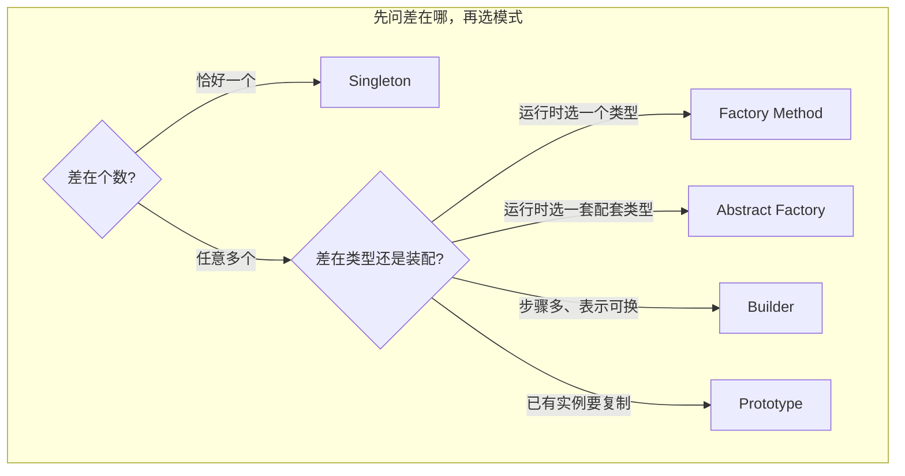

### C++ 里这五种共同的契约

和 Java 教材里的 `new` 不同，本仓库统一了三件事：

1. **多态基类删除拷贝 / 移动**，防止切片。`Product`、`ProductA`、`Builder`、`Prototype` 都是这条规则。
2. **所有权写进返回类型**：工厂和 `clone()` 返回 `unique_ptr`，单例返回引用（调用方不拥有）。
3. **头文件不打日志**：`use()` / `paint()` / `describe()` 返回 `string`，测试才能 `EXPECT_EQ`。

`unique_ptr` 解决所有权，虚函数解决类型。返回智能指针不会自动变成工厂方法；写了虚 `create` 却返回裸指针，模式对了，C++ 契约仍是错的。

---

## 2. C++ 开发里更常见的创建方式

GoF 五种并不是 C++ 里出现频率最高的。工程代码里，对象多半在模式之前就被造出来了。下面按**真正会写到的顺序**排，不按教科书目录。

### 2.1 语言把对象造出来

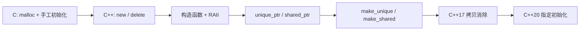

| 方式 | 典型代码 | 解决什么 | 还缺什么 |
| ---- | -------- | -------- | -------- |
| 栈上直接构造 | `HttpRequest req{...};` | 类型确定、生命周期跟着作用域 | 不能多态、不能延迟到堆 |
| 构造函数不变量 | 非法参数直接 `throw` | 造出来的对象一定合法 | 参数一多就出现望远镜构造 |
| `new T` / `delete` | 旧代码 | 堆上寿命自管 | 异常路径易泄漏，所有权靠约定 |
| `make_unique<T>` | 本仓库工厂的实现手段 | 所有权在类型里 | 调用方仍要写出具体类 `T` |
| `make_shared<T>` | 共享所有权 | 多个观察者同一份 | 循环引用、开销比 unique 大 |
| 拷贝 / 移动 | `auto b = a;` / `std::move` | 值语义、移交资源 | 通过基类按值拷会切片 |
| 指定初始化 | `Point{.x = 1, .y = 2}` | 聚合体字段多时少写建造者 | 只适用于聚合，没有不变量逻辑 |
| 拷贝消除 / 纯右值 | 按值返回大对象 | 少一次拷贝 | 不替代工厂，只让「返回值」便宜 |

这一层是**机制**，不是模式。`make_unique<Warrior>` 不是原型，也不是工厂方法；它只是把 `new` 和 `delete` 收进类型。

### 2.2 命名构造与免费工厂函数

类型只有一种，但构造规则不少：校验、默认值、从文件加载。这时不必上 `Factory`，把构造函数藏起来，留几个静态函数：

```cpp
class Connection {
public:
  static Connection fromUri(std::string_view uri);
  static Connection localEcho();
private:
  Connection(...);
};
```

C++ 社区常叫 **Named Constructor**，或直接写自由函数 `make_connection(uri)`。和工厂方法的差别：没有继承、没有虚 `create()`、加「另一种连接」通常还是改这几个函数。种类少、规则集中时，这是默认选项。

### 2.3 简单工厂与类型登记表

种类开始涨，但客户端仍不想写 `make_unique<ConcreteA>`：

```cpp
auto p = SimpleFactory::create(ProductType::A);
```

再往后，编译期写不死所有分支，会变成**运行时登记表**：字符串 / ID → `std::function<unique_ptr<Product>()>`。本仓库 `PrototypeRegistry` 是同一思路的拷贝版（登记的是模板实例，不是构造函数）。插件、脚本刷怪、按配置加载资源，走的都是登记表，不一定再套一层 `Factory`。

### 2.4 值拷贝、链式建造者、依赖注入

这三件在现代 C++ 里比 GoF 原版更常见：

| 写法 | 本仓库对照 | 真实项目里像什么 |
| ---- | ---------- | ---------------- |
| 值对象 + 拷贝 | `UnitSpec` | DTO、配置、小聚合 |
| 链式 setter 最后 `build()` | `HttpRequestChainBuilder` | `RequestBuilder`、测试 fixture |
| 构造函数注入依赖 | 五种模式都没强制单例工厂 | 把 `Logger&` 传进来，而不是 `Logger::getInstance()` |

依赖注入（DI）不是 GoF 创建型模式，却经常**替代单例**：对象仍随便造，谁需要资源谁在构造时把资源接进来。单测可以塞假对象。进程级真资源（日志设备、配置）才考虑 Meyers 单例。

### 2.5 对象池、placement new、分配器

创建成本高、对象形态固定时，问题从「怎么造」变成「**要不要每次都造**」：

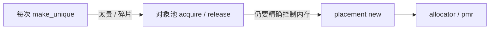

- **对象池**：预先造好，借出 / 归还。游戏子弹、网络连接、内存块。
- **placement new**：在已有内存上调构造函数。容器、池子的底层。
- **`std::pmr` / allocator**：谁提供内存和构造分离。

这些和工厂正交：池子内部仍然可能用工厂方法造第一批对象。

### 2.6 不用继承的「选类型」

运行时选类型不一定要虚函数：

```cpp
using Widget = std::variant<StandardProductA, ProProductA>;
```

`std::visit` 代替 `paint()` 虚调用。种类封闭、想要值语义时，这比抽象工厂轻。种类开放、要插件化时，仍用继承 + 工厂 / 原型。

C++20 Concept + 模板是另一条路：**编译期**选实现，没有虚表，也没有运行时工厂。嵌入式、高性能库更常见。它解决的是「算法同一、实现可替换」，不是「配置文件里写 Standard 还是 Pro」。

### 2.7 和 GoF 的对应关系

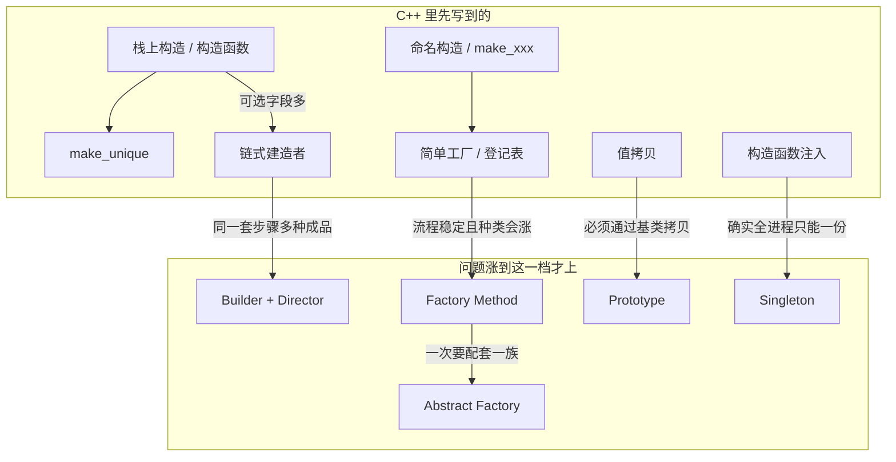

上半是默认工具箱，下半是痛点涨出来之后的升级。本仓库每个模式带的对照类（`SimpleFactory`、`HttpRequestChainBuilder`、`UnitSpec`、`VersionFactorySelector`）刻意停在上半，避免把日常写法误叫成 GoF。

---

## 3. 演进：从「new 一个」到五种模式

演进不是时间线「先发明单例再发明工厂」，而是**调用方反复碰到的新约束**。每加一条约束，就多一种创建方式。

### 3.1 语言侧：谁拥有这块内存

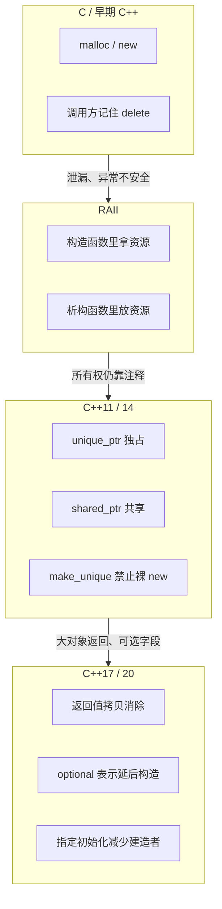

这一轨解决的是安全和寿命。它**不选类型**。所以即使用上 `make_unique`，客户端写 `make_unique<StandardProductA>()` 仍然把具体类写死了——这才轮到工厂。

### 3.2 设计侧：约束一条条加上去

下面每一步的箭头含义是：「旧写法还能用，但新约束出现后代价变高」。

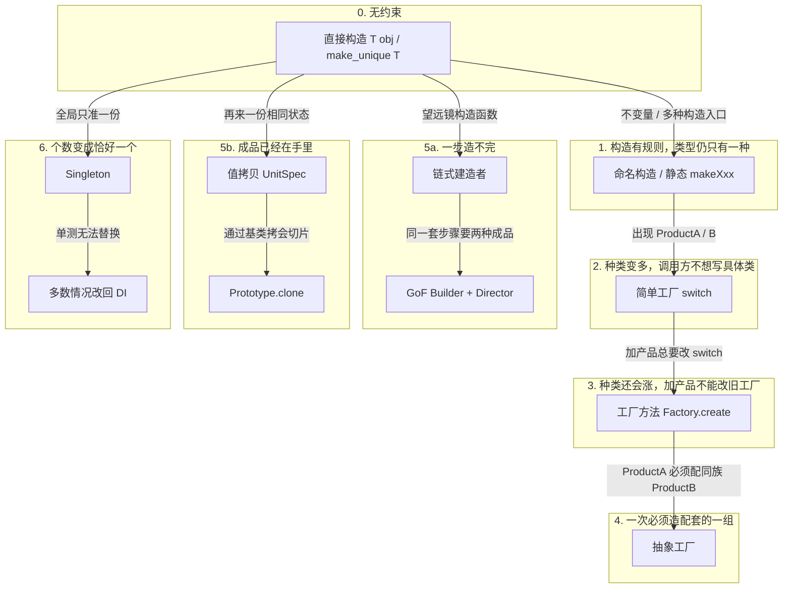

读图时抓住每次多出来的那句话：

| 阶段 | 新约束 | 还用旧写法会怎样 | 升级到 |
| ---- | ------ | ---------------- | ------ |
| 0 → 1 | 非法参数、多种合法构造 | 构造函数重载爆炸 | 命名构造 |
| 1 → 2 | 运行时才知道 A 还是 B | 调用点铺满 `if` / `make_unique<A>` | 简单工厂 |
| 2 → 3 | 加 C 不能改旧工厂 | 每次加产品改中央 `switch` | 工厂方法 |
| 3 → 4 | 两个产品必须同族 | 客户端自己配对，配错标准版 ProductA + 专业版 ProductB | 抽象工厂 |
| 0 → 5a | 十几个可选字段 | 望远镜构造、半成品对象 | 链式建造者 |
| 5a → GoF | 同一步骤多种表示 | 为 curl 再抄一套 setter | Builder + Director |
| 0 → 5b | 模板已配好 | 每次从零填技能树 | 值拷贝 |
| 5b → 原型 | 只拿着基类引用 | 切片，派生字段丢光 | `clone()` |
| 0 → 6 | 进程级唯一资源 | 每人 `new` 一份配置 | 单例；能注入则不要单例 |

### 3.3 一张总图：两条轨交汇

语言轨保证「造出来的对象有人管」。设计轨保证「该造哪一个、造几个、怎么造完」。交汇点就是本仓库的实现约定：`make_unique` + 虚函数 + 删除基类拷贝。

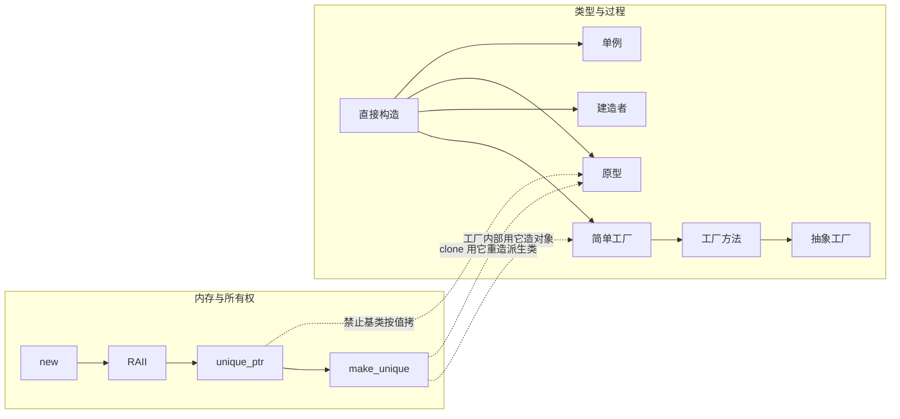

### 3.4 现代 C++ 对 GoF 的修正

GoF 写于 1994，例子是裸 `new`。C++ 现在会把几条路**往回收**：

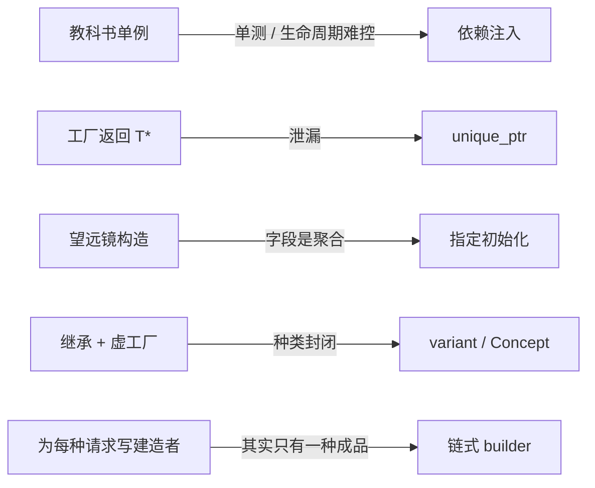

| GoF 原意 | C++ 里更常改成 | 本仓库对应 |
| -------- | -------------- | ---------- |
| 单例当全局 | 能注入就注入；真全局才 Meyers | `SingletonMeyers`，笔记里写了不适合当全局变量 |
| `create()` 返回裸指针 | `unique_ptr` | 全部工厂 / `clone()` |
| 为可选字段上 Director | 链式建造者或指定初始化 | `HttpRequestChainBuilder` |
| 为拷贝上 Prototype | 值类型直接拷 | `UnitSpec` |
| 为每种子类写 Factory | 简单工厂或登记表 | `SimpleFactory`、`PrototypeRegistry` |

所以演进的最后一跳往往不是「再上一个更重的模式」，而是**问约束是否真的还在**。种类不再涨，就退回简单工厂；不再通过基类拷贝，就退回 `UnitSpec`；不再需要全局唯一，就退回普通对象 + DI。

---

## 4. 怎么选

把前面的图收成一张检查表。从左往右，满足就停下，不要继续加模式。

```text
1. 全进程必须恰好一份？
     └─ 是，且替换成本可接受 → Singleton（优先 Meyers）
     └─ 是，但测试要替换 → 不要单例，构造函数注入
     └─ 否 ↓

2. 一步构造得完吗？
     └─ 否，同一套步骤多种成品 → Builder + Director
     └─ 否，只有一种成品、可选字段多 → 链式建造者 / 指定初始化
     └─ 是 ↓

3. 手里已经有一份配好的实例？
     └─ 是，且必须通过基类复制 → Prototype::clone
     └─ 是，已经是具体值类型 → 拷贝构造 / UnitSpec
     └─ 否 ↓

4. 一次要几个相关对象？
     └─ 必须配套一族 → Abstract Factory
     └─ 只要一个 ↓

5. 类型编译期确定吗？
     └─ 确定 → 直接构造 / make_unique / 命名构造
     └─ 不确定，种类少 → SimpleFactory
     └─ 不确定，种类会涨 → Factory Method
```

三个不应靠模式解决的问题：

- **所有权** → `unique_ptr` / 引用，不是工厂
- **太贵不想每次 new** → 对象池，不是原型（原型仍每次造新对象，只是拷现成状态）
- **只是懒得写构造参数** → 默认实参或指定初始化，不是建造者

## 参考

- 《设计模式：可复用面向对象软件的基础》（GoF）：Creational
- [Singleton](singleton.md) / [Factory Method](factory_method.md) / [Abstract Factory](abstract_factory.md) / [Builder](builder.md) / [Prototype](prototype.md)
- 《Effective C++》条款 13、18：资源管理与接口契约
- 《Effective Modern C++》条款 18–22：`unique_ptr` / `shared_ptr` / `make_unique`
- `std::optional`、指定初始化（C++20）、`std::variant`、`std::pmr`
