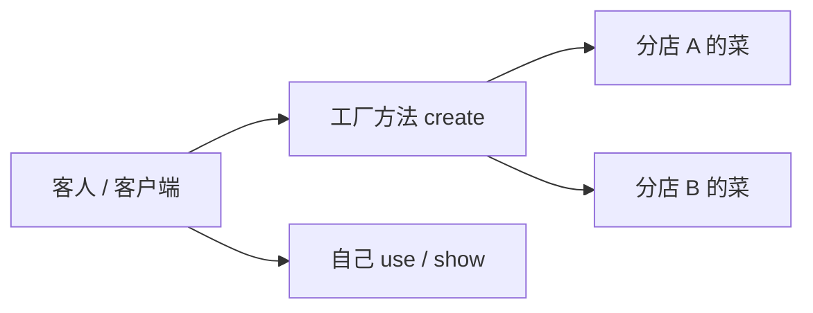
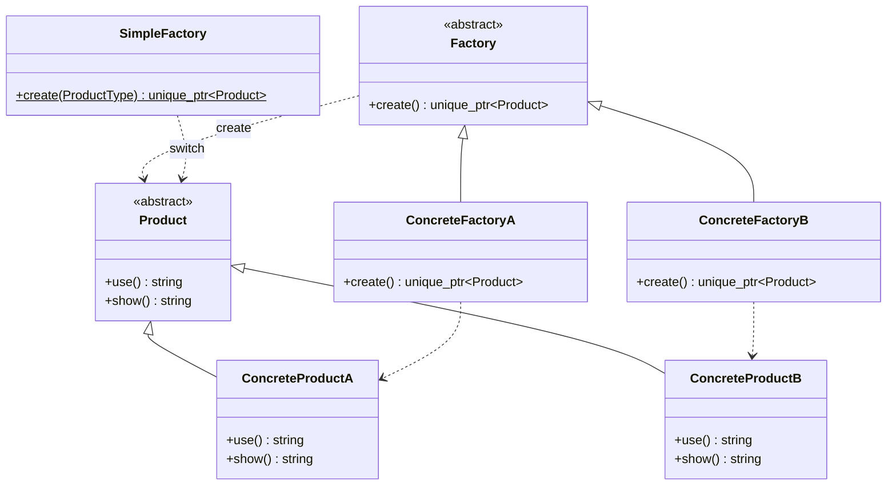
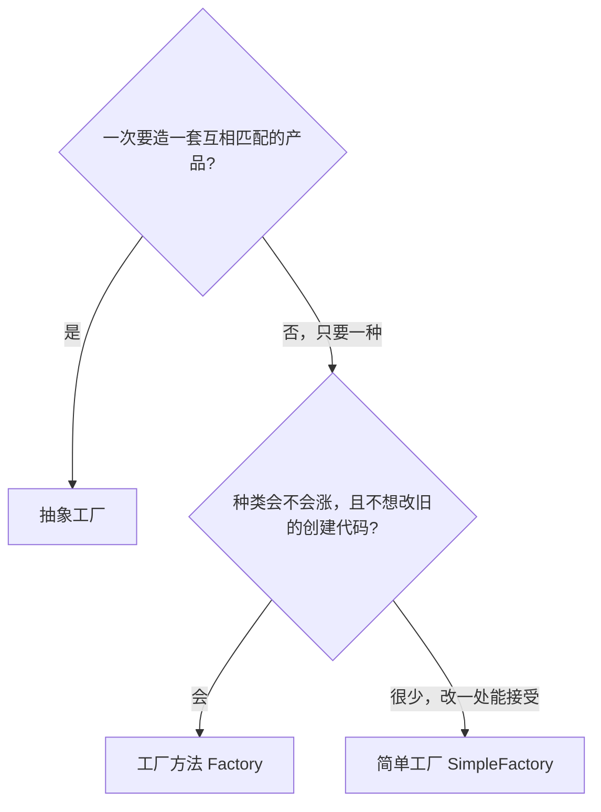
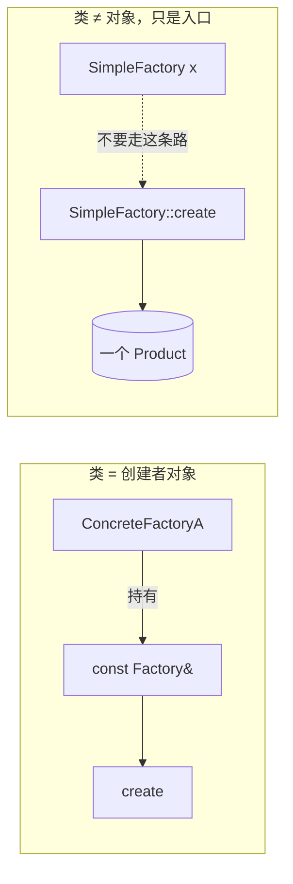
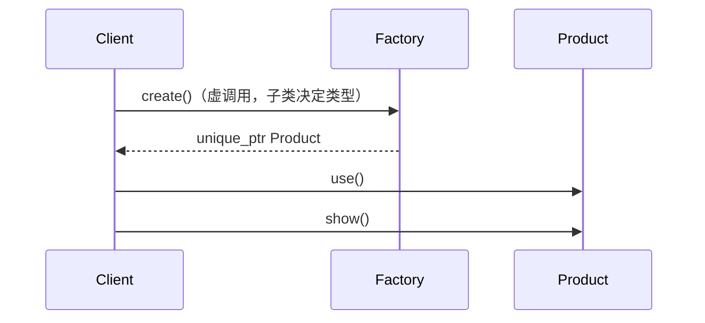
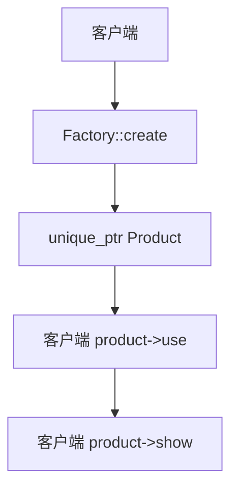
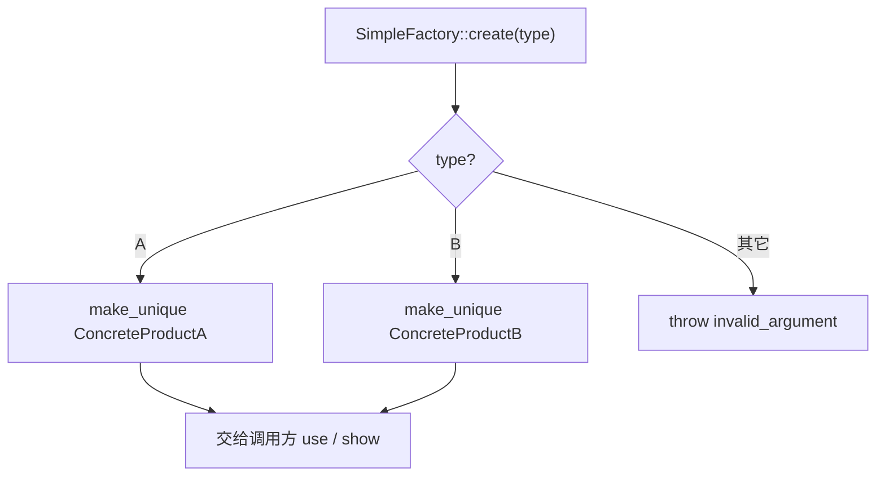
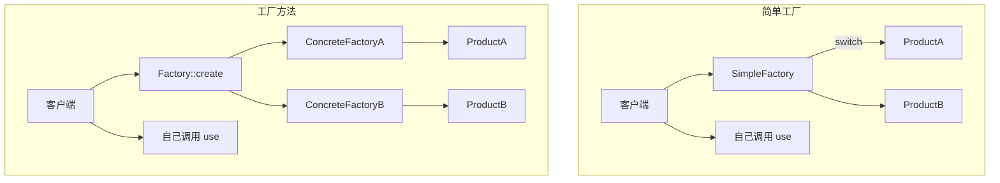
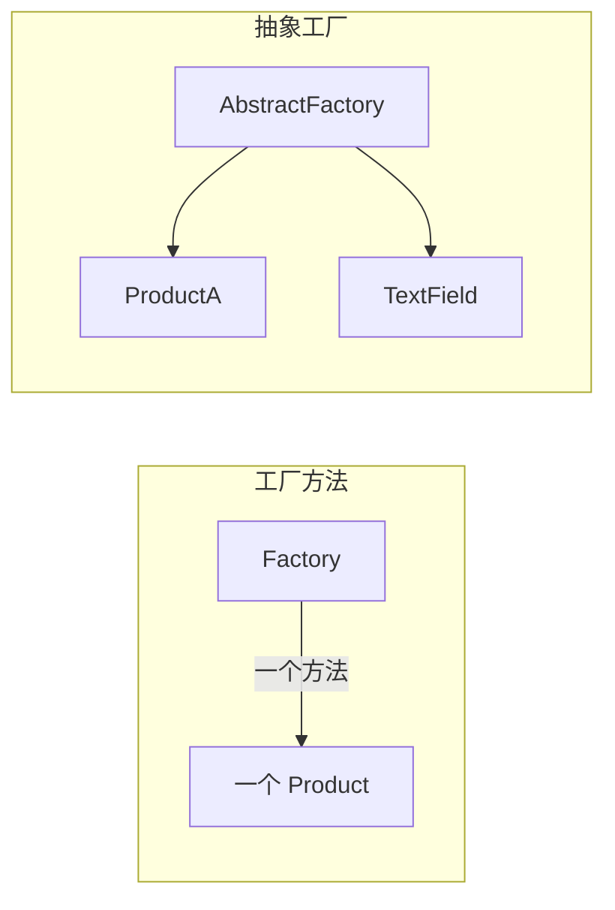

# Factory Method（工厂方法）

**类型**：Creational（创建型）

**代码位置**：

- 头文件：[`include/creational/factory_method/factory_method.h`](../../include/creational/factory_method/factory_method.h)
- 实现：[`src/creational/factory_method/factory_method.cpp`](../../src/creational/factory_method/factory_method.cpp)
- 测试：[`tests/creational/factory_method_test.cpp`](../../tests/creational/factory_method_test.cpp)
- 客户端：[`examples/creational/factory_method/main.cpp`](../../examples/creational/factory_method/main.cpp)

## 意图

定义一个**创建对象的接口**，让子类决定实例化哪一个类。工厂方法把实例化推迟到子类。

可以把 `Factory::create()` 想成后厨窗口：窗口只负责把菜递出来。分店 A 递 `ConcreteProductA`，分店 B 递 `ConcreteProductB`。客人拿到菜之后自己决定怎么吃，后厨不把用餐步骤写进窗口。



## 适用场景

- 客户端不该依赖 `ConcreteProductA`，只该依赖 `Product` / `Factory`
- 希望符合开放封闭：加新产品 = 加一对 `ConcreteProduct` + `ConcreteFactory`，不改已有 `Factory` 和 A/B
- 创建之后怎么用由调用方决定，同一种产品可以有不同用法

**不适合**：

- 只有一种产品、创建逻辑几乎不变 → 直接构造
- 一组互相匹配的产品要一起创建（ProductA + ProductB）→ 那是抽象工厂
- 种类很少，改一处 `switch` 能接受 → 那是简单工厂

## 共同骨架

本仓库两套写法共用同一张产品接口，差在**谁决定造哪一种**：



| 构件 | 作用 |
| ---- | ---- |
| `Product` | 产品接口，调用方只认它 |
| `ConcreteProductA` / `B` | 真正被造出来的对象 |
| `Factory` + `ConcreteFactory*` | 工厂方法：`create()` 在子类，使用在调用方 |
| `SimpleFactory` + `ProductType` | 简单工厂：一个静态函数按枚举分支 |

两套都返回 `std::unique_ptr<Product>`，都不再 `new` 裸指针，使用都留在调用方。差别还在三件事：**创建逻辑在哪、工厂要不要当对象用、加新产品改不改旧代码**。



### 为什么 `Factory` 能造对象，`SimpleFactory` 却是 `= delete`

差在一件事：**这个类本身要不要被当成对象用。**

`ConcreteFactoryA` 是客户端手里的那个创建者：`const Factory &factory = concrete;`，构造必须存在。`Product` / `Factory` 是多态基类，拷贝会切片，所以拷贝 / 移动 **`= delete`**，构造仍是 `= default`。

`SimpleFactory` 相反：正确用法只有静态函数，造出一个 `SimpleFactory` 对象毫无意义。构造直接 **`= delete`**，谁都不能实例化。



| | `Factory` / `ConcreteFactory*` | `SimpleFactory` |
|--|--------------------------------|-----------------|
| 这个类是什么 | 创建者，客户端要持有 | 按参数造产品的工具 |
| 要不要有「自己的实例」 | 要 | 一个都不要 |
| 构造怎么写 | `= default` | `= delete` |
| 拷贝 / 移动 | `= delete`（防切片） | 构造都删了，自然不能拷 |
| 原因 | 成员里能造，按值拷会切片 | 造出来就是误用 |

一句话：

- **`Factory` 默认构造 + 删除拷贝**：对象可以存在，但不能当值来拷。
- **`SimpleFactory` 删除构造**：类型不允许有生命周期，只准调静态方法。

### 为什么返回 `unique_ptr` 而不是裸指针

工厂的职责就是把对象交出去。返回 `Product*` 等于把「谁 `delete`」藏在约定里：漏了就泄漏，异常路径更容易漏。

```cpp
virtual std::unique_ptr<Product> create() const = 0;
static std::unique_ptr<Product> create(ProductType type);
```

实现用 `std::make_unique<ConcreteProductA>()`。签名即契约：调用方独占所有权，析构时自动释放。

裸指针还分不清是「借给你看」还是「给你管」。`unique_ptr` 把这件事写进类型。虚析构必须留着：`unique_ptr<Product>` 析构时走的是 `Product::~Product()`，没有虚析构就是未定义行为。

产品方法返回 `std::string` 而不是打 `std::cout`：头文件一旦 `#include <iostream>` 会污染所有翻译单元，打印也无法直接断言。

---

## 1. 工厂方法：`Factory` / `ConcreteFactory`

`create()` 是各分店覆盖的那一步。工厂把产品交出去，`use()` / `show()` 留在客户端。

### 原理

客户端持有 `Factory`，只调 `create()`。动态绑定发生在 `create()`：子类决定造哪一种。拿到 `unique_ptr<Product>` 之后，客户端自己调用产品方法。



加产品 C 时新增一对类，**不改** `Factory` 和已有的 A/B：



### 基本构成

| 位置 | 内容 |
| ---- | ---- |
| `Product` | 纯虚 `use()` / `show()`，虚析构，删除拷贝 / 移动 |
| `ConcreteProductA` / `B` | `final`，实现放在 `.cpp` |
| `Factory::create()` | 纯虚、`const`，只负责创建 |
| `ConcreteFactoryA` / `B` | 只覆盖 `create()`，`make_unique` 对应产品 |

`create()` 标 `const`：创建不修改 Factory 自身。测试里才能写 `const Factory &factory = concrete`，再 `factory.create()`。

```cpp
std::unique_ptr<Product> ConcreteFactoryA::create() const {
  return std::make_unique<ConcreteProductA>();
}
```

### 用法

直接拿产品（测试 `FactoryACreatesProductA` / `FactoryBCreatesProductB`）：

```cpp
ConcreteFactoryA factory;
std::unique_ptr<Product> product = factory.create();
product->use();   // "ConcreteProductA use"
product->show();  // "ConcreteProductA show"
```

两种工厂交出来的产品，用法由客户端拼（测试 `ClientUsesProductAfterCreate`）：

```cpp
ConcreteFactoryA a;
ConcreteFactoryB b;
auto product_a = a.create();
auto product_b = b.create();
product_a->use();   // 客户端自己决定先 use 再 show
product_b->show();
```

依赖抽象（测试 `ClientDependsOnFactoryAbstraction`）：

```cpp
ConcreteFactoryA concrete;
const Factory &factory = concrete;
auto product = factory.create();  // 动态绑定到 A 的 create
product->use();
```

拷贝 / 移动已删除，对应测试 `CopyAndMoveAreDeleted`。

### 特点

- 换产品只换 `ConcreteFactory`，调用方代码仍写 `factory.create()`
- 符合开放封闭：加 `ConcreteProductC` + `ConcreteFactoryC`，不改已有 `Factory` 和 A/B
- 每个 `ConcreteFactory` 都可以有很多实例，**不是**工厂单例
- 每多一种产品就要多一对类，种类很少时偏重
- 工厂不包含产品的使用流程；`use()` / `show()` 留在调用方

---

## 2. 简单工厂：`SimpleFactory`

对照实现，**不是** GoF 工厂方法。一个类、一个静态函数、内部 `switch` 按 `ProductType` 决定造什么。和工厂方法一样，客户端自己 `use()` / `show()`。差别是选类型的方式：这里改 `switch`，工厂方法加子类。

### 原理

调用方把「要哪一种」当作参数传进去。工厂内部看枚举，命中就 `make_unique`，否则抛异常。没有虚函数，也没有子类。





### 基本构成

| 位置 | 内容 |
| ---- | ---- |
| `enum class ProductType` | 编译期类型开关，避免 `"A"` / `"B"` 魔数字符串 |
| `SimpleFactory() = delete` | 不许实例化，只准调静态方法 |
| `create(ProductType)` | `switch` 分支；未知值 `throw std::invalid_argument` |

```cpp
auto p = SimpleFactory::create(ProductType::A);
p->use();  // 客户端自己用
```

非法枚举（例如 `static_cast<ProductType>(99)`）走 `switch` 之后的 `throw`，对应测试 `SimpleFactoryRejectsUnknownType`。

### 用法

```cpp
auto a = SimpleFactory::create(ProductType::A);
auto b = SimpleFactory::create(ProductType::B);
a->use();  // "ConcreteProductA use"
b->show(); // "ConcreteProductB show"
// SimpleFactory f;  // 错误：构造已删除
```

对应测试 `SimpleFactoryCreatesProductA` / `SimpleFactoryCreatesProductB`。`CopyAndMoveAreDeleted` 里还有 `!std::is_default_constructible_v<SimpleFactory>`。

### 特点

- 代码最短，一种产品一个 `case`，好懂
- 加新产品必须改 `create()`（以及 `ProductType`），封闭原则破了
- 和工厂方法一样，创建和使用是分开的
- 多态只发生在产品上，工厂本身不是多态点
- 种类少、改一处能接受时很合适；种类会涨时该换成工厂方法

---

## 总对照

| 写法 | 创建点 | 使用点 | 加新产品 | 推荐场景 |
| ---- | ------ | ------ | -------- | -------- |
| 直接 `make_unique<T>` | 调用方 | 调用方 | 改所有调用点 | 类型固定 |
| 简单工厂 `SimpleFactory` | 一个静态 `switch` | 调用方 | 改工厂 | 种类少 |
| **工厂方法** `Factory` | 子类的 `create` | 调用方 | 加一对类 | 种类会涨、一次造一个 |
| 抽象工厂 | 一族工厂方法 | 客户端 / 框架 | 加一个产品族 | 多产品要配套出现 |

工厂方法一次造 **一种** 产品。抽象工厂一次造 **一族** 互相匹配的产品（例如标准版的 `ProductA` + `ProductB`）。抽象工厂的**每个**工厂方法，内部往往仍是工厂方法。两者是粒度不同，不是互斥。



再记两点，和具体类名无关，但最容易混：

1. **工厂方法是「方法」，不是「工厂单例」。** 每个 `ConcreteFactory` 都可以有很多实例；它管的是「造哪种产品」，不管「全进程只有一个工厂」。
2. **`unique_ptr` 解决所有权，虚函数解决类型。** 两件事不要互相替代：返回智能指针不会自动变成工厂方法；写了虚 `create` 但返回裸指针，模式对了，C++ 契约仍是错的。

## 怎么选

```text
一次要造的是一个对象，还是一套必须匹配的对象？
  └─ 一套 → 抽象工厂
  └─ 一个
        └─ 类型编译期就确定 → 直接构造
        └─ 种类少，改一处能接受 → SimpleFactory
        └─ 种类会涨，不想改已有创建代码 → Factory / ConcreteFactory
```

## 参考

- 《设计模式：可复用面向对象软件的基础》（GoF）：Factory Method
- 《Effective C++》条款 18：让接口容易正确使用、难以误用（所有权写进签名）
- `std::unique_ptr` / `std::make_unique`（`<memory>`）
