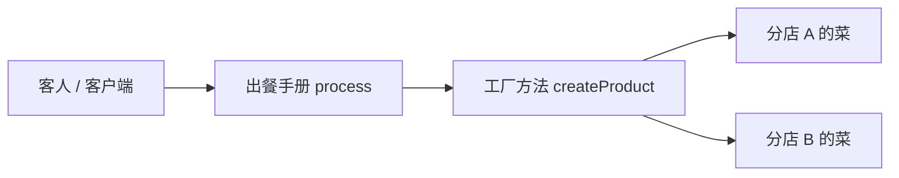
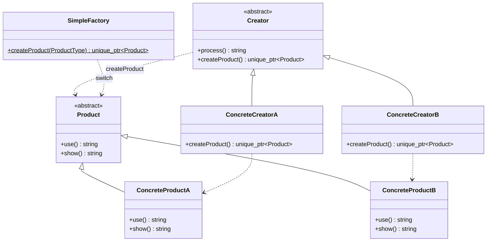
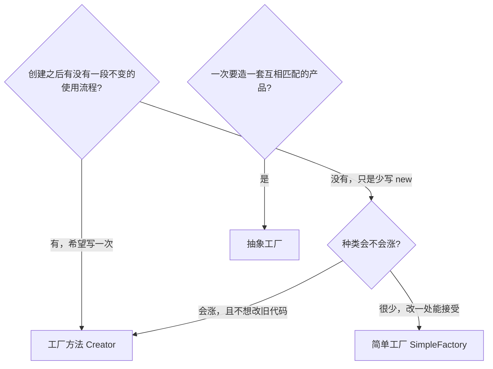
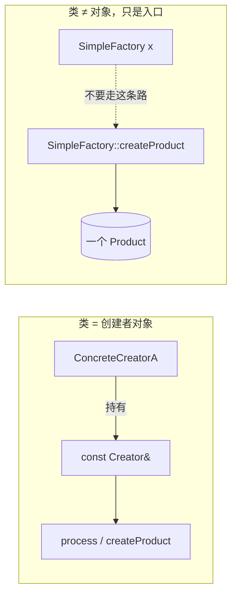
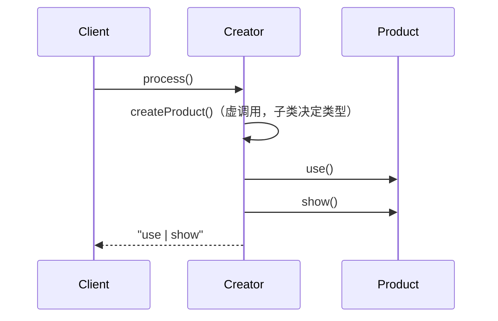
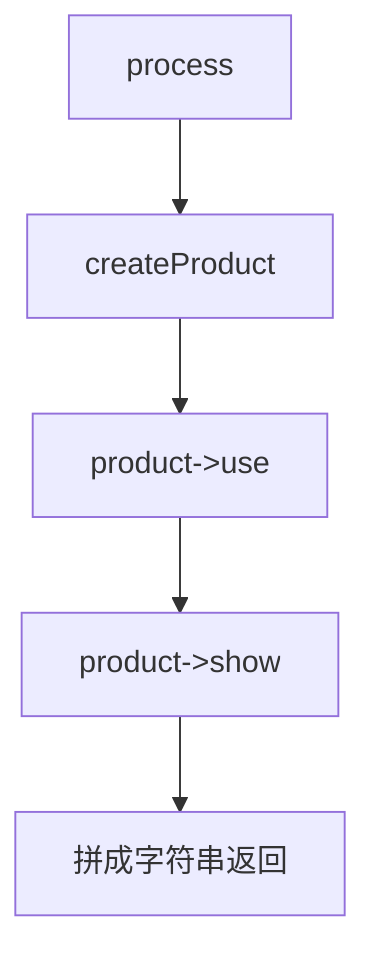
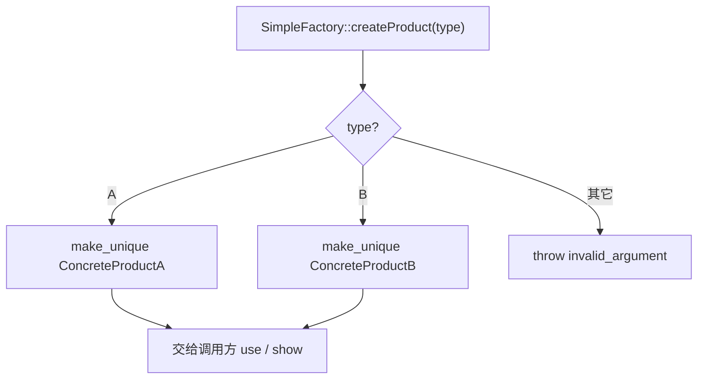
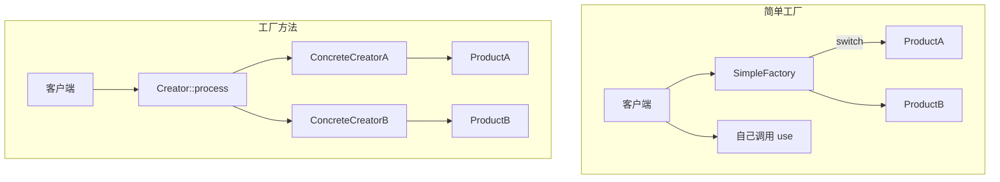
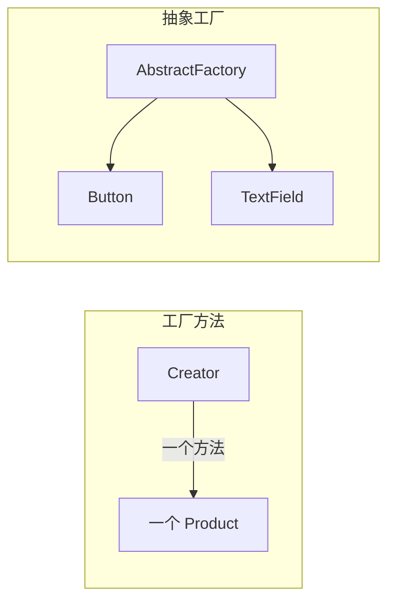

# Factory Method（工厂方法）

**类型**：Creational（创建型）

**代码位置**：

- 头文件：[`include/creational/factory_method/factory_method.h`](../../include/creational/factory_method/factory_method.h)
- 实现：[`src/creational/factory_method/factory_method.cpp`](../../src/creational/factory_method/factory_method.cpp)
- 测试：[`tests/creational/factory_method_test.cpp`](../../tests/creational/factory_method_test.cpp)
- 客户端：[`examples/creational/factory_method/main.cpp`](../../examples/creational/factory_method/main.cpp)

## 意图

定义一个**创建对象的接口**，让子类决定实例化哪一个类。工厂方法把实例化推迟到子类。

可以把 `Creator::process()` 想成连锁店的「出餐手册」：备料、烹饪、装盘这几步总店写死，各地分店只决定**今天上哪道菜**。客人点的是套餐流程，不会自己进厨房 `new` 一道菜。



## 适用场景

- **使用流程稳定，创建哪一种会变**：框架写好「打开文档 / 导出 / 出餐」，应用决定具体产品
- 客户端不该依赖 `ConcreteProductA`，只该依赖 `Product` / `Creator`
- 希望符合开放封闭：加新产品 = 加一对 `ConcreteProduct` + `ConcreteCreator`，不改已有 `process()`

**不适合**：

- 只有一种产品、创建逻辑几乎不变 → 直接构造
- 一组互相匹配的产品要一起创建（按钮 + 输入框 + 滚动条）→ 那是抽象工厂
- 只是不想在客户端写 `new`，却没有「稳定流程」→ 那是简单工厂，不必上这一套

## 共同骨架

本仓库两套写法共用同一张产品接口，差在**谁决定造哪一种、谁来使用产品**：



| 构件 | 作用 |
| ---- | ---- |
| `Product` | 产品接口，`process()` / 客户端只认它 |
| `ConcreteProductA` / `B` | 真正被造出来的对象 |
| `Creator` + `ConcreteCreator*` | 工厂方法：流程在基类，创建在子类 |
| `SimpleFactory` + `ProductType` | 简单工厂：一个静态函数按枚举分支 |

两套都返回 `std::unique_ptr<Product>`，都不再 `new` 裸指针。差别还在三件事：**创建逻辑在哪、谁使用产品、加新产品改不改旧代码**。



### 为什么 `Creator` 能造对象，`SimpleFactory` 却是 `= delete`

差在一件事：**这个类本身要不要被当成对象用。**

`ConcreteCreatorA` 是客户端手里的那个创建者：`const Creator &creator = concrete;`，构造必须存在。`Product` / `Creator` 是多态基类，拷贝会切片，所以拷贝 / 移动 **`= delete`**，构造仍是 `= default`。

`SimpleFactory` 相反：正确用法只有静态函数，造出一个 `SimpleFactory` 对象毫无意义。构造直接 **`= delete`**，谁都不能实例化。



| | `Creator` / `ConcreteCreator*` | `SimpleFactory` |
|--|--------------------------------|-----------------|
| 这个类是什么 | 创建者，客户端要持有 | 按参数造产品的工具 |
| 要不要有「自己的实例」 | 要 | 一个都不要 |
| 构造怎么写 | `= default` | `= delete` |
| 拷贝 / 移动 | `= delete`（防切片） | 构造都删了，自然不能拷 |
| 原因 | 成员里能造，按值拷会切片 | 造出来就是误用 |

一句话：

- **`Creator` 默认构造 + 删除拷贝**：对象可以存在，但不能当值来拷。
- **`SimpleFactory` 删除构造**：类型不允许有生命周期，只准调静态方法。

### 为什么返回 `unique_ptr` 而不是裸指针

工厂的职责就是把对象交出去。返回 `Product*` 等于把「谁 `delete`」藏在约定里：漏了就泄漏，异常路径更容易漏。

```cpp
virtual std::unique_ptr<Product> createProduct() const = 0;
static std::unique_ptr<Product> createProduct(ProductType type);
```

实现用 `std::make_unique<ConcreteProductA>()`。签名即契约：调用方独占所有权，析构时自动释放。

裸指针还分不清是「借给你看」还是「给你管」。`unique_ptr` 把这件事写进类型。虚析构必须留着：`unique_ptr<Product>` 析构时走的是 `Product::~Product()`，没有虚析构就是未定义行为。

产品方法返回 `std::string` 而不是打 `std::cout`：头文件一旦 `#include <iostream>` 会污染所有翻译单元，打印也无法直接断言。

---

## 1. 工厂方法：`Creator` / `ConcreteCreator`

GoF 原意。`process()` 是总店写死的出餐手册，`createProduct()` 才是各分店覆盖的那一步。

### 原理

客户端只调 `process()`。基类内部用虚函数拿产品，再 `use()` / `show()`。动态绑定发生在 `createProduct()`，不发生在业务流程上。



加产品 C 时新增一对类，**不改** `process()`：



### 基本构成

| 位置 | 内容 |
| ---- | ---- |
| `Product` | 纯虚 `use()` / `show()`，虚析构，删除拷贝 / 移动 |
| `ConcreteProductA` / `B` | `final`，实现放在 `.cpp` |
| `Creator::process()` | 非虚，稳定流程 |
| `Creator::createProduct()` | 纯虚、`const` |
| `ConcreteCreatorA` / `B` | 只覆盖 `createProduct()`，`make_unique` 对应产品 |

| | `process()` | `createProduct()` |
|--|-------------|-------------------|
| 是否虚函数 | 否 | 纯虚 |
| 谁实现 | 基类一份 | 每个 `ConcreteCreator` |
| 加新产品要不要改 | 不要 | 新写一个覆盖 |

`createProduct()` 标 `const`：创建不修改 Creator 自身。所以 `process()` 也能是 `const`，测试里才能写 `const Creator &creator = concrete`。

```cpp
std::string Creator::process() const {
  auto product = createProduct();
  return product->use() + " | " + product->show();
}

std::unique_ptr<Product> ConcreteCreatorA::createProduct() const {
  return std::make_unique<ConcreteProductA>();
}
```

### 用法

直接拿产品（测试 `CreatorACreatesProductA` / `CreatorBCreatesProductB`）：

```cpp
ConcreteCreatorA creator;
std::unique_ptr<Product> product = creator.createProduct();
product->use();   // "ConcreteProductA use"
product->show();  // "ConcreteProductA show"
```

只走业务流程，不碰具体类型（测试 `ProcessUsesProductFromFactoryMethod`）：

```cpp
ConcreteCreatorA a;
ConcreteCreatorB b;
a.process();  // "ConcreteProductA use | ConcreteProductA show"
b.process();  // "ConcreteProductB use | ConcreteProductB show"
```

依赖抽象（测试 `ClientDependsOnCreatorAbstraction`）：

```cpp
ConcreteCreatorA concrete;
const Creator &creator = concrete;
creator.process();  // 动态绑定到 A 的 createProduct
```

拷贝 / 移动已删除，对应测试 `CopyAndMoveAreDeleted`。

### 特点

- 流程写一次，换产品只换 `ConcreteCreator`
- 符合开放封闭：加 `ConcreteProductC` + `ConcreteCreatorC`，不改已有 `process()` 和 A/B
- 每个 `ConcreteCreator` 都可以有很多实例，**不是**工厂单例
- 每多一种产品就要多一对类，种类很少时偏重
- 若删掉 `process()` 只留 `createProduct()`，类图还像工厂方法，语义上已滑回「拆成两个类的简单工厂」

---

## 2. 简单工厂：`SimpleFactory`

对照实现，**不是** GoF 工厂方法。一个类、一个静态函数、内部 `switch` 按 `ProductType` 决定造什么。客户端自己 `use()` / `show()`，没有 `process()`。

### 原理

调用方把「要哪一种」当作参数传进去。工厂内部看枚举，命中就 `make_unique`，否则抛异常。没有虚函数，也没有子类。





### 基本构成

| 位置 | 内容 |
| ---- | ---- |
| `enum class ProductType` | 编译期类型开关，避免 `"A"` / `"B"` 魔数字符串 |
| `SimpleFactory() = delete` | 不许实例化，只准调静态方法 |
| `createProduct(ProductType)` | `switch` 分支；未知值 `throw std::invalid_argument` |

```cpp
auto p = SimpleFactory::createProduct(ProductType::A);
p->use();  // 客户端自己用，没有 process()
```

非法枚举（例如 `static_cast<ProductType>(99)`）走 `switch` 之后的 `throw`，对应测试 `SimpleFactoryRejectsUnknownType`。

### 用法

```cpp
auto a = SimpleFactory::createProduct(ProductType::A);
auto b = SimpleFactory::createProduct(ProductType::B);
a->use();  // "ConcreteProductA use"
b->show(); // "ConcreteProductB show"
// SimpleFactory f;  // 错误：构造已删除
```

对应测试 `SimpleFactoryCreatesProductA` / `SimpleFactoryCreatesProductB`。`CopyAndMoveAreDeleted` 里还有 `!std::is_default_constructible_v<SimpleFactory>`。

### 特点

- 代码最短，一种产品一个 `case`，好懂
- 加新产品必须改 `createProduct()`（以及 `ProductType`），封闭原则破了
- 没有稳定业务流程，创建和使用是分开的
- 多态只发生在产品上，工厂本身不是多态点
- 种类少、改一处能接受时很合适；种类会涨时该换成工厂方法

---

## 总对照

| 写法 | 创建点 | 使用点 | 加新产品 | 推荐场景 |
| ---- | ------ | ------ | -------- | -------- |
| 直接 `make_unique<T>` | 调用方 | 调用方 | 改所有调用点 | 类型固定 |
| 简单工厂 `SimpleFactory` | 一个静态 `switch` | 调用方 | 改工厂 | 种类少、没有稳定流程 |
| **工厂方法** `Creator` | 子类的 `createProduct` | **基类 `process`** | 加一对类 | 流程稳定、产品会扩展 |
| 抽象工厂 | 一族工厂方法 | 客户端 / 框架 | 加一个产品族 | 多产品要配套出现 |

工厂方法一次造 **一种** 产品。抽象工厂一次造 **一族** 互相匹配的产品（例如 Windows 风格的按钮 + 输入框）。抽象工厂的**每个**工厂方法，内部往往仍是工厂方法。两者是粒度不同，不是互斥。



再记两点，和具体类名无关，但最容易混：

1. **工厂方法是「方法」，不是「工厂单例」。** 每个 `ConcreteCreator` 都可以有很多实例；它管的是「造哪种产品」，不管「全进程只有一个工厂」。
2. **`unique_ptr` 解决所有权，虚函数解决类型。** 两件事不要互相替代：返回智能指针不会自动变成工厂方法；写了虚 `create` 但返回裸指针，模式对了，C++ 契约仍是错的。

## 怎么选

```text
创建之后有没有一段不变的使用流程？
  └─ 没有，只是想少写 new
        └─ 种类很少 → 直接构造或 SimpleFactory
        └─ 种类会涨，且想少改旧代码 → Creator / ConcreteCreator
  └─ 有，希望流程写一次
        └─ 每次造一个产品 → 工厂方法（本仓库 Creator）
        └─ 每次造一套互相匹配的产品 → 抽象工厂
```

## 参考

- 《设计模式：可复用面向对象软件的基础》（GoF）：Factory Method
- 《Effective C++》条款 18：让接口容易正确使用、难以误用（所有权写进签名）
- `std::unique_ptr` / `std::make_unique`（`<memory>`）
