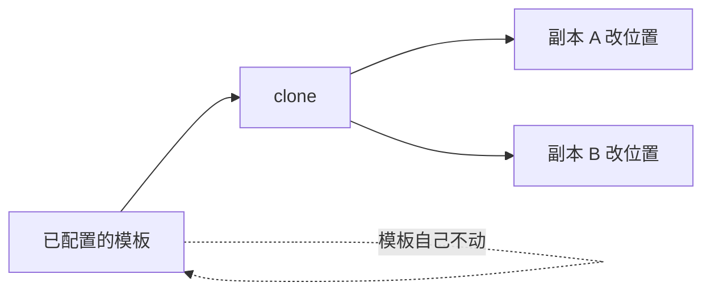
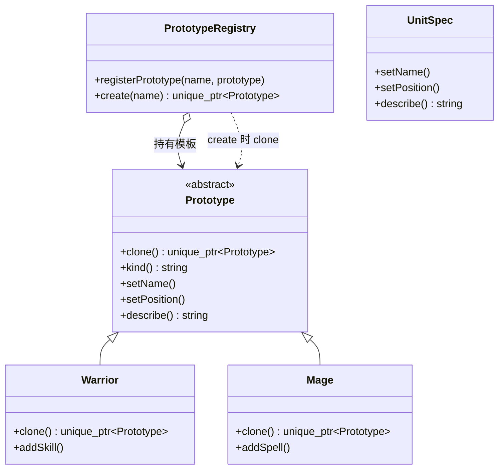
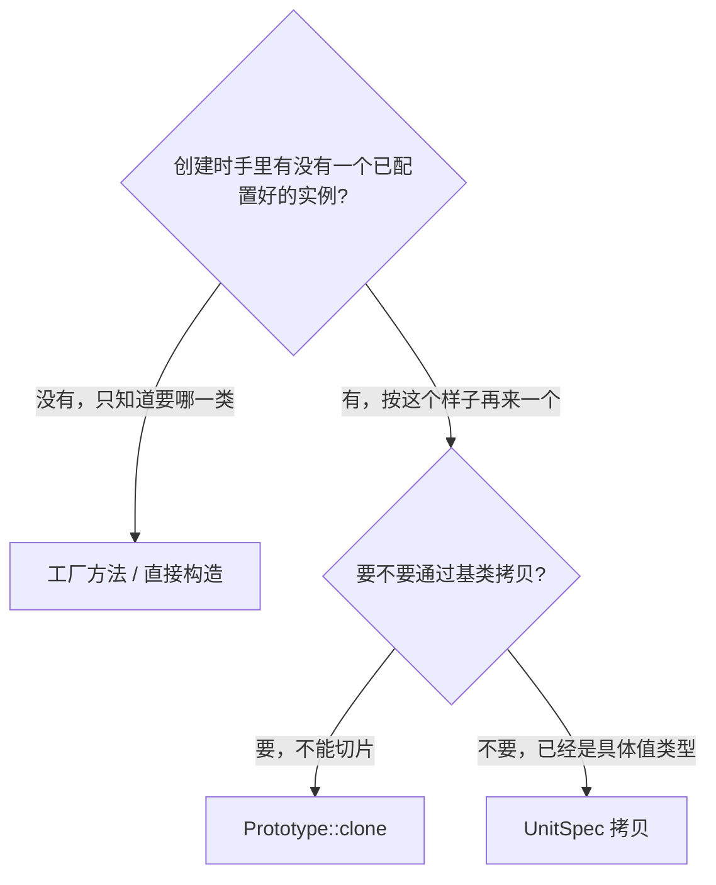
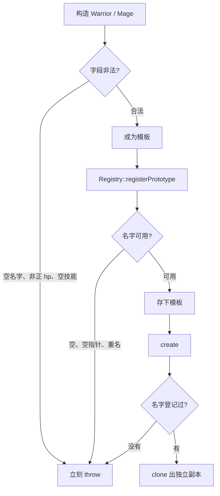
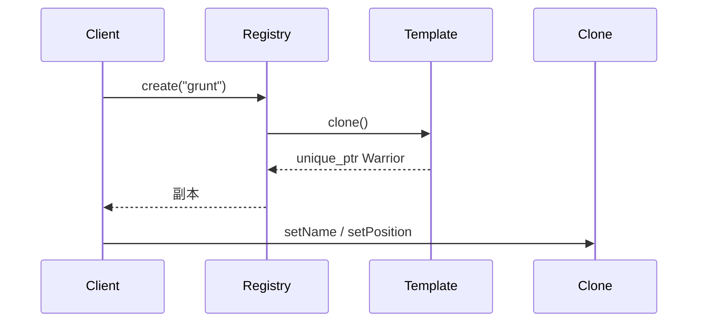
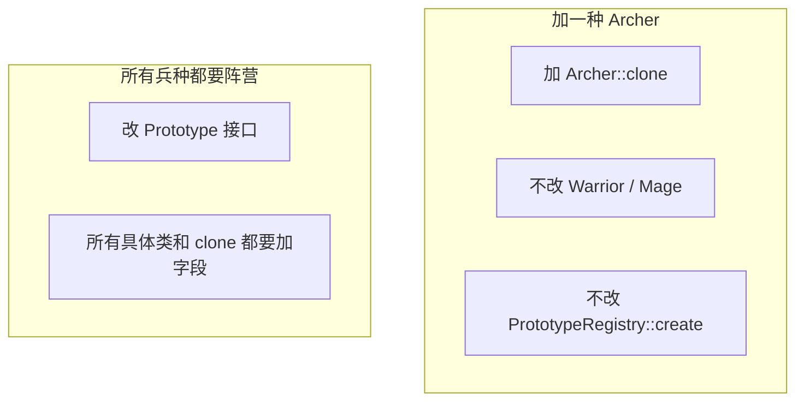
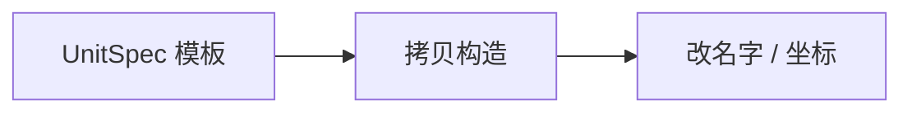
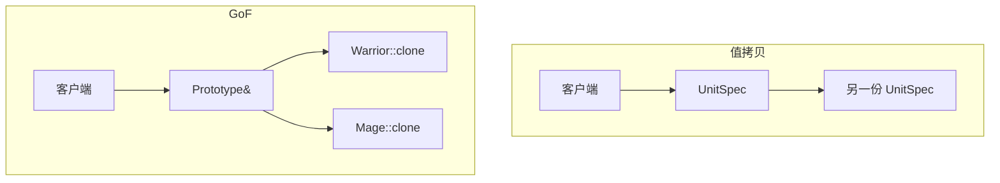
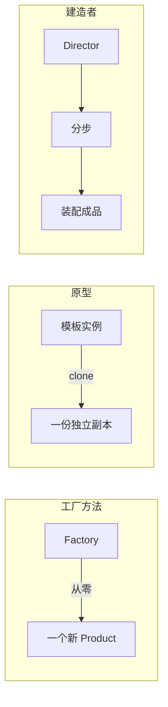

# Prototype（原型）

**类型**：Creational（创建型）

**代码位置**：

- 头文件：[`include/creational/prototype/prototype.h`](../../include/creational/prototype/prototype.h)
- 实现：[`src/creational/prototype/prototype.cpp`](../../src/creational/prototype/prototype.cpp)
- 测试：[`tests/creational/prototype_test.cpp`](../../tests/creational/prototype_test.cpp)
- 客户端：[`examples/creational/prototype/main.cpp`](../../examples/creational/prototype/main.cpp)

## 意图

用**已经存在的对象**当模板，通过拷贝来创建新对象，而不必知道它的具体类，也不必再走一遍完整构造。

可以把 `clone()` 想成兵营里的「模具出兵」：grunt 的血量、攻击、技能早就配好了，战场上要的是**再出一个长得一样的**，然后只改坐标和编号。调用方点的是「按这个样子再来一个」，不会自己 `new Warrior` 再把技能树填一遍。

本仓库的例子就是出兵：`Warrior` / `Mage` 实现 `Prototype::clone()`，`PrototypeRegistry` 按名字取出模板再克隆。



## 适用场景

- **对象构造贵，但副本只要改几个字段**：技能、法术、默认装备已经配好，刷怪只改坐标
- **客户端不该依赖 `Warrior` / `Mage`**：只拿着 `Prototype&`，`clone()` 自己带出正确类型
- **运行时才知道要复制哪一个**：模板来自配置、存档、编辑器里用户刚画好的形状

**不适合**：

- 类型固定、构造很便宜、没有「已配置好的实例」→ 直接构造或工厂方法
- 已经拿着具体类型、只是想拷一份数据 → 值对象的拷贝构造函数就够了（本仓库的 `UnitSpec`）
- 一次要造一组互相匹配的对象 → 那是抽象工厂
- 复杂对象要从零件逐步装配，还没有「成品模板」→ 那是建造者

## 共同骨架

本仓库两套写法差在**要不要多态拷贝**：GoF 原型通过虚 `clone()` 保留具体类型；对照的 `UnitSpec` 是值对象，拷贝构造函数直接可用。



| 构件 | 作用 |
| ---- | ---- |
| `Prototype` | 声明 `clone()`；客户端只认它 |
| `Warrior` / `Mage` | 具体原型，各自实现拷贝，字段不同（atk+skills / mana+spells） |
| `PrototypeRegistry` | 按名字登记模板，`create()` 内部 `clone()` |
| `UnitSpec` | 对照：可拷贝的值对象，没有虚函数 |

两套都返回独立副本，改副本不影响模板。差别在三件事：**拷贝发生在虚函数还是拷贝构造、客户端知不知道具体类型、加新兵种改不改旧代码**。



### 为什么必须是 `clone()`，不能靠拷贝构造

差在一件事：**通过基类拷贝会切片。**

`Prototype` 要被 `const Prototype &` 持有。按值拷只会拷基类那一层，`Warrior` 的技能、`Mage` 的法术全部丢掉。拷贝 / 移动因此 **`= delete`**。真正的拷贝走虚函数 `clone()`：`Warrior::clone()` 造 `Warrior`，`Mage::clone()` 造 `Mage`。

```cpp
Warrior grunt("grunt", 100, 20, {"slash"});
const Prototype &as_unit = grunt;
auto copy = as_unit.clone();          // 仍是 Warrior
// Prototype sliced = as_unit;        // 编译失败：拷贝已删除
```

这和 [工厂方法](factory_method.md) 里 `Product` 删除拷贝是同一条规则：多态基类不当值来拷。工厂方法用虚 `create()` 决定**造哪一类空对象**；原型用虚 `clone()` 决定**复制哪一个已有实例**。

### 为什么 `clone()` 返回 `unique_ptr`，内部用 `make_unique` 重造

工厂的职责是交出新对象。返回 `Prototype*` 会把「谁 `delete`」藏在约定里。

```cpp
virtual std::unique_ptr<Prototype> clone() const = 0;
```

`unique_ptr` 不能协变，所以 `Warrior::clone()` 的返回类型仍是 `unique_ptr<Prototype>`，不能写成 `unique_ptr<Warrior>`。实现用字段再构造一次：

```cpp
std::unique_ptr<Prototype> Warrior::clone() const {
  return std::make_unique<Warrior>(name_, hp_, attack_, skills_, x_, y_);
}
```

没有走拷贝构造函数：基类拷贝已经删掉，派生类也就不能拷。这和本仓库其它多态基类一致。代价是**加字段必须改 `clone()`**；漏了就会静默丢状态。成员是 `std::vector<std::string>` 时，`make_unique` 会拷整份 vector，改副本的技能不会碰到模板——这是深拷贝。如果成员改成裸指针或 `shared_ptr` 却只拷指针，两个对象就会共享同一份可变数据。

`clone()` 标 `const`：复制不修改模板自己。所以 `spawn_at(const Prototype &)` 和 `PrototypeRegistry::create() const` 才能成立。

### 为什么产品用 `describe()` 而不是 `std::cout`

原型的职责是交出副本。头文件里 `#include <iostream>` 会污染所有翻译单元，打印也无法直接断言。`describe()` 返回 `std::string`，测试写 `EXPECT_EQ`，示例再决定要不要打印。

### 错误和异常：造模板时验字段，登记 / 克隆时验名字

非法状态进不了对象。规则抛 `std::invalid_argument`。



| 时机 | 检查 | 例子 |
| ---- | ---- | ---- |
| 构造 / setter | 单字段非法 | 空 `name`、`hp <= 0`、空 skill / spell |
| `PrototypeRegistry::registerPrototype` | 登记非法 | 空名字、`nullptr`、重复 `"grunt"` |
| `PrototypeRegistry::create` | 模板不存在 | `"dragon"` 从未登记 |
| `clone()` / `setPosition` | 不抛 | 拷的是已经合法的对象；坐标可正可负 |

对应测试 `ConstructorsRejectInvalidFields` / `SettersRejectInvalidFields` / `RegistryRejectsInvalidOperations`。

---

## 1. 原型：`Prototype` / 具体类 / `PrototypeRegistry`

GoF 原意。变化点在「复制哪一个已配置实例」，不在「从零构造哪一个类」。`PrototypeRegistry` 是书里的 Prototype Manager：把「要哪一种」收成一个名字，客户端连 `Warrior` 都不必写。

### 原理

客户端拿着 `const Prototype &`（或登记表里的名字），调 `clone()`。动态绑定发生在 `clone()` 上。得到的是新对象，再改名字、坐标这些**实例差异**。模板留在原地，下一次还能再克隆。



加一种兵种时新增一个具体类并实现 `clone()`，**不改**已有 `Warrior` / `Mage`，也不改 `spawn_at(const Prototype &)`：



加兵种符合开放封闭。加**所有类型都要有的新字段**要改抽象，这是原型的经典代价：共同的「克隆后可改什么」写进了 `Prototype` 接口。

### 基本构成

| 位置 | 内容 |
| ---- | ---- |
| `Prototype` | 纯虚 `clone()` / `describe()` / 名字与坐标，虚析构，删除拷贝 / 移动 |
| `Warrior` / `Mage` | `final`，实现放在 `.cpp`，`clone()` 用 `make_unique` 重造自己 |
| `PrototypeRegistry::registerPrototype` | 拿走模板所有权；重名即抛 |
| `PrototypeRegistry::create` | `const`，只 clone，不改库存 |

| | `clone()` | `PrototypeRegistry::create()` |
|--|-----------|-------------------------------|
| 是否虚函数 | 纯虚 | 否 |
| 谁实现 | 每个具体原型 | 登记表一份 |
| 客户端要不要知道具体类 | 不必 | 不必，连对象都不必拿着 |
| 加新兵种要不要改 | 新写一个覆盖 | 登记时多 `registerPrototype` 一次 |

`setName` / `setPosition` 在抽象接口上：克隆之后的**共同定制**不应该倒逼 `dynamic_cast`。`addSkill` / `addSpell` 仍在具体类上：那是类型自己的零件。

```cpp
std::unique_ptr<Prototype> spawn_at(const Prototype &prototype, int x, int y) {
  auto unit = prototype.clone();
  unit->setPosition(x, y);
  return unit;
}
```

没有「克隆出半个法师」这条路径：`clone()` 交出完整合法对象。这是模式要保证的不变量。

### 用法

直接克隆并断言类型（测试 `WarriorClonePreservesTypeAndState` / `MageClonePreservesTypeAndState`）：

```cpp
Warrior grunt("grunt", 100, 20, {"slash", "block"});
std::unique_ptr<Prototype> copy = grunt.clone();
copy->describe();
// "Warrior grunt hp=100 atk=20 skills=slash,block @ (0,0)"
```

副本独立，改技能不影响模板（测试 `CloneIsIndependentOfOriginal`）：

```cpp
auto copy = grunt.clone();
copy->setName("grunt#2");
copy->setPosition(4, 1);
dynamic_cast<Warrior *>(copy.get())->addSkill("block");
grunt.describe();  // 仍是原来的 slash @ (0,0)
```

只依赖抽象（测试 `ClientDependsOnPrototypeAbstraction`）：

```cpp
const Prototype &as_warrior = grunt;
spawn_at(as_warrior, 3, 1);
```

登记表按名字出兵（测试 `RegistryCreatesIndependentClones` / `RegistryCreateKeepsTemplateUnchanged`）：

```cpp
PrototypeRegistry barracks;
barracks.registerPrototype("grunt", std::make_unique<Warrior>("grunt", 100, 20, std::vector<std::string>{"slash"}));
auto a = barracks.create("grunt");
auto b = barracks.create("grunt");
a->setPosition(3, 1);
b->setPosition(4, 1);
```

拷贝 / 移动已删除，对应测试 `CopyAndMoveAreDeleted`。空名字、非正 hp、重复登记、未知模板会抛异常。

示例 [`examples/creational/prototype/main.cpp`](../../examples/creational/prototype/main.cpp) 里，兵营先登记 grunt / captain / apprentice，再按模板刷两个 grunt；换 `Prototype&` 只换兵种，`spawn_at` 不动。

### 特点

- 复制的是**运行时状态**，不是「这个类的默认构造」
- 符合开放封闭的方向是**加一种可克隆对象**：加 `Archer`，不改已有具体类和 `create()`
- 每个模板都可以有很多实例，**不是**单例；登记表也不是全局唯一，只是一台兵营
- `clone()` 必须自己保证深拷贝；指针成员很容易变成浅拷贝
- 加**所有类型共用的新定制接口**必须改 `Prototype` 和所有具体类
- 若客户端已经拿着 `Warrior`，再套一层虚 `clone()` 语义上已滑回「手工拷字段」

---

## 2. 对照：`UnitSpec`

对照实现，**不是** GoF 原型。一个可拷贝的值类，没有虚函数，也没有登记表。客户端写 `UnitSpec spawned = template_spec;`，再改副本字段。

它对应工厂方法笔记里的 `SimpleFactory`、建造者笔记里的 `HttpRequestBuilder`：把「我已经知道具体类型」收成最便宜的语言机制。真正保证副本独立的，还是值语义本身。

### 原理

`UnitSpec` 没有基类，拷贝不会切片。`kind` 只是一个字符串标签，法力、技能这类类型特有字段放不进来——除非把这个类改成大杂烩。





### 基本构成

| 位置 | 内容 |
| ---- | ---- |
| 默认拷贝 / 赋值 | 值对象，允许拷 |
| `kind` 字符串 | 用标签区分种类，不是类型系统 |
| 无抽象基类 | 不删除拷贝 |

```cpp
UnitSpec spec("warrior", "grunt", 100);
UnitSpec spawned = spec;
spawned.setName("grunt#2");
spawned.setPosition(4, 1);
```

空 `kind` / 空名字 / 非正 hp 同样 `throw`，对应 `ConstructorsRejectInvalidFields`。拷贝可用，对应 `CopyAndMoveAreDeleted` 里的 `is_copy_constructible_v<UnitSpec>`。

### 用法

```cpp
UnitSpec spec("warrior", "grunt", 100);
UnitSpec left = spec;
UnitSpec right = spec;
left.setPosition(3, 1);
right.setPosition(4, 1);
```

对应测试 `UnitSpecCopiesByValue`。

示例第三段就是这条路径：已经知道是一份数值规格，直接拷。

### 特点

- 代码最短，C++ 值语义就是拷贝，好懂
- 只有一种布局，加法师的 `mana` 必须改这个类，封闭原则帮不上忙
- 不能通过 `Prototype&` 复制，多态不发生
- 类型固定、没有「已配置的多态实例」时很合适。不要把它当成 GoF 原型本身

---

## 总对照

| 写法 | 创建依据 | 拷贝方式 | 加新种类 | 推荐场景 |
| ---- | -------- | -------- | -------- | -------- |
| 直接 `make_unique<T>` | 类名 | 从零构造 | 改所有调用点 | 类型固定、构造便宜 |
| 工厂方法 | 类（子类决定） | 从零构造 | 加一对类 | 流程稳定、没有现成模板 |
| **GoF 原型** | **已有实例** | **虚 `clone()`** | 加一个具体原型 | 多态拷贝、模板已配置 |
| `PrototypeRegistry` | 名字 → 模板 | 内部 `clone()` | 登记时多 `registerPrototype` | 运行时按配置刷实例 |
| `UnitSpec` 值拷贝 | 已有值对象 | 拷贝构造 | 改这一个类 | 已知具体类型 |
| 建造者 | 分步零件 | 装配，不是拷贝 | 加具体建造者 | 还没有成品模板 |



再记三点，和具体类名无关，但最容易混：

1. **原型是「按例子造」，不是「带默认参数的构造函数」。** 默认参数解决的是「少写几个实参」；原型解决的是「运行时状态已经配好，再要一份且不能切片」。
2. **`clone()` 必须是虚函数，因为拷贝构造函数不是虚的。** C++ 没有虚拷贝构造。通过基类按值拷一定切片；通过基类调 `clone()` 才可能得到派生对象。
3. **`UnitSpec` 只负责值拷贝。** 没有它，GoF 原型照样成立；有了它，也不等于把虚函数和登记表都省掉之后还叫同一个模式。

## 怎么选

```text
创建时手里有没有一个已配置好的实例？
  └─ 没有
        └─ 一次一个完整对象 → 工厂方法 / 直接构造
        └─ 一次一族配套产品 → 抽象工厂
        └─ 还要分步装配 → 建造者
  └─ 有，按这个样子再来一个
        └─ 必须通过基类拷贝、不能切片 → Prototype::clone
        └─ 已经是具体值类型 → UnitSpec / 拷贝构造函数
```

`clone()` 里如果出现指针成员，先问拷的是对象还是地址；拷地址就不是原型要的那份独立副本。

## 参考

- 《设计模式：可复用面向对象软件的基础》（GoF）：Prototype
- [Factory Method（工厂方法）](factory_method.md)：按类创建 vs 按实例复制
- [Builder（建造者）](builder.md)：从零件装配 vs 拷贝成品
- [Abstract Factory（抽象工厂）](abstract_factory.md)：一族对象 vs 一个对象的副本
- 《Effective C++》条款 12：复制对象时勿忘其每一个成分
- `std::unique_ptr` / `std::make_unique`（所有权写进签名）
