# Singleton（单例）

**类型**：Creational（创建型）

**代码位置**：

- 头文件：[`include/creational/singleton/singleton.h`](../../include/creational/singleton/singleton.h)
- 实现：[`src/creational/singleton/singleton.cpp`](../../src/creational/singleton/singleton.cpp)
- 测试：[`tests/creational/singleton_test.cpp`](../../tests/creational/singleton_test.cpp)

## 意图

保证一个类在进程里**只有一个实例**，并提供全局访问点（通常是 `getInstance()`）。

可以把单例想成大楼里的「总配电箱」：整栋楼只允许有一台，谁要用电都去同一个箱子，而不是每人再装一台。

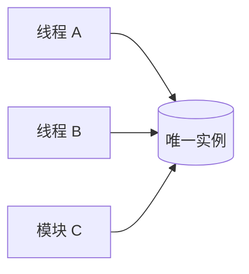

## 适用场景

- 进程级共享资源：日志、配置、线程池、设备句柄
- 创建成本高，且全进程只需要一份
- **不适合**：只是图省事当全局变量用。单例会把依赖藏起来，单测替换困难

## 共同骨架

所有写法都靠这三件事保证「只有一个」：

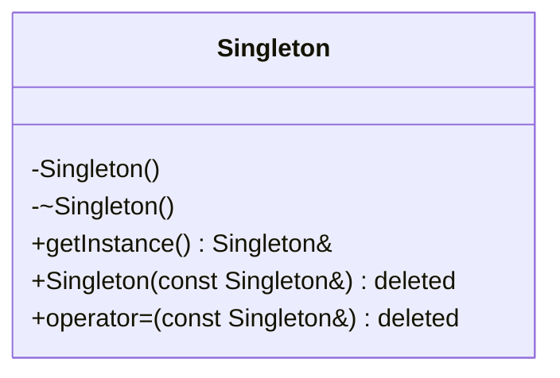

| 构件                  | 作用                                            |
| --------------------- | ----------------------------------------------- |
| 私有构造 / 析构       | 外面不能`Singleton x;`，也不能随便 `delete` |
| 删除拷贝 / 移动       | 不能通过拷贝再变出第二个                        |
| 静态`getInstance()` | 唯一合法入口，返回同一份引用                    |

差别只在三件事：**何时创建、如何保证线程安全、何时销毁**。

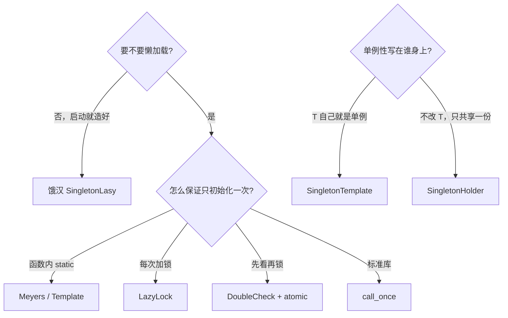

---

## 1. Meyers：函数内 `static`

现代 C++ **首选**。第一次调用 `getInstance()` 时才构造；C++11 起，这个初始化由编译器保证线程安全（magic static）。

### 原理

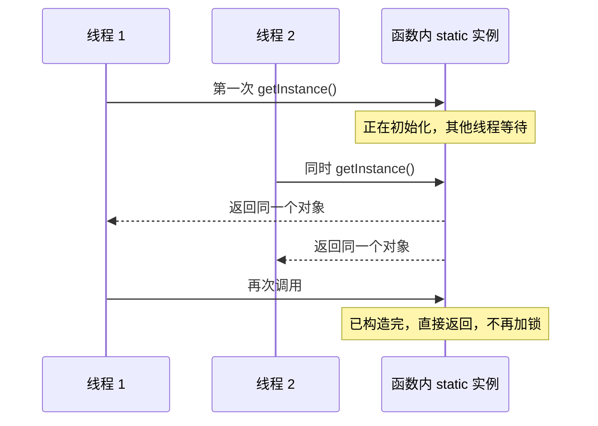

### 基本构成

- 没有类静态指针，也没有 mutex
- 局部 `static SingletonMeyers instance_{}` 就是那一份实例
- 程序退出时会析构（正常 RAII）

### 用法

```cpp
auto &s = SingletonMeyers::getInstance();
auto &t = SingletonMeyers::getInstance();
assert(&s == &t);
```

### 特点

- 代码最短，无手写内存序
- 析构顺序：若另一个静态对象析构时再调用 `getInstance()`，实例可能已经销毁（静态析构顺序问题）

---

## 2. 饿汉 `SingletonLasy`：启动即构造

类名叫 `Lasy`，语义其实是 **Eager（饿汉）**：进程启动、进入 `main` 之前就构造好，`getInstance()` 只是把引用递出去。

类内只能**声明**静态对象（类定义尚未结束，类型不完整），必须在 `.cpp` 里定义：

```cpp
// singleton.cpp
SingletonLasy SingletonLasy::instance_{};
```

### 原理

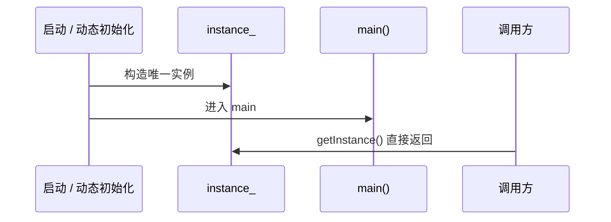

### 基本构成

| 位置     | 内容                                               |
| -------- | -------------------------------------------------- |
| 头文件   | `static SingletonLasy instance_;` 声明           |
| `.cpp` | `SingletonLasy SingletonLasy::instance_{};` 定义 |

不能写成类内 `inline static SingletonLasy instance_{}`：此时类型还不完整。

### 用法

与 Meyers 相同：`SingletonLasy::getInstance()`。

测试里 `EagerReturnsSameInstance` 测的就是这个类。

### 特点

- `getInstance()` 无分支、无锁，可 `noexcept`
- 即使用不到也会构造
- 跨翻译单元时，若别的全局对象在动态初始化阶段就调用它，可能碰到**静态初始化顺序问题**

---

## 3. 懒汉加锁 `SingletonLazyLock`

第一次用才 `new`，每次 `getInstance()` 都加锁。正确、好懂，初始化之后仍付锁的成本。

### 原理

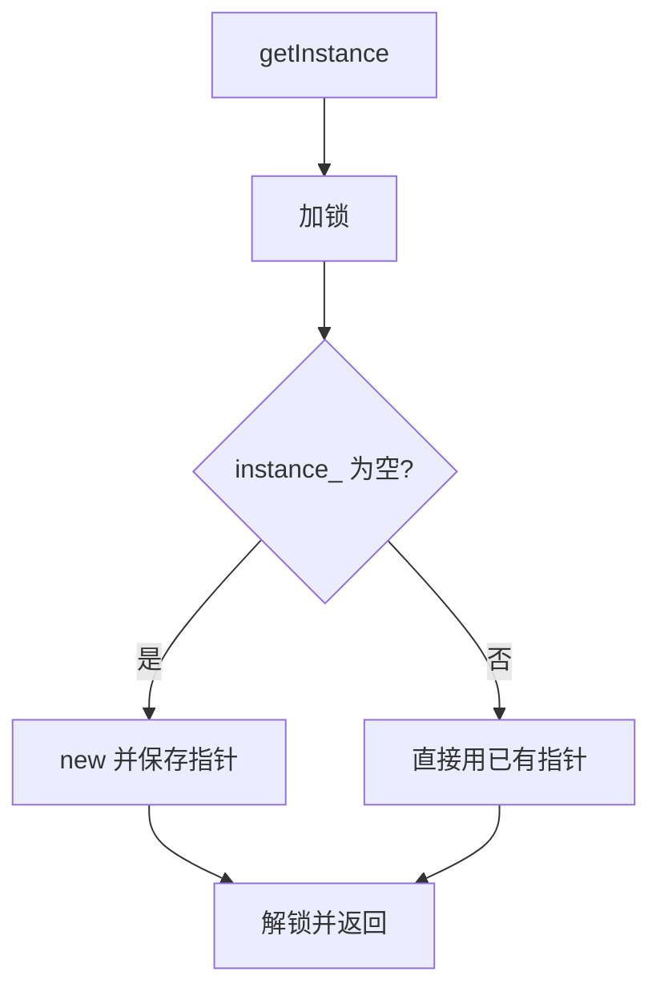

### 基本构成

- `inline static std::mutex mutex_`
- `inline static SingletonLazyLock *instance_ = nullptr`
- `new` 之后**故意不 delete**（进程结束由 OS 回收），避开静态析构顺序问题

### 用法

```cpp
auto &s = SingletonLazyLock::getInstance();
```

### 特点

- 一定线程安全
- 初始化完成后每次获取仍加锁，作为对照实现很合适，生产代码一般不会停在这一版

---

## 4. 双重检查锁 `SingletonDoubleCheck`

想法：大多数调用时实例已经存在，不必每次加锁。先无锁看一眼，只有「看起来还没有」才进锁，锁里再检查一次。

**必须用 `std::atomic`。** 普通指针做双重检查在 C++11 内存模型下是数据竞争，是未定义行为。

### 原理

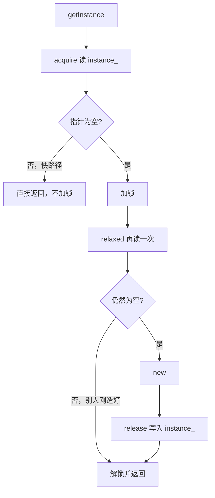

为什么要 `acquire` / `release`：

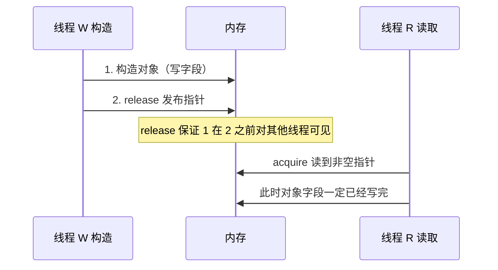

若不用 atomic，可能出现：别的线程看到「指针已经非空」，但对象还没构造完。

### 基本构成

- `std::mutex`：保护真正的创建
- `std::atomic<SingletonDoubleCheck *>`：无锁快路径上的安全发布
- 同样有意泄漏

### 用法

```cpp
auto &s = SingletonDoubleCheck::getInstance();
```

多线程测试：`DoubleCheckIsThreadSafe`（8 个线程同时 `getInstance()`，地址必须相同）。

### 特点

- 初始化后走快路径，几乎无锁
- 手写内存序，教学价值高；生产代码更推荐 Meyers / `call_once`

---

## 5. `std::call_once`：`SingletonCallOnce`

把「只执行一次」交给标准库。`once_flag` 记住有没有做过；callable 若抛异常，下次还会再试。

### 原理

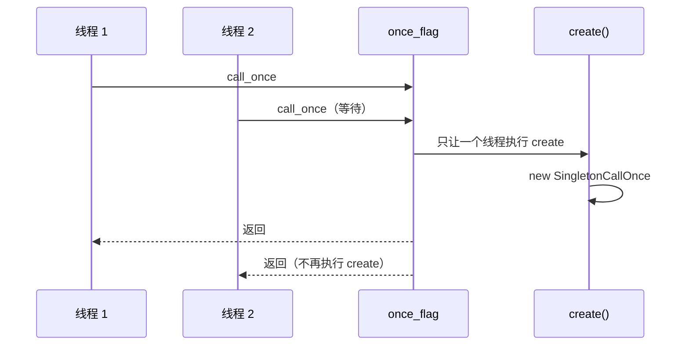

### 基本构成

- `inline static std::once_flag once_{}`
- `inline static SingletonCallOnce *instance_ = nullptr`
- 私有静态 `create()`：lambda 不是类的成员，放到静态成员函数里才能访问私有构造

### 用法

```cpp
auto &s = SingletonCallOnce::getInstance();
```

### 特点

- 语义比手写 DCLP 清楚
- 初始化逻辑很重、或不方便放进函数内 `static` 时很好用
- 日常情况 Meyers 更短

---

## 6. CRTP 模板 `SingletonTemplate`

前面几种每个类都要抄一遍样板。CRTP 把「单例性」抽到基类：`T` **自己就是**单例类型。

### 原理

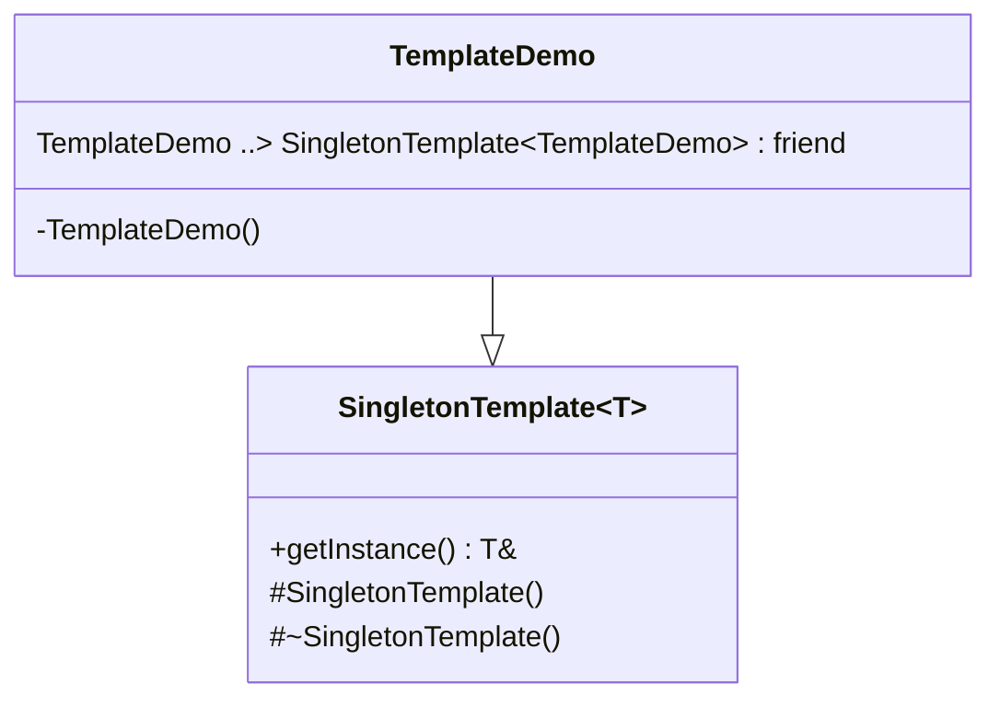

`getInstance()` 构造的是 `static T`，所以：

1. 派生类必须 `friend class SingletonTemplate<T>`，否则基类访问不了私有构造
2. 派生类构造放 `private`，外面不能 `TemplateDemo x;`
3. **不能**给模板加 `final`，否则无法继承
4. 基类构造/析构必须是 `protected`，派生类才能初始化基类

### 用法

```cpp
class Logger : public SingletonTemplate<Logger> {
  friend class SingletonTemplate<Logger>;
  Logger() = default;
public:
  void info(const std::string &);
};

Logger::getInstance().info("boot");
// Logger log;  // 错误：构造是 private
```

测试里的 `TemplateDemo` 就是这种用法。

### 适合

日志、配置、全局服务——**按设计这个类型就只能有一个**。

---

## 7. 持有器 `SingletonHolder`

不改 `T`，只保证「通过 Holder 拿到的那份 `T` 是同一个」。`T` 仍然可以是普通类（第三方类型、单测里随便构造）。

### 原理

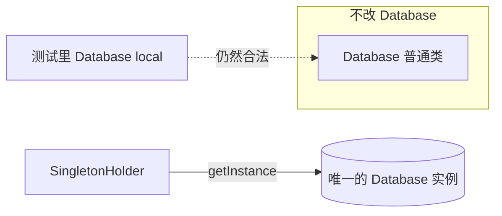

Holder **不能当对象用**：

```cpp
// 错误：Holder 构造/析构都 = delete
SingletonHolder<Database> x;

// 正确
auto &db = SingletonHolder<Database>::getInstance();
```

### 用法（对应测试 `SingletonHolderReturnsSameInstance`）

```cpp
class Database { /* 普通类，构造 public */ };

auto &a = SingletonHolder<Database>::getInstance();
auto &b = SingletonHolder<Database>::getInstance();
assert(&a == &b);
```

### 和 CRTP 的区别

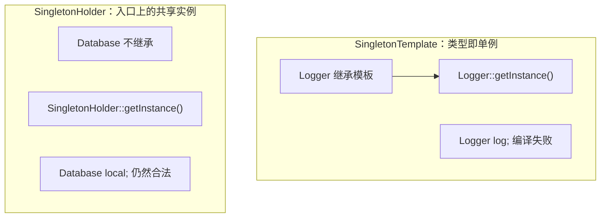

|               | `SingletonTemplate<T>`     | `SingletonHolder<T>`                       |
| ------------- | ---------------------------- | -------------------------------------------- |
| 是什么        | `T` 的基类                 | 和`T` 无关的工具类                         |
| 要不要改`T` | 要：继承 + friend + 私有构造 | 不要                                         |
| 调用          | `Logger::getInstance()`    | `SingletonHolder<Database>::getInstance()` |
| `T t;`      | 编译失败                     | 构造 public 时合法                           |
| 适合          | 「这个类型就是单例」         | 「这里需要一份共享的`T`」                  |

---

## 总对照

| 写法                      | 创建时机            | 线程安全       | 销毁           | 推荐场景           |
| ------------------------- | ------------------- | -------------- | -------------- | ------------------ |
| Meyers                    | 首次`getInstance` | magic static   | 程序退出时析构 | **日常首选** |
| `SingletonLasy`（饿汉） | 启动 / 动态初始化   | 单 TU 内安全   | 程序退出时析构 | 确定启动就要有     |
| LazyLock                  | 首次使用            | 每次加锁       | 有意泄漏       | 教学 / 对照        |
| DoubleCheck               | 首次使用            | atomic + mutex | 有意泄漏       | 学内存模型         |
| CallOnce                  | 首次使用            | `once_flag`  | 有意泄漏       | 初始化逻辑较重     |
| Template                  | 同 Meyers           | 同 Meyers      | 同 Meyers      | 业务类本身是单例   |
| Holder                    | 同 Meyers           | 同 Meyers      | 同 Meyers      | 不侵入的共享实例   |

再记两点，和具体写法无关，但最容易混：

1. **初始化线程安全 ≠ 使用线程安全。** `getInstance()` 只保证「构造发生一次」。对象里的可变成员，并发读写仍要自己同步。
2. **有意泄漏**（LazyLock / DCLP / CallOnce）是为了避开「退出阶段用已销毁单例」。Meyers / 饿汉会在 `atexit` 时析构。

## 怎么选

```text
能改 T，且 T 按设计就只能有一个？
  └─ 是 → SingletonTemplate（内部用 Meyers）
T 改不了 / 只是某处要共享一份？
  └─ 是 → SingletonHolder
要手写具体类，而不是模板？
  ├─ 要懒加载 → Meyers（首选）或 call_once
  ├─ 启动就必须有 → 饿汉 SingletonLasy
  └─ 学习锁与内存序 → LazyLock，再看 DoubleCheck
```

## 参考

- 《设计模式：可复用面向对象软件的基础》（GoF）
- C++11 `[stmt.dcl]`：函数局部 `static` 的初始化线程安全
- `std::call_once` / `std::once_flag`（`<mutex>`）
- `std::atomic` 的 acquire / release（双重检查锁）
