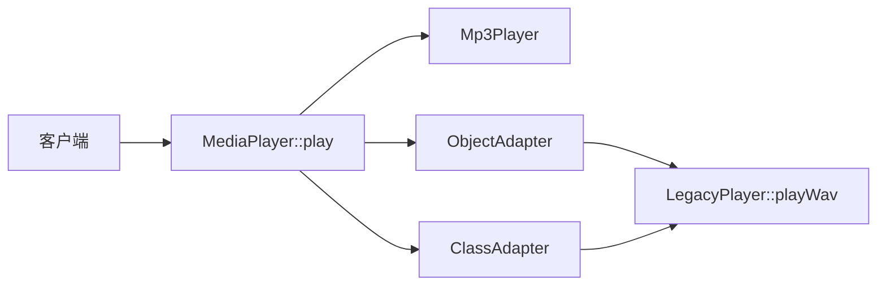
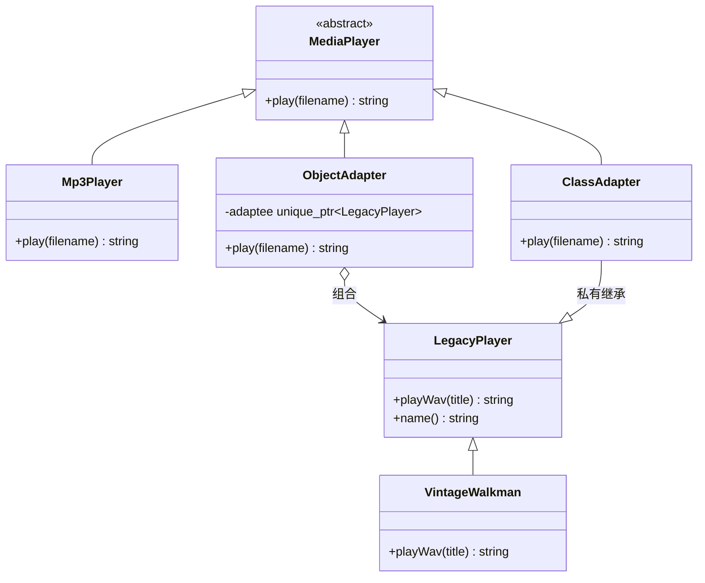
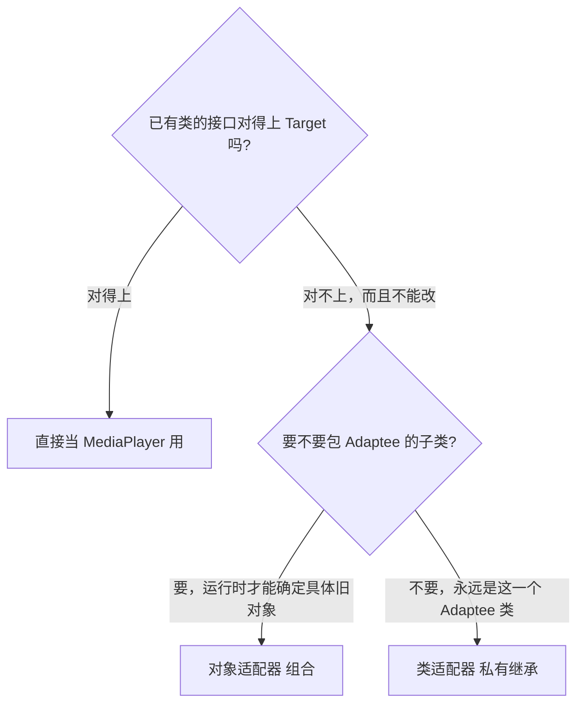
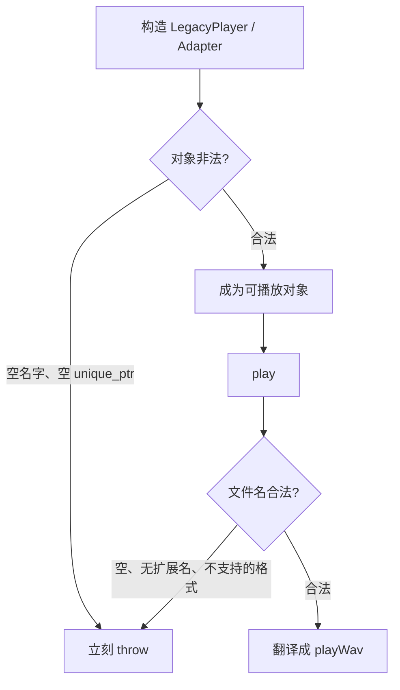
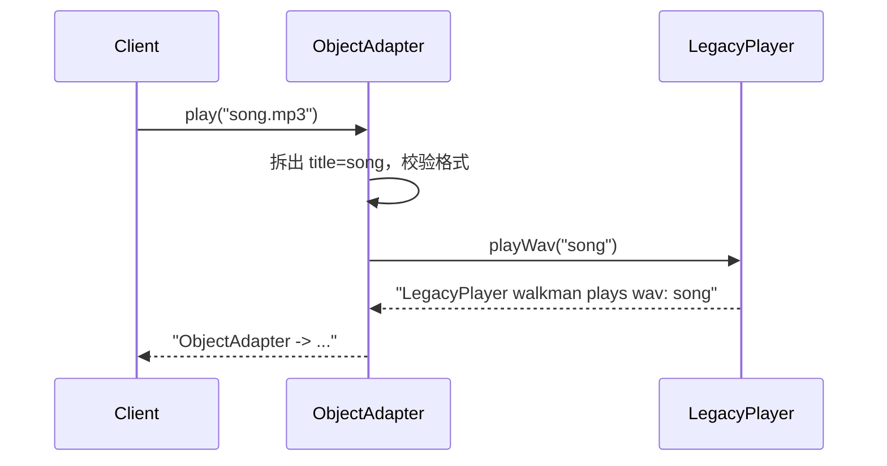
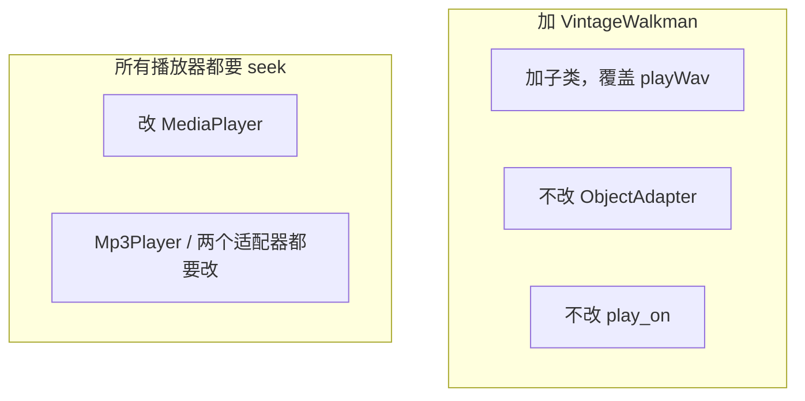
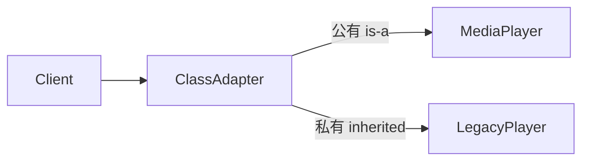
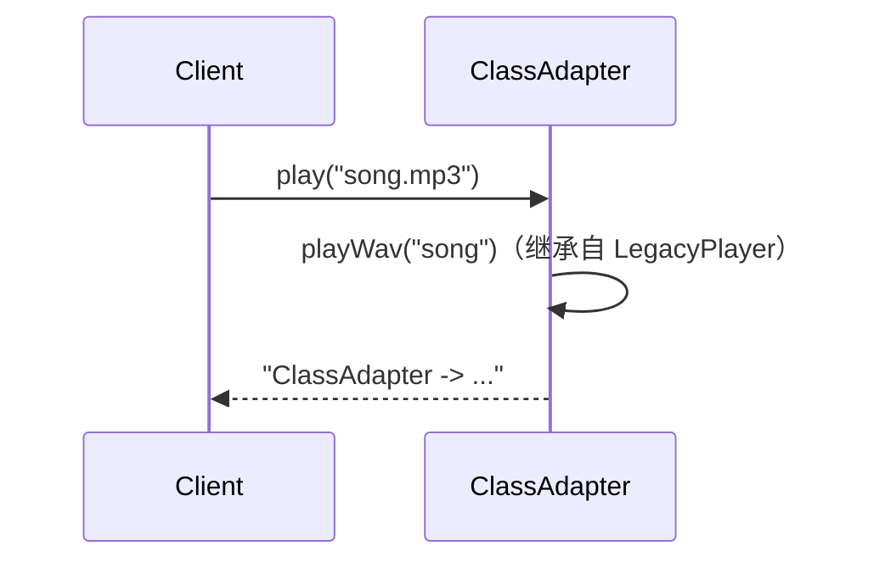
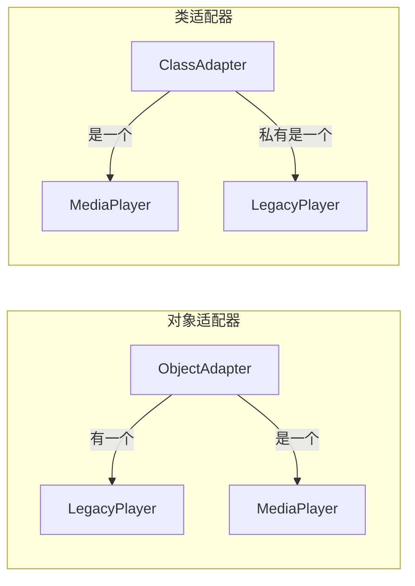

# Adapter（适配器）

**类型**：Structural（结构型）

**代码位置**：

- 头文件：[`include/structural/adapter/adapter.h`](../../include/structural/adapter/adapter.h)
- 实现：[`src/structural/adapter/adapter.cpp`](../../src/structural/adapter/adapter.cpp)
- 测试：[`tests/structural/adapter_test.cpp`](../../tests/structural/adapter_test.cpp)
- 客户端：[`examples/structural/adapter/main.cpp`](../../examples/structural/adapter/main.cpp)

## 意图

把一个类的接口转换成客户端期望的另一个接口。适配器让原本接口不兼容的类可以一起工作。

可以把 `Adapter` 想成电源转换头：墙上是圆孔（`LegacyPlayer::playWav`），笔记本电脑要扁口（`MediaPlayer::play`）。你不会把墙拆了，也不会改笔记本；中间加一个头，两边各自保持原样。

本仓库的例子就是播放器：客户端只调 `MediaPlayer::play(filename)`。`Mp3Player` 已经兼容；`LegacyPlayer` 只会 `playWav(title)`，由对象适配器或类适配器翻译过去。



## 适用场景

- **已有类不能改，接口却对不上**：第三方库、旧设备、历史模块，方法名、参数、返回值都不一样
- **客户端已经依赖 Target**：播放列表、UI、框架只认 `MediaPlayer&`，不能为旧播放器开特例
- **转换是局部的、可枚举的**：文件名拆成曲目名、格式映射，逻辑能收进一个类

**不适合**：

- 两边接口本来就一样，只是想加功能 → 那是装饰器
- 两边接口一样，只是想控制访问（懒加载、权限）→ 那是代理
- 想藏起一整套子系统的复杂度，不是转换单个接口 → 那是外观
- 抽象和实现都要独立变化，而且两边都是你能改的 → 那是桥接
- 可以直接改 Adaptee 去实现 Target → 不必再套一层

## 共同骨架

本仓库两套写法共用同一个 Target 和同一个 Adaptee，差在**适配器怎么拿到 Adaptee**：对象适配器用组合，类适配器用私有继承。



| 构件 | 作用 |
| ---- | ---- |
| `MediaPlayer` | Target。客户端只认 `play(filename)` |
| `Mp3Player` | 已经兼容 Target 的对照实现，不需要适配 |
| `LegacyPlayer` | Adaptee。只会 `playWav(title)`，不要改它 |
| `VintageWalkman` | Adaptee 子类。用来证明对象适配器能包派生对象 |
| `ObjectAdapter` | 组合一个 `unique_ptr<LegacyPlayer>`，翻译 `play` → `playWav` |
| `ClassAdapter` | 公有继承 Target、私有继承 Adaptee，翻译发生在类内部 |

两套都让客户端只拿 `const MediaPlayer &`。差别在三件事：**能不能包 Adaptee 子类、适配器和 Adaptee 是不是同一个对象、C++ 里继承关系会不会漏出去**。



### 为什么必须有 Target，不能让客户端直接调 `playWav`

差在一件事：**变化点在「谁来播放」，不在「怎么播放」。**

播放列表、进度条、音量键都已经按 `play(filename)` 写好了。如果客户端到处写 `legacy.playWav(strip_extension(file))`，每接入一种旧设备都要改调用点。适配器把翻译收进一个类，调用点保持 `MediaPlayer&`。

```cpp
void play_on(const MediaPlayer &player, std::string_view filename) {
  player.play(filename);
}

Mp3Player mp3;
ObjectAdapter walkman(std::make_unique<LegacyPlayer>("walkman"));
play_on(mp3, "song.mp3");
play_on(walkman, "song.mp3");
```

`Mp3Player` 存在的意义就是对照：接口本来兼容时，不要为了「看起来像模式」再包一层。

### 为什么对象适配器用 `unique_ptr`，类适配器用私有继承

对象适配器要**持有**一个 Adaptee。返回 / 构造都用 `unique_ptr`，所有权写进签名：适配器析构时旧播放器一起释放，不会悬空。裸指针分不清是「借给你看」还是「给你管」。

类适配器在 GoF 里是公有多重继承 Target + Adaptee。那样客户端能把 `ClassAdapter*` 转成 `LegacyPlayer*`，`playWav` 就漏出去了，Target 形同虚设。C++ 里 Adaptee 用**私有继承**：`is-a MediaPlayer`，`implemented-in-terms-of LegacyPlayer`。`std::is_base_of_v<LegacyPlayer, ClassAdapter>` 仍为真（忽略访问），但 `ClassAdapter*` 不能转换成 `LegacyPlayer*`。对应测试 `InheritanceAndConvertibility`。

`MediaPlayer` / `LegacyPlayer` 都是多态基类，拷贝会切片，所以拷贝 / 移动 **`= delete`**。虚析构必须留着：`unique_ptr<LegacyPlayer>` 析构时走的是 `LegacyPlayer::~LegacyPlayer()`。

### 为什么 `play()` 返回 `std::string` 而不是 `std::cout`

适配器的职责是转换接口。头文件里 `#include <iostream>` 会污染所有翻译单元，打印也无法直接断言。`play()` 返回描述字符串，测试写 `EXPECT_EQ`，示例再决定要不要打印。

### 错误和异常：构造时验对象，播放时验文件

非法状态进不了对象。规则抛 `std::invalid_argument`。



| 时机 | 检查 | 例子 |
| ---- | ---- | ---- |
| `LegacyPlayer` / `ClassAdapter` 构造 | 空名字 | `""` |
| `ObjectAdapter` 构造 | 空适配对象 | `nullptr` |
| `play` / `playWav` | 文件或曲目非法 | 空文件名、`"song"`、`".mp3"`、`"song.flac"` |
| `Mp3Player::play` | 只接受 mp3 | `"song.wav"` 对原生播放器非法，适配器却可以翻译 |

对应测试 `Mp3PlayerRejectsInvalidFiles` / `ObjectAdapterRejectsInvalidOperations` / `ClassAdapterRejectsInvalidOperations`。

---

## 1. 对象适配器：`ObjectAdapter`

GoF 原意里更常用的写法，也是 C++ 的首选。适配器**是一个** `MediaPlayer`，**有一个** `LegacyPlayer`。

### 原理

客户端调 `play(filename)`。适配器把文件名拆成曲目名，再委托给手里的 `adaptee_->playWav(title)`。动态绑定发生在 Target 上；Adaptee 那一侧如果是虚函数，还可以再绑到 `VintageWalkman`。



加一种旧设备时，只要它是 `LegacyPlayer` 的子类，**不改** `ObjectAdapter`，把指针塞进去即可：



### 基本构成

| 位置 | 内容 |
| ---- | ---- |
| `MediaPlayer` | 纯虚 `play()`，虚析构，删除拷贝 / 移动 |
| `LegacyPlayer` | `playWav(title)`，虚析构；可再派生 |
| `ObjectAdapter` | `final`，构造拿走 `unique_ptr<LegacyPlayer>`，`play()` 做翻译 |
| `VintageWalkman` | 覆盖 `playWav`，输出多一段 `[tape]` |

```cpp
std::string ObjectAdapter::play(std::string_view filename) const {
  const auto file = parse_media_file(filename);
  require_format(file, "mp3", "wav");
  return "ObjectAdapter -> " + adaptee_->playWav(file.title);
}
```

翻译做了两件事：方法名 `play` → `playWav`，参数 `filename` → `title`。这就是适配器的全部职责，不要顺手加音效、缓存、权限。

### 用法

包一个旧播放器（测试 `ObjectAdapterTranslatesPlayToPlayWav`）：

```cpp
ObjectAdapter adapter(std::make_unique<LegacyPlayer>("walkman"));
adapter.play("song.mp3");
// "ObjectAdapter -> LegacyPlayer walkman plays wav: song"
```

只依赖抽象（测试 `ClientDependsOnTargetAbstraction`）：

```cpp
const MediaPlayer &player = adapter;
play_on(player, "song.mp3");
```

包 Adaptee 子类（测试 `ObjectAdapterDispatchesToAdapteeSubclass`）：

```cpp
ObjectAdapter vintage(std::make_unique<VintageWalkman>());
play_on(vintage, "song.mp3");
// "... plays wav: song [tape]"
```

空指针、坏文件名会抛异常。拷贝 / 移动已删除，对应 `CopyAndMoveAreDeleted`。

示例 [`examples/structural/adapter/main.cpp`](../../examples/structural/adapter/main.cpp) 里，播放列表同时塞 `Mp3Player`、对象适配器、类适配器；换 `MediaPlayer&` 只换设备，`play_on` 不动。

### 特点

- 能适配 Adaptee **以及它的子类**，这是组合相对继承的关键优势
- 适配器和 Adaptee 是两个对象，生命周期由 `unique_ptr` 绑在一起
- 符合开放封闭的方向是**加一种旧设备子类**：加 `VintageWalkman`，不改适配器
- 不能覆写 Adaptee 的非虚方法；要改行为只能包一层再委托
- 多一个对象、一次间接调用。对播放器这种粒度完全可以接受

---

## 2. 类适配器：`ClassAdapter`

GoF 的另一种写法。适配器同时是 Target 和 Adaptee：公有继承 `MediaPlayer`，私有继承 `LegacyPlayer`。

### 原理

没有单独的 Adaptee 成员。`play()` 内部直接调继承来的 `playWav()`。翻译逻辑和对象适配器相同，只是「拿到 Adaptee」的方式从组合变成了继承。





它**绑死**在 `LegacyPlayer` 这一个类上。要适配 `VintageWalkman`，必须再写一个 `class VintageAdapter : public MediaPlayer, private VintageWalkman`。对象适配器没有这个问题。

### 基本构成

| 位置 | 内容 |
| ---- | ---- |
| 公有继承 `MediaPlayer` | 客户端当 Target 用 |
| 私有继承 `LegacyPlayer` | 复用 `playWav`，但不暴露给客户端 |
| 构造函数 | 转发播放器名字给 `LegacyPlayer` |
| `play()` | 与对象适配器相同的拆文件名 / 校验 / 翻译 |

```cpp
class ClassAdapter final : public MediaPlayer, private LegacyPlayer {
public:
  explicit ClassAdapter(std::string player_name);
  std::string play(std::string_view filename) const override;
};
```

```cpp
ClassAdapter discman("discman");
discman.play("song.mp3");
// "ClassAdapter -> LegacyPlayer discman plays wav: song"
// discman.playWav("song");  // 错误：私有继承，客户端调不到
```

空名字、坏文件名同样 `throw`，对应 `ClassAdapterRejectsInvalidOperations`。`InheritanceAndConvertibility` 断言：它是 `MediaPlayer`，基类关系上是 `LegacyPlayer`，但不能转换成 `LegacyPlayer*`。

### 用法

```cpp
ClassAdapter adapter("discman");
const MediaPlayer &player = adapter;
play_on(player, "nocturne.mp3");
```

示例第三段之后的对照：类适配器没有 `VintageWalkman` 版本；对象适配器直接包一个即可。

### 特点

- 少一个对象，调用是 `this->playWav`，没有成员间接
- 理论上可以覆写 Adaptee 的虚函数，等于适配的同时改行为
- 不能适配 Adaptee 的子类，除非再写一个适配器类
- C++ 没有 Java 那种「接口 + 单继承类」的现成组合；私有继承是更安全的替代，公有多重继承会把 Adaptee 漏给客户端
- Adaptee 若再继承别的东西，多重继承的构造顺序、析构顺序都要小心。本仓库 Adaptee 没有更深层基类

---

## 总对照

| 写法 | 拿到 Adaptee 的方式 | 包得了子类吗 | 客户端看不看得到 Adaptee | 推荐场景 |
| ---- | ------------------- | ------------ | ------------------------ | -------- |
| 直接改 Adaptee 去实现 Target | 无 | — | — | 你拥有源码，改得起 |
| 调用点自己翻译 | 无 | — | 到处都是 `playWav` | 只有一处、以后不会再接旧设备 |
| **对象适配器** | **组合 `unique_ptr`** | **能** | 不能 | C++ 默认选择 |
| **类适配器** | **私有继承** | 不能 | 不能（因为私有） | Adaptee 类型固定、想少一个对象 |
| `Mp3Player` | 本身就是 Target | — | — | 接口已经兼容，不要适配 |



再记三点，和具体类名无关，但最容易混：

1. **适配器转换的是接口，不是行为。** 加均衡器、加日志、加缓存是装饰器；加访问控制、加懒加载是代理。适配器在翻译完之后，旧对象该怎么播还怎么播。
2. **Facade 也「包一层」，但目的不同。** 外观把一堆子系统收成一个简单入口；适配器把一个已有接口变成另一个已有接口。一边是简化，一边是对接。
3. **`Mp3Player` 不是适配器。** 没有它，模式照样成立；有了它，是为了说明「接口已经兼容时不要硬套模式」。

和其它结构型模式的边界：

| 模式 | 接口关系 | 目的 |
| ---- | -------- | ---- |
| Adapter | 两边**不同**，中间翻译 | 让旧代码能被新客户端用 |
| Decorator | **相同**，再包一层 | 动态加职责 |
| Proxy | **相同**，再包一层 | 控制访问 |
| Facade | 新入口盖住一堆旧接口 | 简化子系统 |
| Bridge | 抽象和实现从一开始就分开 | 两边独立变化 |

## 怎么选

```text
已有类的接口对得上客户端吗？
  └─ 对得上 → 直接用（本仓库 Mp3Player）
  └─ 对不上
        └─ 能改已有类去实现 Target → 改它，不必适配
        └─ 不能改
              └─ 要包 Adaptee 的子类、或 Adaptee 类型运行时才知道
                    → ObjectAdapter（组合）
              └─ Adaptee 类型编译期就固定、想少一个对象
                    → ClassAdapter（私有继承）
```

翻译逻辑一旦开始管缓存、权限、日志，适配器就已经越界；那些职责分别属于代理和装饰器。

## 参考

- 《设计模式：可复用面向对象软件的基础》（GoF）：Adapter
- 《Effective C++》条款 18：让接口容易正确使用、难以误用（所有权写进签名）
- 《Effective C++》条款 32 / 39：公有继承是 is-a；私有继承是 implemented-in-terms-of
- `std::unique_ptr` / `std::make_unique`（对象适配器的成员所有权）
