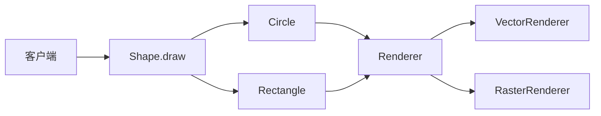
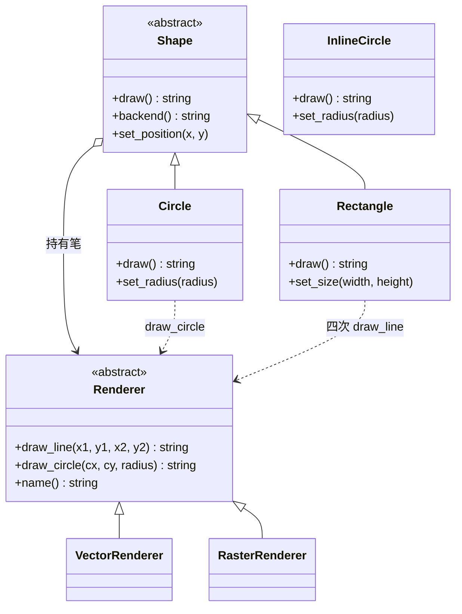
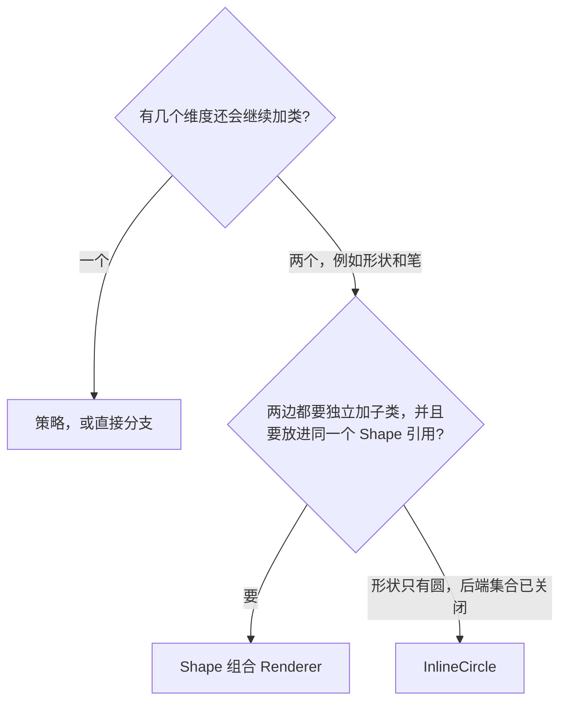
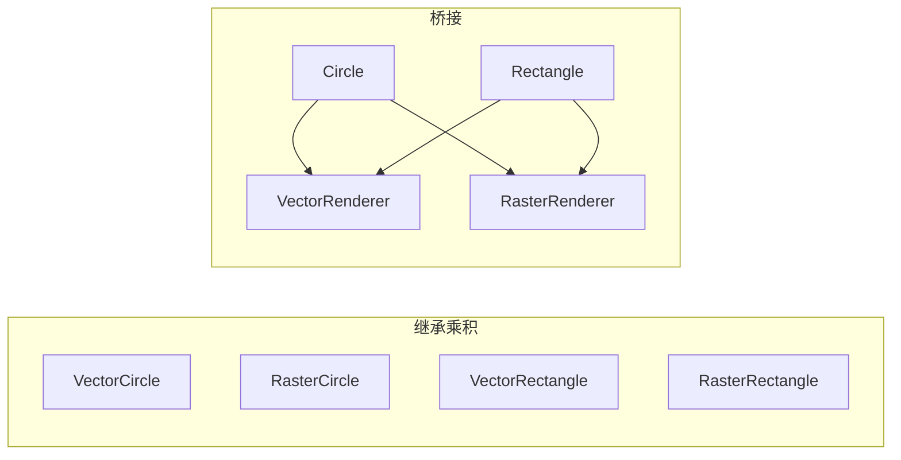
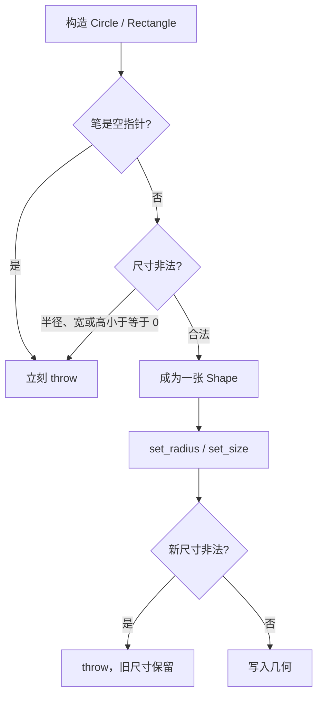
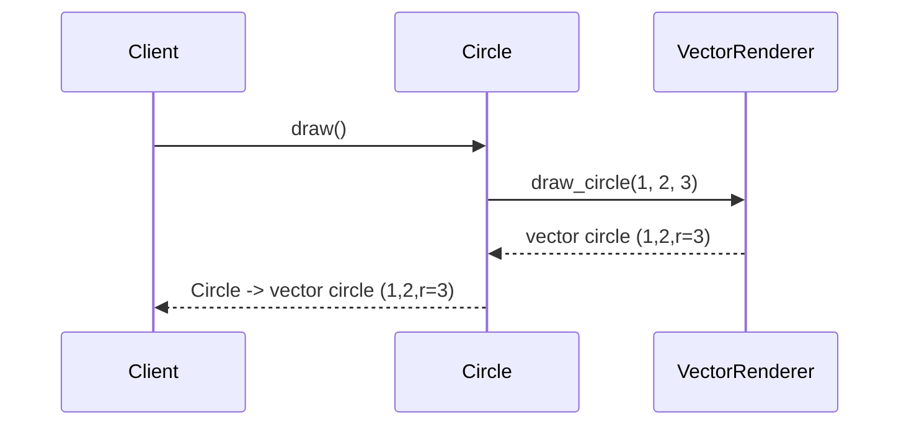
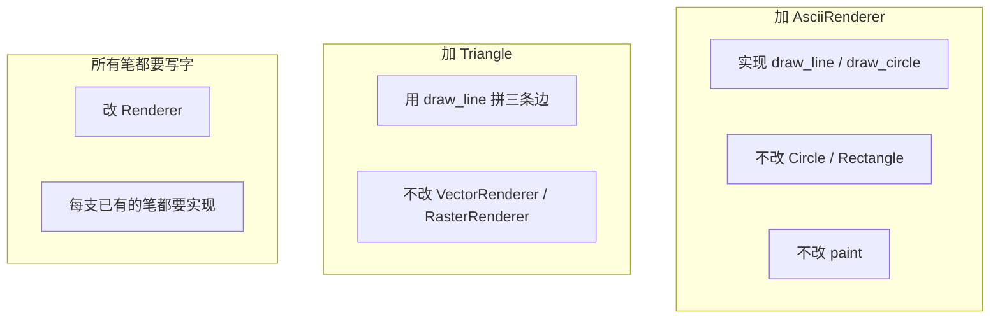
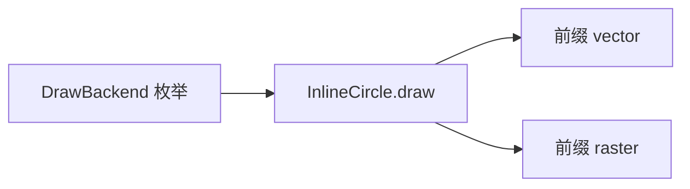
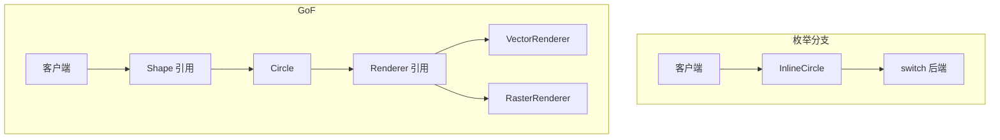
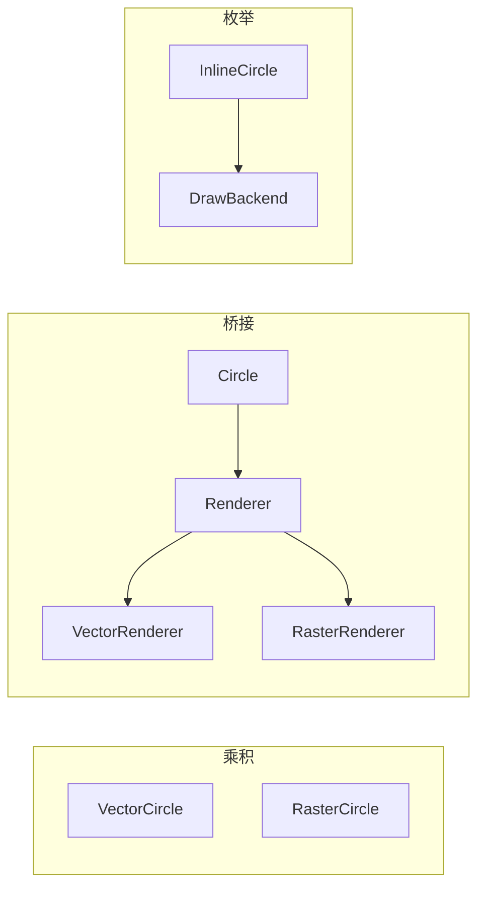

# Bridge（桥接）

**类型**：Structural（结构型）

**代码位置**：

- 头文件：[`include/structural/bridge/bridge.h`](../../include/structural/bridge/bridge.h)
- 实现：[`src/structural/bridge/bridge.cpp`](../../src/structural/bridge/bridge.cpp)
- 测试：[`tests/structural/bridge_test.cpp`](../../tests/structural/bridge_test.cpp)
- 客户端：[`examples/structural/bridge/main.cpp`](../../examples/structural/bridge/main.cpp)

## 意图

把一个东西的两个变化维度拆开，让它们各自生长，而不是在继承树上乘成一组类。

可以把桥接想成「形状」和「笔」分开放。圆要不要加、矩形要不要加，是一边的事；矢量、光栅、字符画要不要加，是另一边的事。调用方点的是「把这个形状画出来」，形状自己决定用哪些笔画，笔只负责把一笔画成自己的那句话。两边在构造时接上，之后互不认识对方的具体类。

本仓库的例子就是画图。`Circle` / `Rectangle` 是抽象这边的形状，`VectorRenderer` / `RasterRenderer` 是实现这边的笔。`Shape` 持有 `Renderer`。矩形用四次 `draw_line` 拼出来，笔上没有 `draw_rectangle`。



## 适用场景

- **两个维度都会继续加类**：形状会多，绘制后端也会多。用继承的话，类的数量是乘积
- **高层操作要建立在一组更窄的原语上**：矩形、三角形都是线，只有圆需要曲线。原语留在笔上，形状自己拼
- **客户端只该依赖抽象**：绘制函数拿 `const Shape &`。换笔、换形状都不改这个函数

**不适合**：

- 只有一个维度在变，例如同一种形状换一种完整算法 → 那是策略。永远只有 `Circle` 时，`Renderer` 看起来就是圆的绘制策略
- 两边接口已经写死、对不上，要事后翻译 → 那是[适配器](adapter.md)
- 外层和内层是同一个接口，调用前后多做一步 → 那是[装饰器](decorator.md)
- 外层和内层是同一个接口，由外层决定这次调用让不让发生 → 那是[代理](proxy.md)
- 想把一堆子系统收成一个粗粒度入口 → 那是[外观](facade.md)
- 形状只有一种，后端集合也已经关闭 → 本仓库的 `InlineCircle`，一个枚举分支就够了

## 共同骨架

本仓库两套写法画出来的圆可以是同一句话，差在**后端有没有自己的类型**。GoF 桥接是两条层次，中间用组合接上。对照的 `InlineCircle` 把后端收成枚举，分支写在形状里面。



| 构件 | GoF 角色 | 作用 |
| ---- | -------- | ---- |
| `Shape` | Abstraction | 声明 `draw()`。客户端只认它。位置也在这里，因为每种形状都有坐标 |
| `Circle` / `Rectangle` | RefinedAbstraction | 各自把原语拼成一种画法。半径、宽高不进 `Shape` |
| `Renderer` | Implementor | 直线和圆两种笔画。没有 `draw()`，也不知道矩形 |
| `VectorRenderer` / `RasterRenderer` | ConcreteImplementor | 同一种笔画，两句不同的文本 |
| `InlineCircle` | 对照 | 枚举后端，没有笔对象，也不能放进 `Shape &` |

两种圆都能画出 `Circle -> vector circle (1,2,r=3)`。差别在三件事：**后端是类型还是枚举、加一种笔要不要改形状、客户端能不能只拿 `Shape &`**。



### 为什么是组合两条层次，不能让圆去继承笔

差在一件事：**类的数量会变成乘法。**

矢量圆、光栅圆、矢量矩形、光栅矩形，是四种类。再加一种字符画笔，每种形状都要再写一个子类。再加一个三角形，每种笔都要再写一个子类。`Circle` 若继承 `VectorRenderer`，圆的类型里就焊死了笔，光栅圆只能是另一个类。

桥接把乘法改成加法。形状一条线：`Circle`、`Rectangle`。笔一条线：`VectorRenderer`、`RasterRenderer`。四种组合是构造时配对，不是四种类型。测试 `InheritanceAndConvertibility` 固定了 `Circle` 不是 `Renderer`，`VectorRenderer` 也不是 `Shape`。



动态绑定发生在笔的原语上，不发生在「这是矢量圆还是光栅圆」这种合并类型上。`paint(const Shape &)` 里面没有 `VectorRenderer` 这个名字。测试 `ClientDependsOnShapeAbstraction` 把这件事固定下来。

### 为什么笔上只有原语，矩形却没有 `draw_rectangle`

差在一件事：**实现侧的接口要窄到新形状还能复用。**

如果每一种形状都在 `Renderer` 上有一个同名方法，加三角形就要改每一支笔。笔就反过来依赖形状清单，两条线又焊在一起。现在的原语只有 `draw_line` 和 `draw_circle`。圆调用一次 `draw_circle`，因为曲线怎么落笔是笔的事。矩形自己算四条边，调用四次 `draw_line`。y 向下增大，顺序是上、右、下、左。

```cpp
std::string Rectangle::draw() const {
  const int left = x();
  const int top = y();
  const int right = left + width_;
  const int bottom = top + height_;
  const Renderer &pen = renderer();
  return "Rectangle -> " + pen.draw_line(left, top, right, top) + " | " +
         pen.draw_line(right, top, right, bottom) + " | " +
         pen.draw_line(right, bottom, left, bottom) + " | " +
         pen.draw_line(left, bottom, left, top);
}
```

测试 `RectangleIsFourLinesOnEitherRenderer` 把整句对上，并确认结果里没有 `circle`。测试 `ShapesAcceptAnUnforeseenRenderer` 再进一步：一支测试里临时写的 `DotRenderer` 只返回 `dot line` / `dot circle`，矩形仍然拼出四段，圆仍然只取圆那一句。形状没有把具体笔的类名写进自己的代码。

这和策略最容易混。两边都是「一个对象里面装着另一个接口」。策略替换的是一整段算法，上下文通常把工作整个交出去。桥接的抽象侧还有自己的子类，每个子类用原语拼出不同的过程。只有一种形状时，这段代码就退回策略。本仓库不提供 `set_renderer`：笔在构造时定下来。运行中换笔，看起来会更像策略。

和[适配器](adapter.md)的差别在时机。适配器翻译的是两个已经存在、对不上的接口，`play` 对 `playWav`。桥接在拆开的时候就把两边的接口一起定了：`Shape::draw` 和 `Renderer::draw_line` 从一开始就不是同一个方法。和[装饰器](decorator.md)、[代理](proxy.md)的差别在接口是否相同。那两个模式的外层和内层都是同一个类型。桥接的形状和笔不是同一个类型。

### 为什么用 `unique_ptr` 持有笔，`draw()` 却是 `const`

笔的寿命跟形状走。`unique_ptr<Renderer>` 把所有权写进构造函数：形状析构时，笔一起释放。裸指针分不清是借来看还是交给你管。空指针直接拒绝，避免第一次 `draw()` 才在空指针上崩溃。

每张形状持有自己的那一支笔。测试 `ShapesKeepIndependentGeometry` 改左边矢量圆的半径和坐标，右边的光栅圆原样留着。要让多张形状共用同一支笔，得改成引用或 `shared_ptr`，并另外约定谁负责释放。本仓库和其它模式一样，把「这一份实现属于这一个抽象」写进签名。

`renderer()` 是 `protected`。只有形状子类在 `draw()` 里用它。客户端拿着 `Shape &` 调不到 `draw_line`。测试 `QueriesStayOnTheirOwnSide` 用 `requires` 把边界固定下来：`Shape` 上没有 `draw_line` / `name`，`Renderer` 上没有 `draw` / `radius`。

`draw()` 标成 `const`，笔的原语也是 `const`。画一次不改几何，所以 `paint(const Shape &)` 才能成立。改位置、改半径是另外的非 `const` 操作，发生在形状上，笔的具体类不动。测试 `GeometryChangesStayOnTheShape`：圆挪到 `(-2, 4)`、半径改成 5 之后，`backend()` 仍是 `"vector"`。

`Shape` 和 `Renderer` 都是多态基类。按值拷会切片，移动会把「这张形状」和「它的笔」拆开，所以拷贝和移动都 `= delete`。子类不用再写一遍。虚析构必须留着：`unique_ptr<Renderer>` 析构时走的是 `Renderer::~Renderer()`。对应测试 `CopyAndMoveAreDeleted`。`InlineCircle` 没有基类，拷贝可用，这是对照类的值语义，不是桥接的一部分。

`backend()` 只转述笔的 `name()`，例如 `"vector"`。它不是原语，客户端仍然不能拿它去画线。换笔不改变 `Circle` 这个类型。

### 为什么 `draw()` 返回 `std::string` 而不是 `std::cout`

桥接的职责是把一次绘制交给对的那支笔。头文件里 `#include <iostream>` 会污染所有翻译单元，打印也无法直接断言。`draw()` 返回 `std::string`，测试写 `EXPECT_EQ`，示例再决定要不要打印。

笔的原语同样返回文本：`vector line (0,0)-(4,0)`、`vector circle (1,2,r=3)`。形状只在前面加上自己的名字和分隔符。原语不检查半径、宽高。`draw_circle(0, 0, 0)` 仍会画出 `vector circle (0,0,r=0)`。尺寸规则在形状上，不在笔上。测试 `VectorRendererStrokesLinesAndCircles`。

### 错误和异常：构造时先验笔，再验尺寸；失败的 setter 不改旧值

非法状态进不了对象。规则抛 `std::invalid_argument`。



基类先构造，所以空笔和非法半径同时出现时，先报告笔。`Circle(0, 0, 0, nullptr)` 的异常是 `renderer is required`。

| 时机 | 检查 | 例子 |
| ---- | ---- | ---- |
| `Shape` 构造 | 笔必须存在 | `nullptr` |
| `Circle` / `Rectangle` / `InlineCircle` 构造 | 尺寸必须为正 | 半径 `0`、宽度 `0`、高度 `-2` |
| `InlineCircle` 构造 | 枚举必须是已知后端 | `static_cast<DrawBackend>(7)` |
| `set_radius` / `set_size` | 新尺寸必须为正，两个都合法才写入 | `set_size(0, 5)` 后宽高仍是 `4` 和 `3` |
| `set_position`、笔的原语 | 不抛 | 坐标可正可负；笔不重复检查尺寸 |

对应测试 `ConstructorsRejectInvalidInput` / `SettersRejectInvalidSizes`。

---

## 1. 桥接：`Shape` / `Renderer`

GoF 原意。变化点有两个：画什么，以及用什么笔。`Circle` 和 `Rectangle` 是修正抽象，它们增加的是几何，不是新的笔。`VectorRenderer` 和 `RasterRenderer` 是具体实现，它们增加的是一笔的写法，不是新的形状。

### 原理

客户端拿着 `const Shape &`，调 `draw()`。形状的 `draw()` 再调用手里那支笔的原语。动态绑定发生在 `draw_line` / `draw_circle` 上。几何留在形状里，下次 `draw()` 用的还是同一支笔。



加一种笔时新增一个 `Renderer` 子类，**不改** `Circle` / `Rectangle`，也不改 `paint(const Shape &)`。加一种形状时新增一个 `Shape` 子类，用已有原语去拼，**不改**已有的笔：



加形状、加笔符合开放封闭。加**所有笔都要有的新原语**要改 `Renderer`，这是桥接的经典代价：共同的「笔会画什么」写进了实现接口。加**所有形状都要有的新操作**同理，要改 `Shape`。半径就不在 `Shape` 上，那是圆自己的字段。

### 基本构成

| 位置 | 内容 |
| ---- | ---- |
| `Renderer` | 纯虚 `draw_line` / `draw_circle` / `name`，虚析构，删除拷贝 / 移动 |
| `VectorRenderer` / `RasterRenderer` | `final`，实现放在 `.cpp`，文本前缀分别是 `vector` 和 `raster` |
| `Shape` | 纯虚 `draw()`，持有 `unique_ptr<Renderer>`，`renderer()` 仅给子类 |
| `Circle` / `Rectangle` | `final`。圆转发 `draw_circle`；矩形拼四条 `draw_line` |

| | `Shape::draw()` | `Renderer::draw_line()` |
|--|-----------------|-------------------------|
| 是否虚函数 | 纯虚 | 纯虚 |
| 谁实现 | 每种形状 | 每种笔 |
| 客户端要不要知道另一边的具体类 | 不必 | 形状也不必 |
| 加新的一边要不要改 | 加形状时新写一个覆盖 | 加笔时新写一个覆盖 |

`set_position` 在 `Shape` 上：挪动是所有形状的共同操作，不应该逼出 `dynamic_cast`。`set_radius` / `set_size` 留在具体形状上。

```cpp
std::string paint(const Shape &shape) { return shape.draw(); }
```

没有「画出半个矩形」这条路径：`draw()` 要么拼完四条边，要么在更早的构造阶段就已经拒绝了非法尺寸。

### 用法

同一个圆，两支笔（测试 `CircleDrawsWithEitherRenderer`）：

```cpp
Circle vector_circle(1, 2, 3, std::make_unique<VectorRenderer>());
Circle raster_circle(1, 2, 3, std::make_unique<RasterRenderer>());
vector_circle.draw();
// "Circle -> vector circle (1,2,r=3)"
raster_circle.draw();
// "Circle -> raster circle (1,2,r=3)"
```

矩形在两支笔上都是四条线（测试 `RectangleIsFourLinesOnEitherRenderer`）：

```cpp
Rectangle frame(0, 0, 4, 3, std::make_unique<VectorRenderer>());
frame.draw();
// "Rectangle -> vector line (0,0)-(4,0) | vector line (4,0)-(4,3) | vector line (4,3)-(0,3) | vector line (0,3)-(0,0)"
```

只依赖抽象（测试 `ClientDependsOnShapeAbstraction`）：

```cpp
const Shape &as_circle = vector_circle;
paint(as_circle);
```

库外面再加一支笔，已有形状不用改（测试 `ShapesAcceptAnUnforeseenRenderer`）：

```cpp
class DotRenderer final : public Renderer {
public:
  std::string draw_line(int, int, int, int) const override { return "dot line"; }
  std::string draw_circle(int, int, int) const override { return "dot circle"; }
  const std::string &name() const override { return name_; }

private:
  std::string name_{"dot"};
};

Circle circle(1, 2, 3, std::make_unique<DotRenderer>());
circle.draw();
// "Circle -> dot circle"
```

改几何不换笔（测试 `GeometryChangesStayOnTheShape`）：

```cpp
circle.set_position(-2, 4);
circle.set_radius(5);
circle.backend();
// "vector"
```

拷贝 / 移动已删除，对应测试 `CopyAndMoveAreDeleted`。空笔、非正尺寸会抛异常；`set_size` 有一边非法时，宽和高都保持原值。

示例 [`examples/structural/bridge/main.cpp`](../../examples/structural/bridge/main.cpp) 里，`paint` 同时接矢量和光栅。后面临时加了 `Triangle`（三条 `draw_line`）和 `AsciiRenderer`。三角形用的仍是库里的 `VectorRenderer`，字符画笔画的仍是库里的 `Circle` / `Rectangle`。

### 特点

- 两个维度各自加类：加 `AsciiRenderer` 不改形状，加 `Triangle` 不改笔
- 符合开放封闭的方向是**加一种形状或加一种笔**。加一种原语要改 `Renderer` 和所有具体笔
- 抽象依赖实现的接口，具体形状不出现具体笔的名字
- 每张形状拥有自己的笔。桥接本身不要求共享实现；共享是另一种寿命约定
- 原语选窄了，新形状才加得动。原语若和形状一一对应，实现层次会被形状清单拖着走
- 若永远只有一种形状，虚函数和第二条继承线就滑回「可替换的绘制策略」

---

## 2. 对照：`InlineCircle`

对照实现，**不是** GoF 桥接。一个可拷贝的值类，没有 `Renderer`，也没有 `Shape`。后端是 `DrawBackend` 枚举，`draw()` 里面按枚举选前缀。

它对应原型笔记里的 `UnitSpec`：把「我已经知道具体种类，而且种类不会再长」收成最便宜的语言机制。真正把形状和笔拆开的，还是两条层次和中间那次组合。

### 原理

`InlineCircle` 没有基类，拷贝不会切片。`DrawBackend` 只有 `Vector` 和 `Raster`。矩形、第三条边、第三种笔都放不进来——除非再写一个类，把同一组分支抄一遍，或者把这个类改成大杂烩。

封闭情况下，画出来的文本和桥接版相同。测试比的是扩展方式，不是这一次的标点。





### 基本构成

| 位置 | 内容 |
| ---- | ---- |
| `DrawBackend` | 两个枚举值。再加一个值就要改 `draw()` |
| 默认拷贝 / 赋值 | 值对象，允许拷 |
| `draw()` | 按枚举拼出和 `Circle` 相同的文本 |
| 无抽象基类 | 不删除拷贝，也不能传给 `paint` |

```cpp
InlineCircle spec(1, 2, 3, DrawBackend::Vector);
spec.draw();
// "Circle -> vector circle (1,2,r=3)"
```

空半径同样 `throw`。越界枚举在构造时抛 `backend is unknown`，对应 `ConstructorsRejectInvalidInput`。拷贝可用，对应 `CopyAndMoveAreDeleted` 里的 `is_copy_constructible_v<InlineCircle>`。

### 用法

和桥接版对上同一句话（测试 `InlineCircleMatchesTheClosedCase`）：

```cpp
Circle vector_circle(1, 2, 3, std::make_unique<VectorRenderer>());
InlineCircle vector_inline(1, 2, 3, DrawBackend::Vector);
vector_inline.draw() == vector_circle.draw();
```

副本独立（测试 `InlineCircleCopiesByValue`）：

```cpp
InlineCircle copy = spec;
copy.set_position(4, 5);
copy.set_radius(6);
spec.draw();
// 仍是 "Circle -> vector circle (1,2,r=3)"
```

它过不了 `const Shape &`。测试 `InheritanceAndConvertibility` 断言 `InlineCircle *` 不能转换成 `Shape *`。

示例最后一段就是这条路径：种类已经闭合，直接拷一份再改半径。

### 特点

- 代码最短。后端不会再增加、形状也只有圆的时候，枚举比两条虚函数层次清楚
- 加一种笔必须改这个类；加一种形状只能再抄一份分支
- 不能放进 `paint(const Shape &)`，多态不发生
- 类型固定、两个维度都不再扩展时很合适。不要把它当成 GoF 桥接本身

---

## 总对照

| 写法 | 两个维度怎么放 | 加一种形状 | 加一种笔 | 推荐场景 |
| ---- | -------------- | ---------- | -------- | -------- |
| 继承乘积 | 焊进一个类名 | 每种笔再写一个类 | 每种形状再写一个类 | 组合少到几乎固定 |
| 调用点自己分支 | 散在客户端 | 每个调用点都要补 | 每个调用点都要补 | 只有一处、以后不改 |
| **GoF 桥接** | **两条层次，构造时组合** | **加一个 `Shape` 子类** | **加一个 `Renderer` 子类** | **两边都会变** |
| `InlineCircle` | 枚举写在形状里 | 再抄一份 `switch` | 改这个类 | 只有圆，后端已关闭 |
| 策略 | 一个算法接口 | 算法若要认识每种形状，维度就反了 | 加一个策略类 | 只有算法在变 |



再记三点，和具体类名无关，但最容易混：

1. **桥接拆的是两个都会增长的层次，不是事后翻译接口。** 适配器假定两边已经写好而且对不上。桥接假定这两边都还要加类，所以接口在拆开时一起设计。`draw()` 对 `draw_line` 是高层对原语，不是 `play` 对 `playWav` 那种迁就。
2. **和策略的类图几乎一样，意图不一样。** 都是组合一个接口。策略把一整段算法换掉；桥接的实现侧是原语，抽象侧自己还有 `Circle` / `Rectangle`。拿掉第二种形状之后，剩下的代码不必再叫桥接。
3. **`InlineCircle` 只负责封闭集合里的分支。** 没有它，GoF 桥接照样成立；有了它，也不等于把 `Renderer` 和 `Shape` 省掉之后还叫同一个模式。

和其它结构型模式的边界：

| 模式 | 接口关系 | 目的 |
| ---- | -------- | ---- |
| Adapter | 两边**不同**，中间翻译 | 让旧代码能被新客户端用 |
| Decorator | **相同**，再包一层 | 动态加职责 |
| Proxy | **相同**，再包一层 | 控制访问 |
| Facade | 新入口盖住一堆旧接口 | 简化子系统 |
| Bridge | 抽象和实现从一开始就分开 | 两边独立变化 |

## 怎么选

```text
有几个维度还会继续加类？
  └─ 一个
        └─ 换的是一整段算法 → 策略
        └─ 种类已经关闭 → 枚举或直接构造
  └─ 两个，例如形状和绘制后端
        └─ 两边都要加子类，还要放进同一个 Shape&
              → Shape 持有 Renderer
        └─ 只有一种形状，后端集合也不再增加
              → InlineCircle
        └─ 接口是事后对不上的两套旧 API
              → 适配器，不是桥接
```

`Renderer` 上如果开始出现 `draw_rectangle`、`draw_triangle`，实现侧就已经被形状清单拖住了；那些过程属于抽象侧。

## 参考

- 《设计模式：可复用面向对象软件的基础》（GoF）：Bridge。书上的例子是窗口和窗口系统，本仓库换成形状和笔，两边独立变化的结构相同
- [Adapter（适配器）](adapter.md)：事后翻译两个对不上的接口
- [Decorator（装饰器）](decorator.md)：同一个接口上叠加职责
- [Proxy（代理）](proxy.md)：同一个接口上控制访问
- [Facade（外观）](facade.md)：把一堆子系统收成一个入口
- `std::unique_ptr`（实现对象的所有权写进抽象的构造函数）
