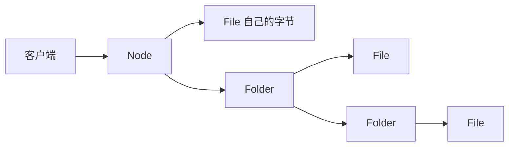
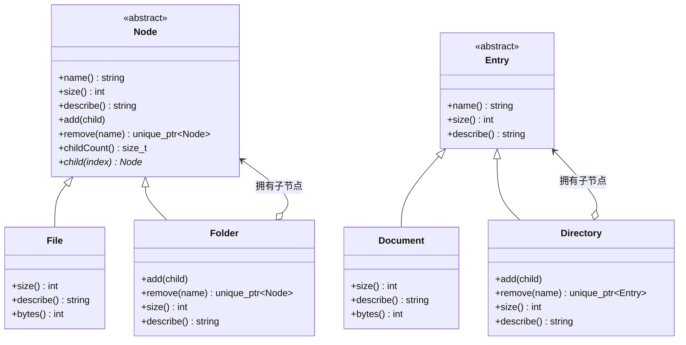
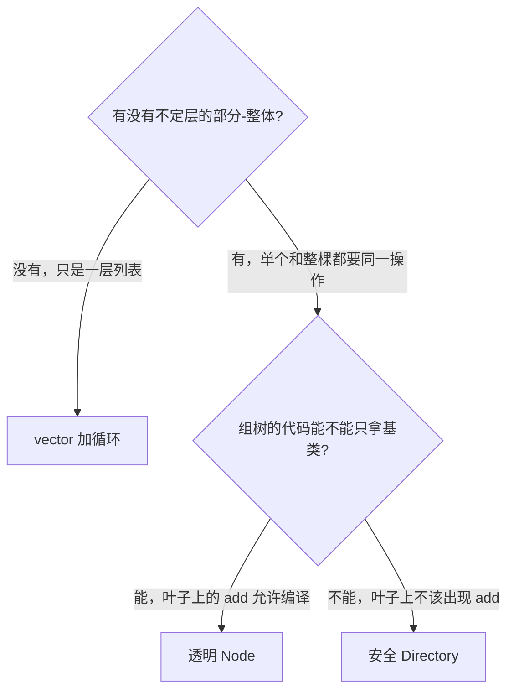
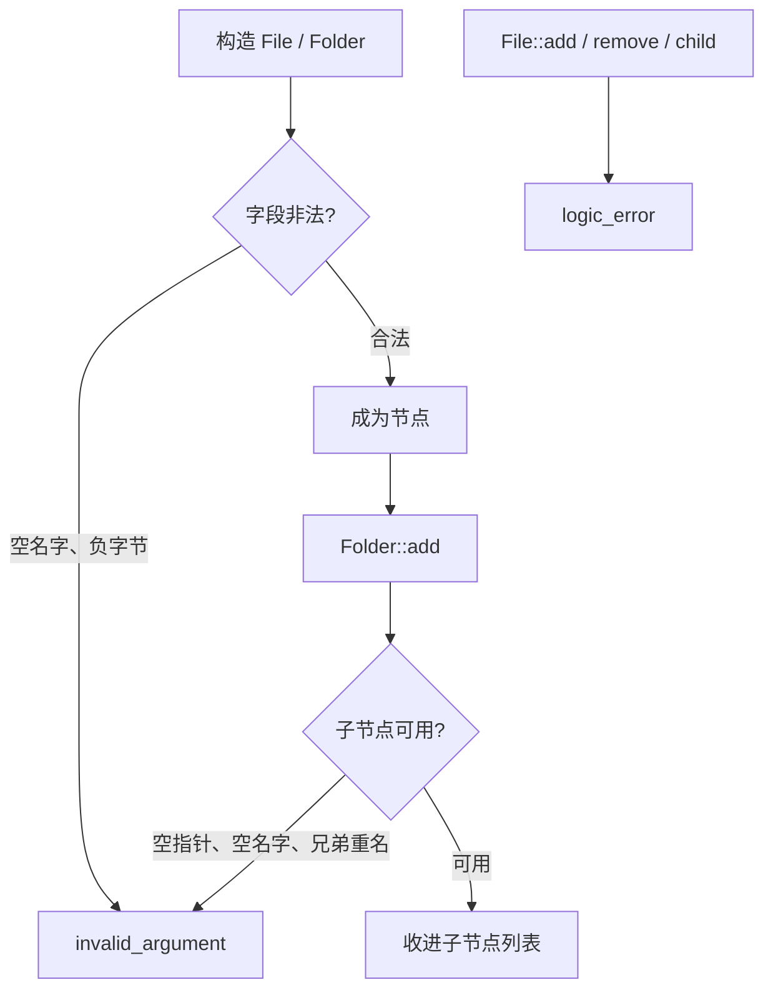
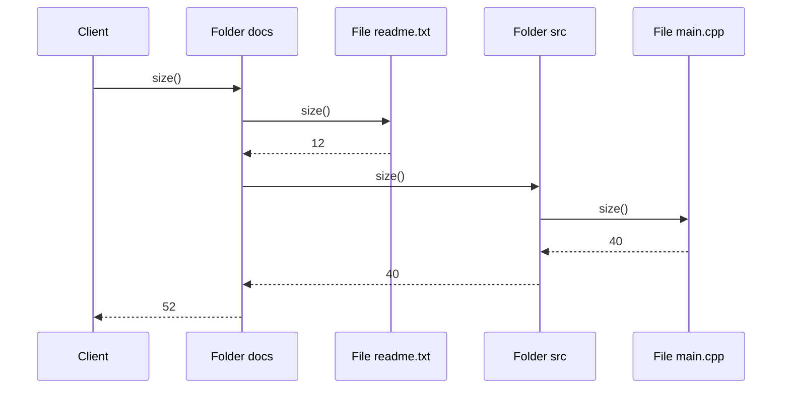
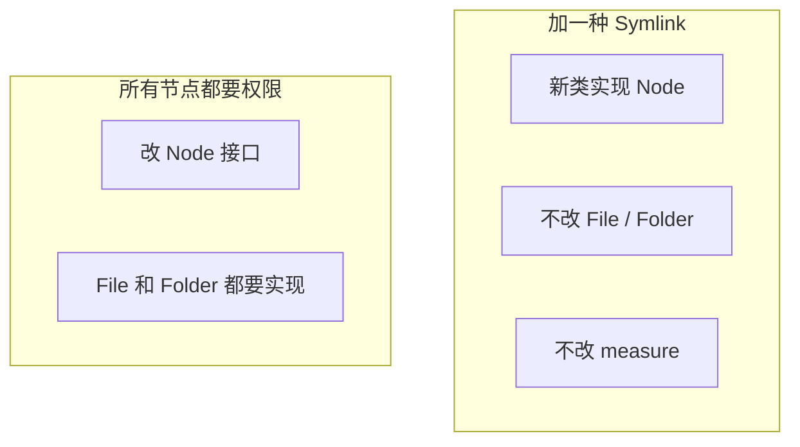
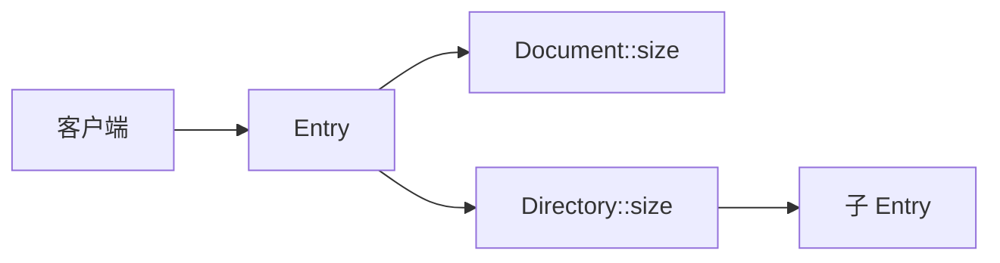
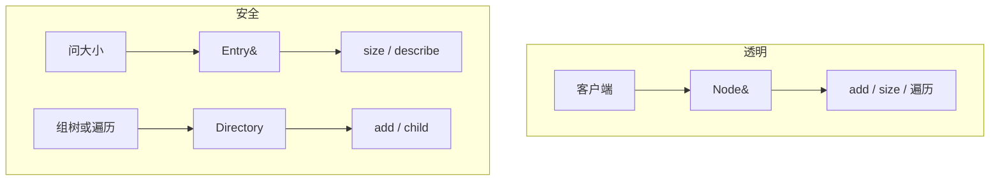
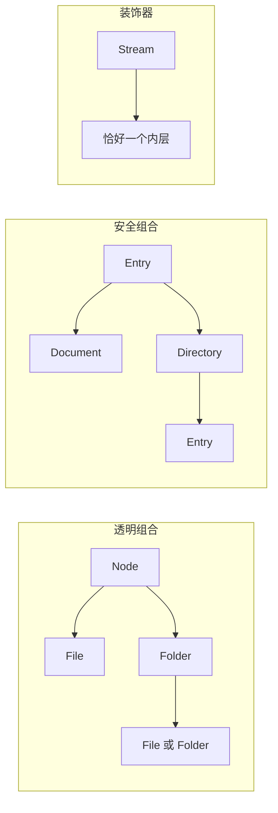

# Composite（组合）

**类型**：Structural（结构型）

**代码位置**：

- 头文件：[`include/structural/composite/composite.h`](../../include/structural/composite/composite.h)
- 实现：[`src/structural/composite/composite.cpp`](../../src/structural/composite/composite.cpp)
- 测试：[`tests/structural/composite_test.cpp`](../../tests/structural/composite_test.cpp)
- 客户端：[`examples/structural/composite/main.cpp`](../../examples/structural/composite/main.cpp)

## 意图

把对象组成**树**，让客户端用同一套操作对待单个对象和整棵子树。

可以把 `size()` 想成资源管理器里的「占用空间」：文件回答自己的字节数，文件夹把里面每一项的占用加起来。点在文件夹上和点在文件上是同一个动作。调用方不会先问「你是文件还是文件夹」，再决定调 `bytes()` 还是自己写一层循环。

本仓库的例子是一棵目录树。透明写法里 `File` / `Folder` 都是 `Node`；安全写法里 `Document` / `Directory` 都是 `Entry`。容器的 `size()` / `describe()` 递归到子节点。



## 适用场景

- **部分和整体要做同一件事**：问大小、列内容、计数。文件是叶子，文件夹里面还可以再有文件夹，层数事先不定
- **调用点不该出现「是不是容器」的分支**：`measure(const Node &)` 对文件和目录都成立
- **加一种节点不该改容器**：以后加 `Symlink`，`Folder` 的 `add` / `size` 不用动，只要新类实现 `Node`

**不适合**：

- 只有一层文件、类型也固定 → `std::vector` 加一个循环就够了
- 同一个节点要出现在两棵子树里，或结构是图 → 组合要求恰好一个父节点。要共享叶子，那是[享元](flyweight.md)
- 给**一个**对象动态加职责，链上始终只有一个内层 → 那是装饰器
- 两边接口对不上，要做翻译 → 那是适配器
- 想用一个新入口盖住一整套互不相同的类 → 那是外观
- 新操作和节点种类都在涨，塞进 `Node` 会改到每一个类 → 那是访问者

## 共同骨架

本仓库两套写法是同一棵目录树，差在**子节点操作放在哪**。GoF 把放在 Component 上的叫透明，只放在容器上的叫安全。透明是 `Node` / `File` / `Folder`；安全是 `Entry` / `Document` / `Directory`。



| 构件 | 作用 |
| ---- | ---- |
| `Node` | 透明组合的 Component。`size` / `describe` 和 `add` / `remove` 都在这 |
| `File` | 叶子。大小是自己的字节数，不覆盖 `add` |
| `Folder` | 容器。持有 `vector<unique_ptr<Node>>`，`size` / `describe` 递归 |
| `Entry` | 安全组合的 Component。只有叶子和容器都说得通的操作 |
| `Document` | 安全组合的叶子。类上没有 `add` |
| `Directory` | 安全组合的容器。`add` / `remove` 是普通成员，不进虚接口 |

两套都能对根问一次大小，得到整棵树的字节数。差别在三件事：**组树时拿不拿得到基类引用、叶子上的 `add` 是编译失败还是运行时抛、往下走子节点要不要 `dynamic_cast`**。



### 为什么叶子和容器必须是同一个接口

差在一件事：**变化点在「这是一个节点还是一整棵子树」，不在「调用方怎么问」。**

如果文件的方法叫 `bytes()`、文件夹叫 `totalSize()`，每个调用点都要先分支。组合把这件事收成一次虚调用。动态绑定发生在 `size()` 上：`File::size()` 返回自己的字节数，`Folder::size()` 把每个子节点的 `size()` 加起来，子节点若还是文件夹就继续往下。

```cpp
int measure(const Node &node) { return node.size(); }
```

递归写在容器里面，不写在客户端里面。`describe()` 同样：叶子是一行，文件夹把自己的名字和每个子节点的 `describe()` 拼成一棵缩进树。

这和 [原型](../creational/prototype.md) 里「通过基类按值拷贝会切片」是同一类约束的另一面。容器若写成 `vector<Node>`，`Folder` 会被切成 `Node`，子节点全部丢掉，而且 `Node` 是抽象类、拷贝已删除，这行代码本来就过不了编译。子节点因此是 `unique_ptr<Node>`。

### 为什么一套把 `add` 放在 `Node` 上，另一套只放在 `Directory` 上

`size()` 对叶子和容器都说得通。`add()` 只对容器说得通。放在哪，就是透明和安全的分界。

透明组合把 `add` / `remove` / `child` 放在 `Node` 上。客户端组树时可以只拿 `Node &`：

```cpp
void attach(Node &parent, std::unique_ptr<Node> child) {
  parent.add(std::move(child));
}
```

`File` 不覆盖 `add`。基类默认实现抛 `std::logic_error`。新叶子自动拒绝收子节点；新容器必须覆盖，否则第一次 `add` 就会抛，不会静默变成一个空壳容器。代价是错误的 `add` **能编译**，要到运行时才发现。

安全组合的 `Entry` 上没有这些方法。`Document` 上调用 `add` 直接编译失败。代价是组树代码必须拿着 `Directory`。手里只有 `Entry &` 时，要往下遍历就得 `dynamic_cast<const Directory *>`。`count_entries` 就是这条路径。

两套都没有第三种行为：叶子的 `add` 静默忽略。那样组树的 bug 会变成一棵缺了一截、却不报错的树。

### 为什么子节点用 `unique_ptr`

容器的职责是**拥有**子树。返回或保存裸指针会把「谁 `delete`」藏在约定里。

```cpp
void add(std::unique_ptr<Node> child);
std::unique_ptr<Node> remove(std::string_view name);
```

`unique_ptr` 还把「恰好一个父节点」写进类型。同一个 `File` 不能同时放进两个 `Folder`，`size()` 不会把一份字节算两次，所有权链也走不回自己，树不会变成带环的图。`remove` 把这棵子树的所有权交回去：对象还活着，父节点的 `size()` 不再算它。

`child()` 返回的是不拥有的观察指针。`vector` 扩容只搬 `unique_ptr`，不搬堆上的节点，所以这个指针在该子节点被 `remove` 之前一直有效。对应测试 `ChildPointerStaysValidAcrossAdds`。若改成 `shared_ptr`，两个父节点可以共享一个孩子，上面这条不变量就没了。要共享的是[享元](flyweight.md)，不是把组合的所有权改松。

名字在构造时定死，没有 `setName`。父节点用名字区分直接子节点；子节点若能事后改名，兄弟之间的唯一性会在容器不知道的情况下坏掉。

### 为什么用 `describe()` / `size()` 而不是 `std::cout`

组合的职责是回答「这棵树有多大、长什么样」。头文件里 `#include <iostream>` 会污染所有翻译单元，打印也无法直接断言。`describe()` 返回 `std::string`，`size()` 返回 `int`，测试写 `EXPECT_EQ`，示例再决定要不要打印。

### 错误和异常：构造时验字段，改树时验结构

非法节点进不了树。字段错误抛 `std::invalid_argument`，叶子上不该出现的结构操作抛 `std::logic_error`，下标越界抛 `std::out_of_range`。



| 时机 | 检查 | 例子 |
| ---- | ---- | ---- |
| 构造 | 单字段非法 | 空 `name`、`bytes < 0`。`0` 字节是空文件，允许 |
| `add` | 子节点非法 | `nullptr`、空名字、同一个父节点下重名 `"readme.txt"` |
| `remove` | 目标不存在 | 空名字、`"missing.txt"` 不是直接子节点 |
| `Folder::child` / `Directory::child` | 下标越界 | 空文件夹上 `child(0)` |
| `Node::add` / `remove` / `child` | 叶子没有子节点 | `File` 上这三件事都抛 `cannot contain children` |
| `size` / `describe` / `childCount` | 不抛 | 空文件夹大小是 `0`，`childCount()` 是 `0` |

`add` 的参数是按值传来的 `unique_ptr`。校验失败时异常抛出，这个 `unique_ptr` 析构，节点被销毁——所有权在进函数时已经交进来了。不同父节点下可以各有一份 `"readme.txt"`，`remove` 只摘掉直接子节点，不递归。

对应测试 `ConstructorsRejectInvalidFields` / `ContainersRejectInvalidStructure` / `LeafRejectsChildOperations`。

---

## 1. 透明组合：`Node` / `File` / `Folder`

GoF 为了「客户端完全一致」更倾向的写法。变化点在「节点的具体种类」，不在「调用方要不要区分叶子和容器」。`File` 和 `Folder` 都能放进只认 `Node &` 的函数，包括 `add`。

### 原理

客户端拿着 `const Node &` 调 `size()` 或 `describe()`，或者拿着 `Node &` 调 `add()`。动态绑定发生在这些虚函数上。`Folder::size()` 不关心子节点是文件还是文件夹，它只对每个孩子再调一次 `size()`。



加一种节点时新增一个 `Node` 的具体类，**不改** `Folder`，也不改 `measure(const Node &)`：



加节点种类符合开放封闭。加**所有节点都要有的新操作**要改抽象，这是组合的经典代价：公共行为写进了 `Node`。那种操作若还会随节点种类单独变化，就该交给访问者，而不是继续往 `Node` 上堆方法。

### 基本构成

| 位置 | 内容 |
| ---- | ---- |
| `Node` | 纯虚 `name` / `size` / `describe`，虚析构，删除拷贝 / 移动 |
| `Node::add` / `remove` / `child` | 默认抛 `logic_error`。叶子不必覆盖 |
| `Node::childCount` | 默认 `0`，这样客户端的循环在叶子上自然结束 |
| `File` | `final`，`size()` 就是字节数 |
| `Folder` | `final`，覆盖子节点操作；`size` / `describe` 递归 |
| `Folder::remove` | 把子树的 `unique_ptr` 交回去，不在容器里销毁 |

| | `size()` / `describe()` | `add()` / `remove()` |
|--|-------------------------|----------------------|
| 是否虚函数 | 纯虚 | 虚，基类有默认实现 |
| 谁真正干活 | 每个具体节点 | 只有 `Folder` 覆盖 |
| 客户端要不要知道具体类 | 不必 | 不必，但叶子会抛 |
| 加新叶子要不要改 | 新写 `size` / `describe` | 不用覆盖，默认就是拒绝 |

`childCount()` 在叶子上返回 `0` 而不是抛：统一遍历靠的就是「没有孩子就不要进循环」。`child(i)` 在叶子上仍然抛，因为任何一个下标都没有对应节点。

```cpp
int count_nodes(const Node &node) {
  int total = 1;
  for (std::size_t i = 0; i < node.childCount(); ++i) {
    total += count_nodes(*node.child(i));
  }
  return total;
}
```

没有「文件夹只加了一半」这条成功路径：`add` 要么把一个已经合法的节点收进来，要么抛、并且那个节点随之销毁。

### 用法

叶子只报告自己（测试 `FileReportsOwnSize`）：

```cpp
File readme("readme.txt", 12);
readme.size();      // 12
readme.describe();  // "File readme.txt 12"
readme.childCount();  // 0
```

文件夹把子树加总（测试 `FolderSumsNestedChildren` / `DescribeKeepsInsertionOrder`）：

```cpp
Folder docs("docs");
docs.add(std::make_unique<File>("readme.txt", 12));
auto src = std::make_unique<Folder>("src");
src->add(std::make_unique<File>("main.cpp", 40));
src->add(std::make_unique<File>("util.h", 8));
docs.add(std::move(src));
docs.size();
// 60
docs.describe();
// Folder docs
//   File readme.txt 12
//   Folder src
//     File main.cpp 40
//     File util.h 8
```

只依赖抽象（测试 `ClientTreatsLeafAndFolderUniformly` / `AddThroughNodeReference`）：

```cpp
File readme("readme.txt", 12);
Folder tree("docs");
tree.add(std::make_unique<File>("readme.txt", 12));
auto src = std::make_unique<Folder>("src");
src->add(std::make_unique<File>("main.cpp", 40));
tree.add(std::move(src));

const Node &as_file = readme;
const Node &as_folder = tree;
measure(as_file);        // 12
measure(as_folder);      // 52
count_nodes(as_file);    // 1
count_nodes(as_folder);  // 4

Folder notes("notes");
Node &as_folder_mut = notes;
as_folder_mut.add(std::make_unique<File>("todo.txt", 6));
```

`remove` 摘下的是同一对象，父节点不再计入它（测试 `RemoveDetachesIndependentSubtree`）。同名文件可以出现在不同父节点下，`remove("readme.txt")` 只摘直接子节点（测试 `SameNameAllowedUnderDifferentParents`）。

拷贝 / 移动已删除，对应测试 `CopyAndMoveAreDeleted`。`File` 上能看见 `add`，对应 `ChildApiVisibility`；调用会抛，对应 `LeafRejectsChildOperations`。

示例 [`examples/structural/composite/main.cpp`](../../examples/structural/composite/main.cpp) 的前两段就是这条路径：先对根问大小和节点数，再演示 `Node &` 上的 `add` 对文件夹成立、对文件抛异常。

### 特点

- 客户端对根调一次 `size()` / `describe()`，递归留在 `Folder` 里
- 符合开放封闭的方向是**加一种节点**：加 `Symlink`，不改 `Folder` 和 `measure`
- `add` 对 `File` 可见，所以透明是运行时约束，不是编译期约束
- 每个节点恰好一个父节点，**不是**可以随意共享的图
- 加**所有节点共用的新操作**必须改 `Node` 和每个具体类
- 观察指针 `child()` 不拥有对象；要拿走子树用 `remove()`

---

## 2. 对照：安全组合 `Entry` / `Document` / `Directory`

同一棵目录树的另一种边界。上一节为了让 `Node &` 也能组树，把 `add` 放进了公共接口。这一节把 `add` / `remove` / `child` 从基类拿掉，只留在 `Directory` 上。GoF 把这种写法叫安全组合：叶子上不该出现的操作，编译期就没有。

它对应原型笔记里的 `UnitSpec`：当调用方**已经知道**具体种类时，就不要再为这个种类付出多态的代价。组树的人本来就拿着容器；问大小的人仍然只拿 `Entry &`。

### 原理

`Entry` 只有 `name()` / `size()` / `describe()`。`Document::size()` 返回字节数，`Directory::size()` 仍是对子节点递归求和。动态绑定只发生在这些两边都说得通的操作上。



往树上挂节点必须是 `Directory` 的静态类型。`Entry &` 上没有 `add`，`Document` 上也没有。要自己写遍历，就得先认出容器：



### 基本构成

| 位置 | 内容 |
| ---- | ---- |
| `Entry` | 纯虚 `name` / `size` / `describe`，删除拷贝 / 移动 |
| `Document` | `final` 叶子，类上没有子节点操作 |
| `Directory::add` / `remove` / `child` | 普通成员，不是虚函数，也不在 `Entry` 上 |
| 校验 | 与 `Folder` 同一套：空指针、空名字、兄弟重名、越界 |

```cpp
Directory archive("docs");
archive.add(std::make_unique<Document>("readme.txt", 12));
const Entry &as_archive = archive;
as_archive.size();
// as_archive.add(...)  编译失败
```

`Directory` 不是用来被再派生的，所以这些方法不必放进虚接口。容器内部的递归仍然通过 `Entry::size()` / `describe()` 发生，子节点可以是 `Document`，也可以是另一个 `Directory`。

空名字、负字节同样 `throw`，对应 `ConstructorsRejectInvalidFields`。子节点操作在谁身上，对应 `ChildApiVisibility` 里的 `HasEntryAdd<Document>` 为假。

### 用法

通过基类问整棵树（测试 `SafeClientMeasuresThroughEntry`）：

```cpp
Directory docs("docs");
docs.add(std::make_unique<Document>("readme.txt", 12));
auto src = std::make_unique<Directory>("src");
src->add(std::make_unique<Document>("main.cpp", 40));
src->add(std::make_unique<Document>("util.h", 8));
docs.add(std::move(src));

const Entry &as_dir = docs;
as_dir.size();  // 60
```

自己遍历必须认出 `Directory`（测试 `SafeWalkCastsToDirectory`）：

```cpp
int count_entries(const Entry &entry) {
  int total = 1;
  if (const auto *directory = dynamic_cast<const Directory *>(&entry)) {
    for (std::size_t i = 0; i < directory->childCount(); ++i) {
      total += count_entries(*directory->child(i));
    }
  }
  return total;
}
```

示例第三段就是这条路径：树仍然用 `add` 搭好，问大小时换成 `Entry &`。

### 特点

- `Document` 上不存在 `add`，错误的组树在编译期就被拦住
- `size()` / `describe()` 仍然统一，问大小的客户端不用分支
- 组树、按下标访问、手写遍历都要具体的 `Directory`
- 加一种叶子同样只加一个类；加一种公共查询仍然要改 `Entry`
- 类型已经区分了「谁是容器」时很合适。要连组树都只拿基类引用，用上一节的 `Node`

---

## 总对照

| 写法 | 单个和整体 | 谁能 `add` | 加一种节点 | 推荐场景 |
| ---- | ---------- | ---------- | ---------- | -------- |
| 调用点自己 `if` | 不统一 | 每个调用点 | 改所有分支 | 结构只有一两处，而且不再变 |
| `vector<File>` 一层 | 没有嵌套 | 那个 `vector` | 要嵌套就得改类型 | 没有子文件夹 |
| **透明组合** | **同一套 `Node` 操作** | **任何 `Node &`，叶子抛** | 加一个具体类 | 组树和查询都不该分叶子 / 容器 |
| **安全组合** | **`size` / `describe` 统一** | **只有 `Directory`** | 加一个具体类 | 组树代码本来就拿着容器 |
| 装饰器 | 一条链，始终一个内层 | 不收一组子节点 | 加一个装饰器 | 给一个对象叠职责 |
| 享元 | 叶子可以共享 | 共享的是状态，不是树的所有权 | 加一种共享单元 | 大量叶子长得一样 |



再记三点，和具体类名无关，但最容易混：

1. **组合是树，装饰器是链。** 两者都让外层和内层实现同一个接口。装饰器始终持有一个内层，叠的是职责；组合持有零个或多个子节点，叠的是结构。`Folder` 的 `size()` 会问每一个孩子，`EncryptedStream` 的 `write()` 只会转发给下一层。
2. **透明和安全分的是 `add` 的位置，不是 `size` 的位置。** 两边都说得通的操作留在基类上，组合才成立。只对容器有意义的操作，放进基类就是透明，留在容器上就是安全。叶子的 `add` 静默成功会把失败藏起来，本仓库不这么做。
3. **递归属于容器，新操作不一定属于 `Node`。** 客户端对根调一次即可。如果节点种类和操作种类同时在增加，继续给 `Node` 加虚函数会改到每一个具体类；那种变化方向是访问者。

和其它结构型模式的边界：

| 模式 | 接口关系 | 目的 |
| ---- | -------- | ---- |
| Composite | 同一接口组成树 | 单个对象和一组对象可以互换 |
| Decorator | 同一接口包一层 | 动态加职责 |
| Proxy | 同一接口包一层 | 控制这次访问让不让发生 |
| Adapter | 两边接口不同 | 把旧接口翻译成客户端要的 |
| Facade | 新入口盖住一堆旧接口 | 把多步用例收成一次调用 |
| Flyweight | 叶子状态可以共享 | 让大量细小对象省掉重复数据 |

## 怎么选

```text
有没有不定层的部分-整体，而且单个和整体要做同一件事？
  └─ 没有
        └─ 一层、类型固定 → vector
        └─ 只是给一个对象加职责 → 装饰器
        └─ 接口对不上 → 适配器
  └─ 有
        └─ 组树也要只拿基类引用 → Node / File / Folder
        └─ 叶子上不该出现 add，组树代码拿着容器 → Entry / Document / Directory
        └─ 叶子要在多处共享 → 先保留这棵树的唯一所有权，共享的那部分状态再考虑[享元](flyweight.md)
```

`child()` 交出去的是观察指针。要把子树拿到别的父节点下，用 `remove()` 取回 `unique_ptr`，再 `add` 给新的容器。

## 参考

- 《设计模式：可复用面向对象软件的基础》（GoF）：Composite。透明与安全是书里对子节点操作放在哪的两种处理
- [Decorator（装饰器）](decorator.md)：同一接口的一条链 vs 同一接口的一棵树
- [Facade（外观）](facade.md)：简化一组互不相同的类 vs 统一一组相同接口的节点
- [Adapter（适配器）](adapter.md)：翻译接口 vs 递归结构
- [Proxy（代理）](proxy.md)：控制访问 vs 表达部分-整体
- [Flyweight（享元）](flyweight.md)：共享的是不变状态，不是树节点的所有权
- [Prototype（原型）](../creational/prototype.md)：通过基类按值拷贝会切片；组合用 `unique_ptr` 避开同样的问题
- [Visitor（访问者）](../behavioral/visitor.md)：操作种类比节点种类变得更快时，把操作从 `Node` 上挪走
- 《Effective C++》条款 18：让接口容易正确使用、难以误用（所有权写进 `unique_ptr`）
- `std::unique_ptr` / `std::make_unique`（容器拥有子树）
