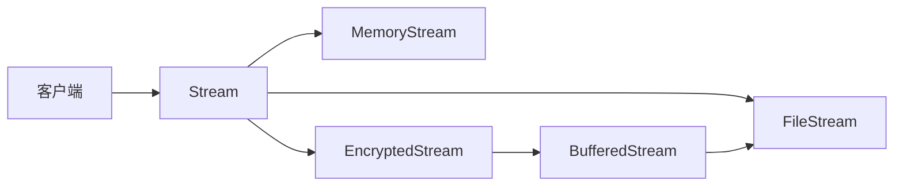
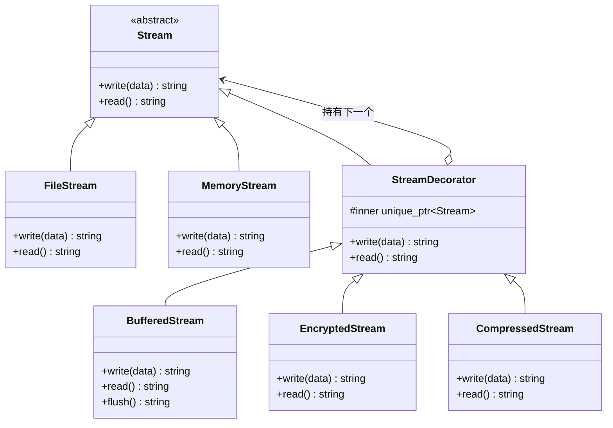
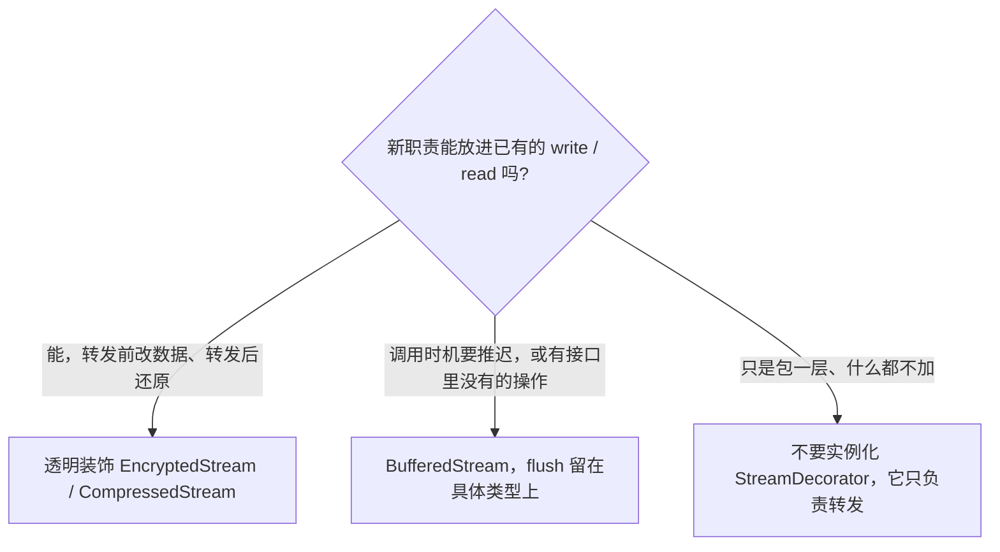
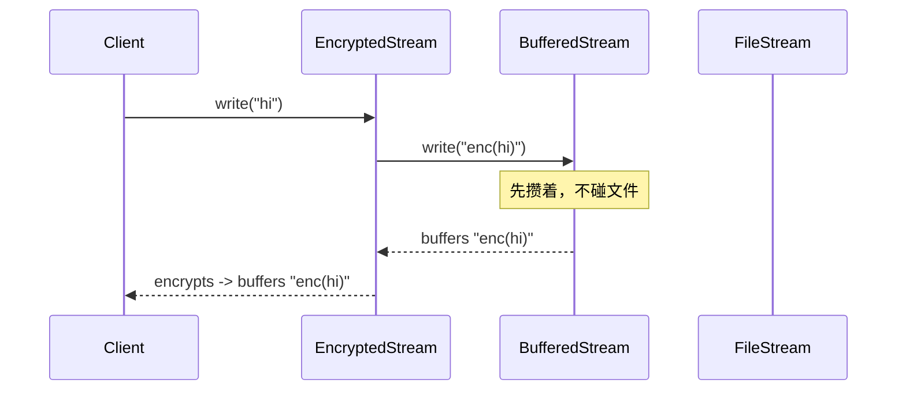
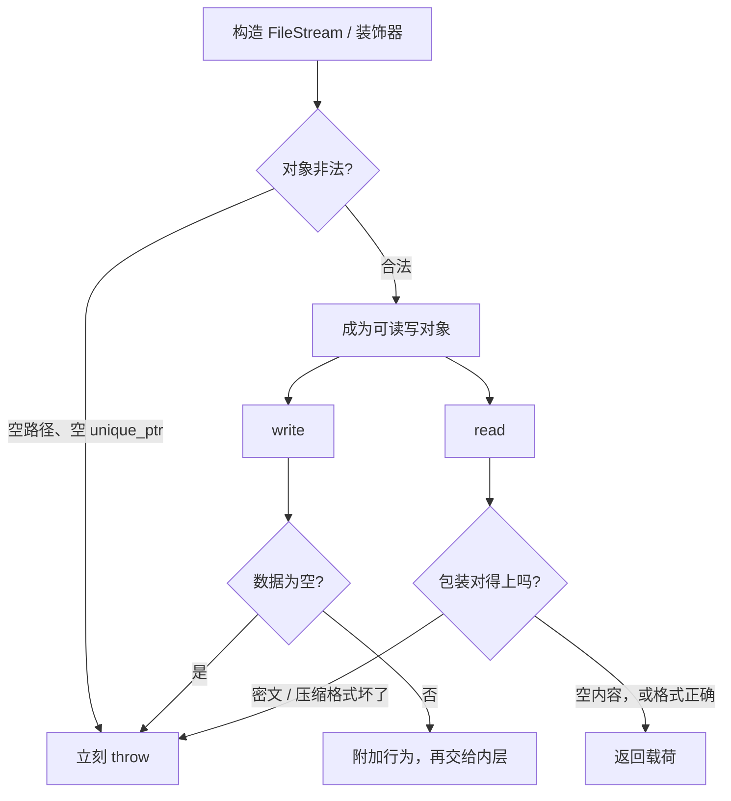
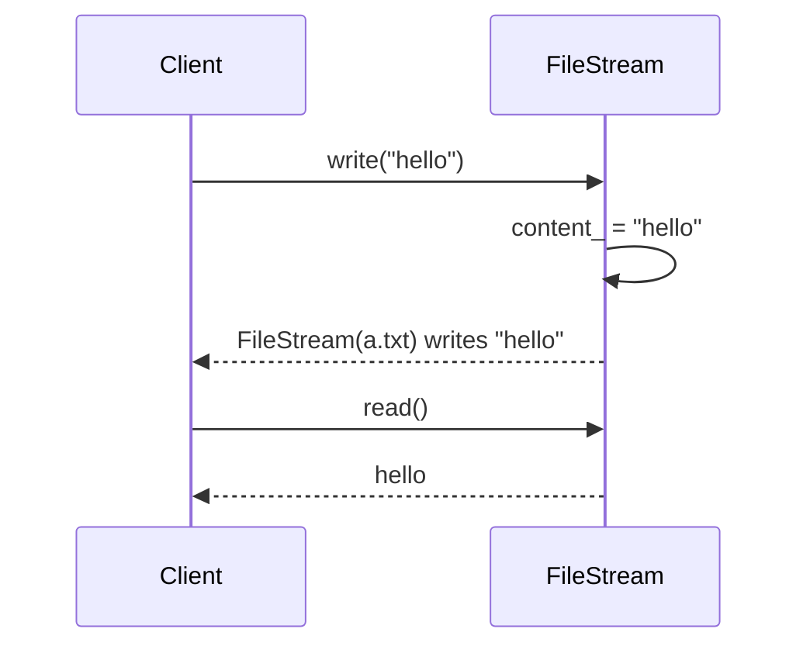
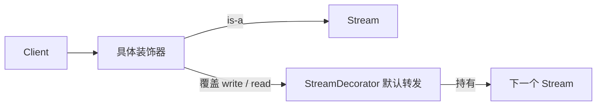
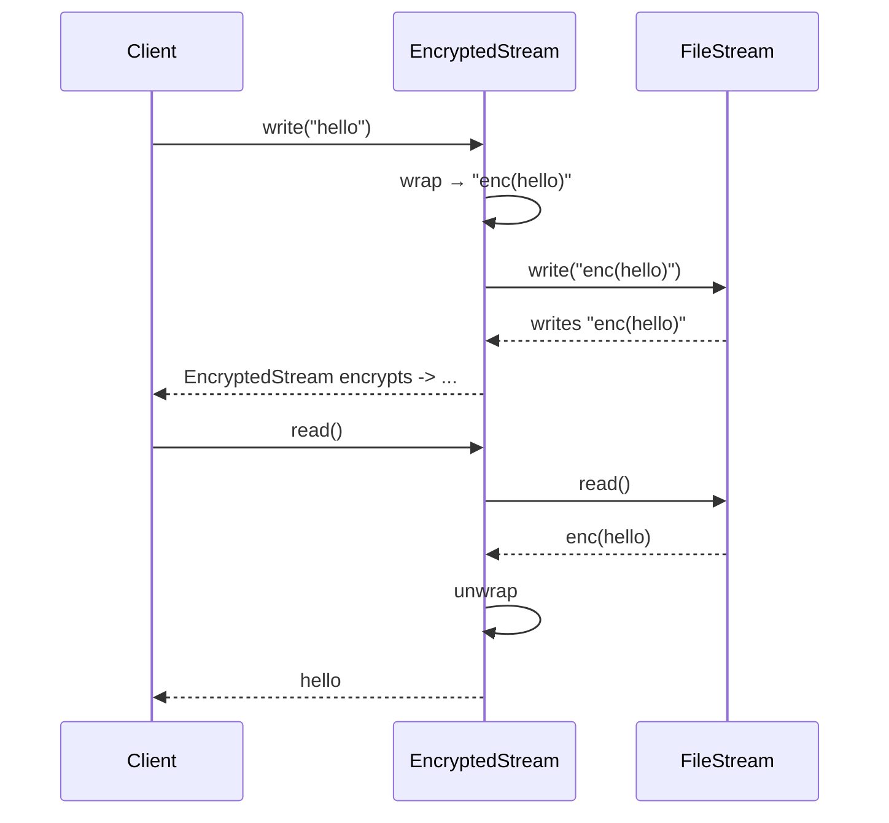
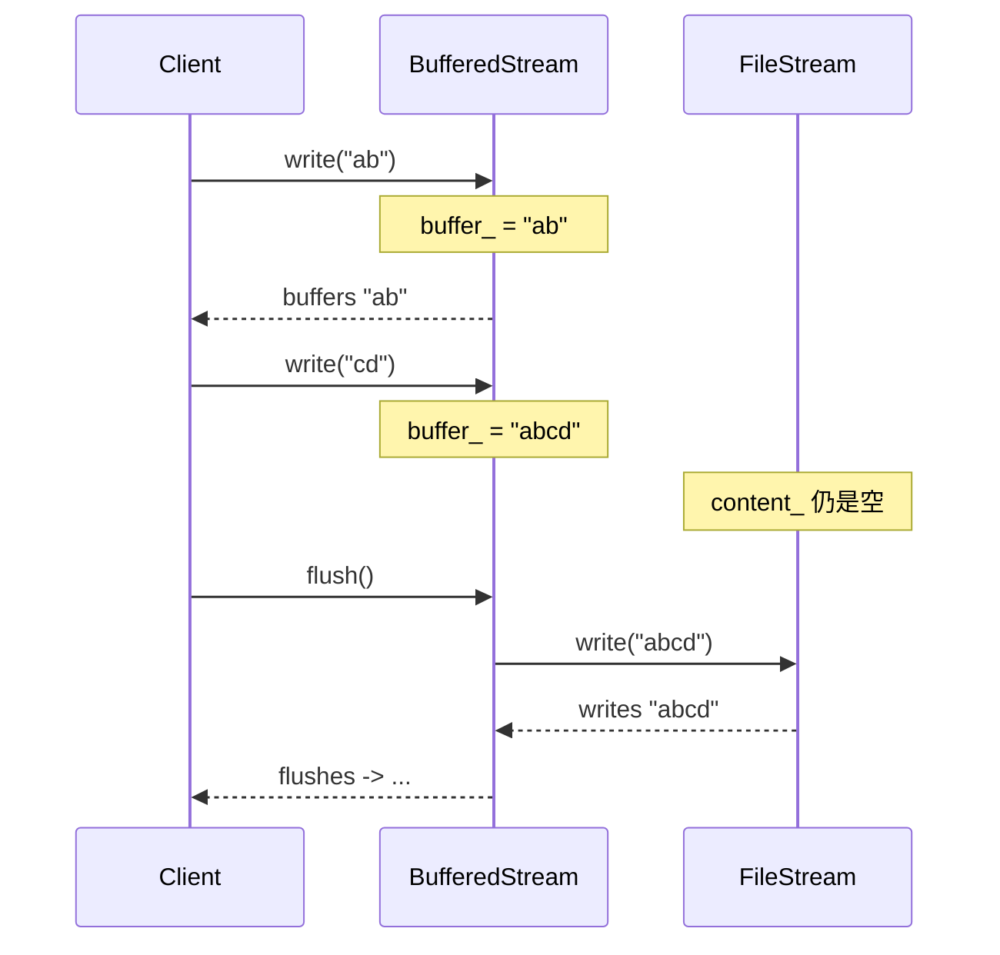
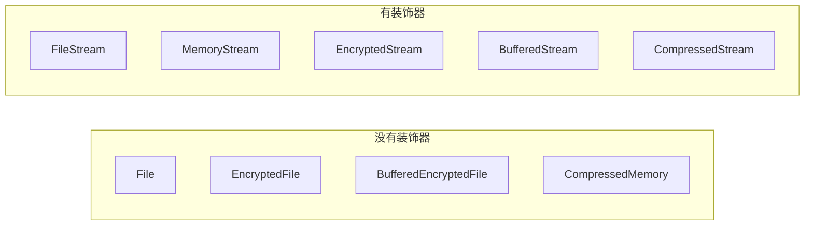

# Decorator（装饰器）

**类型**：Structural（结构型）

**代码位置**：

- 头文件：[`include/structural/decorator/decorator.h`](../../include/structural/decorator/decorator.h)
- 实现：[`src/structural/decorator/decorator.cpp`](../../src/structural/decorator/decorator.cpp)
- 测试：[`tests/structural/decorator_test.cpp`](../../tests/structural/decorator_test.cpp)
- 客户端：[`examples/structural/decorator/main.cpp`](../../examples/structural/decorator/main.cpp)

## 意图

在不改原类、也不靠子类爆炸的前提下，给对象动态叠上额外职责。装饰器和被装饰对象实现同一个接口，客户端拿着 `Stream&` 分不出手里是裸流还是套了好几层。

可以把 `Decorator` 想成给一杯咖啡加料：杯子还是那只杯子（`Stream`），浓缩是核心（`FileStream` / `MemoryStream`），牛奶、糖浆是一层层套上去的（`BufferedStream`、`EncryptedStream`、`CompressedStream`）。加料的顺序会改变最后的味道，喝的时候用的还是同一个动作。

本仓库的例子是文本流。客户端只调 `write` / `read`。缓冲、加密、压缩都是后包上去的，核心流类一行都不用改。



## 适用场景

- **职责要运行时组合**：有的流要加密，有的要压缩，有的两个都要，还有的再加缓冲。组合数量事先数不清
- **不能改核心类**：`FileStream` 已经在用，不想为每种搭配再派生一个子类
- **客户端已经依赖 Component**：调用点只认 `Stream&`，加一层装饰不能改调用点

**不适合**：

- 两边接口不一样，要做翻译 → 那是适配器
- 接口一样，只是想控制访问（懒加载、权限、远程占位）→ 那是代理
- 想藏起一整套子系统 → 那是外观
- 职责是固定的几步、编译期就排好顺序 → 普通函数或模板方法更直接
- 装饰器要加的操作 Component 接口里根本没有，而且每个调用点都得用到它 → 先考虑把操作放进接口，或别用装饰器硬塞

## 共同骨架

核心流和装饰器都是 `Stream`。装饰器基类持有下一个 `Stream`，具体装饰器在转发前后加上自己的那一步。



| 构件 | 作用 |
| ---- | ---- |
| `Stream` | Component。客户端只认 `write` / `read` |
| `FileStream` / `MemoryStream` | ConcreteComponent。真正把字节留下来的对象 |
| `StreamDecorator` | 装饰器基类。持有 `unique_ptr<Stream>`，默认原样转发 |
| `BufferedStream` | 先攒在缓冲区里，`flush` 或 `read` 时才写进内层 |
| `EncryptedStream` | 写出前套上 `enc(...)`，读回时拆掉 |
| `CompressedStream` | 写出前套上 `zip(...)`，读回时拆掉。用来和加密对照叠加顺序 |

少了装饰器，每一种搭配都是一个类：`File`、`BufferedFile`、`EncryptedFile`、`BufferedEncryptedFile`、`EncryptedCompressedMemory`……n 种职责是 2^n 个类。有了装饰器，2 个核心流加 3 个装饰器，任意嵌套都是现成的。

三种具体装饰器共用同一个基类，差在**附加行为放在调用的哪一侧**：



### 为什么必须和内层是同一个接口

差在一件事：**变化点在「这份流还多做了什么」，不在「调用方怎么用它」。**

如果加密流的方法叫 `writeEncrypted`，每个调用点都要知道自己手里是不是加密流。装饰器让调用点保持：

```cpp
void round_trip(Stream &stream, std::string_view data) {
  stream.write(data);
  stream.read();
}

FileStream plain("notes.txt");
EncryptedStream encrypted(std::make_unique<MemoryStream>());
round_trip(plain, "hello");
round_trip(encrypted, "hello");
```

`FileStream` 和 `MemoryStream` 都在，是为了说明装饰器依赖的是 `Stream`，不是某一个具体类。同一套 `EncryptedStream` 包文件、包内存都可以。

这也是它和对象适配器看起来像、实际上分开的地方。两边都是「外层拿着一个对象，调用前动一下数据再转给它」：

| | 对象适配器 | 装饰器 |
| ---- | ---------- | ------ |
| 自己的类型 | `MediaPlayer` | `Stream` |
| 手里对象的类型 | `LegacyPlayer`，另一个接口 | `Stream`，同一个接口 |
| 转发调用 | `play` → `playWav` | `write` → `write` |
| 中间那一步 | 把调用翻译成对方听得懂的形式，否则这次调用发生不了 | 在同名操作上追加职责；去掉这一层，内层自己也能被客户端用 |
| 再套一层 | 套不上。外层要的是 `LegacyPlayer`，里层交出来的是 `MediaPlayer` | 套得上。每一层都是 `Stream` |

### 为什么用 `unique_ptr<Stream>`，构造放在 protected

装饰器要**拥有**下一层。`unique_ptr` 把所有权写进签名：外层析构时，里面的流一起释放。裸指针分不清是借来看还是交给你管。

`StreamDecorator` 的构造函数是 `protected`。它自己只做转发，客户端应该 `make_unique<EncryptedStream>(...)`，而不是直接构造一个空装饰器。具体装饰器把 `unique_ptr<Stream>` 交给基类，基类拒绝 `nullptr`。

`Stream` 是多态基类，拷贝会切片，所以拷贝 / 移动 **`= delete`**。子类不用再写一遍，编译器会把它们的拷贝 / 移动也删掉。虚析构必须留着：`unique_ptr<Stream>` 析构时走的是 `Stream::~Stream()`。对应测试 `CopyAndMoveAreDeleted` / `InheritanceAndConvertibility`。

### 为什么 `write()` 返回描述字符串，`read()` 返回载荷

`write()` 要让测试看见**谁先谁后**。返回值是一整条调用链，例如：

```text
EncryptedStream encrypts -> BufferedStream buffers "enc(hi)"
```

`read()` 返回的是客户端真正想要的数据。加密、压缩对只拿 `Stream&` 的人是透明的：写进去 `"hi"`，读出来还是 `"hi"`。落地字节要另拿内层指针看，测试 `EncryptedStreamIsTransparentButStoresCiphertext` 就是这么拆开的。

头文件里不 `#include <iostream>`。打印留在示例里。

### 后包上的先执行 `write`

客户端拿到的永远是最外层那只指针。`write` 从外往里走：外层先改数据，再交给内层。

```cpp
auto file = std::make_unique<FileStream>("a.txt");
auto buffered = std::make_unique<BufferedStream>(std::move(file));
std::unique_ptr<Stream> stream =
    std::make_unique<EncryptedStream>(std::move(buffered));
stream->write("hi");
```



`read` 也是外层先被调用，但外层要先问内层要字节，再做自己的逆变换。所以数据是从里往外还原的：文件里的 `enc(hi)` 先被缓冲层读出，再被加密层拆成 `hi`。

### 错误和异常：构造时验对象，读写时验数据

非法状态进不了对象。规则抛 `std::invalid_argument`。



| 时机 | 检查 | 例子 |
| ---- | ---- | ---- |
| `FileStream` 构造 | 空路径 | `""` |
| 装饰器构造 | 空内层 | `nullptr` |
| `write` | 空数据 | `""` |
| `EncryptedStream::read` / `CompressedStream::read` | 内层字节对不上包装 | 文件里是明文 `hello`，外面却套了加密流 |

空流 `read()` 返回空字符串，不抛。还没写过的文件就是空的。对应测试 `RejectsInvalidOperations`。

---

## 1. 具体组件：`FileStream` / `MemoryStream`

这是被装饰的对象。装饰器模式成立，前提是先有一个不带附加职责、本身就能用的 `Stream`。

### 原理

`write` 把字节留在对象自己身上，`read` 把留下来的字节交回去。动态绑定发生在 `Stream` 上：装饰器只调用 `inner().write()` / `inner().read()`，代码里看不到 `FileStream` 或 `MemoryStream` 这两个名字。

`write` 覆盖已有内容，不是追加。多次追加发生在 `BufferedStream` 的缓冲区里，刷下去时一次交给内层。



两个具体类的差别只在描述字符串里有没有路径。同一套装饰器因此可以包住任何一种核心流。

### 基本构成

| 位置 | 内容 |
| ---- | ---- |
| `Stream` | 纯虚 `write()` / `read()`，虚析构，删除拷贝 / 移动 |
| `FileStream` | `final`，构造收路径，`write` 覆盖 `content_` |
| `MemoryStream` | `final`，没有路径，行为与文件流相同 |
| `path()` | 只在 `FileStream` 上，用来让测试和描述字符串对上文件名 |

```cpp
std::string FileStream::write(std::string_view data) {
  content_ = require_data(data);
  return "FileStream(" + path_ + ") writes " + quote(content_);
}

std::string FileStream::read() { return content_; }
```

`MemoryStream::write` 同样覆盖 `content_`，返回值是 `MemoryStream writes "..."`。

### 用法

写完再覆盖（测试 `FileStreamWritesAndReads`）：

```cpp
FileStream file("a.txt");
file.write("hello");  // "FileStream(a.txt) writes \"hello\""
file.read();          // "hello"
file.write("next");   // 覆盖，read() 得到 "next"
```

同接口的第二种核心流（测试 `MemoryStreamUsesTheSameInterface`）：

```cpp
MemoryStream memory;
memory.write("hello");  // "MemoryStream writes \"hello\""
memory.read();          // "hello"
```

空路径、空数据会抛异常。客户端把它们放进 `Stream&` 时，调用点和套了装饰器的流是同一个，对应 `ClientDependsOnStreamAbstraction`。

### 特点

- 职责只有「把字节留下来」。加密、压缩、缓冲都不写在这里
- 装饰器通过 `Stream&` 调用它们，加一种核心流不必改任何装饰器
- `write` 是覆盖。要把多次 `write` 拼成一次落地，用 `BufferedStream`
- 拷贝 / 移动已删除。多态基类按值传递会切片

---

## 2. 装饰器基类：`StreamDecorator`

GoF 里 Decorator 既继承 Component，又组合一个 Component。继承是为了能放进 `Stream&`，组合是为了把调用交给下一层。

### 原理

基类不添加职责。`write` / `read` 的默认实现就是转发给 `inner_`。具体装饰器覆盖其中一侧或两侧，在转发前或转发后插入自己的步骤；没覆盖的那一侧继续用基类。

构造放在 `protected`，是为了不让客户端直接拿到一个「什么都不做的包装」。空包装多一次间接调用，不改变行为，也表达不出「叠了哪份职责」。



加一种职责的步骤因此是：新建一个 `StreamDecorator` 子类，不改 `FileStream`，也不改已有装饰器。测试里的 `MarkingStream` 只覆盖 `write`，`read` 走基类，对应 `NewDecoratorForwardsThroughTheBase`。

### 基本构成

| 位置 | 内容 |
| ---- | ---- |
| 公有继承 `Stream` | 客户端当 Component 用 |
| `inner_` | `unique_ptr<Stream>`，构造时拒绝 `nullptr` |
| 构造函数 | `protected`。只有子类能创建 |
| `inner()` | `protected`，给子类拿下一层，不暴露给客户端 |
| `write()` / `read()` | 默认原样转发，子类按需覆盖 |

```cpp
class StreamDecorator : public Stream {
public:
  std::string write(std::string_view data) override;
  std::string read() override;

protected:
  explicit StreamDecorator(std::unique_ptr<Stream> inner);
  Stream &inner();

private:
  std::unique_ptr<Stream> inner_;
};
```

```cpp
std::string StreamDecorator::write(std::string_view data) {
  return inner().write(data);
}
```

### 用法

库外面新增一层，只改自己要改的操作（测试 `NewDecoratorForwardsThroughTheBase`）：

```cpp
class MarkingStream final : public StreamDecorator {
public:
  explicit MarkingStream(std::unique_ptr<Stream> inner)
      : StreamDecorator(std::move(inner)) {}

  std::string write(std::string_view data) override {
    return "MarkingStream -> " + StreamDecorator::write(data);
  }
};

MarkingStream marking(std::make_unique<FileStream>("a.txt"));
marking.write("hi");  // "MarkingStream -> FileStream(a.txt) writes \"hi\""
marking.read();       // "hi"，走基类转发
```

`MarkingStream` 写在测试里，不在头文件里。它说明开放封闭的方向是**加子类**，不是改 `Stream` 或 `FileStream`。

### 特点

- 一份「持有 + 转发」写在基类，具体装饰器只写差异
- 子类可以只覆盖 `write` 或只覆盖 `read`
- 客户端拿不到 `inner_`，下一层的具体类型不会从装饰器漏出去
- 基类本身不是一份职责。业务代码叠的是 `EncryptedStream` 这类子类
- 多一个对象、一次间接调用。职责要叠加时，这个成本是模式本身的代价

---

## 3. 透明装饰：`EncryptedStream` / `CompressedStream`

这两层不改变 `Stream` 的用法，只改变落地字节。包装格式故意写成可读的 `enc(...)` / `zip(...)`，测试才能直接断言密文，而不是去对一组看不懂的字节。

### 原理

`write` 先把数据包起来，再交给 `inner().write()`。`read` 先问内层要字节，再拆包装。只拿 `Stream&` 的客户端写 `"hello"`、读 `"hello"`；内层流里留下来的是 `enc(hello)` 或 `zip(hello)`。



动态绑定在两侧都会发生。外层装饰器不知道内层是文件、内存，还是另一个装饰器。所以同一种装饰器可以叠两次，两种装饰器也可以互换内外顺序。

外层先改 `write` 进来的数据：

| 嵌套（左为外层） | `write` 的顺序 | 落地 |
| ---------------- | -------------- | ---- |
| `Encrypted(Compressed(File))` | 先加密，再压缩 | `zip(enc(hi))` |
| `Compressed(Encrypted(File))` | 先压缩，再加密 | `enc(zip(hi))` |

两种嵌套 `read` 都得到 `hi`。顺序是使用时要显式决定的，类型系统不会帮你排。对应 `StackOrderChangesStoredBytes`。

### 基本构成

| 位置 | 内容 |
| ---- | ---- |
| `EncryptedStream` | `final`，`write` 套 `enc(...)`，`read` 拆掉 |
| `CompressedStream` | `final`，`write` 套 `zip(...)`，`read` 拆掉 |
| `wrap` / `unwrap` | 文件内部的辅助函数，不放进 `Stream` |
| 空内容 | `unwrap` 得到空字符串，不抛 |
| 对不上的包装 | `read` 抛 `invalid enc payload` 或 `invalid zip payload` |

```cpp
std::string EncryptedStream::write(std::string_view data) {
  const std::string cipher = wrap("enc", require_data(data));
  return "EncryptedStream encrypts -> " + inner().write(cipher);
}

std::string EncryptedStream::read() { return unwrap(inner().read(), "enc"); }
```

`CompressedStream` 的形状一样，标签换成 `zip`，描述换成 `compresses`。

### 用法

对客户端透明、对字节不透明（测试 `EncryptedStreamIsTransparentButStoresCiphertext`）：

```cpp
auto file = std::make_unique<FileStream>("a.txt");
FileStream *raw = file.get();
EncryptedStream encrypted(std::move(file));

encrypted.write("hello");
encrypted.read();  // "hello"
raw->read();       // "enc(hello)"
```

`raw` 能看到密文，是因为测试在移交所有权之前留了指针。客户端代码只拿 `Stream&` 时，看不到这层差别。

压缩包在内存流上，说明装饰器不绑死某一种核心流（测试 `CompressedStreamIsTransparentButStoresPackedBytes`）：

```cpp
CompressedStream compressed(std::make_unique<MemoryStream>());
compressed.write("hello");
compressed.read();  // "hello"
```

同一种装饰器叠两次（测试 `SameDecoratorCanBeStacked`）：

```cpp
std::unique_ptr<Stream> twice = std::make_unique<EncryptedStream>(
    std::make_unique<EncryptedStream>(std::make_unique<FileStream>("a.txt")));
twice->write("hi");  // 落地 "enc(enc(hi))"
twice->read();       // "hi"
```

换内外顺序（测试 `StackOrderChangesStoredBytes`）：

```cpp
std::unique_ptr<Stream> encrypt_outside = std::make_unique<EncryptedStream>(
    std::make_unique<CompressedStream>(std::make_unique<FileStream>("a.txt")));
encrypt_outside->write("hi");  // 落地 "zip(enc(hi))"
encrypt_outside->read();       // "hi"
```

内层是明文、外层却是加密流时，`read` 抛 `invalid enc payload`。空数据在 `write` 里就抛，不会写成 `enc()`。

示例 [`examples/structural/decorator/main.cpp`](../../examples/structural/decorator/main.cpp) 里，`round_trip` 只收 `Stream&`。裸文件流、加密过的内存流、压缩过的文件流走的是同一个函数。

### 特点

- 接口与内层完全一致，客户端不必知道这一层的存在
- 可以叠在任何 `Stream` 上，包括另一个装饰器，也包括同一种装饰器自己
- 叠加顺序会改变落地字节。先包上的更靠近核心流，后包上的先处理 `write`
- `read` 必须是 `write` 的逆操作，否则透明性不成立
- 包装格式是教学用的可读文本。换成真正的加密或压缩，调用形状不变，变的是 `wrap` / `unwrap`

---

## 4. 推迟转发的装饰：`BufferedStream`

缓冲有一个 Component 接口里没有的动作：`flush()`。`write` 当时也不调用内层。这是装饰器最容易踩的点。

### 原理

`write` 把数据拼进自己的 `buffer_`，内层流保持原样。`flush` 才把整段缓冲区一次交给 `inner().write()`，然后清空缓冲区。`read` 发现缓冲区还有数据，会先 `flush` 再读内层，所以只拿 `Stream&` 的客户端 `write` 之后立刻 `read`，仍然拿得到自己写过的内容。



和加密叠在一起时，谁在外层谁先动手。加密在外、缓冲在内：

```text
write:  EncryptedStream encrypts -> BufferedStream buffers "enc(hi)"
flush:  BufferedStream flushes -> FileStream(a.txt) writes "enc(hi)"
read:   "hi"
```

密文先待在缓冲区里，刷下去之后文件里才是 `enc(hi)`。对应 `OutermostDecoratorRunsBeforeInnerOnes`。

### 基本构成

| 位置 | 内容 |
| ---- | ---- |
| `buffer_` | 多次 `write` 拼在这里，`flush` 前不碰内层 |
| `write()` | 只追加缓冲区，返回 `buffers "..."` |
| `flush()` | 不在 `Stream` 上。空缓冲返回 `flushes nothing`；否则一次写进内层 |
| `read()` | 缓冲区非空时先 `flush`，再 `inner().read()` |
| 失败时 | `inner().write` 成功之后才 `buffer_.clear()`，写失败不会把待写数据丢掉 |

```cpp
std::string BufferedStream::write(std::string_view data) {
  buffer_.append(require_data(data));
  return "BufferedStream buffers " + quote(data);
}

std::string BufferedStream::flush() {
  if (buffer_.empty()) {
    return "BufferedStream flushes nothing";
  }
  const std::string payload = buffer_;
  const std::string trace = inner().write(payload);
  buffer_.clear();
  return "BufferedStream flushes -> " + trace;
}
```

`flush` 留在具体类上，是因为把它加进 `Stream` 之后，`FileStream` 和 `EncryptedStream` 都得应付一个自己用不上的操作。

### 用法

两次写入拼成一次落地（测试 `BufferedStreamDefersWriteUntilFlushOrRead`）：

```cpp
auto file = std::make_unique<FileStream>("a.txt");
FileStream *raw = file.get();
BufferedStream buffered(std::move(file));

buffered.write("ab");
buffered.write("cd");
raw->read();         // ""
buffered.flush();    // 内层收到 "abcd"
raw->read();         // "abcd"
buffered.flush();    // "BufferedStream flushes nothing"
```

不调用 `flush`，靠 `read` 把缓冲刷下去：

```cpp
buffered.write("ef");
raw->read();         // 还是上一次落地的内容
buffered.read();     // "ef"
raw->read();         // "ef"
```

加密包在缓冲外面（测试 `OutermostDecoratorRunsBeforeInnerOnes`）：

```cpp
auto file = std::make_unique<FileStream>("a.txt");
auto buffered = std::make_unique<BufferedStream>(std::move(file));
std::unique_ptr<Stream> stream =
    std::make_unique<EncryptedStream>(std::move(buffered));

stream->write("hi");  // 文件仍为空，缓冲区里是 "enc(hi)"
stream->read();       // "hi"，read 触发 flush
```

只拿 `Stream&` 时调不到 `flush`。测试 `ClientDependsOnStreamAbstraction` 里，压缩包着缓冲：`write` 的返回值停在 `buffers`，随后的 `read` 把数据刷进文件并拆开压缩，客户端拿到原文。

空 `write` 会抛，缓冲区保持为空，接着 `flush` 得到 `flushes nothing`。

### 特点

- `write` 可以不立刻转发。适配器没有这种选择：不调用 `playWav`，这次播放就没有发生
- `flush` 透不过 `Stream&`。要显式控制刷出时机，调用点必须拿着 `BufferedStream`
- `read` 把「只认 `Stream` 的客户端仍能读到自己写过的数据」补上，透明性靠这个副作用维持
- 多次 `write` 在缓冲里拼接，刷下去时内层只看到一次覆盖写
- 可以和加密、压缩任意嵌套。缓冲放在哪一层，决定的是「哪一段字节被推迟」，不是接口

---

## 总对照

| 写法 | 加一种搭配要改谁 | 运行时能拆能叠吗 | 推荐场景 |
| ---- | ---------------- | ---------------- | -------- |
| 为每种组合派生一个类 | 新类，而且旧调用点要换成新类型 | 不能 | 组合就两三种，而且永远不变 |
| 在 `FileStream::write` 里加 if | 核心类，所有流都背上这个分支 | 不能按对象开关 | 职责其实是核心流自己的 |
| **透明装饰** | **只加一个装饰器类** | **能** | 加密、压缩这种可逆变换 |
| **`BufferedStream`** | **只加一个装饰器类** | **能**，但 `flush` 要具体类型 | 转发时机要推迟，或有接口外的操作 |
| 调用点自己包一层函数 | 每个调用点 | 能，但散落在外面 | 只有一处、以后不会再叠 |
| 对象适配器 | 加的是翻译，不是职责 | 不能把两个适配器按同一接口套起来 | 内层接口和客户端要的不是同一个 |



再记三点，和具体类名无关，但最容易混：

1. **装饰器追加的是职责，接口保持不变。** 对象适配器也是外层持有内层、调用前动数据，但它把 `play` 翻译成 `playWav`，内层本来就不是 `MediaPlayer`。装饰器的 `write` 转发给的还是 `write`；去掉加密层，`FileStream` 自己仍能被原来的客户端使用。
2. **代理的接口也相同，目的不同。** 代理决定「这次调用让不让发生、何时才真正发生」；装饰器假定调用会发生，并在前后多做一步。缓冲看起来像懒写入，但这里它是一份额外的 I/O 职责，客户端最后仍然把同一份数据写进去。
3. **`flush` 这种额外方法透不过 `Stream&`。** 装饰器透明的前提是新行为能安放在已有操作里。安放不下时，要么扩大 Component，要么接受只有具体类型才调得到。

和其它结构型模式的边界：

| 模式 | 接口关系 | 目的 |
| ---- | -------- | ---- |
| Adapter | 两边**不同**，中间翻译 | 让旧代码能被新客户端用 |
| Decorator | **相同**，再包一层 | 动态加职责 |
| Proxy | **相同**，再包一层 | 控制访问 |
| Facade | 新入口盖住一堆旧接口 | 简化子系统 |
| Bridge | 抽象和实现从一开始就分开 | 两边独立变化 |
| Composite | 同一接口的树 | 让单个对象和一组对象可以互换 |

## 怎么选

```text
要在现有对象上加一份可选职责吗？
  └─ 接口对不上，要翻译方法名和参数 → 适配器
  └─ 接口相同，但要决定这次调用让不让发生 → 代理
  └─ 接口相同，转发前后要多做一步
        └─ 职责固定、不会和别的职责排列组合 → 直接写进类或一个函数
        └─ 要运行时叠加，客户端继续用原来的接口
              → Decorator
              → 能放进 write/read 的（加密、压缩）做成透明装饰
              → 接口里没有的操作（flush）留在具体装饰器上
              → 后包上的装饰器先执行 write；顺序自己定
```

示例 [`examples/structural/decorator/main.cpp`](../../examples/structural/decorator/main.cpp) 把上面几件事串在一起：裸文件流、装饰器套在另一种核心流上、加密包住缓冲、两种叠加顺序、同一种装饰器叠两次，以及空路径、空指针、空数据、对不上的载荷。

## 参考

- 《设计模式：可复用面向对象软件的基础》（GoF）：Decorator
- 《Effective C++》条款 18：让接口容易正确使用、难以误用（所有权写进 `unique_ptr`）
- `std::unique_ptr` / `std::make_unique`（装饰器持有下一层流）
