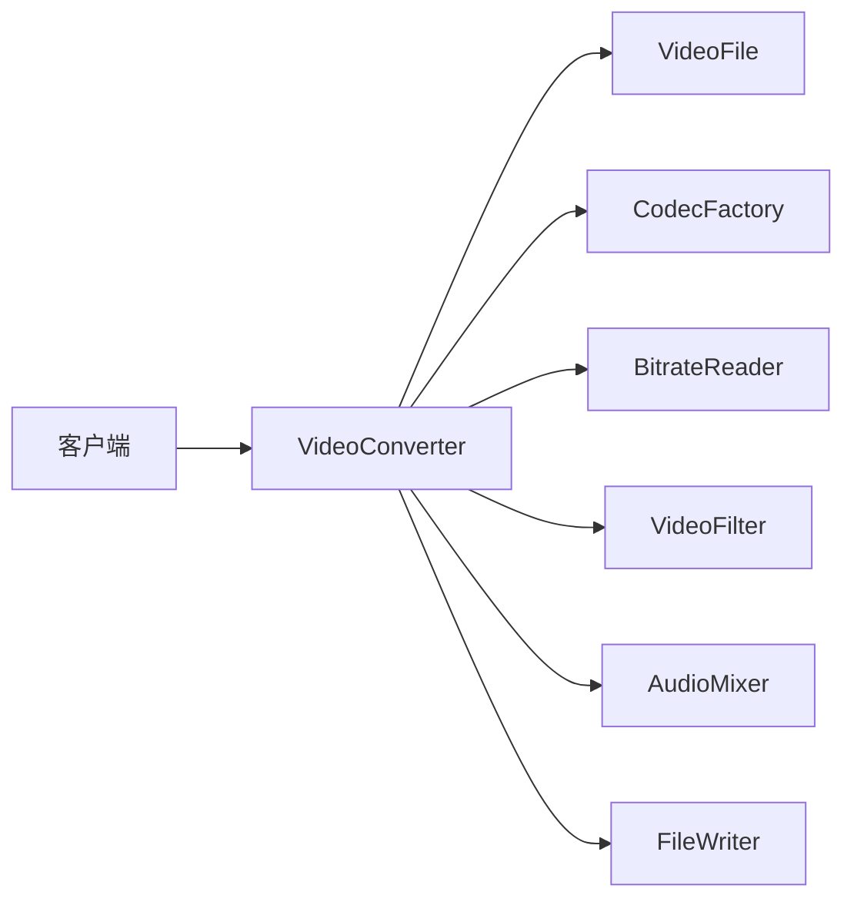
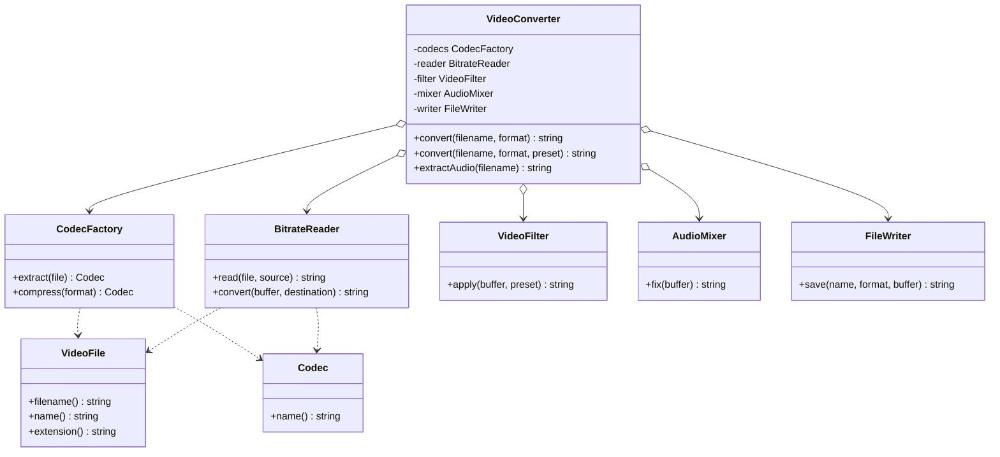
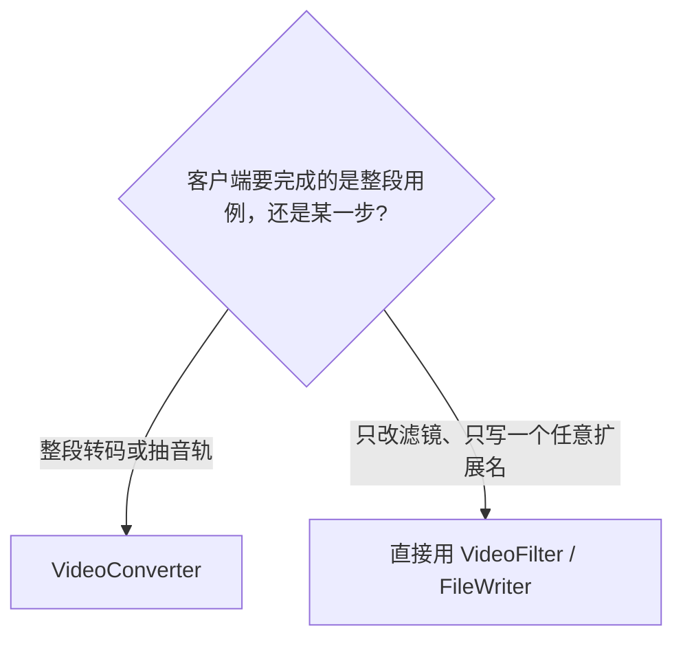
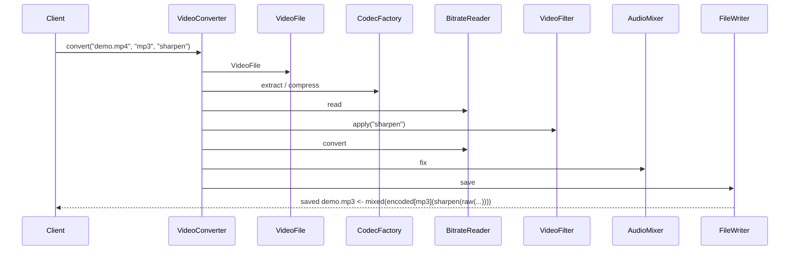
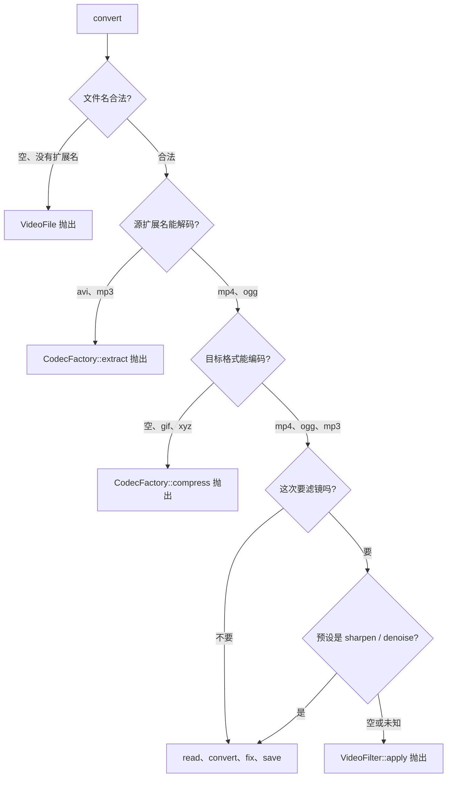
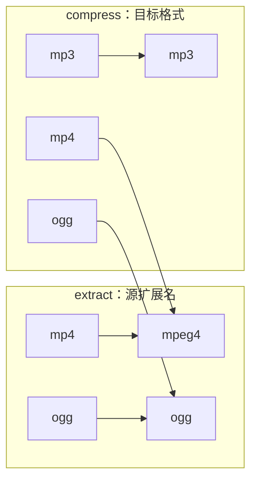
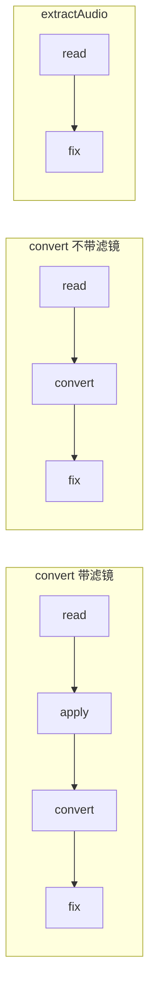
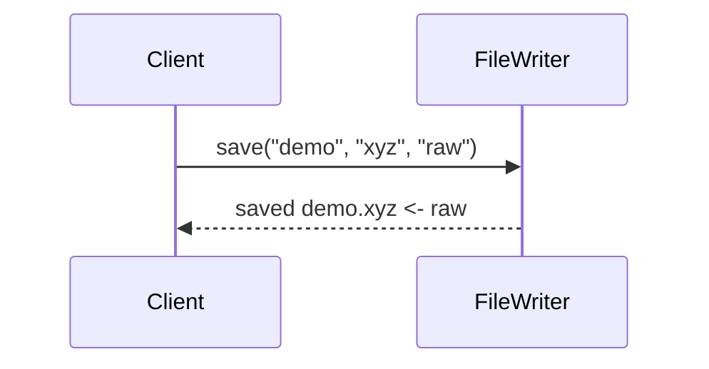
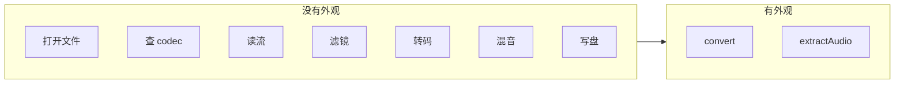

# Facade（外观）

**类型**：Structural（结构型）

**代码位置**：

- 头文件：[`include/structural/facade/facade.h`](../../include/structural/facade/facade.h)
- 实现：[`src/structural/facade/facade.cpp`](../../src/structural/facade/facade.cpp)
- 测试：[`tests/structural/facade_test.cpp`](../../tests/structural/facade_test.cpp)
- 客户端：[`examples/structural/facade/main.cpp`](../../examples/structural/facade/main.cpp)

## 意图

给一组接口各不相同的类提供一个高层入口。客户端要完成的用例收成一两个方法；步骤、顺序和中间对象留在外观里面。子系统类本身保持原样，需要单步控制时仍可以直接用。

可以把 `VideoConverter` 想成剪辑软件的「导出」按钮。解码器、码率、滤镜、混音、写盘各自有菜单，方法名和参数对不上。按导出时，你只选目标格式。这些类还在，高级用户仍能单步调用。

本仓库的例子是视频转码。没有外观时，客户端要自己走 `VideoFile` → `CodecFactory` → `BitrateReader` → （可选）`VideoFilter` → `AudioMixer` → `FileWriter`。`convert` 把这条流水线收成一次调用。



## 适用场景

- **完成一件事要跨好几个类**：转码要打开文件、选 codec、读流、滤镜、混音、写盘。客户端关心的是结果文件，不是每一步的参数
- **想少改调用点**：支持的格式、滤镜插入位置变了，只改外观。已经在直接用子系统的代码不受影响
- **同一套子系统要服务几种用例**：整段转码和只抽音轨用到的类差不多，编排不一样

**不适合**：

- 只有一个已有类，接口对不上 → 那是适配器
- 想给某一个对象动态加职责，接口还保持不变 → 那是装饰器
- 接口相同，只是想拦下或推迟这次调用 → 那是代理
- 子系统之间要互相发消息，谁都不该直接引用谁 → 那是中介者
- 步骤就三行、只有一处调用 → 一个函数就够了，不必再做一个外观类

## 共同骨架

子系统是一组具体类，接口互不相同，也没有共同基类。外观按值持有其中需要反复使用的那些，按用例排好顺序。依赖是单向的：外观知道子系统，子系统不知道外观。



| 构件 | GoF 角色 | 作用 |
| ---- | -------- | ---- |
| `VideoFile` | Subsystem | 拆开文件名。`my.demo.mp4` 的主文件名是 `my.demo`，扩展名是 `mp4` |
| `Codec` | Subsystem | 一个 codec 名字。扩展名 `mp4` 对应的 codec 是 `mpeg4` |
| `CodecFactory` | Subsystem | 唯一知道「扩展名 / 格式 → codec」的地方 |
| `BitrateReader` | Subsystem | `read` 按源 codec 取码流，`convert` 按目标 codec 转码 |
| `VideoFilter` | Subsystem | `sharpen` / `denoise`。不管编解码 |
| `AudioMixer` | Subsystem | 把当前码流包成修过音轨的结果 |
| `FileWriter` | Subsystem | 拼出 `saved <name>.<format> <- <buffer>`。不检查格式支不支持 |
| `VideoConverter` | Facade | `convert` 走完整条流水线，`extractAudio` 只解码、混音、写成 mp3 |

少了外观，每个调用点都要记得三件彼此无关的事：先解码再滤镜再编码，目标格式 `mp4` 要换成 codec `mpeg4`，输出文件用的是扩展名而不是 codec 名。有了外观，这些约定只写在 `convert_to` 里。

客户端面对的选择因此是「要整段用例，还是要某一步」：



### 为什么客户端不自己排这六步

差在一件事：**变化点在「导出什么」，不在「导出要经过哪些类」。**

格式表加一种、滤镜从「编码前」改成「编码后」，手写流水线的每处都要改。外观把顺序收进 `convert_to`。调用点保持：

```cpp
VideoConverter converter;
converter.convert("demo.mp4", "mp3");
converter.convert("demo.mp4", "mp3", "sharpen");
converter.extractAudio("demo.mp4");
```

子系统留在公开头文件里，是为了说明外观**没有封死**它们。测试 `ManualPipelineMatchesFacade` 用同一组类手写一遍，结果和 `convert` 相同：外观没有另做一套转码，它只是把已有步骤排好。

这也是它和适配器看起来像、实际上分开的地方。两边都是「外层帮客户端少碰一点内部接口」：

| | 适配器 | 外观 |
| ---- | ------ | ---- |
| 包住谁 | 一个 Adaptee | 一组子系统 |
| 外层接口 | 必须是客户端已经在用的 Target | 按用例新设计的粗粒度方法 |
| 内部接口 | 翻译成另一个已有方法 | 原样调用，各自保持原样 |
| 再包一层 | 套不上。外层交出来的是 Target，里层要的是 Adaptee | 不靠套娃。一条用例里依次调用多个类 |
| 高级用法 | 一般不再把 Adaptee 露给客户端 | 子系统仍然可以直接用 |

### 为什么子系统不引用外观

依赖只有外观 → 子系统这一边。`BitrateReader` 的声明里没有 `VideoConverter`，它也不回调外观。

反过来就会变成中介者：每个子系统持有中介，消息都从中介转发。外观不负责让解码器和写盘互相认识。它们互相不调用，由外观按顺序把返回值传下去。

所以 `VideoConverter` 也不是这些类的子类。测试 `FacadeIsNotASubsystemType` 把这件事固定下来：`VideoConverter` 既不继承 `CodecFactory` / `BitrateReader` / `VideoFilter` / `FileWriter`，也不能转换成它们的指针。接口看起来简单，是因为**方法少**，不是因为继承了某一个子系统。

### 为什么成员是值，方法是 const

这些子系统没有堆上资源，构造也不需要参数。外观用成员把「这条流水线要用哪些对象」写在类型里：

```cpp
CodecFactory codecs_;
BitrateReader reader_;
VideoFilter filter_;
AudioMixer mixer_;
FileWriter writer_;
```

它们没有虚函数，按值成员、编译器生成的拷贝就够了。这里不需要 `unique_ptr`：没有多态所有权，也没有「外层析构时释放内层」这回事。装饰器必须用 `unique_ptr<Stream>`，是因为它要拥有下一个未知具体类型；外观拥有的是五个已知具体类型。

方法都是 `const`。一次 `convert` 不改外观自己的成员，中间码流是函数里的局部 `std::string`。连续两次调用互不影响，测试 `RepeatedCallsDoNotDependOnPreviousOnes` 覆盖这一点：同一个对象先转 `a.mp4`，再转 `b.ogg`，结果和新建一个 `VideoConverter` 相同。

`VideoFile` 不放进成员。它是某一次请求的输入，不是流水线的设备。每次 `convert` / `extractAudio` 用文件名现构造一个。

### 为什么返回值是一层层套起来的字符串

本仓库没有真正的视频字节。每个子系统的返回值故意写成可读的包装，测试才能看见**谁包住谁**，也就是外观把步骤排成了什么顺序。

```text
saved demo.mp3 <- mixed(encoded[mp3](sharpen(raw(demo.mp4:mpeg4))))
```

从外往里读：`FileWriter` 写出 `saved ... <- ...`，里面是 `AudioMixer` 的 `mixed(...)`，再里面是 `BitrateReader::convert` 的 `encoded[mp3](...)`，再里面是 `VideoFilter` 的 `sharpen(...)`，最里面是 `BitrateReader::read` 的 `raw(...)`。滤镜若跑到编码之后，字符串会变成 `sharpen(encoded[mp3](...))`，测试 `FilterRunsAfterDecodeAndBeforeEncode` 就会失败。

头文件里不 `#include <iostream>`。打印留在示例里。

### 两条用例，一套子系统

`convert` 的顺序是固定的：



| 用例 | 调用的子系统 | 结果 |
| ---- | ------------ | ---- |
| `convert(file, format)` | 打开、查源 codec、查目标 codec、读、转码、混音、写盘 | `saved demo.mp3 <- mixed(encoded[mp3](raw(demo.mp4:mpeg4)))` |
| `convert(file, format, preset)` | 同上，读完之后、转码之前多一次滤镜 | `saved demo.mp3 <- mixed(encoded[mp3](sharpen(raw(...))))` |
| `extractAudio(file)` | 打开、查源 codec、读、混音、写成 mp3。没有滤镜，也没有转码 | `saved demo.mp3 <- mixed(raw(demo.mp4:mpeg4))` |

两参 `convert` 跳过 `VideoFilter`。滤镜改变的是码流嵌套的位置：必须包住 `raw(...)`，再被 `encoded[...]` 包住。

`extractAudio` 是第二条用例，不是把 `convert` 的参数再堆一个开关。它不调用滤镜，也不调用 `BitrateReader::convert`，输出扩展名固定写成 `"mp3"`。

外观上的方法对应**客户端的任务**。如果把 `read` / `apply` / `save` 每个都原样转发一遍，类还在，复杂度回到了客户端，外观就只是一个命名空间。

### 错误沿着调用顺序抛

非法输入进不了下一步。规则抛 `std::invalid_argument`，文案是抛出那一层自己的，外观不再包一层。



| 时机 | 检查 | 例子 |
| ---- | ---- | ---- |
| `VideoFile` 构造 | 空文件名、没有扩展名、点在开头或结尾 | `""`、`"demo"`、`".mp4"`、`"demo."` |
| `Codec` 构造 | 空名字 | `""` |
| `CodecFactory::extract` | 源扩展名不在表里 | `"avi"`、`"mp3"` → `unsupported source: ...` |
| `CodecFactory::compress` | 目标格式为空或不在表里 | `""`、`"gif"`、`"xyz"` |
| `BitrateReader::convert` / `AudioMixer::fix` / `FileWriter::save` | 空码流、空名字、空格式 | `buffer is required` 等 |
| `VideoFilter::apply` | 空预设、未知预设 | `""`、`"blur"` |
| `VideoConverter::convert` | 不另写规则，沿上面的顺序调用 | `"" / "gif" / "blur"` 先报文件名 |

三参版本把文件名、目标格式、滤镜叠在同一次调用里时，仍然是这个顺序：`"" / "gif" / "blur"` 报的是文件名，`demo.mp4 / gif / blur` 报的是格式，`demo.mp4 / mp3 / blur` 才轮到未知滤镜。对应测试 `FacadeValidatesInPipelineOrder`。

`FileWriter` 不查格式表。`save("demo", "xyz", ...)` 会成功；外观的 `convert(..., "xyz")` 在 `compress` 就失败，到不了写盘。策略在用例里，不在每一个子系统里。

---

## 1. 源文件和 codec：`VideoFile` / `Codec` / `CodecFactory`

转码的前两步是「这是哪个文件」和「用哪个编解码器」。这两个问题和滤镜、混音、写盘无关，所以拆成独立的类型。

### 原理

`VideoFile` 只做拆分。最后一个 `.` 后面是扩展名，前面整段是主文件名，因此 `my.demo.mp4` 的主文件名是 `my.demo`，不是 `my`。空文件名、没有点、点在开头或结尾，都在构造时拒绝，后面的类拿到的 `VideoFile` 一定带得走扩展名。

`Codec` 是一个名字。扩展名和 codec 可以不一样：文件叫 `.mp4`，解码器叫 `mpeg4`。这个差异若散落在每个调用点，客户端就得自己记住映射。

`CodecFactory` 是这张表的唯一位置。`extract` 看源扩展名，`compress` 看目标格式。同一个词 `mp4` 出现在源文件上和出现在目标格式上，走的是两个函数，codec 名字都是 `mpeg4`。源文件不允许是 `mp3`：`extract` 抛 `unsupported source: mp3`；`mp3` 只出现在 `compress` 里，作为导出格式。



调用方仍可以自己写 `Codec("mpeg4")`。工厂集中的是表，不是 codec 这个类型的构造权。`BitrateReader` 只认 `Codec::name()`，不回头检查这个名字和扩展名是否配对。配对是工厂和外观的事。

### 基本构成

| 位置 | 内容 |
| ---- | ---- |
| `VideoFile` | 构造收 `std::string`，保存 `filename_`、`name_`、`extension_` |
| 拆分规则 | `rfind('.')`。点缺失、在开头、在结尾都抛 `filename must have an extension` |
| `Codec` | 构造收非空名字，否则 `codec is required` |
| `CodecFactory::extract` | `mp4` → `mpeg4`，`ogg` → `ogg`，其余 `unsupported source: ...` |
| `CodecFactory::compress` | `mp4` → `mpeg4`，`ogg` → `ogg`，`mp3` → `mp3`；空格式是 `format is required` |
| 映射函数 | `source_codec` / `destination_codec` 放在 `.cpp` 的匿名命名空间里，不进头文件 |

```cpp
VideoFile::VideoFile(std::string filename) {
  if (filename.empty()) {
    throw std::invalid_argument("filename is required");
  }
  const auto dot = filename.rfind('.');
  if (dot == std::string::npos || dot == 0 || dot + 1 == filename.size()) {
    throw std::invalid_argument("filename must have an extension");
  }
  filename_ = std::move(filename);
  name_ = filename_.substr(0, dot);
  extension_ = filename_.substr(dot + 1);
}
```

```cpp
Codec CodecFactory::extract(const VideoFile &file) const {
  return Codec(source_codec(file.extension()));
}

Codec CodecFactory::compress(std::string_view format) const {
  return Codec(destination_codec(format));
}
```

### 用法

拆文件名、查两张表（测试 `SubsystemsKeepTheirOwnInterfaces`）：

```cpp
const VideoFile file("my.demo.mp4");
file.filename();    // "my.demo.mp4"
file.name();        // "my.demo"
file.extension();   // "mp4"

CodecFactory codecs;
codecs.extract(file).name();                  // "mpeg4"
codecs.extract(VideoFile("clip.ogg")).name(); // "ogg"
codecs.compress("mp4").name();                // "mpeg4"
codecs.compress("mp3").name();                // "mp3"
```

源格式和目标格式的拒绝理由不同（测试 `SubsystemsRejectBadInput`）：

```cpp
VideoFile{"demo.avi"};                 // 文件名合法
CodecFactory{}.extract(VideoFile{"demo.avi"});  // unsupported source: avi
CodecFactory{}.extract(VideoFile{"demo.mp3"});  // unsupported source: mp3
CodecFactory{}.compress("");                    // format is required
CodecFactory{}.compress("gif");                 // unsupported format: gif
```

`demo`、`.mp4`、`demo.` 到不了工厂，`VideoFile` 构造时就抛 `filename must have an extension`。

### 特点

- 一个类只回答一个问题：文件名怎么拆，或者格式怎么映射成 codec
- 源表和目标表分开。`mp3` 能作为导出格式，不能作为输入文件
- 扩展名 `mp4` 和 codec `mpeg4` 的差别集中在工厂里，读流和写盘都不重复这张表
- `Codec` 可以不经过工厂直接构造。工厂是便利和约束，不是类型系统上的唯一入口
- 这一层不做滤镜、不做转码、不写文件。后面的类拿到的是已经拆好的 `VideoFile` 和 `Codec`

---

## 2. 码流加工：`BitrateReader` / `VideoFilter` / `AudioMixer`

读流、滤镜、转码、混音是四种说法。返回值用包装文本把「这一步做了什么」留在字符串里，下一步只接收上一步的结果，类与类之间不互相持有。

### 原理

`BitrateReader::read` 把文件名和源 codec 收成 `raw(demo.mp4:mpeg4)`。它不打开真实文件，也不核对 codec 是否来自 `extract`。传一个自己构造的 `Codec("mp3")` 进去，会得到 `raw(demo.mp4:mp3)`。这种错配外观不会产生，因为外观总是先 `extract` 再 `read`。

`VideoFilter::apply` 在现有码流外面包一层预设名：`sharpen(...)` 或 `denoise(...)`。空预设和未知预设在这里拒绝。滤镜不知道自己被放在解码之后还是编码之后，位置是调用方决定的。

`BitrateReader::convert` 再包一层目标 codec：`encoded[mp3](...)`。空码流会抛，因为没有输入就没有转码。

`AudioMixer::fix` 同样只包一层：`mixed(...)`。它不关心里面是刚读出来的 `raw(...)`，还是已经 `encoded[...]` 过的结果。抽音轨和整段转码因此可以共用它。

外观规定的嵌套（滤镜在中间）是：

```text
mixed( encoded[目标codec]( 预设( raw(文件:源codec) ) ) )
```

没有滤镜时，少掉中间那一层。抽音轨时，`encoded[...]` 也没有。



三条路径都在 `fix` 之后交给 `FileWriter`。`BitrateReader`、`VideoFilter`、`AudioMixer` 都不知道自己处在哪一条上。

### 基本构成

| 位置 | 内容 |
| ---- | ---- |
| `BitrateReader::read` | `raw(<filename>:<codec>)`。不检查 codec 与扩展名是否匹配 |
| `BitrateReader::convert` | `encoded[<codec>](<buffer>)`。空 buffer 抛 `buffer is required` |
| `VideoFilter::apply` | `<preset>(<buffer>)`。预设只有 `sharpen` 和 `denoise` |
| 空预设 | `filter preset is required` |
| 未知预设 | `unknown filter: <preset>` |
| `AudioMixer::fix` | `mixed(<buffer>)`。空 buffer 同样拒绝 |
| 彼此的关系 | 没有成员指向另一个子系统。数据用返回值传递 |

```cpp
std::string BitrateReader::read(const VideoFile &file,
                                const Codec &source) const {
  return "raw(" + file.filename() + ":" + source.name() + ")";
}

std::string BitrateReader::convert(std::string_view buffer,
                                   const Codec &destination) const {
  const auto payload = require_text(buffer, "buffer is required");
  return "encoded[" + destination.name() + "](" + payload + ")";
}
```

```cpp
std::string VideoFilter::apply(std::string_view buffer,
                               std::string_view preset) const {
  const auto payload = require_text(buffer, "buffer is required");
  if (preset.empty()) {
    throw std::invalid_argument("filter preset is required");
  }
  if (preset != "sharpen" && preset != "denoise") {
    throw std::invalid_argument("unknown filter: " + std::string(preset));
  }
  return std::string(preset) + "(" + payload + ")";
}
```

`AudioMixer::fix` 就是 `mixed(` + 非空 buffer + `)`。

### 用法

单步调用，每一步的包装都能单独断言（测试 `SubsystemsKeepTheirOwnInterfaces`）：

```cpp
const VideoFile file("my.demo.mp4");
const Codec source = CodecFactory{}.extract(file);
BitrateReader reader;
const std::string raw = reader.read(file, source);
// "raw(my.demo.mp4:mpeg4)"

reader.convert(raw, Codec("mp3"));
// "encoded[mp3](raw(my.demo.mp4:mpeg4))"

VideoFilter{}.apply(raw, "sharpen");
// "sharpen(raw(my.demo.mp4:mpeg4))"

AudioMixer{}.fix(raw);
// "mixed(raw(my.demo.mp4:mpeg4))"
```

滤镜的非法预设在子系统自己的方法上就能看到，不必经过外观（测试 `SubsystemsRejectBadInput`）：

```cpp
VideoFilter{}.apply("", "sharpen");  // buffer is required
VideoFilter{}.apply("raw", "");      // filter preset is required
VideoFilter{}.apply("raw", "blur");  // unknown filter: blur
AudioMixer{}.fix("");                // buffer is required
```

手写一条和外观相同的流水线时，滤镜必须夹在 `read` 和 `convert` 之间。测试 `ManualPipelineMatchesFacade` 里的 `convert_by_hand` 就是这个顺序；和 `VideoConverter::convert` 的字符串全等。

### 特点

- 四个动作、四种包装，没有共同的 `run()`。硬抽一个基类会把参数塞进标志位
- 类不保存上一次的码流。输入从参数来，输出从返回值走，所以没有「先 read 再 convert」的内部状态机
- 它们不检查业务顺序。先 `convert` 再 `apply` 也能编译，得到的嵌套只是和外观约定的不同
- 空码流在加工入口就拒绝。`read` 自己总会返回非空的 `raw(...)`，空 buffer 只可能来自别的调用方
- 外观若要改变滤镜位置，改的是调用顺序，不是这三个类的实现

---

## 3. 写盘：`FileWriter`

写盘是流水线的最后一步，也是子系统里最容易被外观「顺便加上策略」的地方。这里故意不加。

### 原理

`save` 用主文件名和**格式字符串**拼结果，不用 codec 名。所以 `ogg → mp4` 的最终文本是：

```text
saved clip.mp4 <- mixed(encoded[mpeg4](raw(clip.ogg:ogg)))
```

文件扩展名是 `mp4`，括号里的 codec 是 `mpeg4`。这两件事由不同的类负责：扩展名是调用方传给 `save` 的格式，codec 是更早的 `compress` 写进码流的。

`save` 不查 `CodecFactory` 那张表。`xyz` 也能写。外观的 `convert(..., "xyz")` 会失败，是因为 `compress` 先抛了 `unsupported format: xyz`，执行流到不了 `save`。高级客户端要写一个表外的扩展名，直接用 `FileWriter`，不用改外观，也不用改工厂。



名字、格式、码流三者有一个为空，就在写盘这一层拒绝。写盘不负责解释「为什么这个格式不能转」，那是工厂的文案。

### 基本构成

| 位置 | 内容 |
| ---- | ---- |
| `save(name, format, buffer)` | 返回 `saved <name>.<format> <- <buffer>` |
| 空名字 | `name is required` |
| 空格式 | `format is required` |
| 空码流 | `buffer is required` |
| 格式表 | 不读取。任何非空格式都会拼进结果 |

```cpp
std::string FileWriter::save(std::string_view name, std::string_view format,
                             std::string_view buffer) const {
  const auto stem = require_text(name, "name is required");
  const auto extension = require_text(format, "format is required");
  const auto payload = require_text(buffer, "buffer is required");
  return "saved " + stem + "." + extension + " <- " + payload;
}
```

### 用法

表外的扩展名在写盘层是合法的（测试 `SubsystemsKeepTheirOwnInterfaces`）：

```cpp
FileWriter writer;
writer.save("my.demo", "xyz", "raw(my.demo.mp4:mpeg4)");
// "saved my.demo.xyz <- raw(my.demo.mp4:mpeg4)"
```

同一个 `xyz` 交给外观则到不了写盘（测试 `FacadeValidatesInPipelineOrder`，示例里也有对照）：

```cpp
VideoConverter{}.convert("demo.mp4", "xyz");  // unsupported format: xyz
```

空字段各自有自己的文案，不会合成一句「参数无效」：

```cpp
FileWriter{}.save("", "mp3", "raw");    // name is required
FileWriter{}.save("demo", "", "raw");   // format is required
FileWriter{}.save("demo", "mp3", "");   // buffer is required
```

### 特点

- 只负责拼出最终结果，不判断这次导出是否被用例允许
- 扩展名来自参数 `format`，不来自码流里的 `encoded[mpeg4]`
- 外观把「支持哪些格式」留在 `compress`。写盘保持无知，单步调用才放得开
- 没有缓存、没有路径对象。返回值就是这次写入的描述
- 外观不会在 `save` 的结果外面再加前缀。`ManualPipelineMatchesFacade` 要求两边字符串全等；多一层前缀就说明外观开始改写子系统的结果

---

## 4. 外观：`VideoConverter`

`VideoConverter` 是客户端完成「转码」和「抽音轨」时唯一需要依赖的类型。它不加工字节，只决定调用谁、以什么顺序、把上一步的返回值传给下一步。

### 原理

两个 `convert` 重载共用私有的 `convert_to`。没有滤镜时传入 `std::nullopt`，有滤镜时传入那个 `string_view`。流水线只写一份，避免以后调整顺序时只改到其中一条重载。

```cpp
std::string VideoConverter::convert_to(
    std::string_view filename, std::string_view format,
    std::optional<std::string_view> preset) const {
  const VideoFile file{std::string(filename)};
  const Codec source = codecs_.extract(file);
  const Codec destination = codecs_.compress(format);

  std::string buffer = reader_.read(file, source);
  if (preset.has_value()) {
    buffer = filter_.apply(buffer, *preset);
  }
  buffer = reader_.convert(buffer, destination);
  buffer = mixer_.fix(buffer);
  return writer_.save(file.name(), format, buffer);
}
```

`preset` 只要有值就会进入 `apply`，包括空字符串。空字符串由 `VideoFilter` 抛 `filter preset is required`。两参 `convert` 走的是 `nullopt`，根本不会调用滤镜，和「传了空预设」不是同一件事。

`extractAudio` 不复用 `convert_to`。它少了滤镜和转码，输出扩展名也是固定的。塞进同一个函数就要加「是否编码、扩展名从哪来」的开关，外观会重新变成子系统的参数表。

```cpp
std::string VideoConverter::extractAudio(std::string_view filename) const {
  const VideoFile file{std::string(filename)};
  const Codec source = codecs_.extract(file);
  const std::string buffer = mixer_.fix(reader_.read(file, source));
  return writer_.save(file.name(), "mp3", buffer);
}
```

这里的 `"mp3"` 是字面量，不调用 `compress`。抽音轨自己约定输出扩展名。`convert` 的目标格式表不管这条用例。

同格式转换不会短路。`convert("demo.mp4", "mp4")` 仍然读、转、混、写，结果里既有源 `mpeg4` 也有目标 `mpeg4`。外观表达的是一条用例，不是「能跳过就跳过」的优化。

和手写流水线相比，外观多出来的只有编排。`ManualPipelineMatchesFacade` 要求 `convert("demo.mp4", "mp3")` 和手写六步的字符串全等，带 `denoise` 的那次也全等。

### 基本构成

| 位置 | 内容 |
| ---- | ---- |
| `codecs_` / `reader_` / `filter_` / `mixer_` / `writer_` | 按值成员。默认构造，方法均为 `const` |
| `convert(filename, format)` | 转发到 `convert_to(..., std::nullopt)` |
| `convert(filename, format, preset)` | 转发到 `convert_to(..., preset)` |
| `convert_to` | 私有。`optional` 不出现在公有签名里 |
| `extractAudio` | 独立流水线：`extract` → `read` → `fix` → `save(..., "mp3")` |
| 不持有的东西 | `VideoFile`、中间 `buffer`、上一次的输出 |

公有接口只有三个入口：

```cpp
std::string convert(std::string_view filename, std::string_view format) const;
std::string convert(std::string_view filename, std::string_view format,
                    std::string_view preset) const;
std::string extractAudio(std::string_view filename) const;
```

`convert_to` 使用 `std::optional<std::string_view>`，是为了在类型上区分「这次没有滤镜」和「这次有一个预设」。公有的两参 / 三参重载把这个区别显式留给调用方，而不是再加一个布尔参数。

### 用法

只给出文件和目标格式（测试 `ConvertHidesThePipeline`）：

```cpp
VideoConverter converter;
converter.convert("demo.mp4", "mp3");
// saved demo.mp3 <- mixed(encoded[mp3](raw(demo.mp4:mpeg4)))

converter.convert("clip.ogg", "mp4");
// saved clip.mp4 <- mixed(encoded[mpeg4](raw(clip.ogg:ogg)))

converter.convert("demo.mp4", "mp4");
// saved demo.mp4 <- mixed(encoded[mpeg4](raw(demo.mp4:mpeg4)))
```

滤镜夹在解码和编码之间（测试 `FilterRunsAfterDecodeAndBeforeEncode`）：

```cpp
converter.convert("demo.mp4", "mp3", "sharpen");
// saved demo.mp3 <- mixed(encoded[mp3](sharpen(raw(demo.mp4:mpeg4))))

converter.convert("clip.ogg", "ogg", "denoise");
// saved clip.ogg <- mixed(encoded[ogg](denoise(raw(clip.ogg:ogg))))
```

抽音轨没有 `encoded[...]`，也没有预设名（测试 `ExtractAudioSkipsFilterAndEncode`）：

```cpp
converter.extractAudio("demo.mp4");
// saved demo.mp3 <- mixed(raw(demo.mp4:mpeg4))

converter.extractAudio("my.clip.ogg");
// saved my.clip.mp3 <- mixed(raw(my.clip.ogg:ogg))
```

同一个对象可以连续导出，结果不依赖上一次（测试 `RepeatedCallsDoNotDependOnPreviousOnes`）：

```cpp
converter.convert("a.mp4", "mp3");
converter.convert("b.ogg", "mp4", "sharpen");
converter.extractAudio("a.ogg");
```

错误仍然是子系统的原文（测试 `FacadeValidatesInPipelineOrder`）：

```cpp
converter.convert("", "mp3");                 // filename is required
converter.convert("demo", "mp3");             // filename must have an extension
converter.convert("demo.avi", "mp3");         // unsupported source: avi
converter.convert("demo.mp4", "");            // format is required
converter.convert("demo.mp4", "gif");         // unsupported format: gif
converter.convert("demo.mp4", "mp3", "");     // filter preset is required
converter.convert("demo.mp4", "mp3", "blur"); // unknown filter: blur
converter.extractAudio("demo.mp3");           // unsupported source: mp3
```

`"" / "gif" / "blur"` 这组参数报 `filename is required`，因为 `VideoFile` 先于 `compress` 和 `apply`。`demo.mp4 / gif / blur` 报 `unsupported format: gif`，滤镜还没机会看到 `blur`。

示例 [`examples/structural/facade/main.cpp`](../../examples/structural/facade/main.cpp) 把日常用法放在 `VideoConverter` 上，并并列了一份手写流水线。手写版本要自己构造六个对象、自己记住滤镜位置；外观版本只留文件名和格式。示例末尾还对照了 `FileWriter::save(..., "xyz", ...)` 成功、`convert(..., "xyz")` 失败。

### 特点

- 公有方法按用例命名：`convert`、`extractAudio`。没有 `read()`、`apply()`、`save()` 这种转发
- 一条流水线写在 `convert_to`，两条重载只决定有没有滤镜
- `extractAudio` 单独写，是因为它少了步骤、又写死了扩展名。合并进 `convert_to` 会把外观做成参数开关
- 不改子系统的返回值。编排正确时，手写同一顺序会得到同一个字符串
- 不缓存请求。成员是设备，`VideoFile` 和码流是某一次调用的局部量
- 异常文案来自抛出的那一层。外观不捕获、不改写
- 多一个对象、一次间接编排。用例只有一处、步骤也不再变时，这个类就是多余的包装

---

## 总对照

| 写法 | 客户端要知道的事 | 改滤镜顺序时要改谁 | 推荐场景 |
| ---- | ---------------- | ------------------ | -------- |
| 每个调用点手写六步 | codec 表、类的构造、谁先谁后 | 每一处 | 只有一处，而且不会再长 |
| 一个自由函数 `convert_video` | 函数名和两个参数 | 函数内部 | 没有第二条用例，也不需要带着这组对象走 |
| **`VideoConverter`** | **`convert` / `extractAudio`** | **`convert_to` 一处** | 同一套子系统上有几条稳定用例 |
| 外观把每个子系统方法都转发一遍 | 还是全部参数 | 转发函数本身 | 复杂度没有减少，不要这样写 |
| 适配器 | Target 上的那一个方法 | 不涉及一组子系统 | 只是两个接口对不上 |



再记三点，和具体类名无关，但最容易混：

1. **外观简化的是一组接口，适配器翻译的是一个接口。** 适配器的外层必须长得像客户端已经依赖的 `MediaPlayer`。外观的 `convert` 是新方法，子系统原来的 `read` / `apply` / `save` 一个都不用改名。
2. **装饰器和代理包的是同一个接口。** 加密流仍然是 `Stream`，代理仍然是那个对象。外观和里面的 `CodecFactory` 没有 is-a 关系，客户端也不能把 `VideoConverter` 传到期待 `FileWriter` 的地方。
3. **中介者是为了让同事对象互相通信。** 那些对象知道中介。本仓库的解码器、滤镜、写盘互不引用，只有外观知道整张图。

和其它结构型模式的边界：

| 模式 | 接口关系 | 目的 |
| ---- | -------- | ---- |
| Adapter | 两边**不同**，中间翻译 | 让旧代码能被新客户端用 |
| Decorator | **相同**，再包一层 | 动态加职责 |
| Proxy | **相同**，再包一层 | 控制访问 |
| Facade | 新入口盖住一堆旧接口 | 简化子系统 |
| Bridge | 抽象和实现从一开始就分开 | 两边独立变化 |
| Composite | 同一接口的树 | 让单个对象和一组对象可以互换 |

## 怎么选

```text
客户端是在完成一整段用例，还是在使用某一个类？
  └─ 只是两个类的方法对不上 → 适配器
  └─ 同一个接口上要加一层行为 → 装饰器
  └─ 同一个接口上要控制这次调用 → 代理
  └─ 好几个类凑成一件事
        └─ 调用点就一处，以后也不会多 → 一个函数
        └─ 用例稳定、步骤会变、还想留出高级入口
              → Facade
              → 外观方法按用例设计，不要把子系统方法原样转发
              → 子系统保持公开，需要单步控制时直接用
              → 依赖单向：只有外观引用子系统
              → 格式、顺序、异常分属不同的类，外观只负责把它们串起来
```

示例 [`examples/structural/facade/main.cpp`](../../examples/structural/facade/main.cpp) 把上面几件事串在一起：一次 `convert`、手写流水线对照、带滤镜的导出、抽音轨、写盘放行但外观拒绝的格式，以及文件名、源格式、目标格式、滤镜这四类错误。

## 参考

- 《设计模式：可复用面向对象软件的基础》（GoF）：Facade。为子系统的一组接口提供一个一致的高层界面
- 《重构与模式》：把「客户端自己编排子系统」收成外观
- `std::optional`（私有的 `convert_to` 用来表示这次转码有没有滤镜）
