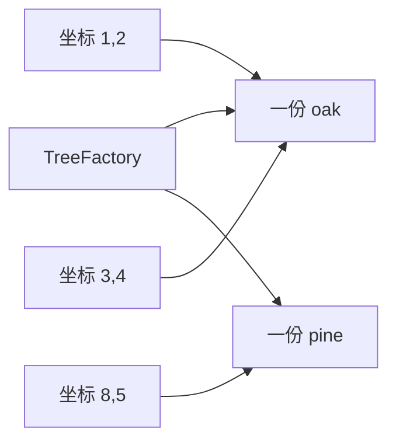
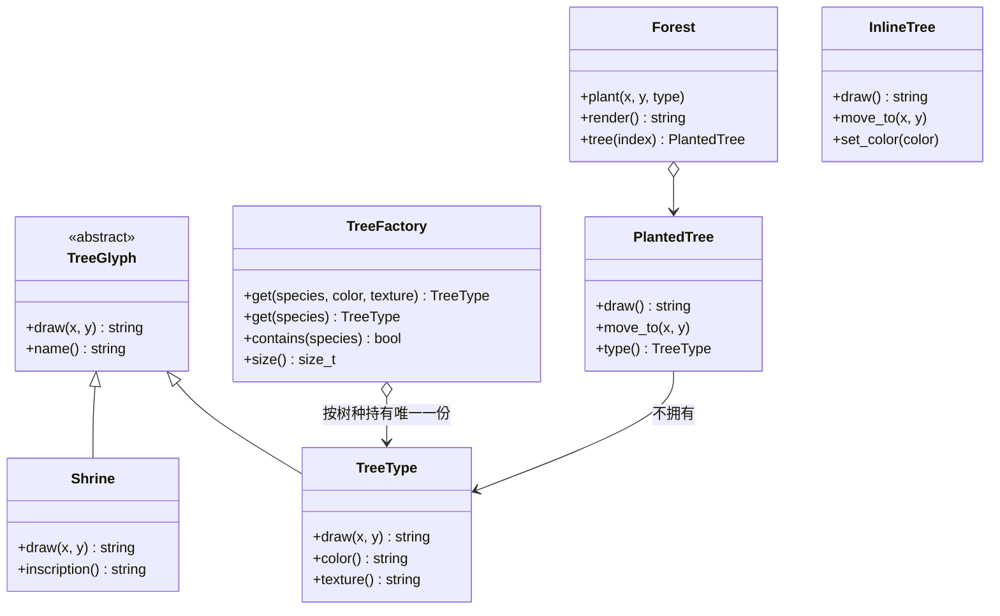
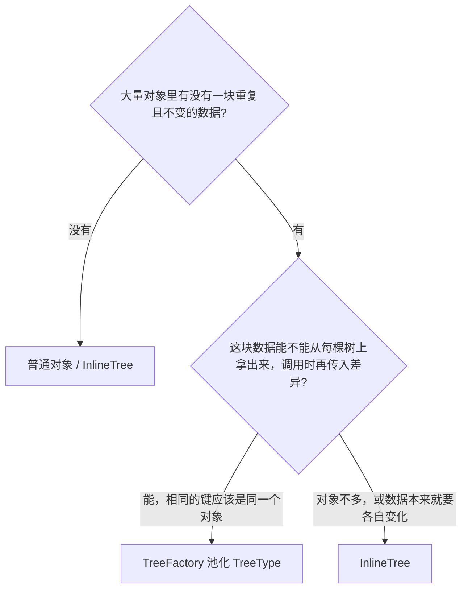
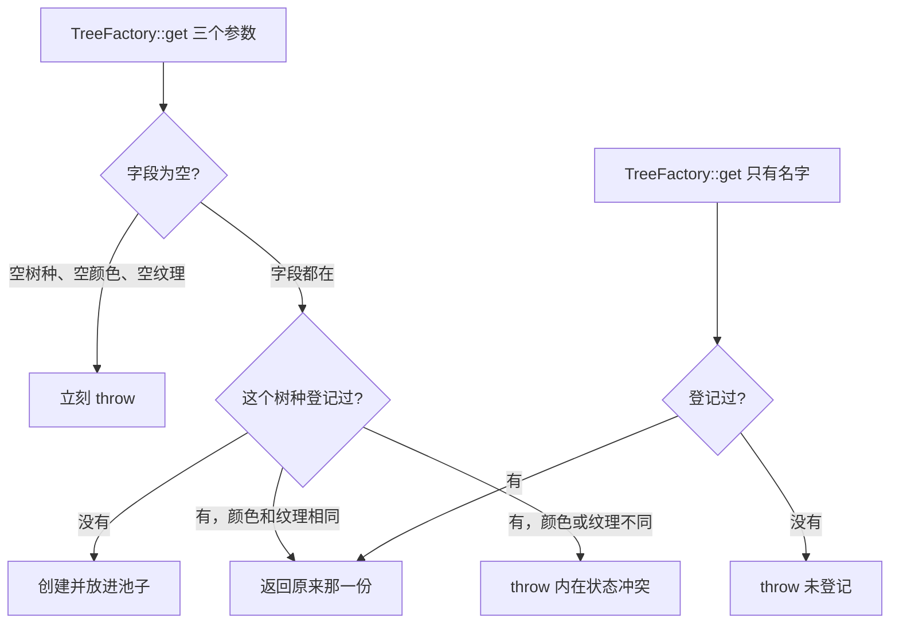
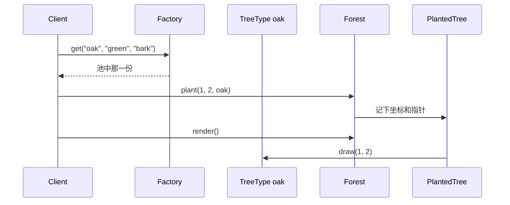
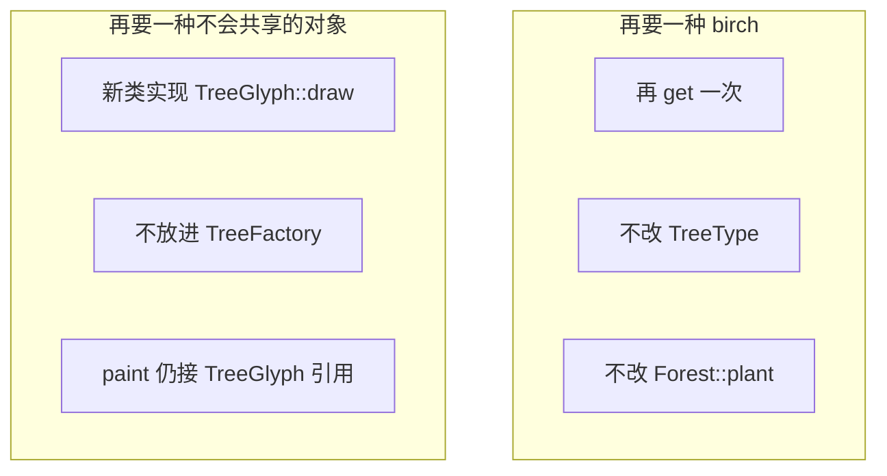
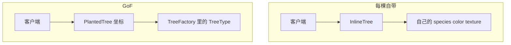
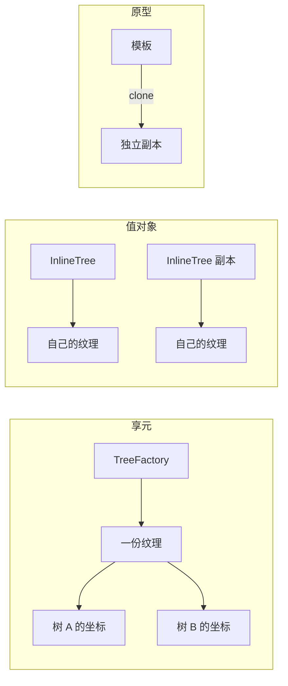

# Flyweight（享元）

**类型**：Structural（结构型）

**代码位置**：

- 头文件：[`include/structural/flyweight/flyweight.h`](../../include/structural/flyweight/flyweight.h)
- 实现：[`src/structural/flyweight/flyweight.cpp`](../../src/structural/flyweight/flyweight.cpp)
- 测试：[`tests/structural/flyweight_test.cpp`](../../tests/structural/flyweight_test.cpp)
- 客户端：[`examples/structural/flyweight/main.cpp`](../../examples/structural/flyweight/main.cpp)

## 意图

让大量细小对象**共用**那些相同、而且不会变的数据，把每份对象自己才有的差异留在外面。

可以把享元想成苗圃和林子。橡树的颜色、树皮纹理在整片林子里是同一份，要重复准备的是「种在哪」。调用方点的是「用这份树种，画在这个坐标」，不会给每一棵树再拷一份纹理。

本仓库的例子就是一片林。`TreeType` 保存树种、颜色、纹理。`TreeFactory` 按树种名字交出同一份对象。`PlantedTree` 只记坐标。`Shrine` 也实现 `TreeGlyph`，但铭文每座一份，不进工厂。



## 适用场景

- **对象很多，其中一大块数据完全一样**：一万棵橡树不该有一万份树皮。一样的是树种，不一样的是坐标
- **那块相同数据在共享之后不能被某一棵改掉**：改颜色会让整片橡树一起变。这种字段留在共享对象里，并且不再提供 setter
- **差异可以在调用时传进去**：`draw(x, y)` 的坐标不属于树种。换一棵树，换的是参数，不是纹理

**不适合**：

- 对象本来就不多，或者那份数据很小 → 每棵树自己带上字段，本仓库的 `InlineTree`
- 每个对象的状态都要独立变化 → 共享会让一次修改打到所有人
- 你要的是「按这个样子再来一个互不影响的副本」 → 那是[原型](../creational/prototype.md)。`clone()` 造的是新对象
- 进程里这个类只能有一个实例 → 那是[单例](../creational/singleton.md)。享元是每个键一份，键可以有很多个
- 同一个对象的操作结果想留到下次 → 那是[代理](proxy.md)里的缓存。两个 `LazyImage("same.png")` 仍然各读一次盘
- 叶子要出现在多个父节点下，共享的是树的所有权 → [组合](composite.md)要求每个节点恰好一个父节点。享元共享的是状态，不是把 `unique_ptr` 改成多个主人

## 共同骨架

本仓库两套写法都能画出 `oak (green) [bark] @ (1,2)`，差在**纹理有没有被收成一份**。GoF 享元把内在状态放进工厂管理的对象，外在状态由上下文在调用时传入。对照的 `InlineTree` 把树种、颜色、纹理和坐标都放在每一棵树上。



| 构件 | GoF 角色 | 作用 |
| ---- | -------- | ---- |
| `TreeGlyph` | Flyweight | 声明 `draw(x, y)`。客户端只认它。坐标是参数 |
| `TreeType` | ConcreteFlyweight | 内在状态：树种、颜色、纹理。构造之后不能改 |
| `Shrine` | UnsharedConcreteFlyweight | 铭文独一无二，不进工厂，接口仍然是 `draw(x, y)` |
| `TreeFactory` | FlyweightFactory | 按树种名字返回池里那一份。没有就创建 |
| `PlantedTree` | 上下文 | 外在状态：坐标。持有 `TreeType` 的观察指针 |
| `Forest` | Client | 种下很多棵树，渲染时让每棵树把自己的坐标交出去 |
| `InlineTree` | 对照 | 每棵树自带全部字段。可以拷贝，不能放进 `TreeGlyph &` |

两种橡树在字段相同时画出同一句话。差别在三件事：**相同树种是不是同一个对象、改一棵的颜色会不会碰到别的树、加一种树种要不要加一个类**。



### 为什么坐标必须留在外面

差在一件事：**放进共享对象里的字段，改一次就是改所有人。**

橡树的纹理可以共用。坐标不行：两棵橡树不站在同一个点上。如果 `x`、`y` 也存在 `TreeType` 里，工厂要么按坐标再做一把钥匙，每棵树又变回自己的一份，共享就没了；要么所有橡树被画到同一个位置。

所以内在状态回答「这是哪一种」，外在状态回答「这一次用在哪」。`TreeType::draw` 不保存上一次的坐标，两次调用可以画出两个位置：

```cpp
TreeType oak("oak", "green", "bark");
oak.draw(1, 2);  // "oak (green) [bark] @ (1,2)"
oak.draw(3, 4);  // "oak (green) [bark] @ (3,4)"
```

对应测试 `TreeTypeDrawCombinesIntrinsicAndExtrinsic`。这和[代理](proxy.md)里的 `CachedImage` 相反：缓存留下的是一次调用的结果，享元留下的是可以配上不同参数再算的数据。

`PlantedTree` 把外在状态收成对象。`move_to` 只改这棵树的坐标，旁边那棵和 `TreeType` 自己都不动。对应测试 `PlantedTreeMoveChangesOnlyExtrinsicState`。

### 为什么共享发生在工厂，而不是构造函数

差在一件事：**`TreeType` 的构造函数并不知道世界上已经有另一份相同的橡树。**

自己写两遍 `TreeType("oak", "green", "bark")`，得到的是两个对象，画出来的字可以一样。对应测试 `DirectTreeTypesWithTheSameDataAreDistinctObjects`。去重是 `TreeFactory` 的职责：池里用树种名字当键，第二次 `get` 返回同一地址。

```cpp
TreeFactory nursery;
const TreeType &oak = nursery.get("oak", "green", "bark");
const TreeType &again = nursery.get("oak", "green", "bark");
// &oak == &again，nursery.size() == 1
```

对应测试 `FactorySharesOneObjectPerSpecies`。

树种名字是钥匙，颜色和纹理是这份对象的内容，不是第二把钥匙。同一名字再要另一套颜色或纹理，工厂拒绝，池子大小不变：

```cpp
nursery.get("oak", "yellow", "bark");  // throw "species intrinsic state conflicts"
```

对应测试 `FactoryRejectsConflictingIntrinsicState`。如果业务上允许「同名橡树、两套纹理」，钥匙就该带上纹理。本仓库的苗圃里，一个名字只对应一份内在状态。

工厂也不是单例。两座苗圃可以各有一份叫 oak 的树种，地址不同，画出来的字可以相同。对应测试 `SeparateFactoriesDoNotShare`。单例保证的是「这个类只有一个实例」；享元保证的是「在这一座池子里，这个键只有一个实例」。池子本身可以有很多座，谁持有工厂，谁就能看见共享范围。

### 为什么内在状态不能改，工厂交出去的是 const 引用

共享对象上如果有 `set_color`，某一棵树换装，整片橡树跟着换。`TreeType` 因此没有 setter，`draw` 是 `const`。测试 `InheritanceAndConvertibility` 用 `requires` 固定了 `TreeType` 没有 `set_color`，`InlineTree` 有。

工厂内部用 `unique_ptr<TreeType>` 放在 `map` 里，`get` 返回 `const TreeType &`。所有权在工厂，林子只观察。

```cpp
const TreeType &get(std::string_view species, std::string_view color,
                    std::string_view texture);
const TreeType &get(std::string_view species) const;
```

三参数的 `get` 会创建，所以不是 `const`。只按名字查找的 `get` 不改池子，可以在 `const TreeFactory &` 上调用。对应测试 `FactoryLookupIsConst`。

返回引用，调用方写不出 `TreeType copy = nursery.get(...)`：`TreeGlyph` 删掉了拷贝和移动，具体类也跟着不能拷。按值拿走会得到第二份纹理，池子里的身份就断了。要再种一棵，拷的是 `PlantedTree`（坐标加上指向同一份 `TreeType` 的指针），不是树种本身。对应测试 `CopyAndMoveAreDeleted` 和 `ForestCopyDuplicatesPositionsNotTypes`。

不用 `shared_ptr`。引用计数会让每棵树都像主人，工厂被销毁以后纹理还能活着，共享范围就看不见了。这里的契约和[代理](proxy.md)里 `LazyImage` 对 `ImageArchive` 的引用一样：工厂必须比种下去的树活得更久。工厂也不提供删除。删掉 oak 之后，已经种下的树会悬空。

`draw` 返回 `std::string`，头文件不包含 `<iostream>`。测试写 `EXPECT_EQ`，示例再决定要不要打印。

### 错误和异常：进池子之前验字段，键冲突和缺登记另算

非法的树种进不了池子。字段错误抛 `std::invalid_argument`，林子下标越界抛 `std::out_of_range`。



| 时机 | 检查 | 例子 |
| ---- | ---- | ---- |
| 构造 `TreeType` / `InlineTree`，或三参数 `get` | 空字段 | 空 `species`、空 `color`、空 `texture` |
| 三参数 `get` 命中已有树种 | 内在状态不一致 | oak 已是 green/bark，再要 yellow |
| 单参数 `get` | 没有登记 | `"dragon"` |
| `Shrine` 构造 | 空铭文 | `""` |
| `Forest::tree` | 下标越界 | 空林子上取第 0 棵 |
| `draw` / `move_to` | 不抛 | 坐标可正可负 |

对应测试 `ConstructorsRejectInvalidFields`、`FactoryRejectsConflictingIntrinsicState`、`FactoryLookupRequiresRegistration`、`ForestRejectsBadIndex`。

---

## 1. 享元：`TreeGlyph` / `TreeType` / `Shrine` / `TreeFactory`

GoF 原意。变化点在「哪一块状态可以让很多对象共用」，不在「给一个对象前后再包一层」。`TreeFactory` 是那座池子：客户端用树种名字取对象，取到的地址稳定，纹理只留一份。

### 原理

种树的人拿着 `const TreeType &`，林子把坐标记在 `PlantedTree` 里。绘制时 `PlantedTree::draw()` 调用 `type.draw(x, y)`。动态绑定发生在 `TreeGlyph::draw` 上，但橡树和松树通常不是两个类：它们是同一具体类的两份数据。加一种树种是再 `get` 一次，不是再写一个子类。



加一种树种、加一种图元，改动的地方不一样：



`Shrine` 就是后一条。铭文每座石碑不同，放进以名字为键的池子里几乎不会命中，命中了也不该把两座石碑合成一座。GoF 把这种对象叫不共享的具体享元：接口允许共享，不强迫每个子类都进工厂。客户端的 `paint` 只调用 `draw(x, y)`，不询问这是树种还是石碑。

```cpp
std::string paint(const TreeGlyph &glyph, int x, int y) {
  return glyph.draw(x, y);
}
```

对应测试 `ClientDependsOnTreeGlyphAbstraction`、`ShrineIsUnshared`。石碑不会让 `factory.size()` 增加，`contains("shrine")` 也是 false。另写一个名叫 `"shrine"` 的 `TreeType` 是池子里的树种，和 `Shrine` 不是同一个类，画出来的文本也不一样。

`Forest` 只种 `TreeType`。石碑走 `TreeGlyph` 接口，不进林子的所有权模型。组合那一侧如果要把叶子挂到多个父节点上，仍然保持每个节点一个 `unique_ptr`；要共用的是纹理这种状态，而不是把节点本身交出去。

### 基本构成

| 位置 | 内容 |
| ---- | ---- |
| `TreeGlyph` | 纯虚 `draw(x, y)` / `name()`，虚析构，删除拷贝 / 移动 |
| `TreeType` | `final`，内在状态只在构造时写入，实现放在 `.cpp` |
| `Shrine` | `final`，唯一的铭文。`name()` 固定是 `"shrine"` |
| `TreeFactory::get` 三参数 | 没有这个树种就创建；有则必须是同一套颜色和纹理 |
| `TreeFactory::get` 单参数 | `const`，只查找 |
| `PlantedTree` | 坐标加 `const TreeType *`。可以拷贝，拷走的是位置和指针 |
| `Forest::render` | 按种下的顺序用换行拼出每棵树的 `draw()` |

| | `TreeType::draw(x, y)` | `TreeFactory::get` | `PlantedTree::move_to` |
|--|------------------------|--------------------|------------------------|
| 改不改共享数据 | 不改 | 未登记时才往池里加一份 | 只改这棵树的坐标 |
| 谁持有纹理 | 工厂里的那一份 | 工厂 | 不持有 |
| 客户端要不要知道具体类 | 调用 `paint` 时不必 | 取树种时要知道是 `TreeType` | 不必再碰纹理 |
| 加一种树种要不要改 | 不改这个函数 | 多调用一次 | 不改 |

`color()` / `texture()` 留在 `TreeType` 上，不放进 `TreeGlyph`。石碑没有颜色。只拿接口的客户端不该为了打印树皮去 `dynamic_cast`。

没有「半棵共享橡树」这条路径：`get` 要么交出一份已经合法的 `TreeType`，要么抛异常。这是池子要守的不变量。

### 用法

工厂把同一树种收成一个对象（测试 `FactorySharesOneObjectPerSpecies`）：

```cpp
TreeFactory nursery;
const TreeType &oak = nursery.get("oak", "green", "bark");
const TreeType &pine = nursery.get("pine", "dark", "needle");
oak.draw(1, 2);
// "oak (green) [bark] @ (1,2)"
```

林子种下三棵，两棵橡树的 `type()` 是同一地址（测试 `ForestSharesTypesAcrossTrees`）：

```cpp
Forest forest;
forest.plant(1, 2, oak);
forest.plant(3, 4, oak);
forest.plant(8, 5, pine);
forest.render();
// oak (green) [bark] @ (1,2)
// oak (green) [bark] @ (3,4)
// pine (dark) [needle] @ (8,5)
```

挪走第一棵，第二棵还在 `(3,4)`，`nursery.size()` 仍然是 2。

只依赖抽象（测试 `ClientDependsOnTreeGlyphAbstraction`）：

```cpp
const TreeGlyph &as_oak = oak;
Shrine well("ancient well");
paint(as_oak, 1, 2);
paint(well, 0, 1);
// "shrine [ancient well] @ (0,1)"
```

拷贝林子会复制坐标，不会复制纹理（测试 `ForestCopyDuplicatesPositionsNotTypes`）：

```cpp
Forest copy = forest;
copy.tree(0).move_to(9, 9);
// 原来的第 0 棵仍在 (1,2)，两棵的 type() 仍是 oak
```

空字段、键冲突、未登记的名字、越界下标会抛异常。`TreeGlyph`、`TreeType`、`Shrine`、`TreeFactory` 不能拷贝也不能移动。

示例 [`examples/structural/flyweight/main.cpp`](../../examples/structural/flyweight/main.cpp) 里，苗圃先取出 oak 和 pine，再种三棵；移动只改一棵的坐标。石碑通过 `TreeGlyph &` 绘制，第二座苗圃有自己的 oak。

### 特点

- 省掉的是**重复的内在状态**。林子里多出来的是坐标和一枚指针，纹理留在工厂那一份里
- 相同树种是同一个对象。只比较 `draw()` 的文本区分不了享元和普通拷贝
- 加一种树种符合开放封闭的方向是**再登记一份数据**：birch 仍是 `TreeType`，不改 `Forest::plant`
- 加一种**画法不同、又不该共享**的图元，是新写一个 `TreeGlyph`。石碑不进 `TreeFactory`
- 加**所有树种都要有的新内在字段**要改 `TreeType` 和每个 `get` 调用点
- 工厂不是全局唯一。共享范围就是你拿着的那座 `TreeFactory`
- 工厂没有加锁。跨线程共用一座工厂时，同步放在工厂外面
- 内在状态一旦放进池子就不能改。需要每棵树各改各的，那个字段就是外在状态，或者根本不该用享元

---

## 2. 对照：`InlineTree`

对照实现，**不是** GoF 享元。一个可拷贝的值类，没有 `TreeGlyph`，也没有工厂。树种、颜色、纹理、坐标都是这棵树自己的成员。

它对应原型笔记里的 `UnitSpec`、桥接笔记里的 `InlineCircle`：种类已经知道，对象也不多，就用最便宜的语言机制。真正把纹理收成一份的，还是工厂返回的那个地址。

### 原理

`InlineTree` 没有基类，拷贝不会切片，也不会指向池子。`set_color` 只改这一棵。两棵橡树的文本在改色之前可以一样，改过之后就分叉。




### 基本构成

| 位置 | 内容 |
| ---- | ---- |
| 全部字段按值保存 | 没有观察指针，拷贝得到独立的颜色和纹理 |
| `draw()` | 不接收坐标。位置已经在对象里，文本格式和 `TreeType::draw` 相同 |
| `set_color` / `move_to` | 只影响这一棵 |
| 无抽象基类 | 不删除拷贝，也不能传给 `paint` |

```cpp
InlineTree local(1, 2, "oak", "green", "bark");
local.draw();
// "oak (green) [bark] @ (1,2)"
```

空树种、空颜色、空纹理同样 `throw`，对应 `ConstructorsRejectInvalidFields`。拷贝可用，对应 `CopyAndMoveAreDeleted` 里的 `is_copy_constructible_v<InlineTree>`。`InlineTree *` 不能转换成 `TreeGlyph *`，对应 `InheritanceAndConvertibility`。

### 用法

字段相同时，文本和共享树种一致（测试 `InlineTreeMatchesSharedDraw`）：

```cpp
TreeType shared("oak", "green", "bark");
InlineTree local(1, 2, "oak", "green", "bark");
local.draw() == shared.draw(1, 2);
```

副本独立（测试 `InlineTreeCopiesByValue`）：

```cpp
InlineTree copy = local;
copy.move_to(3, 4);
copy.set_color("yellow");
local.draw();
// 仍是 "oak (green) [bark] @ (1,2)"
```

示例最后一段就是这条路径：已经决定每棵树自带纹理，直接拷一份再改颜色。

### 特点

- 代码最短。树不多、纹理也不值得单独池化的时候，一个值对象比工厂清楚
- 每多一棵树就多一份颜色和纹理。拷贝是深的，改颜色互不影响
- 不能放进 `paint(const TreeGlyph &)`，多态不发生
- 加一种画法不同的对象只能再写一个类，工厂那一侧的开放封闭用不上
- 对象数量少、状态本来就要各自变化时很合适。不要把它当成 GoF 享元本身

---

## 总对照

| 写法 | 相同数据放哪 | 再来一棵同样的树 | 改一棵的颜色 | 推荐场景 |
| ---- | ------------ | ---------------- | ------------ | -------- |
| 每棵树一份完整对象 | 对象内部 | 再构造或再拷贝 | 只改这一棵 | 数量少 |
| **GoF 享元** | **工厂里的一份 `TreeType`** | **再记一个坐标，指针指向同一份** | **树种上没有 setter** | **大量对象共用不变数据** |
| `Shrine` | 对象自己的铭文 | 再构造一座 | 铭文在构造时定下 | 接口相同，但数据不值得共享 |
| `InlineTree` | 每棵树的成员 | 拷贝构造 | `set_color` 只改副本 | 已知具体类型，不必池化 |
| 原型 `clone()` | 每个副本各一份 | 造出新对象 | 副本可以改自己的字段 | 要的是独立副本 |
| 单例 | 进程里的唯一实例 | 还是那一个 | 改的就是全局那份 | 整个类只能有一个 |
| 缓存代理 | 一次调用的结果 | 代理各自缓存 | 缓存的是结果，不是给很多上下文共用的数据 | 同一个对象被重复调用 |



再记三点，和具体类名无关，但最容易混：

1. **享元省的是重复数据，不是对象这个概念。** 林子里仍然有一万个 `PlantedTree`。少掉的是一万份纹理。如果连坐标也想省掉，那些树就不再是不同的树。
2. **和单例的类图会很像，数量不一样。** 单例是一个类一个实例，通常还带全局访问点。享元是一个键一个实例，键由工厂的调用方决定，工厂本身可以有很多个。
3. **`InlineTree` 只负责「每棵树自己一份」。** 没有它，GoF 享元照样成立；有了它，也不等于把工厂和 `draw(x, y)` 省掉之后还叫同一个模式。

和其它结构型模式的边界：

| 模式 | 和对象的关系 | 目的 |
| ---- | ------------ | ---- |
| Adapter | 外层和内层接口不同 | 翻译 |
| Decorator | 同一接口再包一层 | 动态加职责 |
| Proxy | 同一接口再包一层 | 控制这一次访问 |
| Facade | 新入口盖住一堆接口 | 简化子系统 |
| Composite | 同一接口组成树，节点不共享主人 | 部分和整体一致 |
| Flyweight | 许多上下文指向同一份不变数据 | 避免重复的内在状态 |

## 怎么选

```text
大量对象里有没有一块重复、而且共享之后不能被单独改掉的数据？
  └─ 没有
        └─ 每份都要独立变化 → 普通对象 / InlineTree
        └─ 要按例子造出互不影响的副本 → 原型
        └─ 这个类整个进程只能有一个 → 单例
  └─ 有
        └─ 差异能在调用时传进去，相同的键应该是同一个对象
              → TreeFactory 持有 TreeType，坐标放在 PlantedTree
        └─ 接口想和共享对象一致，但这份数据独一无二
              → 实现 TreeGlyph，不要放进工厂，例如 Shrine
        └─ 想共享的是组合树里的节点所有权
              → 先保持组合的唯一父节点，只把可共用的状态做成享元
```

`TreeType` 上如果开始出现 `set_color`，或者 `draw` 把坐标存进成员，池子里的那一份就已经不再是享元。前者会改到所有橡树，后者会让共享对象记住某一次的外在状态。

## 参考

- 《设计模式：可复用面向对象软件的基础》（GoF）：Flyweight。书上的例子是文档里的字符字形，本仓库换成树种和坐标，内在状态共享、外在状态外置的结构相同
- [Composite（组合）](composite.md)：树节点的唯一所有权。要共用的是状态，不是多个父节点
- [Proxy（代理）](proxy.md)：控制或推迟一次访问。缓存的是结果，不是跨上下文共用的内在状态
- [Prototype（原型）](../creational/prototype.md)：按已有实例造出独立副本
- [Singleton（单例）](../creational/singleton.md)：一个类一个实例，通常还要全局访问点
- `std::unique_ptr`（池子的所有权写在工厂里，客户端只拿引用）
