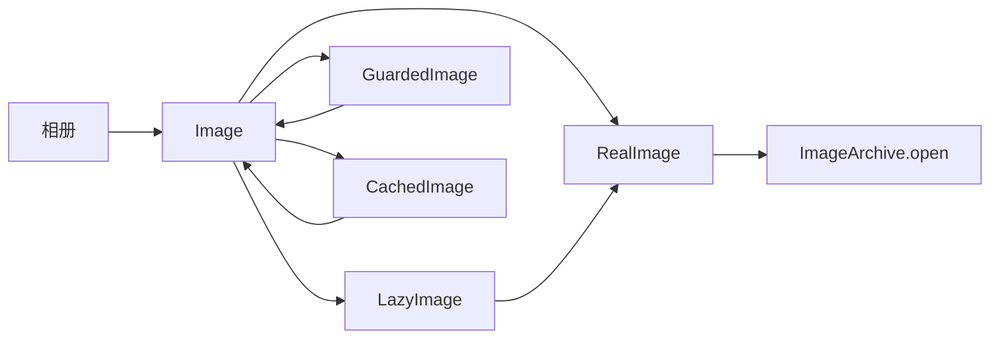
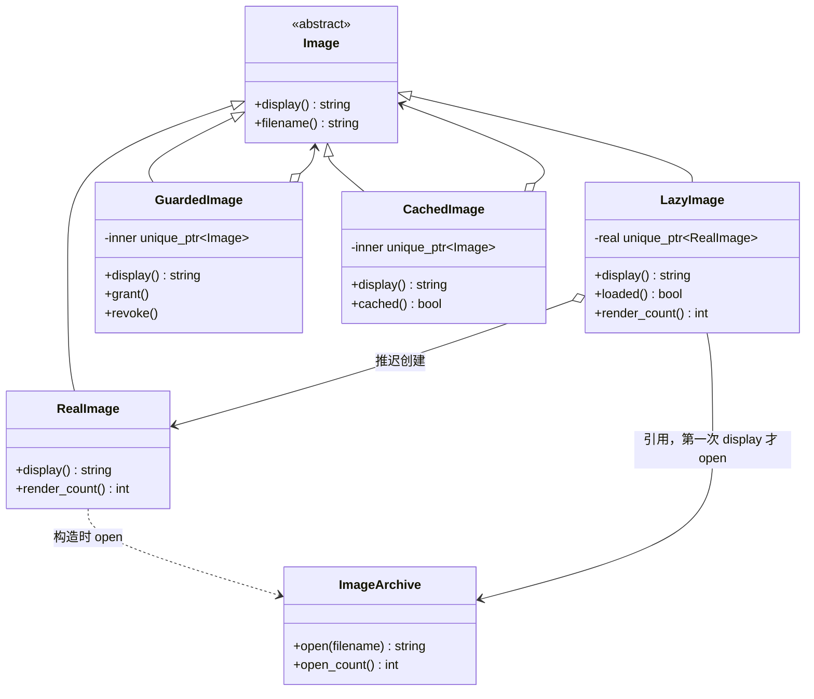
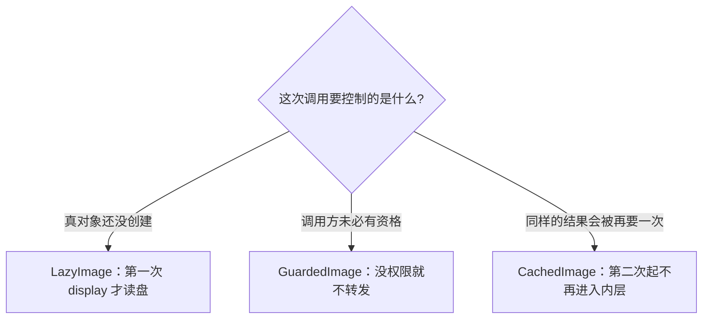
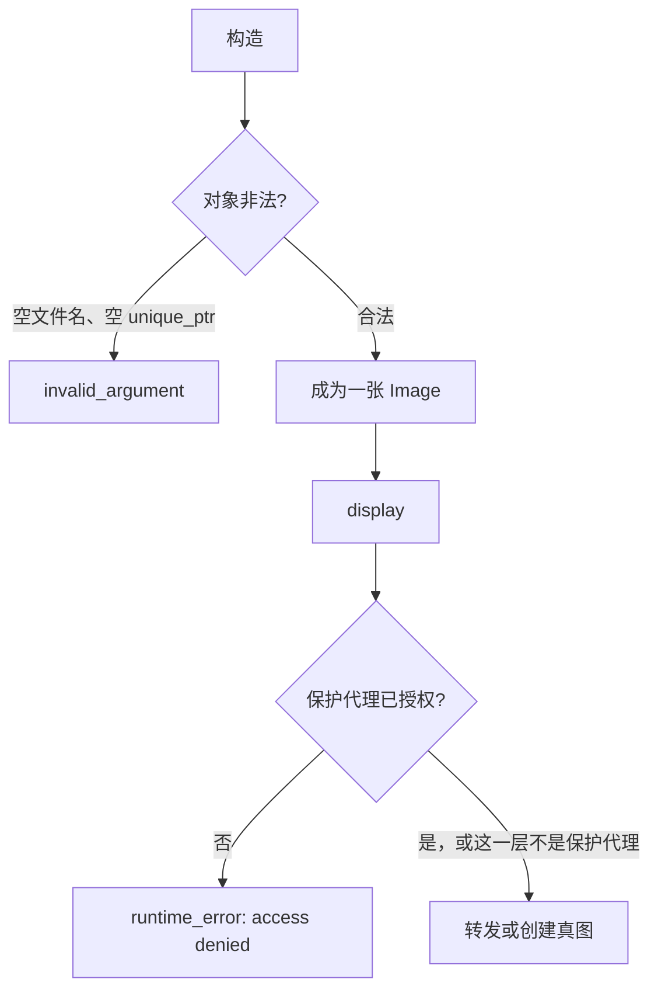
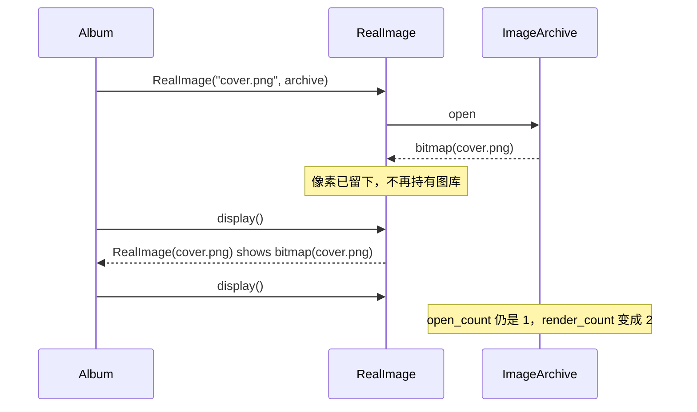
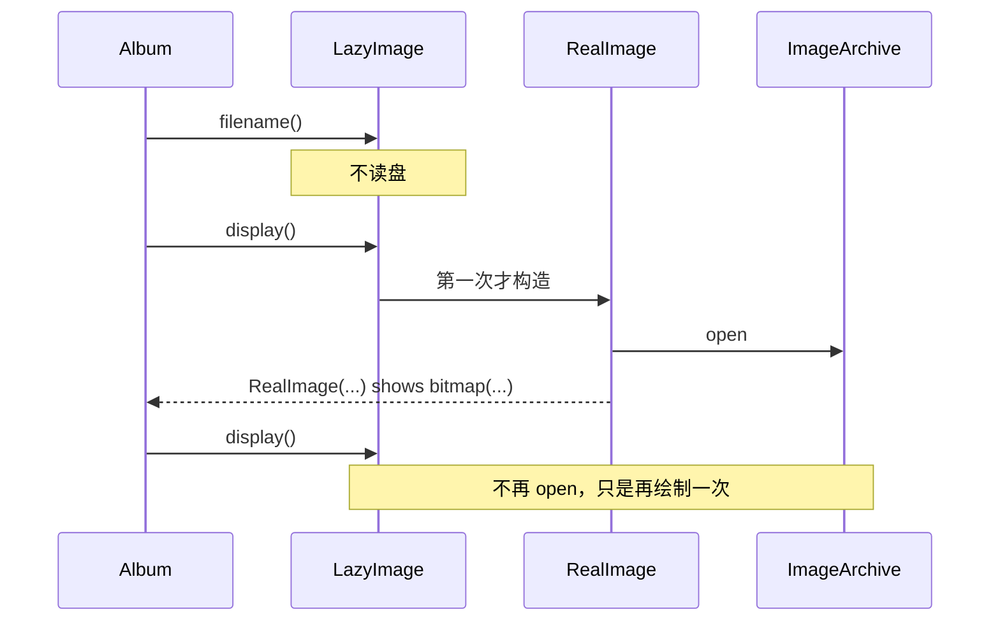
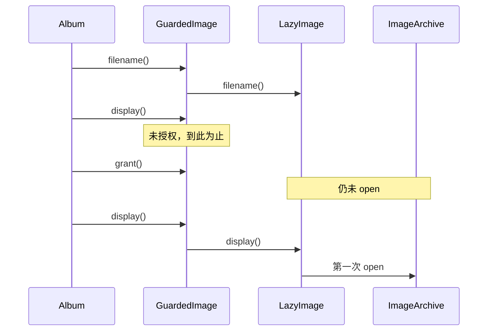
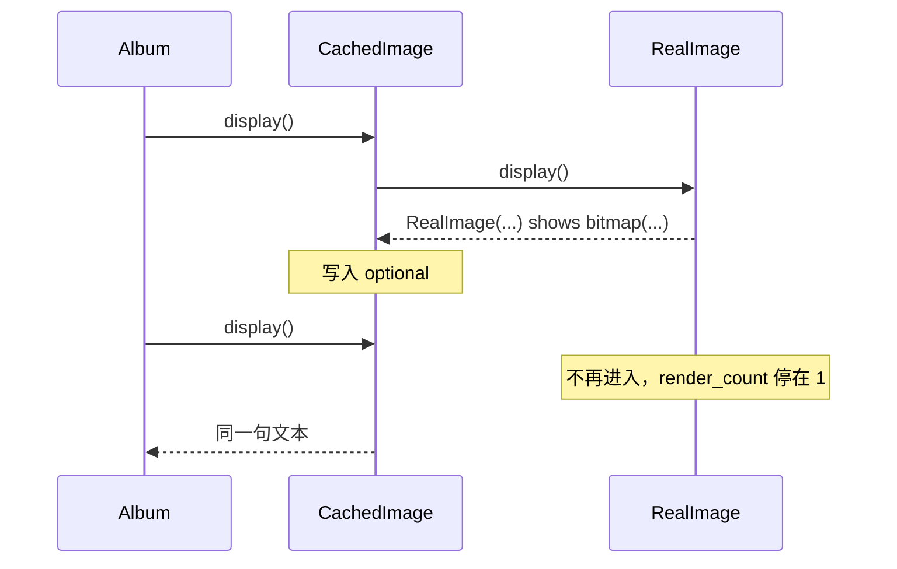
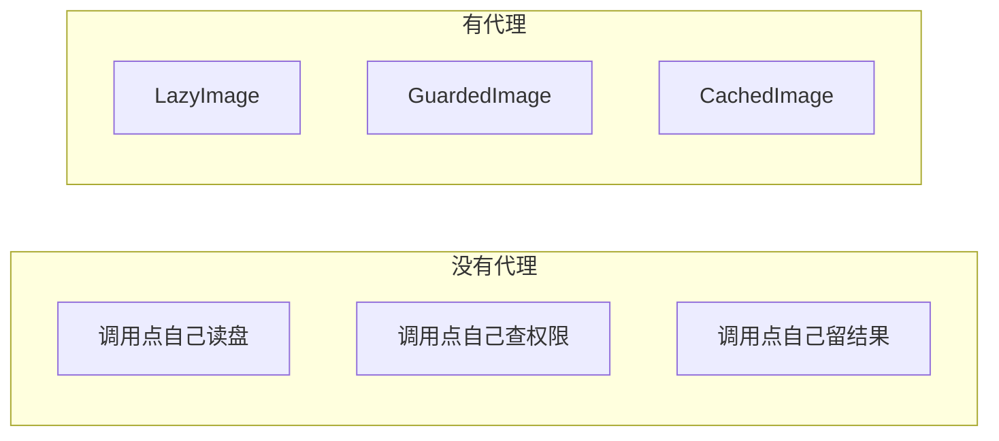

# Proxy（代理）

**类型**：Structural（结构型）

**代码位置**：

- 头文件：[`include/structural/proxy/proxy.h`](../../include/structural/proxy/proxy.h)
- 实现：[`src/structural/proxy/proxy.cpp`](../../src/structural/proxy/proxy.cpp)
- 测试：[`tests/structural/proxy_test.cpp`](../../tests/structural/proxy_test.cpp)
- 客户端：[`examples/structural/proxy/main.cpp`](../../examples/structural/proxy/main.cpp)

## 意图

为另一个对象提供一个替身，让调用方仍然面对原来的接口，由替身决定这次调用让不让发生、何时才发生。

可以把代理想成相册的前台。照片还是那张照片（`Image::display`），前台决定三件事：这张图还没点开就先别读盘，这个人没有权限就别把画面交出去，同一张图刚画过就把结果留下来。调用方拿着 `Image&`，分不出手里是刚从磁盘读出来的真图，还是一个还没读盘的替身。

本仓库的例子是相册。`RealImage` 在构造时向 `ImageArchive` 读盘。三种代理共用 `Image`：`LazyImage` 把读盘推迟到第一次 `display`，`GuardedImage` 在未授权时拒绝 `display`，`CachedImage` 让后续的 `display` 不再进入内层。



## 适用场景

- **真对象贵，而且未必用得上**：相册一页能列出很多文件名，真正点开的只有一两张。每张都在构造时读盘，列表还没画完磁盘就忙完了
- **调用方和真对象不该直接见面**：私密照片的画面要先过权限。调用点已经写成 `image.display()`，不能在每个调用点再写一遍 `if (allowed)`
- **同一次操作会重复发生，结果又不变**：封面在布局和重绘里被 `display` 好几次。像素不会变，第二次不必再画

**不适合**：

- 两边接口不一样，要做翻译 → 那是[适配器](adapter.md)
- 接口相同，调用仍会发生，只是前后要多做一步 → 那是[装饰器](decorator.md)
- 想把一组互不相同的类收成一个粗粒度用例 → 那是[外观](facade.md)
- 很多对象要共享同一份不变数据 → 那是享元。两个 `LazyImage("same.png")` 会读盘两次
- 访问规则只有一处、以后也不会再包一层 → 直接在调用点写判断

## 共同骨架

真图和代理都是 `Image`。虚代理一开始不持有真图，第一次 `display` 才创建。保护代理和缓存代理从构造起就持有另一个 `Image`，差别在于这次 `display` 转不转发。



| 构件 | GoF 角色 | 作用 |
| ---- | -------- | ---- |
| `Image` | Subject | `display` 看画面，`filename` 拿文件名。相册只依赖这个接口 |
| `RealImage` | RealSubject | 构造时 `open`。每次 `display` 绘制一次，`render_count` 加一 |
| `ImageArchive` | 重资源 | `open` 返回 `bitmap(文件名)` 并计数。它不是代理结构里的一层 |
| `LazyImage` | Virtual Proxy | 记下文件名。`filename` 不读盘；第一次 `display` 才创建 `RealImage` |
| `GuardedImage` | Protection Proxy | 默认拒绝。`grant` 之后才把 `display` 转进去；`revoke` 之后再拒绝 |
| `CachedImage` | Cache Proxy | 记住第一次成功的 `display`。之后不再调用内层，返回值与那一次相同 |

少了代理，相册只能在两个写法里选。一是每个调用点自己写「没打开就读盘、没权限就返回、画过就复用」，规则一多就会散。二是把这些判断写进 `RealImage`，于是每张图都背上权限和缓存，连一张普通封面也要过这套分支。

三种代理回答的是三个不同的问题：



和[装饰器](decorator.md)的粒度不同：装饰器假定这次调用会发生，并在前后多做一步；代理可以让这次调用不发生，或者换一个时间发生。和[适配器](adapter.md)也不同：适配器翻译的是两个对不上的接口；代理的 `display` 转发给的还是 `display`。

### 为什么必须和真对象是同一个接口

差在一件事：**变化点在「这次调用怎么被放行」，不在「调用方怎么看一张图」。**

相册的绘制函数只拿 `Image&`。封面可以是还没读盘的虚代理，也可以是已经在内存里的真图。函数体不用改：

```cpp
std::string show(Image &image) { return image.display(); }

RealImage real("cover.png", archive);
LazyImage lazy("cover.png", archive);
show(real);
show(lazy);
```

两次 `show` 得到同一句 `RealImage(cover.png) shows bitmap(cover.png)`。测试 `LazyImageMatchesADirectRealImage` 把这句话固定下来。代理如果在外面再包一层 `"Lazy(...)"`，调用方就能从返回值看出手里是替身，接口虽然相同，行为已经不透明了。

这也是它和装饰器看起来像、实际上分开的地方。两边都是「外层和内层同一个接口，外层手里有内层」：

| | 装饰器 | 代理 |
| ---- | ------ | ---- |
| 接口 | `Stream`，外层内层相同 | `Image`，外层内层相同 |
| 对这次调用的态度 | 调用会发生，前后多做一步 | 决定让不让发生、何时才发生 |
| 去掉这一层之后 | 内层少了一项职责，结果通常变了 | 内层该做的事还是那一件，只是不再被拦住或推迟 |
| 返回值 | `write` 的描述里带装饰器名字，用来看见叠加顺序 | `display` 的文本和直接调用真图相同 |
| 再包一层 | 为了叠加职责，顺序就是加工顺序 | 为了几条访问策略同时生效，顺序是谁先做决定 |

装饰器里的 `BufferedStream` 最容易和虚代理搞混。缓冲也是「先别写进内层」。差别在于：缓冲是一份额外的 I/O 职责，数据最后仍然会写进去，而且 `flush` 是新操作；虚代理没有新的加工步骤，它只是把 `RealImage` 的构造从「放进相册」挪到「第一次 `display`」。客户端最后看到的画面，和一开始就构造真图是同一句文本。

和适配器的差别在接口本身。适配器把 `play` 翻译成 `playWav`，外层和内层不是同一个类型。

### 为什么不做成一个带开关的 Proxy

GoF 的类图上通常是一个 `Proxy`。三种策略若塞进同一个类，`display` 会变成一组布尔开关：要不要懒加载、要不要检查权限、要不要用缓存。问题是它们持有的东西不一样。

- `LazyImage` 手里一开始没有 `Image`。它保存文件名和图库，真图是后来造的
- `GuardedImage` 和 `CachedImage` 从构造起就必须有内层。空指针在构造时抛 `image is required`

合成一个基类，要么逼着虚代理提前造出真图，要么让每个方法都先判断指针是不是空。策略就从类型退回到分支。现在三个类各自把不变量写在成员里：虚代理的 `real_` 允许为空，另外两个的 `inner_` 不允许。

也不要让 `LazyImage` 去继承 `RealImage`。代理和真对象是同一个接口下的两个实现，不是父子。测试 `InheritanceAndConvertibility` 固定了 `LazyImage*` 不能当成 `RealImage*`。

远程代理是同一种形状：本地的 `Image` 把 `display` 转发到另一进程里的真对象。本仓库没有 RPC，不再做一个只在字符串前面加上 `remote` 的类。那样的返回值看起来像装饰器在结果上贴标签，看不出「真对象不在这个进程里」。

### 为什么保护代理和缓存代理用 `unique_ptr`，图库用引用

保护代理和缓存代理**拥有**内层。`unique_ptr<Image>` 把所有权写进构造函数：外层析构时，内层一起释放。裸指针分不清是借来看还是交给你管。空指针直接拒绝，避免第一次 `display` 才在空指针上崩溃。

`LazyImage` 不拥有图库。相册持有 `ImageArchive`，虚代理保存的是引用，等第一次 `display` 再调用当初那个 `open`。图库的拷贝和移动都删掉了：拷走一份，计数就分家；移走，引用悬空。这里不用 `shared_ptr`，因为图库不是和每张照片共享寿命的资源。约定是：图库比 `LazyImage` 活得更久。

`RealImage` 不保存图库。像素在构造时已经拷进 `pixels_`，后面的 `display` 只增加 `render_count`。读盘和绘制因此是两件能分别计数的事。

`Image` 是多态基类。拷贝会切片，移动也会把「相册里的这张图」和「代理里的那张图」拆成两个身份，所以拷贝和移动都 `= delete`。子类不用再写一遍。虚析构必须留着：`unique_ptr<Image>` 析构时走的是 `Image::~Image()`。对应测试 `CopyAndMoveAreDeleted`。

`display()` 不是 `const`。真图要增加 `render_count`，虚代理要写入 `real_`，缓存要写入 `cached_`。一次展示会改变替身自己的控制状态。`filename()` 是 `const`：问名字不读盘、不绘制、不填缓存。

`loaded()`、`grant()`、`cached()` 透不过 `Image&`。和装饰器的 `flush` 是同一类限制：控制策略自己的开关不能塞进所有图片都有的接口。调用点若要授权，就必须拿着 `GuardedImage`。授权完，再把它当成 `Image&` 交给绘制函数。测试 `ControlQueriesStayOffTheImageInterface` 用 `requires` 把这件事固定下来：`Image` 上没有 `loaded`、`grant`、`cached`。

### 计数把「有没有到达真对象」变成可断言的事实

`display` 的文本故意和直接调用真图相同，于是文本本身看不出第二次有没有再画。`ImageArchive::open_count` 和 `RealImage::render_count` 把两件成本分开：

| 发生了什么 | `open_count` | `render_count` |
| ---------- | ------------ | -------------- |
| `LazyImage` 刚构造，只调了 `filename` | 不变 | 0 |
| `LazyImage` 第一次 `display` | +1 | 1 |
| 同一个 `LazyImage` 再 `display` | 不变 | +1 |
| `CachedImage` 第二次 `display` | 不变 | 不变 |
| `GuardedImage` 在未授权时 `display` | 不变（内层若是 `LazyImage`） | 不变 |

`open` 的返回值是 `bitmap(文件名)`，`display` 把它放进 `RealImage(文件名) shows ...`。头文件里不 `#include <iostream>`。打印留在示例里。

### 错误和异常：构造时验名字和内层，`display` 时验权限

空文件名进不了真图和虚代理。空内层进不了保护代理和缓存代理。未授权是另一次失败，发生在 `display`，类型也不同。



| 调用 | 异常 | 说明 |
| ---- | ---- | ---- |
| `ImageArchive::open("")`、`RealImage`、`LazyImage` | `invalid_argument`：`filename is required` | 空文件名在读盘之前拒绝，`open_count` 不变 |
| `GuardedImage(nullptr)`、`CachedImage(nullptr)` | `invalid_argument`：`image is required` | 保护代理和缓存代理不能没有内层 |
| 未授权的 `display` | `runtime_error`：`access denied` | 内层的 `display` 不会被调用 |

代理不改写内层抛出的文案。对应测试 `RejectsInvalidInput` / `GuardedImageHidesDisplayButNotTheFilename`。

### 叠放时，外层先做决定

三种代理都是 `Image`，所以可以套。套的理由是几条访问策略要同时生效，不是装饰器那种每层加一种加工。顺序有语义：

```text
GuardedImage          权限：没通过就不再往里
  CachedImage         缓存：通过之后，第二次起不再往里
    LazyImage         懒加载：第一次真正要画面时才读盘
      RealImage
```

权限放在最外。没通过时，缓存不该留下结果，图库也不该被 `open`。测试 `ProtectionOutsideCacheStillRejectsAfterAHit`：`grant` 之后连续两次 `display`，`open_count` 和 `render_count` 都是 1；`revoke` 之后再次 `display` 仍抛 `access denied`，绘制次数不变。里面的缓存还在，只是外层不再问它。

反过来说，缓存放在保护代理外面，就会把后来的拒绝吃掉。第一次放行并缓存之后，即使 `revoke`，外层的 `CachedImage` 也不再调用内层。测试 `CacheOutsideProtectionServesTheHitAfterRevoke` 把这个结果固定下来。

`LazyImage` 不拿 `unique_ptr<Image>`，它只创建 `RealImage`。所以懒加载放在最里，不能把 `GuardedImage` 再塞进 `LazyImage`。保护和缓存包的是任意 `Image`，懒加载负责把真图造出来。

---

## 1. 真图：`Image` / `RealImage` / `ImageArchive`

代理模式成立，前提是先有一个不带访问策略、本身就能看的 `Image`。`ImageArchive` 是读盘这件事本身，用来把「构造时就碰磁盘」变成可计数的事实。

### 原理

`RealImage` 的构造函数调用 `archive.open`。这就是读盘。像素拷进 `pixels_` 之后，对象不再持有图库。每次 `display` 用已经拷来的像素画一次，`render_count` 加一，`open_count` 不变。

`filename()` 只返回构造时记下的名字。问名字不绘制。

动态绑定发生在 `Image` 上。后面的代理把调用交给 `Image::display` / `Image::filename`，绘制函数里看不到 `RealImage` 这个名字。相册因此可以在真图和替身之间替换，对应测试 `AlbumUsesTheImageInterface`。



图库按文件名分别计数。`open("cover.png")` 两次、`open("page.png")` 一次，总次数是 3，`cover.png` 是 2。没打开过的名字，`open_count` 返回 0，不抛异常。

### 基本构成

| 位置 | 内容 |
| ---- | ---- |
| `Image` | 纯虚 `display()` / `filename()`，虚析构，删除拷贝 / 移动 |
| `RealImage` | `final`。构造时 `open`，`display` 增加 `render_count` |
| `pixels_` | `open` 的返回值。之后的绘制不再读盘 |
| `ImageArchive` | `open` 返回 `bitmap(文件名)`；拷贝 / 移动删除 |
| `open_count()` | 总次数，以及按文件名的次数 |

```cpp
RealImage::RealImage(std::string filename, ImageArchive &archive)
    : filename_(require_filename(filename)), pixels_(archive.open(filename_)) {}

std::string RealImage::display() {
  ++render_count_;
  return "RealImage(" + filename_ + ") shows " + pixels_;
}
```

空文件名在 `require_filename` 里抛出，`open` 不会被调用。`ImageArchive::open("")` 自己也会抛同一句文案，直接碰图库同样安全。

### 用法

构造即读盘，每次 `display` 都绘制（测试 `RealImageOpensDuringConstructionAndRendersEveryDisplay`）：

```cpp
ImageArchive archive;
RealImage image("cover.png", archive);
image.filename();    // "cover.png"，render_count 仍是 0
image.display();     // "RealImage(cover.png) shows bitmap(cover.png)"
show(image);         // 同一句文本，render_count == 2
archive.open_count("cover.png");  // 1
```

图库自己的计数（测试 `ArchiveCountsEachOpen`）：

```cpp
archive.open("cover.png");
archive.open("page.png");
archive.open("cover.png");
archive.open_count();              // 3
archive.open_count("missing.png"); // 0
```

只依赖抽象（测试 `AlbumUsesTheImageInterface`）：

```cpp
Image &direct = real;
show(direct);
```

空文件名会抛 `filename is required`，并且 `open_count` 不变，对应 `RejectsInvalidInput`。拷贝 / 移动已删除，对应 `CopyAndMoveAreDeleted`。

示例开头的对照就是这条路径：相册里的 `LazyImage` 列文件名时 `opens` 仍是 0；旁边直接构造的 `RealImage` 让 `opens(cover)` 立刻加一。

### 特点

- 职责只有「读进像素，再按要求画出来」。懒加载、权限、缓存都不写在这里
- 读盘发生在构造，不发生在 `display`。虚代理要推迟的就是这一下
- `display` 的文本不带代理名字。替身若想透明，就得原样转发这句文本
- 每张真图持有自己的像素。相同文件名再构造一张，会再 `open` 一次
- 代理通过 `Image&` 使用它。加一种访问策略不必改 `RealImage`

---

## 2. 虚代理：`LazyImage`

GoF 的 Virtual Proxy。文档编辑器里的大图经常是这个角色：版面上先占一个位置，真正绘制时才把文件读进来。

### 原理

`LazyImage` 的构造函数只检查文件名，然后把 `ImageArchive&` 留着。`filename()` 返回这份已经记下的字符串，不碰图库。`display()` 才把真图造出来，而且只造一次：

```cpp
std::string LazyImage::display() {
  if (!real_) {
    real_ = std::make_unique<RealImage>(filename_, archive_);
  }
  return real_->display();
}
```



所以「懒」懒的是**创建**，不是**绘制**。第一次 `display` 之后，`open_count` 停在 1，`render_count` 仍会随着后续的 `display` 往上加。测试 `LazyImageDefersOpenUntilDisplay` 覆盖这条分界。还想把第二次绘制也省掉，那是缓存代理的事，不要写进 `LazyImage`。

`loaded()` 和 `render_count()` 留在 `LazyImage` 上。相册通过 `Image&` 看图时用不到这两个数；它们是在回答「替身有没有把真对象造出来、真对象画了几次」。还没加载时 `render_count()` 返回 0，不制造真图。

两个 `LazyImage("same.png")` 会 `open` 两次。代理各自持有自己的真图，不把像素摊给别人用。要共享，那是享元。

加一张「先别读盘」的图，步骤是新写一个虚代理，不改 `RealImage`，也不改已经在用真图的调用点。变化点在创建时机，不在画面怎么画。

### 基本构成

| 位置 | 内容 |
| ---- | ---- |
| 公有继承 `Image` | 相册当普通图片用 |
| `filename_` | 构造时记下。`filename()` 直接返回它 |
| `archive_` | 引用，不是拥有。图库必须活得更久 |
| `real_` | `unique_ptr<RealImage>`，一开始为空 |
| `loaded()` / `render_count()` | 只在具体类型上。不在 `Image` 里 |

```cpp
LazyImage::LazyImage(std::string filename, ImageArchive &archive)
    : filename_(require_filename(filename)), archive_(archive) {}
```

`real_` 允许为空，这是虚代理和另外两种代理的分界。保护代理、缓存代理的 `inner_` 在构造时就不能是空的。

返回值是内层 `display()` 的原句。`LazyImage` 不在外面再包一层自己的名字。

### 用法

先列文件名，点开才读盘（测试 `LazyImageDefersOpenUntilDisplay`）：

```cpp
ImageArchive archive;
LazyImage image("cover.png", archive);
image.filename();          // "cover.png"
image.loaded();            // false
archive.open_count();      // 0

image.display();           // 与 RealImage 同一句文本
image.loaded();            // true
image.render_count();      // 1
archive.open_count("cover.png");  // 1

show(image);               // render_count == 2，open_count 仍是 1
```

和直接构造的真图对得上（测试 `LazyImageMatchesADirectRealImage`）：

```cpp
RealImage real("cover.png", archive);   // 这里已经 open 一次
LazyImage lazy("cover.png", archive);   // 还没有
lazy.display() == real.display();       // 文本相同，open_count 变成 2
lazy.display() == real.display();       // 文本仍相同，open_count 不再增加
```

同名的两张虚代理各读各的盘（测试 `SeparateLazyImagesDoNotShareTheRealSubject`）：

```cpp
LazyImage first("same.png", archive);
LazyImage second("same.png", archive);
first.display();
second.display();
archive.open_count("same.png");  // 2
```

空文件名在构造时抛出，图库计数不变。没点开的 `page.png` 一直是 `loaded() == false`。

示例前两段就是这条路径：相册先打印两个文件名和 `opens=0`，再对封面 `show` 两次，页图始终没加载。

### 特点

- 推迟的是 `RealImage` 的构造，不合并后续的绘制
- `filename()` 可以在读盘之前用。相册列表依赖这一点
- 每个虚代理持有自己的真图。相同文件名会读盘多次
- `loaded()` 透不过 `Image&`。只认接口的绘制函数不该关心图在不在内存里
- 图库是引用。代理析构不会关掉图库，图库先析构则引用悬空
- 多一次空指针判断。规则只有一处、图片又总会被打开时，直接构造 `RealImage` 更短

---

## 3. 保护代理：`GuardedImage`

GoF 的 Protection Proxy。调用方拿着和真图一样的接口，替身在转发之前先看资格。

### 原理

`GuardedImage` 默认 `allowed_ == false`。`display` 在转发之前返回：

```cpp
std::string GuardedImage::display() {
  if (!allowed_) {
    throw std::runtime_error("access denied");
  }
  return inner_->display();
}
```

拒绝时抛 `std::runtime_error`，不是改写返回值。如果未授权也返回一句 `"denied(...)"`，只认 `Image&` 的绘制函数会把这句话当成画面。权限失败和「画出来了」必须能分开。

`filename()` 仍然转发。相册可以列出 `secret.png`，只是点开时被拒绝。名字和画面拆开，虚代理才有一个不必读盘的操作，保护代理才有一个不必放行的操作。如果文件名同样敏感，就让 `filename()` 走同一道检查；那是策略变了，不是接口要裂开。

`grant()` 只改标志，不触发 `display`。包住 `LazyImage` 时，授权之后图仍然还没读盘，要等下一次 `display`。测试 `GuardedLazyImageDoesNotOpenUntilGranted`：拒绝期间 `open_count` 保持 0，`loaded()` 保持 false。



保护代理包住的是**已经交进来的** `Image`。内层若是 `RealImage`，读盘发生在放进代理之前，`GuardedImage` 只能拦住绘制，拦不住那一次 `open`。连读盘一起拦住，内层要用 `LazyImage`。测试 `GuardedImageHidesDisplayButNotTheFilename` 里，构造 `RealImage` 之后 `open_count` 已经是 1，拒绝 `display` 只让 `render_count` 保持 0。

`revoke()` 之后，下一次 `display` 再次抛 `access denied`，已经发生过的绘制次数不变。

### 基本构成

| 位置 | 内容 |
| ---- | ---- |
| 公有继承 `Image` | 绘制函数不用改 |
| `inner_` | `unique_ptr<Image>`，构造时拒绝 `nullptr` |
| `allowed_` | 默认 `false`。安全的一侧是「先别给看」 |
| `grant()` / `revoke()` | 只改标志。不放在 `Image` 上 |
| `filename()` | 始终转发，不受 `allowed_` 影响 |
| `display()` | 未授权抛 `access denied`，不调用内层 |

```cpp
explicit GuardedImage(std::unique_ptr<Image> inner);
```

没有「构造时顺便授权」的参数。要放行就显式 `grant()`，调用点读得出来。内层可以是 `RealImage`、`LazyImage` 或 `CachedImage`，因为成员类型是 `Image`。

### 用法

名字可见，画面要授权（测试 `GuardedImageHidesDisplayButNotTheFilename`）：

```cpp
auto real = std::make_unique<RealImage>("cover.png", archive);
RealImage *raw = real.get();
GuardedImage guarded(std::move(real));

guarded.filename();     // "cover.png"
guarded.allowed();      // false
guarded.display();      // throw "access denied"，render_count 仍是 0

guarded.grant();
show(guarded);          // 与真图同一句文本，render_count == 1

guarded.revoke();
show(guarded);          // 再次拒绝，render_count 仍是 1
```

包住虚代理时，拒绝期间连盘都不读（测试 `GuardedLazyImageDoesNotOpenUntilGranted`）：

```cpp
auto lazy = std::make_unique<LazyImage>("secret.png", archive);
LazyImage *raw = lazy.get();
GuardedImage guarded(std::move(lazy));

guarded.display();      // 拒绝。raw->loaded() == false，open_count == 0
guarded.grant();        // 仍未加载
guarded.display();      // 这时才 open，render_count == 1
```

空指针在构造时抛 `image is required`。授权之后的绘制仍走 `Image&`，`show(guarded)` 和 `show(real)` 是同一个函数。

示例第四段就是这条路径：先打印 `secret.png` 和 `loaded=false`，拒绝时 `opens(secret)=0`，`grant` 之后才出现真图那句文本。

### 特点

- 默认关闭。`grant` 不触发加载，也不触发绘制
- 拦住的是 `display` 这一次调用。内层若在放进来之前已经 `open`，这一次读盘拦不住
- `filename()` 保持可用，相册列表不必为了名字去授权
- 拒绝用异常，不用另一句「也像画面」的字符串
- `grant` / `revoke` 透不过 `Image&`。要改权限，调用点必须拿着 `GuardedImage`
- 多一个对象、一次布尔判断。规则只有一处时，调用点里写 `if` 更直接

---

## 4. 缓存代理：`CachedImage`

GoF 里 Smart Reference 的一种：替身记住一次结果，后面的相同调用不再进入真对象。本仓库的画面一旦 `open` 就不变，所以缓存的是第一次成功的 `display`。

### 原理

`CachedImage` 把第一次成功的 `display` 留在 `std::optional<std::string>` 里。第二次起直接返回这份副本，内层的 `render_count` 不再增加。

```cpp
std::string CachedImage::display() {
  if (!cached_) {
    cached_ = inner_->display();
  }
  return *cached_;
}
```

返回值和内层那一次逐字相同。缓存若改成 `"cached(...)"`，调用方就得知道自己拿到的是替身，而且无法再拿这句文本和直接 `display` 真图的结果对照。代理透明，指的就是这件事。

失败不写入缓存。内层抛 `access denied` 时，赋值还没发生，`cached()` 仍是 false，下一次还会再问内层。测试 `FailedDisplayIsNotCached` 先拒绝、再 `grant`、然后才出现第一次成功的结果。



这只适用于**结果不会变**的画面。像素若会改，缓存必须有失效条件，否则替身交出去的就不再是真对象现在的结果。本仓库的图一旦 `open` 就固定，所以没有失效接口。

`filename()` 不填缓存。问名字不是一次 `display`。

和虚代理的分工：虚代理让「还没点开」的图不去 `open`；缓存代理让「已经点开、又被要求再画」的图不再 `display`。一张图若两个都要，缓存包在懒加载外面：

```text
CachedImage
  LazyImage
    RealImage
```

第一次 `display` 既完成读盘也完成绘制；第二次两者都不再发生。

### 基本构成

| 位置 | 内容 |
| ---- | ---- |
| 公有继承 `Image` | 第二次 `display` 的调用点不用改 |
| `inner_` | `unique_ptr<Image>`，构造时拒绝 `nullptr` |
| `cached_` | `optional<string>`。空表示还没有成功的 `display` |
| `cached()` | 只在具体类型上，告诉测试「结果留下了没有」 |
| `display()` | 有缓存就返回副本；没有就调用内层并留下返回值 |
| `filename()` | 转发，不写入 `cached_` |

```cpp
explicit CachedImage(std::unique_ptr<Image> inner);
```

内层同样是任意 `Image`。缓存不关心里面是真图、虚代理还是保护代理。它只关心「上一次成功的 `display` 还在不在」。

### 用法

第二次不再绘制（测试 `CachedImageForwardsDisplayOnce`）：

```cpp
auto real = std::make_unique<RealImage>("cover.png", archive);
RealImage *raw = real.get();
CachedImage cached(std::move(real));

cached.filename();     // "cover.png"，cached() 仍是 false，render_count 仍是 0
cached.display();      // 与真图同一句文本，render_count == 1
show(cached);
show(cached);          // 文本不变，render_count 仍是 1
archive.open_count("cover.png");  // 1，读盘发生在 RealImage 构造时
```

内层失败时不留下结果（测试 `FailedDisplayIsNotCached`）：

```cpp
CachedImage cached(std::move(guarded));  // guarded 尚未 grant
cached.display();      // throw "access denied"，cached() == false
gate->grant();
cached.display();      // 第一次成功，render_count == 1
```

权限必须包在缓存外面，否则 `revoke` 拦不住已经留下的结果（测试 `ProtectionOutsideCacheStillRejectsAfterAHit` / `CacheOutsideProtectionServesTheHitAfterRevoke`）：

```cpp
// 推荐：GuardedImage → CachedImage → LazyImage
guarded.grant();
guarded.display();
guarded.display();     // open_count == 1，render_count == 1
guarded.revoke();
guarded.display();     // 仍是 access denied

// 缓存在外：第一次放行之后，revoke 不再被问到
cached.display();      // 命中缓存，内层 render_count 不变
```

示例第五段是单层缓存：`banner.png` 显示两次，`renders=1`。第六段把三层按「权限 / 缓存 / 懒加载」套好，授权前不加载、不缓存，授权后两次 `display` 只读盘一次、只绘制一次，`revoke` 之后再次拒绝。

### 特点

- 返回值和内层那一次相同。缓存不在文本上做标记
- 只缓存成功的 `display`。异常留给下一次再试
- `filename()` 不产生缓存项
- 结果会变时，这一层会交出过期画面。那时要先做失效，再考虑缓存
- `cached()` 透不过 `Image&`。绘制函数不需要知道这次是不是命中
- 叠放时不要放在保护代理外面。外层先做决定，权限先于缓存

---

## 总对照

| 写法 | 调用方要知道的事 | 规则变了要改谁 | 推荐场景 |
| ---- | ---------------- | -------------- | -------- |
| 每个调用点自己判断 | 读盘时机、权限、缓存 | 每一处 | 只有一处，而且不会再长 |
| 写进 `RealImage` | 仍然是 `display` | 真图，所有图片都背上分支 | 这本来就是真图的行为，不是访问策略 |
| **`LazyImage`** | **`Image&`，外加具体类型上的 `loaded`** | **虚代理** | 真对象贵，而且常常用不到 |
| **`GuardedImage`** | **`Image&`，授权时要具体类型** | **保护代理** | 画面不能直接交给调用方 |
| **`CachedImage`** | **`Image&`** | **缓存代理** | 结果不变，同一次操作会重复 |
| 装饰器 | `Stream&` | 新职责一个新类 | 调用仍会发生，前后要加工 |
| 对象适配器 | 外层接口和内层不同 | 翻译层 | 方法名和参数对不上 |



再记三点，和具体类名无关，但最容易混：

1. **代理控制的是访问，装饰器追加的是职责。** 两边都保持接口不变。装饰器假定这次 `write` 会发生，并在前后改数据；代理可以让这次 `display` 不发生，或者换一个时间发生。缓冲看起来像懒写入，但那里的数据最终仍会进入内层，而且 `flush` 是一项新操作。
2. **代理和真对象是同一个接口下的并列实现。** 不要让代理去继承 `RealImage`。虚代理甚至可以在一段时间内根本不存在真对象。
3. **额外的控制操作透不过 `Image&`。** `grant`、`loaded`、`cached` 留在具体代理上。把它们加进 `Image`，每张普通照片都得给出一个说得通的实现。

和其它结构型模式的边界：

| 模式 | 接口关系 | 目的 |
| ---- | -------- | ---- |
| Adapter | 两边**不同**，中间翻译 | 让旧代码能被新客户端用 |
| Decorator | **相同**，再包一层 | 动态加职责 |
| Proxy | **相同**，再包一层 | 控制访问 |
| Facade | 新入口盖住一堆旧接口 | 简化子系统 |
| Bridge | 抽象和实现从一开始就分开 | 两边独立变化 |
| Composite | 同一接口的树 | 让单个对象和一组对象可以互换 |

## 怎么选

```text
调用方要的接口和真对象一样吗？
  └─ 不一样，要翻译方法名和参数 → 适配器
  └─ 一样，但调用前后要多做一步，调用本身仍会发生 → 装饰器
  └─ 一样，要决定这次调用让不让发生、何时才发生
        └─ 真对象很贵，不用的时候不该创建 → LazyImage
        └─ 调用方未必有资格 → GuardedImage，默认拒绝
        └─ 同样的调用会重复，结果又不变 → CachedImage
        └─ 真对象在另一个进程里 → 远程代理，同一种形状
        └─ 几条策略同时生效 → 外层先做决定
              权限在外，缓存居中，懒加载在里
              虚代理负责创建 RealImage，不要让它去包装别的代理
```

示例 [`examples/structural/proxy/main.cpp`](../../examples/structural/proxy/main.cpp) 把上面几件事串在一起：相册先列文件名、点开才读盘、真图和虚代理的文本相同、未授权时内层不加载、缓存让第二次不再绘制、三层按权限 / 缓存 / 懒加载叠在一起，以及空文件名不会去读盘。

## 参考

- 《设计模式：可复用面向对象软件的基础》（GoF）：Proxy。为其他对象提供一种代理以控制对这个对象的访问
- [Adapter（适配器）](adapter.md)：接口不同，中间做翻译
- [Decorator（装饰器）](decorator.md)：接口相同，调用仍会发生，前后追加职责
- [Facade（外观）](facade.md)：给一组不同接口一个粗粒度入口
- 《Effective C++》条款 18：让接口容易正确使用、难以误用（所有权写进 `unique_ptr`，图库禁止拷贝和移动）
- `std::unique_ptr` / `std::optional`（内层的所有权，以及「还没有成功的 display」）
