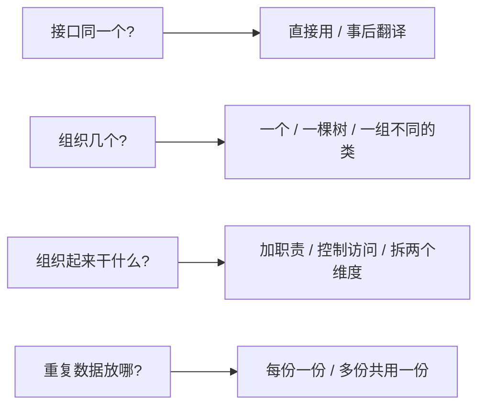
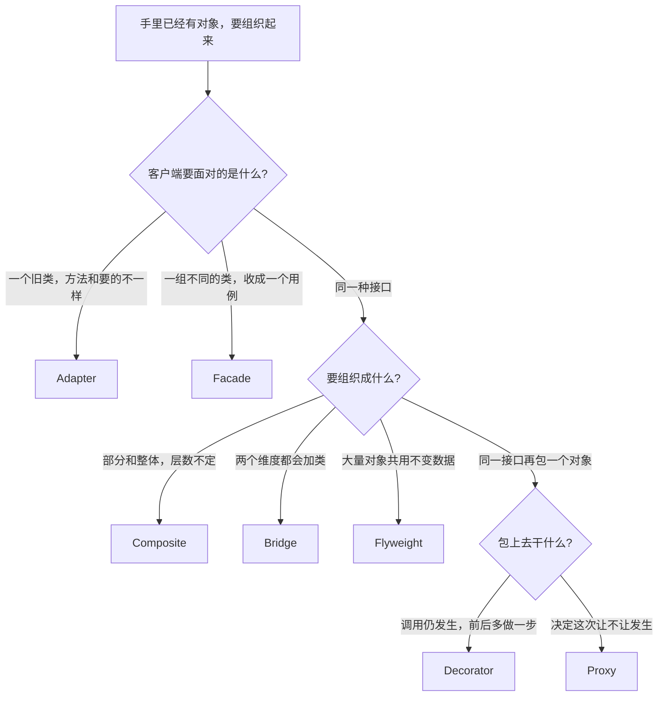
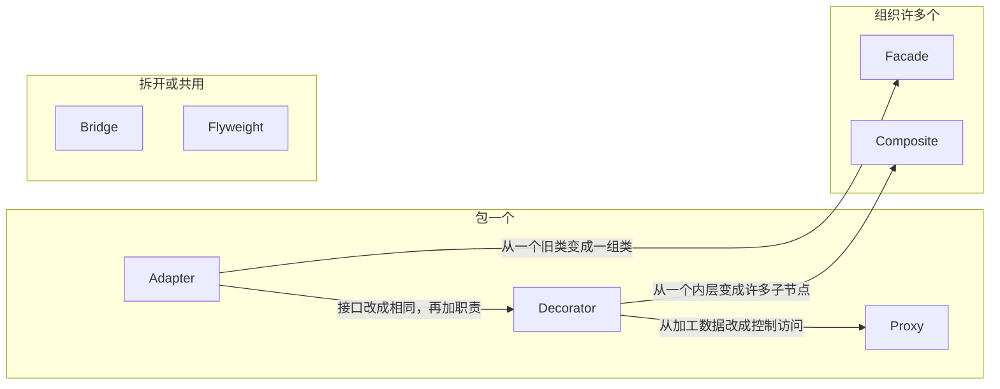
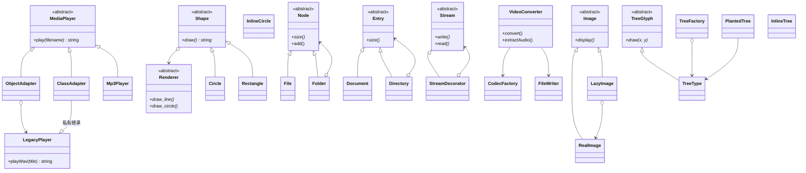
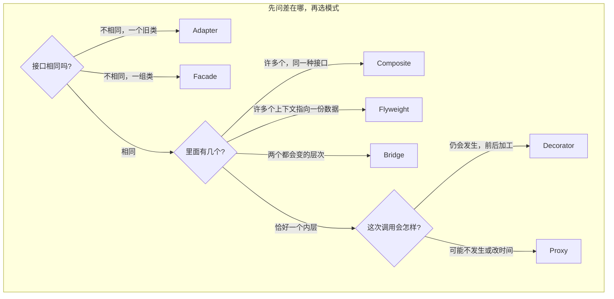
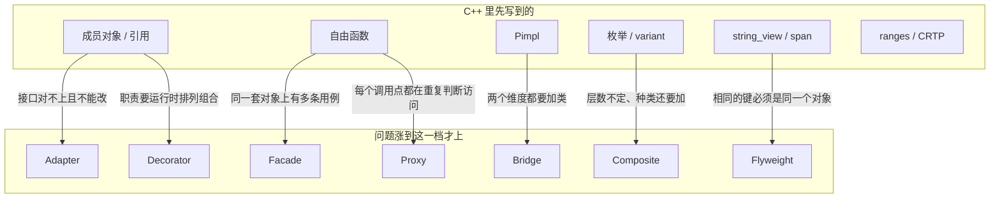
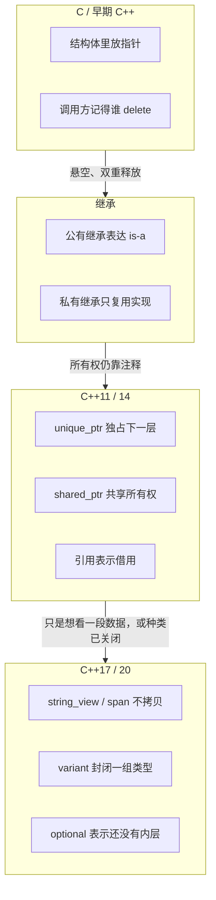
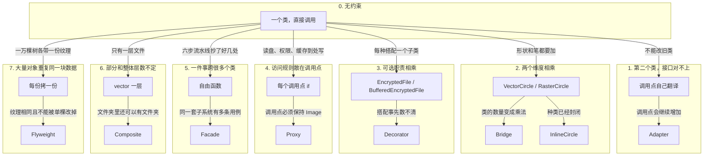
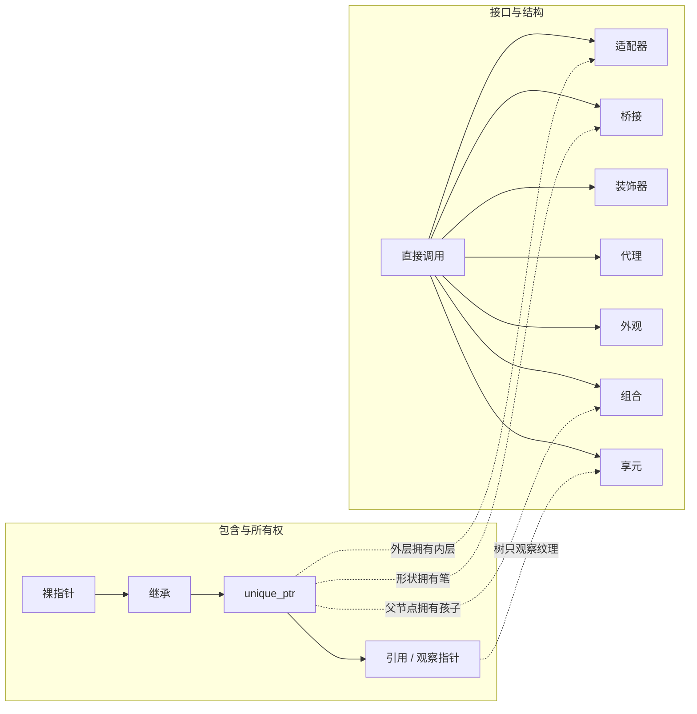
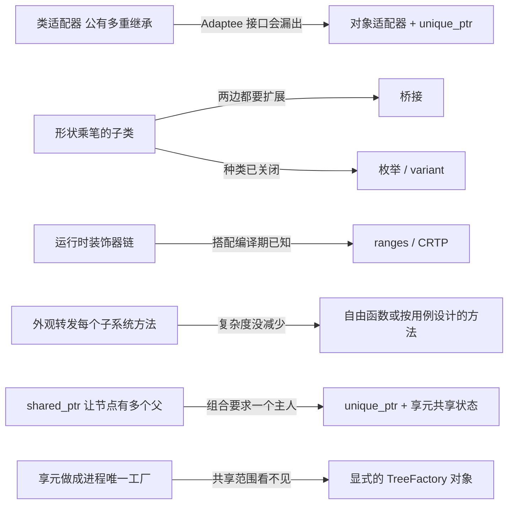

# 结构型模式总览

**类型**：Structural（结构型）对照

本文件把本仓库七种 GoF 结构型模式放在同一张图里看，并补上 C++ 工程里**更常写到**、但不一定叫设计模式的组合方式。单模式细节仍看各自笔记。

| 模式 | 笔记 |
| ---- | ---- |
| Adapter | [adapter.md](adapter.md) |
| Bridge | [bridge.md](bridge.md) |
| Composite | [composite.md](composite.md) |
| Decorator | [decorator.md](decorator.md) |
| Facade | [facade.md](facade.md) |
| Flyweight | [flyweight.md](flyweight.md) |
| Proxy | [proxy.md](proxy.md) |

结构要回答的不是「要不要再包一层」这一件事，而是四个问题：



七种 GoF 模式各自钉死其中一问。C++ 日常写法（成员对象、私有继承、`unique_ptr`、自由函数、`string_view`）往往在这些问题还没涨起来之前就把对象接好了。

---

## 1. 本仓库七种模式对照

把「接口是否相同、组织的是几个对象、加新东西改哪里」对齐以后，七种模式不再像七套互不相关的类图。



### 各自钉死哪一问

| 模式 | 钉死的问题 | 本仓库里像什么 | 变化点 |
| ---- | ---------- | -------------- | ------ |
| [Adapter](adapter.md) | **接口对不上**：把 `playWav` 译成 `play` | 电源转换头 | 对象适配器包子类；类适配器绑死一个 Adaptee |
| [Bridge](bridge.md) | **两个维度**各自加类，避免乘积 | 形状和笔 | 加一个 `Shape` 或一个 `Renderer` |
| [Composite](composite.md) | **部分和整体**做同一件事 | 目录树 | 加一种节点；`add` 放基类还是只放容器 |
| [Decorator](decorator.md) | 运行时**叠加职责**，接口不变 | 给流加密、压缩、加缓冲 | 加一个装饰器；叠加顺序自己定 |
| [Facade](facade.md) | 一组**不同接口**收成高层用例 | 导出按钮 | 改外观里的编排；子系统仍可单步调用 |
| [Flyweight](flyweight.md) | **内在状态**只留一份，坐标每次传入 | 苗圃里的树种纹理 | 再 `get` 一种树种；不共享的图元另写一类 |
| [Proxy](proxy.md) | **控制这一次访问**，接口不变 | 相册前台 | 懒加载、权限、缓存各是一种代理 |

适配器、装饰器、代理都是「外层包住一个对象」。差在接口和目的：对不上就翻译；对得上、调用仍会发生，是在加职责；对得上、但这次调用可以不发生或换个时间发生，是在控制访问。外观和组合都是「里面有很多个」。差在那些对象的接口：外观下面是互不相同的类，组合下面是同一种接口组成的树。桥接和享元不靠「再包一层」解决问题。桥接把两个都会变的层次拆开；享元让很多上下文指向同一份不变数据。



### 类图放在一起看

本仓库里，适配器有对象 / 类两种接法，组合有透明 / 安全两种接法，桥接和享元各带一个**对照写法**（`InlineCircle`、`InlineTree`）。对照不是 GoF 本身，是种类已经封闭、或者数据本来就要各存各的时候更短的那条路。`Mp3Player` 则说明接口已经兼容时不要再包一层。



### 结构关系 / 客户端看见什么 / 扩展方向

| | 结构关系 | 客户端看见 | 加新种类时 | 所有权 |
| - | -------- | ---------- | ---------- | ------ |
| 成员对象 | 一个类里直接放另一个 | 具体类型 | 改这个类 | 按值或按指针，看寿命 |
| `Mp3Player` | 本身就是 Target | `MediaPlayer &` | 不必适配 | 播放器自己 |
| 对象适配器 | 组合 `unique_ptr<LegacyPlayer>` | `MediaPlayer &` | 同一个适配器能包 Adaptee 子类 | 适配器拥有旧播放器 |
| 类适配器 | 私有继承 `LegacyPlayer` | `MediaPlayer &` | 新的 Adaptee 子类要再写一个适配器 | 适配器就是那台旧机器 |
| 调用点自己翻译 | 没有中间对象 | 调用点知道 `playWav` | 每一处都要改 | 调用方自己拿着 |
| GoF 桥接 | `Shape` 持有 `Renderer` | `Shape &` | 加形状或加笔，两边互不改 | 每张形状拥有自己的笔 |
| `InlineCircle` | 枚举写在形状里 | 具体类型 | 加笔要改这个类 | 值对象，可拷贝 |
| 透明组合 | `Folder` 持有多个 `Node` | 任何 `Node &` 都能 `add` | 加一种节点 | 父节点唯一拥有孩子 |
| 安全组合 | `Directory` 持有多个 `Entry` | 查询走 `Entry &`，`add` 只在容器上 | 加一种节点 | 同上 |
| `vector<File>` | 一层，没有文件夹 | 那个 `vector` | 要嵌套就得改类型 | 容器拥有元素 |
| 装饰器 | 恰好一个内层 `Stream` | `Stream &` | 加一个装饰器类 | 外层拥有内层 |
| 代理 | 同一个 `Image`，决定这次 `display` | `Image &` | 加一种代理 | 代理拥有内层；图库是引用 |
| 手写六步转码 | 调用点排出顺序 | 六个具体类 | 每一处流水线 | 调用方临时构造 |
| 外观 | 新的 `convert` 盖住一组类 | 用例方法，不是子系统接口 | 改外观里的顺序 | 设备按值放在外观里；单次文件是局部量 |
| 享元 | 工厂持有一份 `TreeType`，树只记坐标 | `draw(x, y)` 或 `Forest` | 再登记一种树种 | 工厂拥有纹理；树只观察 |
| `InlineTree` | 纹理放在每一棵树上 | 具体类型 | 改这个值类 | 拷贝得到独立的一份 |
| `Shrine` | 实现 `TreeGlyph`，不进工厂 | `TreeGlyph &` | 独一无二的图元另写一类 | 石碑自己带着铭文 |

### 最容易混的几对

**适配器 vs 桥接**

两边类图都可以是「外层持有另一个对象」。适配器假定两套接口**已经写好而且对不上**，`play` 迁就 `playWav`。桥接假定形状和笔都还要加类，所以接口在拆开时一起设计：`draw()` 用 `draw_line` / `draw_circle` 这些原语拼出来，笔上没有 `draw_rectangle`。你还能改两边、而且两个维度都会涨，那是桥接。旧设备不能改、客户端的 `MediaPlayer` 也不能改，那是适配器。

**适配器 vs 外观**

都让客户端少碰旧接口。适配器翻译**一个**已有接口，外层必须长得像客户端已经依赖的 `MediaPlayer`。外观给**一组**互不相同的类一个新入口，`convert` 是新方法，`read` / `apply` / `save` 都不用改名。子系统保持公开，高级调用仍可绕过外观。只有一处、步骤也不再变时，一个自由函数就够了，不必再做一个外观类。

**装饰器 vs 代理**

接口相同，都是再包一个对象，也都可以叠好几层。装饰器假定这次调用**会发生**，并在前后多做一步：加密、压缩改的是数据。代理决定这次调用**让不让发生、何时才发生**：没权限就拒绝，还没点开就不读盘，刚画过就不再进内层。`BufferedStream` 看起来像懒写入，但数据最终仍进入内层，`flush` 是一份新职责。`CachedImage` 留下的是一次 `display` 的结果；再 `display` 不再画。叠放时代理是外层先做决定：权限在外，缓存居中，懒加载在里。

**装饰器 vs 组合**

都让外层和内层实现同一个接口。装饰器始终持有**一个**内层，叠的是职责，`write` 只转发给下一层。组合持有**零个或多个**子节点，叠的是结构，`Folder::size()` 会问每一个孩子。一条链不是树。文件和文件夹要互相嵌套、层数事先不定，才是组合。

**桥接 vs 策略**

类图几乎一样：一个对象里面装着另一个接口。策略换掉的是**一整段算法**，上下文通常把工作整个交出去。桥接的实现侧是**原语**，抽象侧自己还有 `Circle` / `Rectangle`，各自用原语拼出不同的画法。拿掉第二种形状之后，剩下的代码不必再叫桥接。笔在构造时定下来，本仓库没有 `set_renderer`。种类已经关闭、形状也只有圆，用 `InlineCircle` 的枚举。

**享元 vs 缓存代理 vs 原型 vs 单例**

四者都让人觉得「少造一点、少拷一点」，数量和拷的内容不同。

| | 相同的是什么 | 再来一个会怎样 | 本仓库 |
| - | ------------ | -------------- | ------ |
| 缓存代理 | 一次调用的**结果** | 另一个 `LazyImage("same.png")` 仍会再读盘 | `CachedImage` |
| 享元 | 可共用的**内在状态** | 再记一个坐标，指针指向同一份纹理 | `TreeFactory` |
| 原型 | 已配置好的实例 | `clone()` 造出互不影响的新对象 | `Warrior::clone` |
| 单例 | 这个类的**唯一实例** | 还是全局那一个 | `getInstance()` |

`TreeType::draw(1, 2)` 和 `draw(3, 4)` 是两次计算。享元不记住上一次的坐标。工厂也不是单例：两座苗圃各有一份 oak。要的是独立副本，走[原型](../creational/prototype.md)；整个类只能有一个，走[单例](../creational/singleton.md)。

**透明组合 vs 安全组合**

这是同一种模式的两种接口，不是第七种之外的新模式。两边都把 `size()` / `describe()` 放在基类上，单个和整体才能互换。只对容器有意义的 `add`，放进 `Node` 就是透明（叶子调用时抛），只留在 `Directory` 上就是安全。叶子的 `add` 静默成功会把失败藏起来，本仓库不这么做。

**外观 vs 中介者**

外观知道整张图，子系统互不引用，也不知道外观。中介者是为了让同事对象互相通信，那些对象知道中介。解码器、滤镜、写盘之间没有对话，只有外观把它们串成 `convert`。



### C++ 里这七种共同的契约

和 Java 教材里的「包一个引用」不同，本仓库统一了四件事：

1. **多态基类删除拷贝 / 移动**，防止切片。`MediaPlayer`、`Shape`、`Renderer`、`Node`、`Entry`、`Stream`、`Image`、`TreeGlyph` 都是这条规则。对照用的值类（`InlineCircle`、`InlineTree`）反而允许拷贝。
2. **谁拥有，写进 `unique_ptr`；谁只是看，用引用或观察指针。** 适配器、装饰器、代理、形状里的笔、文件夹里的孩子，是拥有。`PlantedTree` 指向 `TreeType`、`child()` 交出去的节点、`LazyImage` 指向的 `ImageArchive`，是观察。观察者不能比主人活得更久。
3. **头文件不打日志。** `play()` / `draw()` / `write()` / `display()` / `describe()` 返回 `string`，测试才能 `EXPECT_EQ`。
4. **只对某一层有意义的操作不塞进公共接口。** `flush`、`grant`、`loaded`、安全组合的 `add` 留在具体类上。放进基类，每个不相干的类都得给出一个说得通的实现。

`unique_ptr` 解决所有权，虚函数解决「这一层和下一层是不是同一个接口」。返回智能指针不会自动变成装饰器；两个类接口相同、却只是碰巧都能 `draw()`，也还不是桥接。

---

## 2. C++ 开发里更常见的组合方式

GoF 七种并不是 C++ 里出现频率最高的。工程代码里，对象多半在模式之前就被接起来了。下面按**真正会写到的顺序**排，不按教科书目录。

### 2.1 语言把对象接起来


| 方式 | 典型代码 | 解决什么 | 还缺什么 |
| ---- | -------- | -------- | -------- |
| 成员对象 | `LegacyPlayer player_;` | 类型确定、寿命跟着外层 | 不能在运行时换成子类 |
| 公有继承 | `class Mp3Player : public MediaPlayer` | 客户端只认基类 | 接口必须真的是 is-a，不能拿来做翻译 |
| 私有继承 | `ClassAdapter` | 复用实现，又不把基类接口漏出去 | 不能再包这个基类的子类 |
| `unique_ptr` 成员 | `ObjectAdapter`、装饰器、代理 | 拥有下一层，析构一起放 | 多一次间接；空指针要在构造时拒绝 |
| 引用成员 | `LazyImage` 里的 `ImageArchive &` | 借用一块活得更久的资源 | 不能重新绑定，主人先销毁就悬空 |
| 观察指针 | `PlantedTree` 里的 `const TreeType *` | 上下文可以放进 `vector` 再移动 | 同样要求主人活得更久 |
| `vector<unique_ptr<Node>>` | `Folder` | 不定个数、多态孩子 | 只有一层文件时这就是过度结构 |

这一层是**机制**，不是模式。类里放了一个 `unique_ptr<Renderer>`，不会自动变成桥接；它只是把寿命写进了类型。

### 2.2 自由函数与「已经兼容」的类型

很多「包一层」其实是一次调用：

```cpp
std::string convert_video(std::string_view filename, std::string_view format);
```

没有第二条用例、这组对象也不必带着走，函数比 `VideoConverter` 短。外观适合同一套子系统上有几条稳定用例（`convert` 和 `extractAudio`），而且步骤以后还会改。

接口已经是客户端要的样子时，同样不要包。`Mp3Player` 直接实现 `MediaPlayer`。再套一个什么都不翻译的适配器，只是多一次间接。

### 2.3 Pimpl：藏起一份实现

```cpp
class Widget {
public:
  Widget();
  ~Widget();
  void draw();
private:
  struct Impl;
  std::unique_ptr<Impl> impl_;
};
```

Pimpl 把**一个**类的私有成员挪到 cpp，缩短编译依赖。它不是桥接：外面没有 `Circle` / `Rectangle` 两条抽象，里面也没有可替换的 `VectorRenderer` / `RasterRenderer` 公开层次。实现类型通常还不完整，客户端不能拿 `Impl` 去扩展。两边都要加子类时，再把 `Impl` 换成 `Renderer`。

### 2.4 非拥有视图

`std::string_view` 和 `std::span` 让函数使用一段已有内存，而不拷贝、也不拥有。这和享元要解决的「别为每棵树拷一份纹理」同一方向，但停在语言机制上：没有工厂，也不保证相同的键是同一个对象。视图不管这段内存在别处会不会被改掉。享元还要求内在状态进池之后不能被某一棵单独修改，相同树种必须是同一地址。

### 2.5 种类封闭时用枚举或 variant

运行时选一种实现，不一定要虚函数：

```cpp
using Backend = std::variant<VectorPen, RasterPen>;
```

本仓库的 `InlineCircle` 用枚举做了同一件事。种类封闭、形状也只有圆，枚举比两条虚函数层次清楚。种类要继续加、而且要放进同一个 `Shape &`，再升到桥接。

组合也有封闭版。文件和文件夹的种类不会再涨时，可以用递归的 `variant` 表示树，`visit` 代替虚 `size()`。种类要插件化、调用点不能改，仍用 `Node`。

### 2.6 编译期叠职责：CRTP、ranges

运行时的装饰器是为了「这一条流要加密，那一条不要，客户端都拿 `Stream &`」。如果搭配在编译期就定了，C++ 还有更短的路：

| 写法 | 和装饰器的差别 | 合适的时候 |
| ---- | -------------- | ---------- |
| 成员函数里直接做 | 没有可拆的层 | 职责就是这个类的 |
| CRTP / mixin | 没有虚函数，不能放进异构容器 | 组合方式编译期已知 |
| ranges 的 view | 惰性、值语义的管道 | 变换一种范围，不需要 `write` / `read` 对称 |
| `StreamDecorator` | 运行时叠加，后包上的先 `write` | 搭配事先数不清 |

`data \| transform \| filter` 看起来像装饰器链。它不维持一个可写回的 `Stream`，也没有 `flush` 这种透不过基类的操作。要的是同一接口上可拆可叠的对象，再用装饰器。

### 2.7 类型擦除

`std::function<std::string(std::string_view)>` 可以装下文件流和内存流的「写」这一下，而不写 `Stream` 基类。这是在边界上擦掉具体类型，适合回调、只有一个操作。操作一多（`write` 和 `read` 必须成对、还要加密层转发），擦除出来的函数对象会比虚接口更难叠。装饰器和代理需要的是**一整组操作都保持同一个接口**。

### 2.8 和 GoF 的对应关系



上半是默认工具箱，下半是痛点涨出来之后的升级。本仓库的对照类（`Mp3Player`、`InlineCircle`、`InlineTree`，以及外观笔记里那条手写流水线）刻意停在上半，避免把日常写法误叫成 GoF。

---

## 3. 演进：从「成员里放一个对象」到七种模式

演进不是时间线「先发明适配器再发明桥接」，而是**调用方反复碰到的新约束**。每加一条约束，就多一种组合方式。

### 3.1 语言侧：谁包含谁



这一轨解决的是包含关系和寿命。它**不决定**外层和内层是不是同一个接口。所以即使用上 `unique_ptr<LegacyPlayer>`，客户端若仍直接调用 `playWav`，适配器还没有出现。

### 3.2 设计侧：约束一条条加上去

下面每一步的箭头含义是：「旧写法还能用，但新约束出现后代价变高」。



读图时抓住每次多出来的那句话：

| 阶段 | 新约束 | 还用旧写法会怎样 | 升级到 |
| ---- | ------ | ---------------- | ------ |
| 0 → 翻译 | 旧类不能改，方法对不上 | 调用点铺满 `playWav` | 适配器；已兼容则直接用 |
| 翻译 → 对象 / 类 | 要不要包 Adaptee 的子类 | 私有继承包不了 `VintageWalkman` | 对象适配器；类型固定才用类适配器 |
| 0 → 乘积 | 形状和笔都会加 | `VectorCircle`、`RasterRectangle` 成对增加 | 桥接；只有圆且后端关闭则枚举 |
| 0 → 职责 | 加密、压缩、缓冲要排列组合 | 子类数量是职责的乘积 | 装饰器 |
| 0 → 访问 | 同一次 `display` 要决定让不让发生 | 每个调用点各写一套判断 | 代理 |
| 0 → 用例 | 转码要跨六个类 | 顺序一改，每一处都改 | 先函数；用例多了再外观 |
| 一层 → 树 | 文件夹里还有文件夹 | `vector<File>` 表达不了嵌套 | 组合；`add` 的位置再分透明 / 安全 |
| 每份一份 → 共享 | 纹理重复且必须只读 | 内存随棵数线性涨，改一棵不该改所有 | 享元；要各改各的就留在 `InlineTree` |

### 3.3 一张总图：两条轨交汇

语言轨保证「里面那个对象有人管」。设计轨保证「外层和内层算不算同一个接口、组织的是一个还是一群」。交汇点就是本仓库的实现约定：需要多态时用虚函数，需要独占时用 `unique_ptr`，只是借用时用引用，基类禁止按值拷贝。



### 3.4 现代 C++ 对 GoF 的修正

GoF 写于 1994，例子里适配器常是多重继承，组合和装饰器常是裸指针。C++ 现在会把几条路**往回收**：



| GoF 原意 | C++ 里更常改成 | 本仓库对应 |
| -------- | -------------- | ---------- |
| 类适配器公有继承两边 | 私有继承，或直接用对象适配器 | `ClassAdapter` 私有继承；默认可包子类的是 `ObjectAdapter` |
| 为每种形状×笔写一个类 | 两条层次，或封闭时用枚举 | `Shape` + `Renderer`，`InlineCircle` |
| 为每种职责搭配写子类 | 运行时装饰；搭配固定则函数 / ranges | `EncryptedStream` 等 |
| 外观把子系统方法原样转发一遍 | 按用例设计 `convert`；只有一处就用函数 | `VideoConverter`，笔记里留了手写流水线 |
| 组合节点用共享指针挂到多处 | 父节点 `unique_ptr`；要共用的是状态 | `Folder` 与 `TreeFactory` |
| 享元工厂做成全局单例 | 池子是普通对象，谁持有谁看见共享范围 | `TreeFactory` 不是 `getInstance()` |
| 额外操作都放进 Component | 留在具体类，避免每个叶子都实现 `flush` / `grant` | `BufferedStream`、`GuardedImage`、安全组合 |

所以演进的最后一跳往往不是「再上一个更重的模式」，而是**问约束是否真的还在**。旧类已经能改去实现 Target，就退回直接继承。形状只有圆、笔也不再加，就退回 `InlineCircle`。树只有几十棵、颜色还要各改各的，就退回 `InlineTree`。转码只有一处，就退回一个函数。

---

## 4. 怎么选

把前面的图收成一张检查表。从上往下，满足就停下，不要继续加模式。

```text
1. 接口和客户端对得上吗？
     └─ 对不上，只有一个不能改的旧类
           └─ 要包它的子类 → 对象适配器
           └─ 类型编译期固定 → 类适配器
     └─ 对不上，是一组类凑成一件事
           └─ 只有一处调用 → 自由函数
           └─ 多条用例、步骤还会变 → Facade
     └─ 对得上，或两边都是你在设计 ↓

2. 部分和整体要做同一件事，而且层数不定吗？
     └─ 是，组树也只拿基类 → 透明组合
     └─ 是，add 不该出现在叶子上 → 安全组合
     └─ 只有一层 → vector
     └─ 否 ↓

3. 有几个维度还会继续加类？
     └─ 两个，例如形状和笔 → Bridge
     └─ 一个，种类已关闭 → 枚举 / variant / InlineCircle
     └─ 一个，换的是一整段算法 → 策略
     └─ 否 ↓

4. 大量对象里有没有一块重复、而且不能被单独改掉的数据？
     └─ 有，差异可以在调用时传入 → Flyweight
     └─ 没有，每份都要独立变化 → InlineTree / 普通成员
     └─ 否 ↓

5. 同一接口上还要再包一层吗？
     └─ 调用仍会发生，前后多做一步，还要排列组合 → Decorator
     └─ 要决定这次调用让不让发生、何时发生 → Proxy
     └─ 职责或判断只有一处 → 写进类里或调用点
```

三个不应靠模式解决的问题：

- **所有权** → `unique_ptr` / 引用 / 观察指针，不是装饰器或享元
- **缩短编译依赖、藏起一个类的私有成员** → Pimpl，不是桥接
- **只是少写几行调用** → 自由函数或成员对象，不是外观

## 参考

- 《设计模式：可复用面向对象软件的基础》（GoF）：Structural
- [Adapter](adapter.md) / [Bridge](bridge.md) / [Composite](composite.md) / [Decorator](decorator.md) / [Facade](facade.md) / [Flyweight](flyweight.md) / [Proxy](proxy.md)
- [创建型总览](../creational/creational_pattern.md)：享元、原型、单例都在「少造一点」上相邻，差在共享的是状态、副本还是唯一实例
- [Strategy（策略）](../behavioral/strategy.md)：一个算法接口。桥接在此之外还有会增长的抽象层次
- [Mediator（中介者）](../behavioral/mediator.md)：同事对象知道中介。外观下面的类不知道外观
- [Visitor（访问者）](../behavioral/visitor.md)：节点种类和操作种类同时在涨时，别把每个操作都加进 `Node`
- 《Effective C++》条款 32、39：公有继承是 is-a，私有继承是 implemented-in-terms-of
- `std::unique_ptr`、`std::string_view`、`std::span`、`std::variant`、`std::optional`
